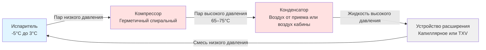
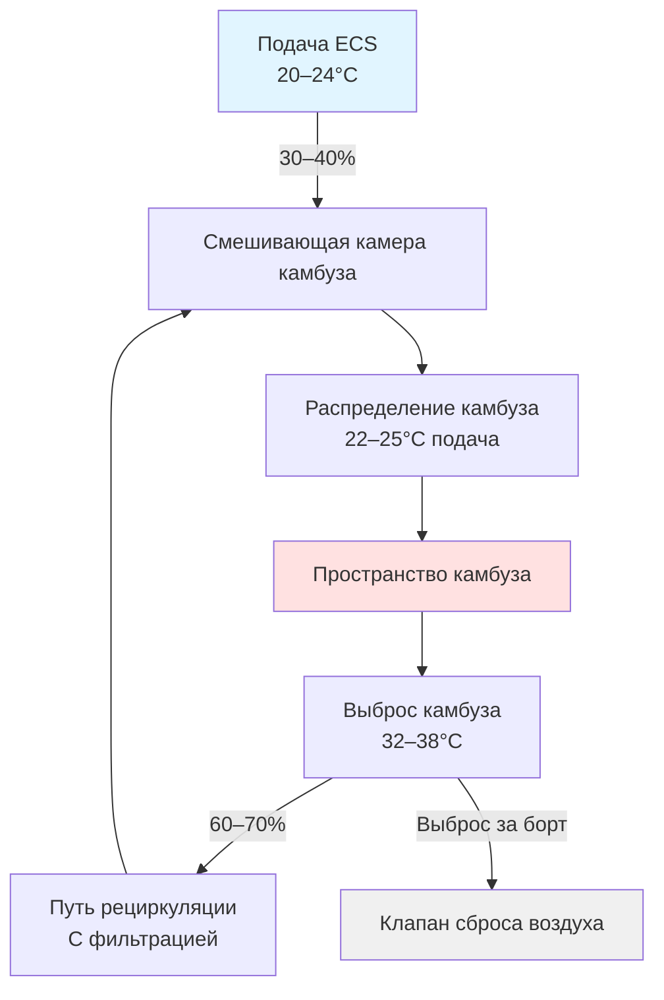

## Обзор

Системы охлаждения камбузов летательных аппаратов представляют специализированные приложения охлаждения, работающие в уникальных условиях: ограничения по весу, колебания давления на большой высоте, ограничения электроэнергии летательного аппарата и ограниченные пространства установки. Эти системы должны поддерживать температуру безопасности пищевых продуктов при воздействии вибрации, быстрых изменений давления и переменных условий окружающей среды на протяжении всех циклов полета.

Охлаждение камбуза интегрируется с системой управления окружающей средой (ECS) летательного аппарата, но работает независимо для обеспечения надежности обслуживания пищей. Современные широкофюзеляжные летательные аппараты с камбузами рассеивают 15–25 кВт тепла во время обслуживания питанием, требуя выделенных стратегий охлаждения, которые минимизируют воздействие на комфорт кабины и системы электроснабжения летательного аппарата.

## Компоненты тепловой нагрузки

Нагрузки охлаждения камбуза происходят из нескольких одновременных источников, которые варьируются на протяжении всех операций полета.

### Источники генерации тепла

| Источник | Типовая нагрузка | Режим работы |
|--------|--------------|-------------------|
| Печи (конвекционные) | 2,5–3,5 кВт каждая | Прерывистая, перед подачей питания |
| Кофеварки | 1,8–2,2 кВт каждая | Непрерывная во время обслуживания |
| Водонагреватели | 2,0–3,0 кВт | Циклический нагрев |
| Отделения холодильников | 0,8–1,2 кВт каждое | Непрерывная |
| Деятельность экипажа | 150–200 Вт на человека | Переменная |
| Освещение | 400–600 Вт | Непрерывное при занятости камбуза |

### Расчет общей тепловой нагрузки

Мгновенная тепловая нагрузка камбуза объединяет явные и скрытые компоненты:

$$Q_{total} = Q_{equipment} + Q_{occupants} + Q_{lighting} + Q_{infiltration} + Q_{refrigeration}$$

Где тепло оборудования учитывает коэффициент использования:

$$Q_{equipment} = \sum_{i=1}^{n} (P_i \times DF_i \times \eta_i)$$

- $P_i$ = номинальная мощность устройства $i$ (Вт)
- $DF_i$ = коэффициент использования (0–1), представляющий процент работы
- $\eta_i$ = доля прироста тепла, поступающая в пространство камбуза (0,6–0,9)

Пиковые нагрузки возникают во время подготовки питания, когда одновременно работают печи, кофеварки и водонагреватели, обычно 20–30 минут перед обслуживанием.

## Конструкция системы охлаждения

Холодильники камбуза летательного аппарата используют циклы парокомпрессионного охлаждения, адаптированные для авиационных сред.

### Термодинамический цикл

Процесс охлаждения следует измененному циклу парокомпрессионного охлаждения:

Коэффициент производительности (COP) для холодильников камбуза:

$$COP = \frac{Q_{evap}}{W_{comp}} = \frac{h_1 - h_4}{h_2 - h_1}$$

Типовое значение COP для холодильников камбуза составляет 1,8–2,4, ниже чем для наземных установок из-за:
- Более высоких температур конденсации (ограниченный охлаждающий воздух)
- Компактных теплообменников с уменьшенной площадью поверхности
- Переменной высоты, влияющей на свойства хладагента
- Легких конструкций компрессора, жертвующих эффективностью

### Выбор хладагента

Системы камбуза летательного аппарата исторически использовали R-134a, переходя на альтернативы с низким потенциалом глобального потепления:

| Хладагент | ПГП | Рабочее давление (бар) | Статус применения |
|-------------|-----|--------------------------|-------------------|
| R-134a | 1 430 | 6,2 испаритель / 15,7 конденсатор (40°C) | Старые системы |
| R-1234yf | 4 | 6,0 испаритель / 14,9 конденсатор (40°C) | Текущая модернизация |
| R-513A | 631 | 6,3 испаритель / 15,5 конденсатор (40°C) | Новые установки |

Выбор хладагента приоритизирует классификацию воспламеняемости (A1 предпочтительно для безопасности летательного аппарата), характеристики давления-температуры, соответствующие работе на высоте, и совместимость с легкими теплообменниками из алюминия.

## Интеграция охлаждающего воздуха

Удаление тепла камбуза использует две основные стратегии в зависимости от конструкции летательного аппарата и местоположения камбуза.

### Выделенная вентиляция камбуза

Большие камбузы получают выделенную вентиляцию от ECS летательного аппарата:

$$\dot{m}_{air} = \frac{Q_{sensible}}{c_p \times \Delta T}$$

Где:
- $\dot{m}_{air}$ = требуемый массовый расход воздуха (кг/с)
- $c_p$ = удельная теплоемкость воздуха при давлении кабины (1,005 кДж/кг·К)
- $\Delta T$ = допустимый прирост температуры (обычно 10–15°C)

Для нагрузки камбуза 20 кВт с приростом температуры 12°C:

$$\dot{m}_{air} = \frac{20 000}{1 005 \times 12} = 1,66 \text{ кг/с} = 5 976 \text{ кг/ч}$$

При типовом давлении кабины во время крейсерского полета (0,75 бар), это соответствует приблизительно 2 200 м³/ч объемного расхода.

### Рециркуляция и смешивание

Системы вентиляции камбуза балансируют введение свежего воздуха с рециркуляцией:

Рециркуляция снижает нагрузку ECS, но требует фильтрации для управления кулинарными запахами и частицами. Высокоэффективные фильтры для улавливания частиц (HEPA) удаляют 99,97% частиц ≥0,3 мкм, с активированными угольными ступенями для контроля запахов.

## Стратегии отвода тепла

Конденсаторы охлаждения камбуза отводят тепло через ограниченные пути, ограниченные конструкцией летательного аппарата.

### Методы охлаждения конденсатора

**Охлаждение воздухом от приема**: Высокопроизводительные камбузы на некоторых летательных аппаратах направляют тепло конденсатора в выделенные теплообменники с воздухом от приема. Эффективность варьируется в зависимости от скорости полета и высоты:

$$Q_{reject} = \dot{m}_{ram} \times c_p \times (T_{out} - T_{in})$$

Наличие воздуха от приема уменьшается при наземных операциях и низкоскоростном полете, требуя дополнительного охлаждения или сброса нагрузки.

**Охлаждение воздухом кабины**: Большинство холодильников камбуза отводят тепло конденсатора прямо в поток воздуха кабины, полагаясь на ECS для удаления объединенной нагрузки камбуза и охлаждения. Этот подход исключает отдельные теплообменники, но повышает потребление ECS во время периодов обслуживания питанием.

**Гибридные системы**: Передовые установки используют охлаждение воздухом кабины во время крейсерского полета с автоматическим переключением на воздух от приема при наземных операциях, когда емкость охлаждения кабины ограничена.

## Требования к контролю температуры

Охлаждение камбуза летательного аппарата поддерживает температуру в соответствии с правилами безопасности пищевых продуктов и операционными требованиями авиакомпании.

### Температурные зоны отделения

| Тип зоны | Диапазон температур | Применение | Стратегия контроля |
|-----------|------------------|-------------|------------------|
| Глубокое охлаждение | -2°C до 0°C | Свежее мясо, морепродукты | Точный термостат ±1°C |
| Стандартное охлаждение | 2°C до 5°C | Молочные продукты, готовые блюда | Термостат ±2°C |
| Высокая влажность для продуктов | 4°C до 7°C, 85–90% ОВ | Свежие овощи | Контроль влажности |
| Морозильник (опционально) | -18°C до -15°C | Лед, замороженные продукты | Требуется цикл оттаивания |

Проблемы однородности температуры возникают от:
- Частого открывания дверей во время обслуживания питанием
- Неравномерного распределения воздуха в компактных отделениях
- Утечки тепла через тонкую изоляцию (ограничения по весу)
- Инфильтрации при изменениях давления

## Управление электроэнергией

Электрические нагрузки камбуза создают значительные требования к системам генерирования летательного аппарата, требуя стратегического управления нагрузкой.

### Профиль электрической нагрузки

Системы электроснабжения летательного аппарата ограничивают доступную мощность для камбуза:

$$P_{available} = P_{generator} - P_{essential} - P_{margin}$$

Типовые широкофюзеляжные летательные аппараты выделяют 80–120 кВт для услуг камбуза из общей генерирующей емкости 300–400 кВт. Протоколы сброса нагрузки автоматически отключают неэссенциальное оборудование камбуза во время:
- Работы одного генератора
- Операций вспомогательной силовой установки на земле
- Конфигурации аварийного электроснабжения

Холодильники камбуза работают непрерывно на цепях существенного электроснабжения для поддержания безопасности пищевых продуктов, тогда как печи и водонагреватели подключены к цепям неэссенциального электроснабжения, подлежащим управлению нагрузкой.

## Рассмотрения при конструировании

Конструкция охлаждения камбуза летательного аппарата учитывает уникальные авиационные требования, выходящие за рамки обычного охлаждения.

### Оптимизация веса

Каждый килограмм оборудования HVAC требует дополнительного топлива:
- Легкая конструкция из алюминия для всех теплообменников
- Герметичные компрессоры минимизируют массу трубопровода хладагента
- Вакуумные изоляционные панели (VIP) обеспечивают RSI 5,3–7,0 против RSI 0,7 для традиционной пены
- Минимизированный воздуховод благодаря стратегическому размещению камбуза рядом с точками распределения ECS

### Устойчивость к вибрации и ударам

Установка оборудования выдерживает:
- Турбулентность во время полета: ±3g типовая, ±6g экстремальная
- Удар при приземлении: 9g вертикальная
- Непрерывная вибрация: диапазон частот 5–50 Гц

Изоляционные крепления компрессора, усиленные опоры воздуховодов и гибкие трубопроводы хладагента предотвращают отказы от усталости на протяжении 50 000+ циклов полета в течение всего срока службы.

### Производительность на высоте

Сниженное атмосферное давление влияет на:
- Температуры и давления насыщения хладагента
- Объемную эффективность компрессора
- Производительность теплообменника на стороне воздуха
- Охлаждение электрических компонентов

Конструкция системы учитывает работу от уровня моря до 13 716 м (эквивалент давления кабины 0,15 бар), поддерживая производительность при изменении давления в 6:1.

## Техническое обслуживание и надежность

Системы охлаждения камбуза летательного аппарата требуют высокой надежности с минимальным доступом для обслуживания во время коротких оборотов на земле.

### Профилактическое техническое обслуживание

Интервалы планового осмотра:
- Ежедневно: Проверка температуры, визуальный осмотр на утечки
- Еженедельно: Очистка катушки конденсатора (наземная проверка)
- 500 часов полета: Замена фильтра, проверка заряда хладагента
- 5 000 часов полета: Тест производительности компрессора, эвакуация и перезаправка системы
- 25 000 часов полета: Полный капитальный ремонт или замена системы

Встроенное диагностическое оборудование (BITE) отслеживает производительность холодильника, логируя превышения температуры и время работы компрессора для прогнозного техническое обслуживания.

### Типовые режимы отказа

Отказы системы обычно возникают от:
- Потери хладагента через вибрационные утечки в фитингах (40% отказов)
- Износа подшипников компрессора от непрерывной работы (25%)
- Ограничения воздушного потока конденсатора от накопления ворсинок (20%)
- Воздействия управляющей электроники на влажность и экстремальные температуры (15%)

Избыточная установка холодильника в больших камбузах обеспечивает непрерывность обслуживания питанием при отказах компонентов, с минимальной конфигурацией двух блоков для долголетних операций.

## Соответствие нормативам

Охлаждение камбуза летательного аппарата соответствует множественным нормативным базам, управляющим безопасностью авиации и обработкой пищевых продуктов.

### Авиационные стандарты

- **FAA TSO-C71**: Техническое стандартное предписание для оборудования охлаждения летательных аппаратов
- **RTCA DO-160**: Условия окружающей среды и процедуры испытаний для бортового оборудования
- **SAE ARP85**: Системы кондиционирования воздуха для дозвуковых самолетов (расчеты нагрузки камбуза)

### Требования безопасности пищевых продуктов

- **FDA Food Code**: Максимум 5°C для охлажденных продуктов во время полета
- **EASA Part-M**: Требования техническое обслуживания летной годности
- **Специфичные для авиакомпании HACCP**: Анализ опасностей и критических контрольных точек для бортового обслуживания питанием

Холодильники камбуза содержат регистраторы данных температуры, обеспечивающие непрерывный мониторинг для документирования соответствия нормативам.

## Будущие разработки

Появляющиеся технологии нацелены на улучшенную эффективность и снижение воздействия на окружающую среду.

**Термоэлектрическое охлаждение**: Твердотельные устройства Пельтье исключают хладагенты и компрессоры, обеспечивая 50% снижение веса несмотря на более низкий COP (0,8–1,2). Подходит для приложений низкой емкости, таких как охладители напитков.

**Магнитное охлаждение**: Системы с магнитокалорическим эффектом, находящиеся в разработке, обещают 30% улучшение эффективности над парокомпрессионным охлаждением с нулевым потенциалом глобального потепления и устранением акустического шума.

**Восстановление отходящего тепла**: Интеграция с топливными элементами вспомогательной силовой установки (APU) обеспечивает охлаждение камбуза циклом абсорбции с использованием отходящего тепла топливных элементов, снижая требования генерирования электроэнергии.

Охлаждение камбуза летательного аппарата продолжает развиваться в сторону более легких и эффективных систем, которые поддерживают строгие стандарты безопасности пищевых продуктов, одновременно минимизируя операционные затраты летательного аппарата и воздействие на окружающую среду.
