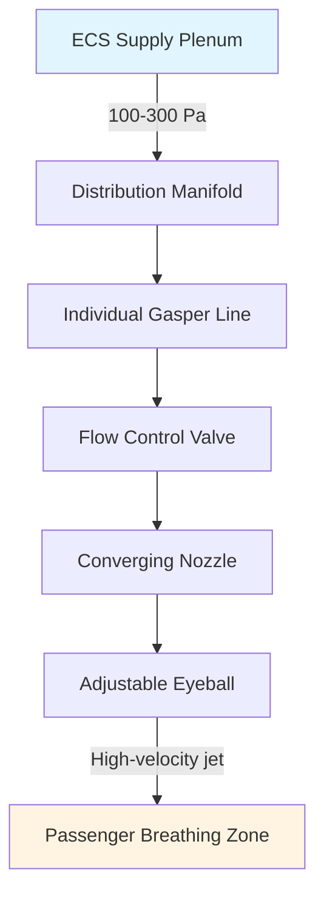

## Обзор

Выпускные отверстия gasper — это устройства индивидуального распределения воздуха в кабинах летательных аппаратов, которые предоставляют пассажирам прямой контроль над локальным потоком воздуха и температурой. Эти небольшие регулируемые сопла подают кондиционированный воздух из системы экологического контроля (ECS) летательного аппарата непосредственно в непосредственную близость пассажира, служа критическим компонентом в достижении приемлемого теплового комфорта в ограниченной, высокой плотности среде коммерческой авиации.

Физика производительности gasper сосредоточена на поведении струи с высокой скоростью, передаче импульса и взаимодействии между первичным подаваемым воздухом и захватываемым воздухом кабины. Понимание этих принципов необходимо для оптимизации комфорта пассажиров при одновременном снижении энергопотребления и генерации шума.

## Фундаментальные принципы работы

### Физика потока воздуха

Выпускные отверстия gasper создают свободную турбулентную струю, которая захватывает окружающий воздух кабины при движении в направлении пассажира. Профиль скорости и спад температуры следуют предсказуемым закономерностям, управляемым законами сохранения импульса и энергии.

Спад скорости на осевой линии свободной струи выражается следующим образом:

$$\frac{u_c}{u_0} = K \frac{d_0}{x}$$

Где:
- $u_c$ = скорость на осевой линии на расстоянии x (м/с)
- $u_0$ = начальная скорость выхода (м/с)
- $d_0$ = диаметр сопла (м)
- $x$ = расстояние от сопла (м)
- $K$ = константа ≈ 6,2 для круглых струй

Коэффициент захвата увеличивается линейно с расстоянием:

$$\frac{Q_x}{Q_0} = 0.32 \frac{x}{d_0}$$

Эта зависимость показывает, что струя gasper захватывает приблизительно в 3,2 раза больше своего начального расхода на каждые 10 диаметров сопла пути, быстро смешивая холодный подаваемый воздух с более теплым воздухом кабины, чтобы предотвратить дискомфорт от прямого попадания.

### Характеристики подаваемого воздуха

Типичные условия подачи воздуха gasper:
- **Температура**: 10-15°C
- **Расход через выпускное отверстие**: 3-10 л/с (6-21 CFM)
- **Давление подачи**: 100-300 Па выше давления в кабине
- **Скорость выхода**: 5-15 м/с

## Конструктивные соображения

### Геометрия сопла

Сопла gasper используют специфические геометрические особенности для управления характеристиками струи:

**Конструкция сужающегося сопла** создает связную струю с более высокой скоростью и большей дальностью действия. Коэффициент сужения (площадь входа к площади выхода) обычно составляет от 4:1 до 9:1.

**Сферические выпускные отверстия** позволяют управлять направлением через сферический шариковый элемент с круглым или кольцевым отверстием выхода. Шарик вращается в гнезде, обеспечивая приблизительно 60-90 градусов углового регулирования.

### Тепловая производительность

Эффективная температура сквозняка (EDT) в расположении пассажира зависит от разбавления струи:

$$\theta_{EDT} = \theta_0 + (\theta_c - \theta_0) \left(\frac{u_c}{u_0}\right)^2$$

Где:
- $\theta_{EDT}$ = эффективная температура сквозняка (°C)
- $\theta_0$ = температура подаваемого воздуха (°C)
- $\theta_c$ = температура воздуха в кабине (°C)

Эта квадратичная зависимость от отношения скоростей означает, что модерирование температуры происходит быстро по мере того, как скорость струи снижается за счет захвата.

### Акустические соображения

Выпускные отверстия gasper генерируют аэродинамический шум в основном от турбулентного смешивания. Уровень звуковой мощности масштабируется со скоростью:

$$L_W = 10 \log_{10}\left(\frac{u^8 d^2}{\rho_0 c_0^5}\right) + C$$

Более высокие скорости экспоненциально увеличивают шум, что делает ограничение скорости критическим. Большинство конструкций нацелены на скорости выхода ниже 12 м/с, чтобы поддерживать шум в кабине ниже критериев NC-45.

## Механизмы управления

| Тип управления | Механизм | Диапазон расхода | Преимущества | Ограничения |
|--------------|-----------|------------|------------|-------------|
| **Вкл/выкл** | Вращающийся запорный клапан | 0% или 100% | Простой, надежный | Без модуляции |
| **Переменный расход** | Игольчатый клапан или ирис | 0-100% непрерывный | Точное управление | Более сложный |
| **Только направление** | Сферический выпуск | Фиксированный расход | Целевая подача | Без управления расходом |
| **Комбинированный** | Клапан расхода + вращение | Полная регулировка | Максимальная гибкость | Наивысшая стоимость |

## Требования к установке

### Верхняя система распределения

Gasper подключаются к загруженному под давлением плену выше потолочных панелей, обычно проходя продольно вдоль осевой линии кабины. Сеть распределения должна поддерживать:

- **Равномерность давления**: ±10% вариация между выпускными отверстиями
- **Доступность**: панели обслуживания каждые 3-4 ряда кресел
- **Герметичность**: <2% от общего расхода при рабочем давлении

### Расстояние и компоновка

Типичные установки предусматривают одно выпускное отверстие gasper на место пассажира, расположенное 600-800 мм выше сидячей позиции головы. Эта геометрия обеспечивает достижение струей дыхательной зоны до чрезмерного разбавления при одновременном избежании неудобного прямого попадания.

Коэффициент дальности к распространению для струй gasper обычно составляет от 4:1 до 6:1, что означает, что струя распространяется в 4-6 раз дальше, чем её диаметр. Эта характеристика определяет оптимальные высоты монтажа и углы.

## Оценка производительности

### Метрики комфорта

Эффективность gasper оценивается с использованием:

**Рейтинг сквозняка (DR)** из ISO 7730, который количественно определяет дискомфорт от движения воздуха:

$$DR = (34 - T_a)(u - 0.05)^{0.62}(0.37 u T_u + 3.14)$$

Где:
- $T_a$ = локальная температура воздуха (°C)
- $u$ = локальная скорость воздуха (м/с)
- $T_u$ = интенсивность турбулентности (%)

**Предсказанный процент недовольных (PPD)** быстро увеличивается, когда рейтинг сквозняка превышает 20%, устанавливая проектные пределы для скорости и температуры.

### Измерение расхода

Индивидуальные расходы gasper измеряются с использованием:
- Горячепроволочная анемометрия для профилей скорости
- Методы Пито-траверса для средней скорости
- Методики захватывающего капота для общего объемного расхода

## Техническое обслуживание и устранение неисправностей

| Проблема | Вероятная причина | Метод диагностики | Решение |
|-------|----------------|-------------------|---------|
| **Низкий расход** | Ограничение клапана | Измерение давления | Чистка или замена клапана |
| **Отсутствие расхода** | Блокировка подачи | Проверка давления выше по потоку | Устранение препятствия |
| **Чрезмерный шум** | Высокая скорость | Измерение скорости | Снижение давления подачи |
| **Неустойчивая работа** | Повреждение клапана | Визуальный осмотр | Замена узла |
| **Колебание температуры** | Расслоение плену | Многоточечное измерение | Улучшение смешивания |

## Интеграция с основными системами кабины

Gasper работают параллельно с основной системой распределения кабины, которая обеспечивает общую вентиляцию и контроль температуры. Объединенная система должна соответствовать требованиям ASHRAE Standard 161:

- **Общий расход вентиляции**: 0,25 л/с·м² (0,05 CFM/ft²) минимум
- **Вентиляция на человека**: 10 л/с (21 CFM) во время крейсерского полета
- **Давление в кабине**: эквивалентно максимальной высоте 2400 м

Расход gasper составляет 20-40% от общей вентиляции на человека, остальное подается через верхние или боковые диффузоры для общего смешивания.

## Соображения по энергии

Дополнительная мощность вентилятора, необходимая для преодоления перепада давления системы gasper, составляет:

$$W = \frac{\Delta P \cdot Q}{\eta}$$

Где $\Delta P$ включает потери в сопле, потери в клапане и трение в распределительном коллекторе. Типичные системы gasper потребляют 5-15 Вт на пассажира, что представляет 2-5% от общей мощности ECS при крейсерских условиях.

## Будущие разработки

Появляющиеся технологии gasper включают электронно управляемые моторизованные клапаны с предустановленными программами комфорта, противомикробные покрытия для снижения передачи патогенов и конструкции сопел с низкой турбулентностью, которые снижают шум при сохранении эффективности. Исследования продолжаются по стратегиям индивидуализированной вентиляции, которые оптимизируют индивидуальный комфорт при одновременном минимизации общего энергопотребления системы.
