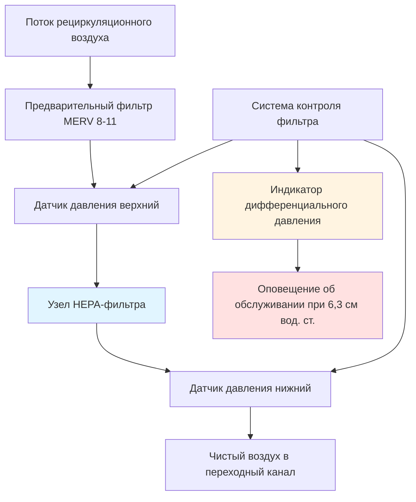

Системы HEPA-фильтрации на воздушных судах представляют критический компонент системы управления микроклиматом салона, удаляя 99,97% взвешенных в воздухе частиц размером 0,3 микрометра и более из рециркулируемого воздуха. Эти высокоэффективные фильтры работают при уникальных ограничениях, включая переменное давление в салоне, ограниченное пространство установки, ограничения по массе и требования непрерывной работы. Понимание физики фильтрации, интеграции системы и характеристик производительности обеспечивает правильный подбор и обслуживание этих систем.

## Стандарты производительности HEPA-фильтров

HEPA-фильтры на воздушных судах должны соответствовать строгим стандартам эффективности, вытекающим из военной спецификации MIL-STD-282 и требований гражданской авиации. Определяющей характеристикой является минимальная эффективность удаления на уровне 99,97% при наиболее проникающем размере частиц (MPPS) 0,3 микрометра, где механизмы фильтрации переходят от доминирующего перехвата к диффузионному захвату.

Эффективность удаления частиц следует комбинированной теории фильтрации, включающей четыре первичных механизма:

**Механизмы фильтрации и эффективные диапазоны размеров:**

- **Инерционное уплотнение:** Частицы >1,0 мкм отклоняются от потоковых линий
- **Перехват:** Частицы 0,3–1,0 мкм контактируют с волокнами вдоль потоковых линий
- **Диффузия:** Частицы <0,3 мкм подвергаются броуновскому движению
- **Электростатическое притяжение:** Все размеры с остаточным зарядом

Общая эффективность собирания ($\eta_{total}$) объединяет отдельные механизмы:

$$\eta_{total} = 1 - (1-\eta_{impaction})(1-\eta_{interception})(1-\eta_{diffusion})(1-\eta_{electrostatic})$$

При MPPS 0,3 мкм вклады перехвата и диффузии приближаются к минимальным значениям, в то время как инерционное уплотнение остается незначительным, создавая впадину эффективности, которая определяет требования производительности HEPA. Частицы как больше, так и меньше 0,3 мкм достигают более высокой эффективности удаления, часто превышая 99,99%.

## Конструкция фильтра и свойства фильтрующего материала

HEPA-фильтры на воздушных судах используют гофрированный боросиликатный стеклянный волокнистый материал для максимизации площади поверхности в компактных размерах. Материал состоит из случайно ориентированных волокон диаметром от 0,5 до 2,0 микрометра, создавая извилистый путь, через который проходит воздух, в то время как частицы контактируют и прилипают к поверхности волокон.

Типичные характеристики материала для применения на воздушных судах:

| Параметр | Значение | Инженерное обоснование |
|-----------|----------|------------------------|
| Диаметр волокна | 0,5–2,0 мкм | Оптимизирует эффективность захвата |
| Толщина материала | 0,4–0,6 мм | Балансирует емкость и перепад давления |
| Плотность упаковки | 8–12% | Объемная доля волокна |
| Глубина гофра | 25–35 мм | Максимизирует площадь в корпусе |
| Расстояние между гофрами | 3–5 мм | Предотвращает разрушение гофров |
| Площадь фронта | 0,074–0,232 м² | Зависит от размера воздушного судна |

Гофрированная конфигурация увеличивает эффективную площадь фильтрации в 15–25 раз по сравнению с плоским материалом, занимающим тот же корпус установки. Эта расширенная площадь поверхности снижает фронтальную скорость и начальный перепад давления, продлевая срок службы фильтра при сохранении компактных размеров, критически важных для массы и пространства воздушного судна.

Опорные структуры материала включают верхние и нижние разделительные листы, которые поддерживают геометрию гофров при различных условиях воздушного потока и давления. Герметики авиационного класса склеивают пакет материала с рамой, предотвращая обходной поток, который бы нарушал эффективность фильтрации.

## Характеристики перепада давления и расчеты воздушного потока

Перепад давления через HEPA-фильтры представляет основную паразитную нагрузку в системах рециркуляционных вентиляторов, напрямую влияя на требования мощности вентилятора и эффективность системы. Перепад давления следует соотношению Дарси-Вейсбаха, модифицированному для потока через пористые материалы:

$$\Delta P = \frac{\mu \cdot V \cdot t}{\alpha} + \frac{\rho \cdot V^2}{2K}$$

Где:
- ΔP = перепад давления через фильтр (Па или см вод. ст.)
- μ = динамическая вязкость воздуха (1,81×10⁻⁵ Па·с при 20°C)
- V = фронтальная скорость через материал (м/с)
- t = толщина материала (м)
- α = коэффициент проницаемости материала (м²)
- ρ = плотность воздуха (кг/м³)
- K = коэффициент инерционного сопротивления потоку (безразмерный)

При типичных скоростях рециркуляции на воздушных судах 1,0–1,5 м/с фронтальной скорости вязкий (первый) член доминирует, создавая приблизительно линейное соотношение перепада давления к потоку. Начальный перепад давления чистого фильтра варьируется от 2,0 до 3,0 см вод. ст. при проектных расходах.

По мере накопления загрязнений на поверхности волокон коэффициент проницаемости (α) снижается, увеличивая перепад давления. Производители указывают замену при достижении перепада давления 6,3–7,6 см вод. ст., что представляет загрузку фильтра 40–60 граммов на квадратный метр площади материала.

## Интеграция системы и проектирование цикла рециркуляции

HEPA-фильтры интегрируются в путь рециркуляционного воздушного потока между извлечением воздуха из салона и переходным каналом, где отфильтрованный рециркулируемый воздух объединяется со свежим воздухом от блоков систем управления микроклиматом. Это расположение обрабатывает 100% рециркулируемого воздуха, избегая экстремальных температур и вариаций влажности, присутствующих в потоках наружного воздуха.

Конфигурация цикла рециркуляции следует этой последовательности:

1. **Сбор возвратного воздуха:** Решетки боковой стены или пола извлекают воздух со скоростью 570–1650 м³/ч на зону
2. **Предварительная фильтрация:** Фильтры MERV 8-11 удаляют крупные частицы и мусор (>10 мкм)
3. **Рециркуляционный вентилятор:** Центробежные или смешанного потока вентиляторы обеспечивают перепад давления 1,0–1,5 см вод. ст.
4. **HEPA-фильтрация:** Первичное удаление частиц при эффективности 99,97%
5. **Доставка в переходный канал:** Отфильтрованный воздух объединяется с наружным воздухом в соотношении 40–60%

Подбор размера рециркуляционного вентилятора должен учитывать перепад давления HEPA-фильтра на протяжении интервала обслуживания от чистой установки (2,0–3,0 см вод. ст.) до порога замены (6,3–7,6 см вод. ст.). Вентиляторы с переменной скоростью регулируют обороты для поддержания постоянного воздушного потока при увеличении загрузки фильтра, предотвращая деградацию скорости вентиляции.

Требования к мощности вентилятора следуют стандартному соотношению:

$$P_{fan} = \frac{Q \cdot \Delta P_{total}}{\eta_{fan} \cdot 6356}$$

Где:
- P_fan = тормозная мощность вентилятора (л.с.)
- Q = объемный расход (м³/ч; CFM для единиц США)
- ΔP_total = общий перепад давления в системе (см вод. ст.)
- η_fan = общая эффективность вентилятора (обычно 0,65–0,75)
- 6356 = константа преобразования

Для типичной зоны узкофюзеляжного воздушного судна, обрабатывающей 950 м³/ч при общем перепаде давления 12,6 см вод. ст., включая фильтры и воздуховоды при эффективности вентилятора 70%, требуемая мощность вентилятора составляет 1,70 кВ. Двойная избыточность вентиляторов обеспечивает 100% резервную способность, при этом каждый вентилятор рассчитан на 60–75% от общего потока.

## Эффективность удаления загрязняющих веществ и качество воздуха в салоне

Система HEPA-фильтрации достигает концентраций загрязняющих веществ в салоне, сравнимых с чистыми помещениями ISO класса 6 (ранее класс 1000), с количеством частиц ниже 350 000 частиц на кубический метр при размере 0,5 мкм и больше. Этот уровень производительности значительно превышает стандарты качества воздуха в помещениях ASHRAE 62.1 и обеспечивает существенный запас выше минимальных требований авиации.

Эффективность HEPA-фильтрации в полной системе вентиляции зависит от доли рециркуляции и качества наружного воздуха:

$$C_{cabin} = \frac{C_{OA} \cdot f_{OA} + C_{recirc} \cdot (1-f_{OA}) \cdot (1-\eta_{HEPA})}{1}$$

Где:
- C_cabin = концентрация частиц в салоне при установившемся режиме
- C_OA = концентрация частиц наружного воздуха (обычно очень низкая на высоте крейсерского полета)
- f_OA = доля наружного воздуха (типовое значение 0,4–0,6)
- C_recirc = рециркуляционный воздух, входящий в фильтр
- η_HEPA = эффективность фильтра (0,9997)

Высокая эффективность HEPA снижает составляющую рециркуляции до пренебрежимо малых уровней. При 50% наружного воздуха с практически нулевой концентрацией частиц (крейсерский полет на высоте) и 50% рециркуляции через HEPA-фильтры система удаляет 99,985% частиц, генерируемых в салоне, во время каждого цикла воздухообмена.

Количество воздухообменов в час (ACH) 20–30 в типовых конфигурациях обеспечивает полный обмен воздуха каждые 2–3 минуты, быстро разбавляя и фильтруя взвешенные в воздухе частицы. Комбинация высокого ACH и HEPA-фильтрации достигает времени удаления частиц 1–2 минуты.

## Срок службы фильтра и критерии замены

Интервалы обслуживания HEPA-фильтра зависят от скоростей загрузки частицами, которые значительно варьируются в зависимости от типа маршрута, коэффициента загрузки пассажирами и качества окружающего воздуха при работе на земле. Типичный срок службы варьируется от 3000 до 6000 летных часов, что эквивалентно 12–24 месяцам для воздушных судов, летающих 250 часов ежемесячно.

**Факторы, влияющие на срок службы фильтра:**

- **Работа на земле в пыльных условиях:** Ускоряет загрузку при рулении и посадке пассажиров
- **Коэффициент загрузки пассажирами:** Более высокая загруженность увеличивает генерацию частиц
- **Длина маршрута:** Коротких маршруты предусматривают больше работы на земле в расчете на летный час
- **Эффективность предварительного фильтра:** Эффективная предварительная фильтрация продлевает жизнь HEPA
- **Чистота салона:** Регулярная уборка салона снижает повторное взвешивание частиц

Критерии замены фильтра включают мониторинг дифференциального давления как основной индикатор. Непрерывное измерение перепада давления на узле фильтра обеспечивает реальное отслеживание статуса загрузки. Когда дифференциальное давление достигает 6,3–7,6 см вод. ст., замена становится необходимой, чтобы предотвратить:

- Чрезмерное потребление мощности рециркуляционного вентилятора
- Потенциальное снижение потока, если пропускная способность вентилятора недостаточна
- Снижение эффективности системы и увеличение операционных затрат
- Риск отказа материала при высоком дифференциальном давлении

Вторичные индикаторы замены включают запланированные календарные интервалы (обычно максимум 24 месяца) для устранения потенциальной деградации материала, старения уплотнений или повреждения влагой даже если перепад давления остается приемлемым.

## Проверка производительности и тестирование

Установки HEPA-фильтров на воздушных судах требуют проверочного тестирования для подтверждения правильной установки, целостности уплотнения и соответствия производительности требованиям. Протоколы тестирования вытекают из стандартов качества в аэрокосмической отрасли и практик сертификации чистых помещений.

| Метод тестирования | Измеряемый параметр | Критерий приемки |
|-------------------|-------------------|------------------|
| DOP проницаемость | Эффективность фильтра | <0,03% проницаемости при 0,3 мкм |
| Перепад давления | Сопротивление потоку | 2,0–3,0 см вод. ст. чистый, <7,6 см вод. ст. максимум |
| Обходной поток | Целостность уплотнения | <0,01% от общего потока |
| Распределение потока | Равномерность скорости | ±15% по поверхности фильтра |
| Сопротивление вибрации | Конструктивная целостность | Без повреждений после вибрации FAR 25.1309 |

Тестирование аэрозолем диоктилфталата (DOP) генерирует частицы 0,3 мкм перед фильтром при измерении нижней концентрации фотометрическим анализом. Проницаемость ниже 0,03% подтверждает минимальную эффективность 99,97%. Этот тест также выявляет утечки уплотнения, которые позволили бы обходному потоку, нарушив производительность системы.

Измерение перепада давления при проектном расходе проверяет правильный подбор фильтра и установку. Чрезмерный начальный перепад давления указывает на неправильный подбор фильтра, неправильную установку или повреждение при обращении.

## Оптимизация по массе и объему

Применение на воздушных судах требует минимальной массы и объема для всех компонентов, что направляет проектирование HEPA-фильтра к максимальной плотности упаковки материала и эффективной гофрированной геометрии. Рассмотрения по массе включают:

| Компонент | Диапазон массы | Факторы проектирования |
|-----------|---------------|---------------------|
| Узел HEPA-фильтра | 1,4–3,6 кг | Площадь материала, материал рамы |
| Предварительный фильтр | 0,2–0,7 кг | Более низкая эффективность, менее плотный материал |
| Корпус и крепление | 2,3–5,4 кг | Требования конструктивной прочности |
| Соединения воздуховодов | 0,9–2,3 кг | Номинальное давление, гибкость |
| Итого на зону | 4,5–11,3 кг | Размер воздушного судна, избыточность |

Современные конструкции фильтров используют композитные рамы, заменяя конструкцию из металла, снижая массу на 20–30% при сохранении конструктивной целостности при вибрации и циклировании давления. Каркасы из высокопрочного алюминия или полимера обеспечивают адекватную опору для пакета материала при минимизации паразитной массы.

Объем установки занимает премиум-пространство салона или потолочные пустоты. Эффективная упаковка достигает 1,4–1,9 м² эффективной площади материала в корпусе объемом 0,004–0,008 м³ посредством глубокого гофрирования и оптимизированного расстояния между гофрами.

## Эксплуатационные вопросы и передовые практики

Производительность системы HEPA-фильтра требует внимания к эксплуатационным факторам, влияющим на эффективность фильтрации и срок службы:

**Управление работой на земле:**

- Минимизируйте время стояния у гейта при работе пакетов в условиях высокого содержания частиц окружающей среды
- Используйте предусловленный наземный воздух, когда доступен, чтобы снизить загрязнение наружного воздуха
- Закройте забор воздуха во время пыльных бурь или событий вулканического пепла
- Запланируйте капитальное техническое обслуживание в периоды благоприятного качества воздуха

**Оптимизация во время полета:**

- Работайте рециркуляционными вентиляторами непрерывно на проектной скорости
- Поддерживайте сбалансированный воздушный поток по нескольким зонам фильтра
- Контролируйте тенденции дифференциального давления, чтобы предсказать сроки замены
- Координируйте замены фильтра с запланированными интервалами техического обслуживания

**Процедуры обслуживания:**

- Осторожно обращайте с сменяемыми фильтрами, чтобы предотвратить повреждение материала
- Проверяйте уплотняющие поверхности и заменяйте прокладки при замене фильтра
- Проверяйте правильную посадку с помощью тестирования обходного потока после установки
- Документируйте перепад давления при установке для анализа тенденций

Система рециркуляции, работающая с HEPA-фильтрацией, потребляет 1,1–1,9 кВ на зону для мощности вентилятора, что представляет 10–15% от общей электрической нагрузки системы управления микроклиматом. Это энергетическое вложение обеспечивает существенное улучшение качества воздуха и позволяет более высокие доли рециркуляции, которые снижают отбор воздуха компрессора и связанные с ними штрафы по расходу топлива.

## Сравнение с альтернативными технологиями фильтрации

Хотя HEPA-фильтрация доминирует в приложениях на воздушных судах, появляющиеся технологии предлагают потенциальные преимущества для конкретных требований:

| Технология | Эффективность | Перепад давления | Масса | Уничтожение микробов | Статус |
|-----------|--------------|-----------------|--------|-------------------|--------|
| HEPA (боросиликатное волокно) | 99,97% при 0,3 мкм | 2,0–3,0 см вод. ст. | 1,4–3,6 кг | Только захват | Стандарт |
| ULPA (сверхнизкий) | 99,999% при 0,12 мкм | 3,8–6,3 см вод. ст. | 1,8–4,5 кг | Только захват | Специализированное |
| Электростатическое | 95–99% | 0,5–1,0 см вод. ст. | 2,3–5,4 кг | Некоторая ионизация | Ограниченное применение |
| UV-C бактерицидное | Переменная | 0,25–0,5 см вод. ст. | 3,6–6,8 кг | Высокое (повреждение ДНК) | Дополнительное |
| Фотокаталитическое | 80–95% | 0,75–1,5 см вод. ст. | 2,7–5,4 кг | Умеренное | В разработке |

Технология HEPA остается предпочтительным решением благодаря доказанной надежности, нормативному признанию и пассивной работе, требующей мощности только для работы вентилятора. Механизм механической фильтрации работает независимо от влажности, температуры и типа частиц, обеспечивая постоянную производительность во всех условиях полета.

Появляющиеся применения объединяют HEPA-фильтрацию с дополнительным бактерицидным облучением UV-C, направленным на патогены, переносимые воздухом. Лампы UV установлены вниз по потоку от HEPA-фильтров для обеспечения дополнительной инактивации микробов посредством разрушения ДНК на длине волны 254 нм. Этот многоуровневый подход обращается как к удалению загрязняющих веществ (HEPA), так и к инактивации патогенов (UV-C), хотя добавляет массу, потребление мощности и сложность обслуживания.
