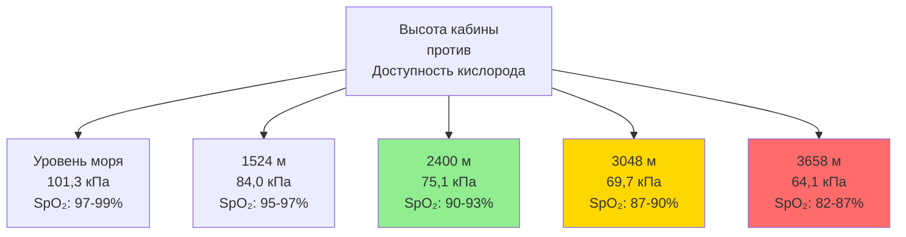

Требования к наружному воздуху для летательных аппаратов находятся на пересечении нормативного соответствия, термодинамических ограничений и физиологических потребностей. В отличие от наземных систем HVAC, где наружный воздух доступен в изобилии при атмосферном давлении, летательные аппараты должны отбирать кондиционированный воздух из компрессоров двигателей со значительным штрафом по расходу топлива, работая в условиях, где внешнее давление падает до 20% от давления на уровне моря, а температура достигает -49°C. Конструктивная задача состоит в обеспечении достаточного количества кислорода и разбавляющей вентиляции при минимизации энергетической нагрузки на силовые установки.

## Нормативная база и минимальные стандарты вентиляции

FAR 25.831 устанавливает предписывающие минимальные требования к наружному воздуху для летательных аппаратов категории транспорт, летающих в соответствии с 14 CFR Part 25. Регламент предусматривает минимальное поступление 0,25 кг/мин на одного пассажира при максимальной сертифицированной вместимости, независимо от высоты полета или условий эксплуатации.

Преобразование массового требования в объемный расход требует учета плотности воздуха при условиях в кабине:

$$
\dot{Q}_{OA} = \frac{\dot{m}_{OA}}{\rho_{cabin}} = \frac{0,25 \text{ кг/мин} \times N_{pax}}{\rho_{cabin}}
$$

При типичных условиях в кабине (24°C, 2400 м эквивалент высоты кабины, соответствующий 75,1 кПа):

$$
\rho_{cabin} = \frac{P}{R \cdot T} = \frac{75,1}{287 \times 297} = 0,882 \text{ кг/м}^3
$$

Это обеспечивает приблизительно 17 м³/ч (10 CFM) на одного пассажира, устанавливая базовую скорость вентиляции. Современные летательные аппараты обычно работают на уровне 25-34 м³/ч (15-20 CFM) на человека, обеспечивая резерв выше нормативных минимумов и улучшая воспринимаемое качество воздуха.

**Параметры нормативного соответствия:**

| Требование | Предел | Условие измерения |
|-------------|--------|------------------|
| Поступление наружного воздуха | 0,25 кг/мин на пассажира | Максимальная вместимость |
| Концентрация CO₂ | <0,5% по объему | Любая занятая зона |
| Концентрация CO | <1 на 20 000 | Требуется непрерывный контроль |
| Высота кабины | ≤2400 м | До практического потолка летательного аппарата |
| Парциальное давление кислорода | ≥15,5 кПа | Эквивалент 2400 м |

Предел по диоксиду углерода 0,5% (5000 ppm) обеспечивает значительный запас выше уровней, вызывающих физиологические эффекты, однако воспринимаемое качество воздуха ухудшается выше 1500-2000 ppm. Требование по парциальному давлению кислорода обеспечивает адекватное насыщение кислородом крови (SpO₂ ≥90%) для здоровых пассажиров при максимальной высоте кабины.

## Отбор воздуха из компрессора и термодинамические аспекты

Наружный воздух для вентиляции кабины поступает из ступеней компрессора двигателя или компрессоров вспомогательной силовой установки (ВСУ) через отбор отбираемого воздуха. Этот отбор происходит на ступенях высокого давления компрессора, где воздух достигает 1380-3100 кПа (абс.) и 200-370°C, что требует значительного охлаждения перед поступлением в кабину.

Термодинамическая стоимость отбора воздуха из компрессора проявляется как увеличение удельного расхода топлива (SFC). Каждый килограмм воздуха, отводимого из процесса горения, снижает удельную эффективность по тяге, с величиной, зависящей от точки отбора:

$$
\Delta SFC = k \cdot \frac{\dot{m}_{bleed}}{\dot{m}_{engine}} \cdot \left(1 + \frac{W_{comp}}{h_{fuel} \cdot \eta_{th}}\right)
$$

Где работа сжатия от точки отбора до условий подачи составляет 93-279 кДж/кг для типичных отборов высокого давления. При крейсерских условиях это преобразуется в приблизительный прирост расхода топлива на 1% на каждые 45 кг/мин отбираемого воздуха.

**Параметры отбора воздуха из компрессора:**

Пакет системы кондиционирования воздуха (СКВ) обрабатывает отбираемый воздух через холодильный цикл, достигая температуры подачи 2-7°C перед смешиванием с циркулируемым воздухом. Это охлаждение требует 186-279 кДж на килограмм наружного воздуха, представляя 35-45% от общей тепловой нагрузки СКВ во время крейсерского полета.

## Зависящая от высоты полета производительность и стратегии вентиляции

Доступное давление отбираемого воздуха уменьшается с высотой полета по мере снижения давления на выходе компрессора двигателя при меньшей плотности воздуха. Эта характеристика требует тщательного конструирования системы для поддержания требуемых скоростей вентиляции по всему диапазону эксплуатации.

Ограничения перепада давления в кабине (55-62 кПа для алюминиевого фюзеляжа, 62-69 кПа для композитных конструкций) ограничивают максимальное давление в кабине на большой высоте. Связь между высотой полета, высотой кабины и требуемым давлением отбираемого воздуха определяет размеры системы:

$$
P_{bleed,req} = P_{cabin} + \Delta P_{system} = P_{amb} \cdot e^{\frac{-h_{cabin}}{8840}} + \Delta P_{duct} + \Delta P_{pack}
$$

На максимальной высоте крейсерского полета (FL410-FL450), внешнее давление падает до 17,2-14,5 кПа (абс.). Поддержание высоты кабины 2400 м (75,1 кПа) требует перепада 44-58 кПа. При добавлении потерь давления в системе 21-34 кПа минимальное необходимое давление отбираемого воздуха составляет 97-117 кПа (абс.).

**Диапазон производительности по высоте:**

| Высота полета | Внешнее давление | Высота кабины | Перепад давления | Требуемый отбор воздуха |
|---------------|------------------|---------------|------------------|------------------------|
| Уровень моря | 101,3 кПа | Уровень моря | 0 кПа | 172-241 кПа (абс.) |
| FL250 | 37,9 кПа | 1829 м | 42,1 кПа | 124-152 кПа (абс.) |
| FL350 | 24,1 кПа | 2286 м | 53,8 кПа | 110-138 кПа (абс.) |
| FL410 | 17,2 кПа | 2400 м | 57,9 кПа | 97-124 кПа (абс.) |
| FL450 | 14,5 кПа | 2400 м | 60,7 кПа | 97-124 кПа (абс.) |

Давление отбираемого воздуха двигателя при крейсерском полете обычно составляет 172-310 кПа (абс.) в зависимости от типа двигателя и положения дроссельной заслонки. Это обеспечивает адекватный резерв для нормальной эксплуатации, но ограничивает увеличение скорости вентиляции при высоком спросе на максимальной высоте.

## Парциальное давление кислорода и физиологические требования

Критическим параметром для дыхания человека является парциальное давление кислорода, а не абсолютное давление или процентное содержание кислорода. Герметизация кабины поддерживает парциальное давление кислорода, адекватное для нормальной физиологической функции без дополнительного кислорода.

На уровне моря парциальное давление кислорода в атмосфере составляет:

$$
P_{O_2,SL} = X_{O_2} \cdot P_{atm} = 0,2095 \times 101,3 = 21,2 \text{ кПа}
$$

На высоте кабины 2400 м:

$$
P_{O_2,2400} = 0,2095 \times 75,1 = 15,7 \text{ кПа}
$$

Это представляет 26% снижение доступности кислорода по сравнению с уровнем моря. Здоровые люди адаптируются через увеличение частоты дыхания и сердечного выброса, поддерживая артериальное насыщение кислородом (SpO₂) на уровне 90-95%.

Связь между высотой кабины и артериальным насыщением кислородом следует кривой диссоциации кислород-гемоглобин:

Нормативное ограничение на высоту 2400 м обеспечивает сохранение SpO₂ выше 90%, что является пороговым значением, ниже которого когнитивная функция начинает снижаться. Пассажиры с респираторными заболеваниями могут испытывать симптомы при этих уровнях, требуя использования дополнительного кислорода для пострадавших лиц.

## Расчеты массового расхода и размеры системы

Точное определение размеров системы поступления наружного воздуха требует учета изменяющихся нагрузок пассажиров, метаболических показателей и этапов полета. Расчет проектирования устанавливает требования максимального расхода:

$$
\dot{m}_{OA,total} = N_{pax,max} \times 0,25 + \dot{m}_{flight\,deck} + \dot{m}_{cargo,heated}
$$

Для типичного узкофюзеляжного летательного аппарата (150 пассажиров):

$$
\dot{m}_{OA,total} = 150 \times 0,25 + 2 \times 0,25 + 4,5 = 37,5 + 0,5 + 4,5 = 42,5 \text{ кг/мин}
$$

Преобразование в объемный расход при условиях в кабине (0,882 кг/м³):

$$
\dot{Q}_{OA,total} = \frac{42,5}{0,882} = 48,2 \text{ м}^3\text{/мин} = 2915 \text{ CFM}
$$

Пакет системы кондиционирования должен обеспечивать этот расход при всех условиях эксплуатации, требуя переразмеривания для наихудших сценариев:

- Максимальная вместимость пассажиров
- Максимальная высота кабины (2400 м)
- Максимальная высота полета (наименьшее давление отбираемого воздуха)
- Работа с одним пакетом (требование резервирования)
- Охлаждающая способность пакета при жарких наземных операциях

**Факторы размеров системы:**

| Условие проектирования | Влияние на размеры | Типичный коэффициент |
|------------------------|-------------------|----------------------|
| Полная загрузка пассажирами | Базовое требование | 1,0× |
| Снижение плотности воздуха на высоте кабины | Увеличение объемного расхода | 1,15× |
| Потери в системе распределения | Компенсация падения давления | 1,10× |
| Работа с одним пакетом | Требование резервирования | 2,0× |
| Эффекты установки | Потери в воздуховодах, высота | 1,05-1,10× |
| Резерв для расширения | Будущие модификации | 1,05-1,10× |

Комбинированные коэффициенты проектирования дают полную мощность пакета 2,5-3,0 раза выше базового требования наружного воздуха, что приводит к установленной мощности 6800-8500 CFM (3,2-4,0 м³/с) на пакет для узкофюзеляжных летательных аппаратов.

## Соотношения циркуляции и баланс качества воздуха

Хотя FAR 25.831 требует минимум наружного воздуха, он позволяет циркуляцию при условии прохождения воздуха через фильтрацию HEPA. Оптимальная доля наружного воздуха уравновешивает качество воздуха, энергопотребление и контроль влажности.

Эффективность вентиляции зависит от эффективности смешивания и удаления загрязняющих веществ:

$$
\eta_v = \frac{C_{exhaust} - C_{supply}}{C_{breathing\,zone} - C_{supply}}
$$

Для хорошо перемешанных кабин летательных аппаратов с циркуляцией с фильтрацией HEPA эффективность вентиляции приближается к 1,0, что указывает на идеальное перемешивание. Это позволяет снизить доли наружного воздуха при сохранении эквивалентного разбавления загрязняющих веществ.

Накопление диоксида углерода обеспечивает ограничивающий фактор для коэффициента циркуляции:

$$
C_{CO_2,ss} = C_{CO_2,OA} + \frac{G_{CO_2}}{\dot{Q}_{OA} + \dot{Q}_{recir} \cdot (1 - \eta_{filter})}
$$

Где $G_{CO_2}$ представляет метаболическое производство CO₂ (0,28 м³/ч на человека в состоянии покоя). При фильтрации HEPA, удаляющей частицы, но не газы, установившееся концентрация CO₂ зависит только от доли наружного воздуха и общей скорости вентиляции.

**Сравнение стратегий циркуляции:**

| % Наружного воздуха | % Циркуляции | Установившаяся концентрация CO₂ | Влияние на топливо | Применение |
|-------------------|------------|--------------------------------|-------------------|-----------|
| 100% | 0% | 800-1000 ppm | Базовое +8-10% | Наземные операции, ВСУ |
| 60% | 40% | 1200-1500 ppm | +3-4% | Типичный крейсер |
| 50% | 50% | 1400-1800 ppm | Справочное | Стандартный крейсер |
| 40% | 60% | 1800-2200 ppm | -2-3% | Экономичный крейсер, легкие нагрузки |
| 30% | 70% | 2400-3000 ppm | -4-5% | Не рекомендуется |

Большинство современных летательных аппаратов работают на 50-60% наружного воздуха при крейсерском полете, достигая уровней CO₂ 1200-1800 ppm при минимизации расхода топлива. Наземные операции с кондиционированием от ВСУ часто используют 70-100% наружного воздуха из-за меньших энергетических затрат и неограниченной доступности воздуха.

## Контроль влажности и управление влагой

Наружный воздух при крейсерском полете содержит минимальную влагу (точка росы -40-60°C), обеспечивая естественное осушение воздуха в кабине. Чрезвычайно сухой отбираемый воздух смешивается с влагой, образующейся при дыхании и потоотделении пассажиров, устанавливая равновесную влажность.

Баланс влаги в кабине:

$$
\dot{m}_{H_2O,generation} = N_{pax} \times G_{moisture} = \dot{m}_{OA} \times (W_{cabin} - W_{OA})
$$

Где $G_{moisture}$ составляет приблизительно 0,11-0,16 кг/ч на человека в состоянии покоя. Для 150 пассажиров:

$$
\dot{m}_{H_2O,total} = 150 \times 0,14 = 21 \text{ кг/ч}
$$

Эта влага должна быть удалена вентиляцией наружного воздуха или конденсироваться на холодных поверхностях (фюзеляж, окна). Требуемое увеличение влажности наружного воздуха:

$$
\Delta W = \frac{21}{42,5 \times 60} = 0,0082 \text{ кг}_w/\text{кг}_{da}
$$

Если поступающий наружный воздух имеет $W_{OA}$ = 0,00009 кгw/кгda (типичный крейсер), влажность в кабине стабилизируется на уровне 0,0083 кгw/кгda, соответствуя 8-12% ОВ при температуре в кабине 22°C. Эта чрезвычайно низкая влажность вызывает дискомфорт у пассажиров на длительных полетах, но предотвращает конденсацию в конструкции летательного аппарата.

Увеличение доли наружного воздуха выше минимальных требований обеспечивает единственный практический метод контроля влажности, поскольку системы активной увлажнения добавляют неприемлемые вес и сложность. Некоторые современные широкофюзеляжные летательные аппараты включают системы увлажнения для премиум-салонов, добавляя 9-18 кг/ч влаги для повышения локальной ОВ до 15-20%.

## Эксплуатационные аспекты и управление системой

Экипажи летательного аппарата контролируют и регулируют поступление наружного воздуха через панели управления СКВ, уравновешивая комфорт, качество воздуха и эффективность использования топлива. Автоматические системы модулируют скорость вентилятора циркуляции и выходную мощность пакета в зависимости от датчиков нагрузки пассажиров, условий окружающей среды и этапа полета.

Ключевые эксплуатационные параметры включают:

- Селектор расхода пакета: Низкий/Нормальный/Высокий (50%/100%/150% от базовой величины)
- Статус вентилятора циркуляции: Включено/Отключено/Авто
- Целевые температуры в кабине: Типичный диапазон 20-24°C
- Высота кабины: Автоматический график герметизации
- Выбор источника отбираемого воздуха: Двигатель или ВСУ

При необычных условиях эксплуатации (один пакет, один двигатель или деградированный отбор воздуха) система автоматически переконфигурируется для поддержания минимальной скорости вентиляции при потенциальном смягчении целевых параметров высоты кабины или температуры. Система герметизации предотвращает превышение высоты кабины 2400 м при нормальных обстоятельствах и 4300-4600 м при экстренном снижении.

Стратификация температуры и боковая равномерность зависят от поддержания проектного распределения воздушного потока. Сниженный расход пакета при легких нагрузках пассажиров может вызвать жалобы на комфорт несмотря на адекватные средние условия, требуя ручного переключения на нормальный или высокий режим расхода.

Современные летательные аппараты включают системы вентиляции по требованию, которые регулируют общий воздушный поток на основе фактического количества пассажиров, а не максимальной сертифицированной вместимости. Эта оптимизация снижает расход топлива на 1-3% на рейсах с легкой загрузкой, сохраняя нормативное соответствие и стандарты комфорта.
