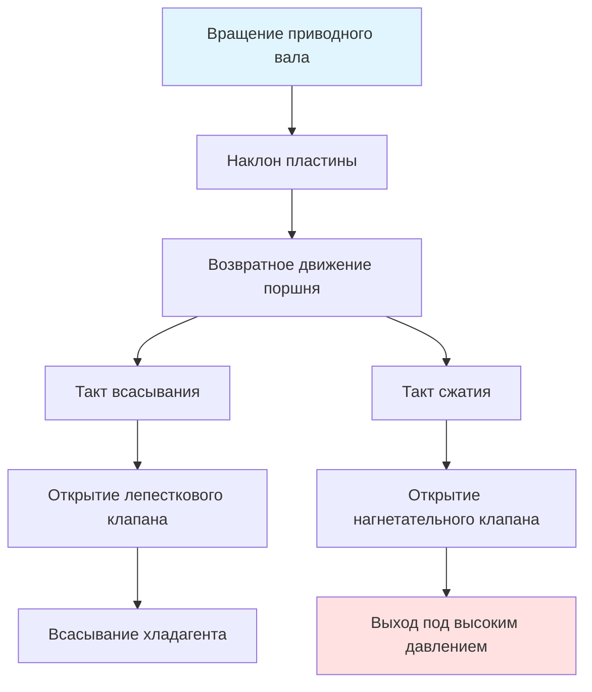

Автомобильные компрессоры кондиционирования преобразуют механическую энергию от двигателя или электромотора в перепад давления хладагента, обеспечивая работу цикла паровой компрессионной холодильной машины. Конструкция компрессора непосредственно влияет на эффективность системы, шум, вибрацию и способность теплоотвода в условиях весьма переменных режимов работы.

## Основные принципы работы

Автомобильные компрессоры должны работать в экстремально широком диапазоне скоростей—от холостого хода (600-900 об/мин двигателя) до условий движения по шоссе (3000-6000 об/мин), что создает уникальные задачи проектирования. Процесс сжатия описывается следующим образом:

$$W_{comp} = \dot{m} \cdot h_{discharge} - h_{suction}$$

где $W_{comp}$ представляет потребляемую мощность компрессора, $\dot{m}$ — массовый расход хладагента, а $h$ обозначает удельную энтальпию. Для типичных систем на R-1234yf давления на входе находятся в диапазоне 1,5-3,0 бар с давлениями на выходе 12-25 бар в зависимости от условий окружающей среды.

Объемный КПД учитывает объем мертвого пространства и потери в клапанах:

$$\eta_v = \frac{\dot{V}_{actual}}{\dot{V}_{displacement}} = 1 - C\left[\left(\frac{P_d}{P_s}\right)^{1/n} - 1\right]$$

где $C$ — коэффициент мертвого объема, $P_d$ и $P_s$ — давления на выходе и входе, $n$ — показатель политропы (обычно 1,1-1,3 для хладагентов).

## Конструкция компрессора с наклонным диском

Компрессор с наклонным диском (аксиально-поршневой) доминирует в автомобильных приложениях благодаря компактной конструкции и плавной работе. Наклонная пластина, установленная на приводном валу, преобразует вращательное движение в возвратно-поступательное движение поршней.

### Компрессор с фиксированным рабочим объемом

Угол наклона пластины остается постоянным, обычно 15-25°. Ход поршня $S$ связан с углом наклона $\alpha$ и радиусом пластины $r$:

$$S = 2r \cdot \tan(\alpha)$$

Рабочий объем для $n$ цилиндров с диаметром поршня $d$:

$$V_d = n \cdot \frac{\pi d^2}{4} \cdot S$$

Общие конфигурации включают конструкции с 5, 6, 7 и 10 цилиндрами. Семицилиндровое расположение обеспечивает отличную балансировку с минимальной пульсацией.

### Управление переменным рабочим объемом

Компрессоры с переменным рабочим объемом регулируют холодопроизводительность путем изменения угла наклона пластины от близких к 0° (минимальная холодопроизводительность) до максимального угла. Это исключает циклическое включение сцепления, снижая термический удар и улучшая комфортабельность.

Механизм управления уравновешивает три области давления:

$$P_{crank} = f(P_{suction}, P_{discharge}, P_{control})$$

Управляющий клапан модулирует давление в картере путем отвода газа нагнетания. При снижении спроса на охлаждение повышение давления в картере уменьшает перепад давления на поршнях, снижая угол наклона пластины.

**Характеристики модуляции холодопроизводительности:**

- Минимальный рабочий объем: 2-5% от максимального
- Время переходного процесса: 0,5-2,0 секунды
- Диапазон давления управления: 3-8 бар

## Технология спирального компрессора

Спиральные компрессоры используют два переплетенных спиральных элемента—один неподвижный, один вращающийся—для непрерывного сжатия хладагента без клапанов. Эта конструкция обеспечивает:

- Сниженный шум (на 5-10 дБ ниже, чем у поршневых)
- Более высокую эффективность при частичных нагрузках
- Меньшее количество движущихся деталей
- Более плавную подачу крутящего момента

Степень сжатия развивается постепенно по мере движения газа от внешнего к внутреннему радиусу:

$$r_c = \left(\frac{r_{outer}}{r_{inner}}\right)^2$$

Для автомобильных приложений типичны степени сжатия 3,5-6,0. Радиус орбиты вращающейся спирали $R_{orbit}$ определяет рабочий объем:

$$V_d = 2\pi h (R_{outer} - R_{inner}) \cdot R_{orbit}$$

где $h$ — высота спирали.

Спиральные компрессоры превосходны в гибридных и электрических автомобилях, где непрерывная работа на фиксированных скоростях обеспечивает оптимальную эффективность. SAE J2765 признает преимущества спиральных компрессоров для электрических приводных систем.

## Системы электрических компрессоров

Электрические компрессоры исключают зависимость от ременного привода, что критично для гибридных и электрических автомобилей и обеспечивает климат-контроль при остановленном двигателе. Существует три архитектуры:

| Архитектура | Напряжение | Диапазон мощности | Применение |
|-------------|-----------|------------------|-----------|
| Высоковольтный DC | 200-400В | 3-7 кВт | Аккумуляторные ЭВ, PHEV |
| 48В мягкий гибрид | 48В | 1,5-3 кВт | Мягкие гибриды |
| 12В электрический | 12В | 0,5-1,5 кВт | Вспомогательное охлаждение/припаркованный режим |

КПД бесщеточного DC-мотора:

$$\eta_{motor} = \frac{P_{mechanical}}{P_{electrical}} = \frac{\tau \cdot \omega}{V \cdot I}$$

Современные инвертерные системы управления достигают КПД 85-92% в широком диапазоне скоростей (1000-8000 об/мин), обеспечивая точное согласование холодопроизводительности без механического изменения рабочего объема.

**Задачи теплоотвода:**

Электрические компрессоры выделяют тепло от потерь в моторе и работы сжатия. Контуры охлаждения маслом или охлаждение впрыском хладагента поддерживают температуру мотора ниже 120°C. Выделение тепла:

$$Q_{motor} = P_{electrical} \cdot (1 - \eta_{motor}) + W_{comp} \cdot (1 - \eta_{comp})$$

## Системы электромагнитного сцепления

Электромагнитные муфты соединяют компрессор с ременной системой привода двигателя. Муфта состоит из:

1. **Узел шкива** — свободно вращается на подшипнике при разомкнутом состоянии
2. **Электромагнитная катушка** — создает магнитное поле (12В, 3-5А)
3. **Фрикционная пластина** — блокирует шкив при включении
4. **Втулка** — соединяется с валом компрессора

Момент включения должен преодолеть:

$$T_{engage} = T_{static} + T_{acceleration} + T_{compression}$$

где момент статического трения предотвращает начальное вращение, момент ускорения приводит компрессор к скорости ремня (обычно 0,1-0,3 секунды), и момент сжатия поддерживает работу.

**Влияние циклирования муфты:**

- Цикл включения-выключения: типично 3-10 в минуту
- Температурный размах: ±5-8°C на испарителе
- Импульс включения: скачок крутящего момента 20-40 Нм
- Износ: ожидаемый срок службы 50 000-100 000 циклов

## Переменный рабочий объем без сцепления

Современные системы исключают муфту путем сочетания переменного рабочего объема с непрерывной работой на минимальном объеме при отсутствии спроса на охлаждение. Такой подход:

- Снижает паразитные потери (минимальный объем потребляет 0,2-0,5 кВт)
- Исключает импульс и шум включения
- Улучшает комфортабельность салона (отсутствует циклирование температуры)
- Продлевает срок службы компонентов

Компрессор с внешним управлением переменным рабочим объемом (ECVD) использует управляемые по ширине импульса клапаны управления, реагирующие на сигналы электронного климат-контроля, обеспечивая интеграцию со стратегиями теплоотвода, оптимизирующими общую эффективность автомобиля.

## Сравнение эффективности

| Тип компрессора | КПД | Шум (дБА) | Масса (кг) | Коэффициент стоимости |
|------------------|-----|-----------|-----------|----------------------|
| Фиксированный с наклонным диском | 65-75% | 70-75 | 4,5-6,0 | 1,0x |
| Переменный рабочий объем | 70-80% | 68-73 | 5,5-7,0 | 1,3-1,5x |
| Спиральный | 75-82% | 62-68 | 5,0-6,5 | 1,4-1,7x |
| Электрический спиральный | 78-85% | 60-65 | 6,5-8,5 | 2,0-2,5x |

Значения КПД представляют изоэнтропийный КПД в условиях испытания SAE J2765 (35°C окружающей среды, целевая температура салона 21°C).

## Критерии выбора приложения

**Выбирайте фиксированный объем со сцеплением для:**
- Приложений, чувствительных к стоимости
- Традиционных автомобилей с ДВС
- Умеренного климата

**Выбирайте переменный объем для:**
- Требований повышенного комфорта
- Продолжительной работы на холостом ходу
- Автомобилей, чувствительных к шуму

**Выбирайте электрические компрессоры для:**
- Гибридных и электрических автомобилей
- Интеграции передовых систем теплоотвода
- Приоритета максимальной эффективности

Тенденция к электрификации автомобилей приводит к внедрению высоковольтных электрических компрессоров с интегрированными инвертерами, тогда как переменный объем остается доминирующим в традиционных силовых установках, где сохраняются преимущества компактности ременного привода и стоимости.

## Ссылки

- SAE J2765: Procedure for Measuring System COP of a Mobile Air Conditioning System on a Test Bench
- SAE J639: Engine Cooling System Field Test (Alphanumeric Designation)
