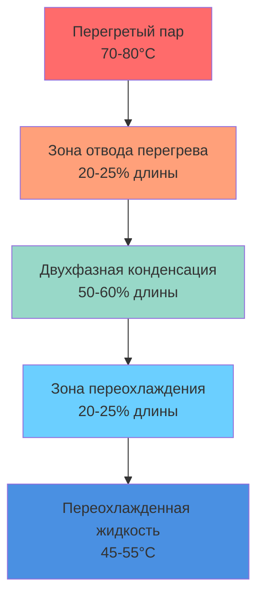

Автомобильные кондиционеры работают в условиях постоянно меняющихся параметров, что создает вызовы традиционным принципам проектирования HVAC. В отличие от стационарных систем, автомобильные конденсаторы должны эффективно отводить тепло при скоростях транспортного средства от 0 до 120+ км/ч, занимая минимальную лобовую площадь и выдерживая вибрацию, пульсации давления и коррозионную среду.

## Конфигурации конструкции конденсаторов

### Архитектура параллельного потока

Конденсаторы параллельного потока направляют хладагент через несколько вертикальных трубок одновременно, при этом воздух движется перпендикулярно потоку хладагента. Эта конфигурация снижает заряд хладагента при улучшении эффективности теплопередачи благодаря оптимизированному распределению потока.

**Характеристики конструкции:**
- Хладагент протекает вертикально через 10-40 параллельных каналов
- Гидравлический диаметр трубки: 1,0-2,0 мм
- Лобовая площадь: 0,3-0,6 м² для легковых автомобилей
- Глубина: 12-16 мм (однопроходной микроканальный)

Теплопередача происходит в основном посредством принудительной конвекции. Общий коэффициент теплопередачи $U$ зависит от сопротивлений со стороны воздуха и хладагента:

$$\frac{1}{U} = \frac{1}{h_{\text{воздух}} \eta_{\text{ребро}}} + \frac{t_{\text{стенка}}}{k_{\text{Al}}} + \frac{1}{h_{\text{хл}}}$$

Где $\eta_{\text{ребро}}$ представляет эффективность ребер, обычно 0,75-0,85 для автомобильных ребристых профилей с жалюзи. Коэффициент со стороны хладагента $h_{\text{хл}}$ резко изменяется по длине конденсатора по мере конденсации пара в жидкость.

### Змеевиковая конфигурация

Змеевиковые конденсаторы используют непрерывную трубку, которая извивается по лобовой стороне конденсатора, заставляя хладагент пройти через один извилистый путь. Эта конструкция поддерживает более высокую скорость хладагента, но увеличивает перепад давления и заряд хладагента.

**Сравнительный перепад давления:**

| Тип конструкции | Перепад давления хладагента | Заряд хладагента | Перепад давления со стороны воздуха |
|---|---|---|---|
| Параллельный поток | 20-40 кПа | 150-250 г | 80-120 Па |
| Змеевиковый | 60-120 кПа | 400-600 г | 100-150 Па |
| Трубчато-пластинчатый | 40-80 кПа | 300-500 г | 60-100 Па |

### Микроканальная технология

Микроканальные конденсаторы используют экструдированные алюминиевые трубки с внутренними гидравлическими диаметрами 0,5-1,5 мм. Малые проходы создают турбулентный поток даже при низких числах Рейнольдса, повышая коэффициент теплопередачи при конденсации и снижая объем хладагента на 40-60% по сравнению с обычными конструкциями.

Коэффициент теплопередачи при конденсации в микроканалах следует модифицированным корреляциям типа Нуссельта:

$$h_{\text{конд}} = 0,023 \, \text{Re}^{0,8} \, \text{Pr}^{0,4} \frac{k_{\text{хл}}}{D_h} \left(1 + \frac{2,5}{X_{tt}}\right)$$

Где $X_{tt}$ — параметр Мартинелли, характеризующий режим двухфазного потока.

## Расчеты отвода тепла

Конденсатор должен отводить как холодопроизводительность испарителя, так и работу компрессора. Общий отвод тепла следует закону сохранения энергии:

$$Q_{\text{конд}} = Q_{\text{испаритель}} + W_{\text{компр}} = \dot{m}_{\text{хл}} (h_{\text{вход}} - h_{\text{выход}})$$

Для типичной системы легкового автомобиля:
- Холодопроизводительность испарителя: $Q_{\text{испаритель}}$ = 3,5-5,0 кВт
- Работа компрессора: $W_{\text{компр}}$ = 1,2-2,0 кВт
- Отвод конденсатора: $Q_{\text{конд}}$ = 4,7-7,0 кВт

Требуемая площадь теплопередачи зависит от логарифмической средней разности температур (LMTD):

$$A_{\text{треб}} = \frac{Q_{\text{конд}}}{U \cdot \text{LMTD}}$$

Для R-134a, конденсирующегося при 55°C с температурой окружающего воздуха 35°C:

$$\text{LMTD} = \frac{(55-35) - (48-40)}{\ln\left(\frac{55-35}{48-40}\right)} = 13,2 \, \text{K}$$

Где 48°C представляет температуру переохлажденной жидкости, а 40°C — температуру выхода воздуха.

## Динамика воздушного потока и скорость транспортного средства

Воздушный поток конденсатора поступает из двух источников: набегающий воздух при движении транспорта и охлаждающий вентилятор двигателя при остановке или низкой скорости.

Скорость набегающего воздуха связана со скоростью транспорта через эффективность лобовой площади:

$$\dot{m}_{\text{воздух}} = \rho_{\text{воздух}} \cdot v_{\text{ТС}} \cdot A_{\text{лоб}} \cdot \eta_{\text{набег}}$$

Где $\eta_{\text{набег}}$ учитывает блокировку радиатора и перепуск воздуха, обычно 0,4-0,7. При 100 км/ч с $A_{\text{лоб}}$ = 0,45 м²:

$$\dot{m}_{\text{воздух}} = 1,18 \times \frac{100}{3,6} \times 0,45 \times 0,6 = 8,9 \, \text{кг/с} = 534 \, \text{кг/мин}$$

## Методология расчета конденсатора

SAE J2765 предоставляет стандартизированные условия испытаний для автомобильных систем кондиционирования. Расчет конденсатора должен удовлетворять требованиям отвода тепла в наихудших условиях:

**Критические точки проектирования:**
- Температура окружающей среды: 46°C (наихудший случай в Фениксе)
- Скорость транспорта: 0 км/ч (режим холостого хода)
- Солнечная нагрузка: 1000 Вт/м²
- Нагрузка салона: максимальный режим свежего воздуха

Процесс расчета следует этим этапам:

1. **Расчет максимального отвода тепла:** Определить $Q_{\text{конд}}$ при максимальной скорости компрессора и наихудшей нагрузке испарителя
2. **Определение воздушного потока:** Использование минимального потока вентилятора на холостом ходу (консервативный подход)
3. **Определение LMTD:** На основе максимальной температуры конденсации (65-70°C для R-134a) и окружающей температуры
4. **Расчет произведения UA:** $UA = Q_{\text{конд}} / \text{LMTD}$
5. **Выбор геометрии сердечника:** Выбор плотности ребер, конфигурации трубок для достижения требования UA
6. **Проверка перепада давления:** Обеспечение $\Delta P$ хладагента < 100 кПа для поддержания эффективности компрессора

## Требования переохлаждения

Переохлаждение обеспечивает вход жидкого хладагента в расширительное устройство, предотвращая образование паров, которые снижают холодопроизводительность системы. Автомобильные системы ориентируются на 5-10°C переохлаждения в нормальных условиях.

Секция переохлаждения занимает нижние 20-30% конденсаторов параллельного потока:

$$Q_{\text{переохл}} = \dot{m}_{\text{хл}} \cdot c_{p,\text{жидкость}} \cdot \Delta T_{\text{переохл}}$$

Для R-134a с $c_p$ = 1,43 кДж/(кг·K) и переохлаждением 8°C при 40 г/с:

$$Q_{\text{переохл}} = 0,040 \times 1430 \times 8 = 458 \, \text{Вт}$$

Это представляет примерно 8-10% от полной холодопроизводительности конденсатора, но критически влияет на производительность расширительного устройства и стабильность системы.

Недостаточное переохлаждение проявляется как:
- Снижение холодопроизводительности испарителя (пары занимают объем без охлаждения)
- Нестабильность и колебания расширительного клапана
- Шум компрессора от гидроударов жидкости при ускорении
- Увеличение давления на напорной линии, так как система компенсирует потери

**Факторы, влияющие на переохлаждение:**
- Воздушный поток конденсатора: прямо пропорционален величине переохлаждения
- Заряд хладагента: недостаток сначала снижает переохлаждение
- Загрязнение конденсатора: отложения закупоривают воздушный поток, снижая теплопередачу
- Температура окружающей среды: более высокая температура требует большей лобовой площади для эквивалентного переохлаждения

Современные автомобильные системы контролируют переохлаждение через соотношение давления и температуры на выходе конденсатора, регулируя скорость вентилятора или рабочий объем компрессора для поддержания целевых значений во всем диапазоне условий эксплуатации.

## Компоненты

- Конденсатор параллельного потока
- Микроканальный конденсатор
- Трубчато-пластинчатый конденсатор
- Змеевиковый конденсатор
- Фронтально установленный конденсатор
- Набегающий воздушный поток конденсатора
- Работа вентилятора конденсатора
- Секция переохлаждения
- Размещение осушителя-аккумулятора
- Размещение аккумулятора
