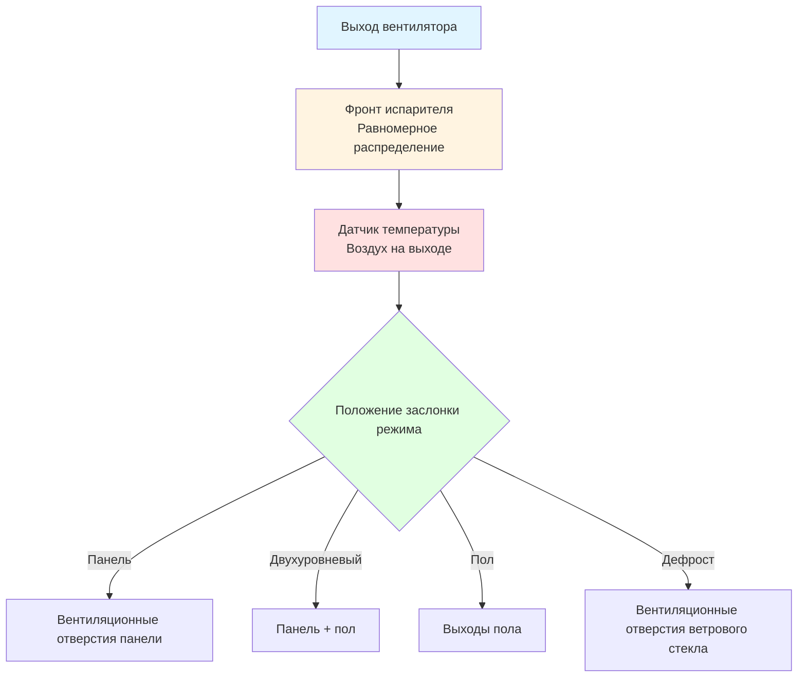

## Основы теплопередачи испарителей

Автомобильный испаритель служит основным охлаждающим компонентом в мобильных системах кондиционирования воздуха, поглощая тепло воздуха салона посредством испарения хладагента. Расположенный в HVAC-модуле позади панели приборов, испаритель работает в сложных условиях, включая вибрацию, переменный поток хладагента и циклическую работу.

Процесс теплопередачи включает явное и скрытое охлаждение при прохождении воздуха салона через сердцевину испарителя. Общая холодопроизводительность следует:

$$Q_{total} = Q_{sensible} + Q_{latent} = \dot{m}_{air} c_{p,air} (T_{in} - T_{out}) + \dot{m}_{air} \omega (h_{fg})$$

где $\dot{m}_{air}$ — массовый расход воздуха (обычно 150–400 кг/ч), $c_{p,air}$ — удельная теплоемкость воздуха, $T_{in}$ и $T_{out}$ — температуры воздуха на входе и выходе, $\omega$ — скорость удаления влаги, и $h_{fg}$ — удельная теплота испарения воды.

## Конструкция пластинчато-реберного испарителя

Пластинчато-реберные испарители преобладают в автомобильных приложениях благодаря компактной геометрии и высокой эффективности теплопередачи. Конструкция состоит из параллельных трубок с хладагентом с тонкими алюминиевыми ребрами, припаянными между ними, создавая несколько проходов для воздуха.

### Элементы конструкции

**Геометрия сердцевины:**
- Плотность ребер: 8–14 ребер на дюйм
- Толщина ребра: 0,08–0,12 мм алюминий
- Расстояние между трубками: 8–12 мм
- Типовая глубина сердцевины: 50–70 мм
- Площадь фронта: 0,15–0,25 м²

Конфигурация пластинчато-реберного типа максимизирует площадь поверхности со стороны воздуха, которая представляет контролирующее тепловое сопротивление. Общий коэффициент теплопередачи зависит от коэффициентов со стороны воздуха и хладагента:

$$\frac{1}{UA_{overall}} = \frac{1}{\eta_{fin} h_{air} A_{air}} + \frac{t_{wall}}{k_{Al} A_{wall}} + \frac{1}{h_{ref} A_{ref}}$$

где $\eta_{fin}$ — эффективность ребра (обычно 0,75–0,85), $h_{air}$ — коэффициент конвекции со стороны воздуха (40–80 Вт/м²·K), $h_{ref}$ — коэффициент кипения хладагента (800–1500 Вт/м²·K), и соответствующие площади поверхности учитывают геометрию.

### Рассмотрение эффективности ребер

Эффективность ребра снижается с длиной ребра из-за градиента температуры вдоль ребра. Для прямоугольных ребер:

$$\eta_{fin} = \frac{\tanh(mL)}{mL}$$

где $m = \sqrt{\frac{2h_{air}}{k_{Al} t_{fin}}}$ и $L$ — половинная высота ребра. Более тонкие ребра увеличивают площадь поверхности, но снижают эффективность, требуя оптимизации.

## Конфигурация трубчато-реберного испарителя

Трубчато-реберные конструкции используют круглые или сплющенные трубки, проходящие через гофрированные ребра. Хотя менее распространены в современных автомобилях, чем пластинчато-реберные, трубчато-реберные испарители предлагают преимущества в конкретных приложениях.

### Сравнительная производительность

| Параметр | Пластинчато-реберный | Трубчато-реберный |
|-----------|-----------|----------|
| Перепад давления со стороны воздуха | 80–120 Па | 60–90 Па |
| Распределение хладагента | Равномерное | Требуются контуры |
| Вес (типовая сердцевина) | 1,8–2,5 кг | 2,2–3,0 кг |
| Стоимость производства | Ниже | Выше |
| Устойчивость к вибрации | Хорошая | Отличная |
| Возможность плотности ребер | 8–14 FPI | 6–10 FPI |

## Распределение потока хладагента

Надлежащее распределение хладагента по трубкам испарителя обеспечивает равномерное охлаждение и предотвращает локальное обледенение. Многоходовые конструкции с распределительными трубками создают параллельные пути потока:

Неравномерное распределение вызывает потерю производительности и может быть количественно оценено коэффициентом распределения:

$$DF = \frac{\dot{m}_{max} - \dot{m}_{min}}{\dot{m}_{avg}}$$

Значения ниже 0,15 указывают приемлемое распределение. SAE J2765 предоставляет протоколы тестирования для оценки распределения.

## Система дренажа конденсата

Удаление влаги из воздуха салона создает 0,5–2,0 литра в час конденсата, который должен стекать эффективно, чтобы предотвратить накопление воды, запахи и рост микроорганизмов.

### Принципы конструкции системы дренажа

Корпус испарителя включает сборный поддон, наклоненный под углом 2–5° к дренажному выходу. Дренажная трубка проходит через пол автомобиля, используя гравитацию и перепад давления воздуха:

$$\Delta P = \rho_{water} g h + \frac{1}{2} \rho_{air} v^2$$

где $h$ — высота вертикального падения и $v$ — скорость автомобиля, создающая давление напорного воздуха. Минимальный диаметр дренажной трубки составляет 12–15 мм, чтобы предотвратить засорение.

**Критические конструктивные особенности:**
- Уклон дренажного поддона ≥ 2° минимум
- Маршрут трубки избегает резких изгибов
- Выход расположен вдали от тепла выхлопа
- P-сифон или обратный клапан предотвращает попадание мусора
- Длина дренажной трубки минимизирована (< 500 мм типовая)

## Предотвращение роста микроорганизмов

Конденсат и органический мусор на поверхностях испарителя создают условия, благоприятные для колонизации бактериями и грибками, производящими затхлые запахи и потенциальные проблемы со здоровьем.

### Механизм роста

Размножение микроорганизмов требует трех элементов: влаги, питательных веществ (пыль, пыльца) и умеренных температур (15–35°C). Поверхность испарителя обеспечивает все три во время периодов между циклами работы.

**Стратегии предотвращения:**

1. **Поверхностные покрытия:** Противомикробные обработки (ионы серебра, пиритион цинка), применяемые к ребрам, ингибируют адгезию бактерий. Эффективность сохраняется: 2–3 года.

2. **Продув после остановки:** Запуск вентилятора в течение 30–60 секунд после остановки компрессора высушивает поверхность испарителя, удаляя влагу. Это снижает относительную влажность ниже порога роста (< 60% RH).

3. **Улучшенный дренаж:** Гидрофильные покрытия на ребрах способствуют стеканию воды, предотвращая задержку капель. Краевой угол смачивания снижен с 70–80° до 10–15°.

4. **УФ-обработка:** Некоторые системы включают УФ-C светодиоды (длина волны 260–280 нм), которые стерилизуют поверхности во время эксплуатации автомобиля.

Скорость испарения влаги во время продува после остановки следует:

$$\frac{dm}{dt} = h_{mass} A (\omega_{surface} - \omega_{air})$$

где $h_{mass}$ — коэффициент массопередачи и $\omega$ представляют отношения влажности. Полное высушивание поверхности обычно требует 1–2 минут воздушного потока.

## Интерфейс распределения воздуха в салоне

Сердцевина испарителя интегрируется с системой распределения воздуха HVAC-модуля, требуя оптимизированных картин потока для минимизации перепада давления при обеспечении равномерной скорости на фронте.

### Картины воздушного потока

Скорость на фронте должна оставаться в диапазоне 2,0–3,5 м/с для баланса между эффективностью теплопередачи и перепадом давления. Неравномерная скорость создает:

- **Зоны низкой скорости:** Сниженная теплопередача, потенциальное обледенение
- **Зоны высокой скорости:** Чрезмерный перепад давления, шум, сниженная эффективность точки росы

SAE J2765 определяет тестирование теплопроизводительности, включая эффективность со стороны воздуха:

$$\varepsilon = \frac{T_{air,in} - T_{air,out}}{T_{air,in} - T_{evap}}$$

Целевые значения эффективности варьируются от 0,65–0,80 в зависимости от условий эксплуатации.

## Управление температурой и предотвращение обледенения

Температура поверхности испарителя должна оставаться выше 0°C, чтобы предотвратить образование льда, который блокирует воздушный поток и исключает холодопроизводительность. Методы управления включают:

**Циклирование муфты (системы с фиксированным отверстием):**
- Компрессор циклирует на переключателе давления (обычно 172 кПа при включении, 138 кПа при отключении)
- Температура испарителя флуктуирует на 1–5°C
- Простая, низкая стоимость
- Пониженный комфорт при циклировании

**Регулятор давления испарителя (EPR):**
- Поддерживает минимальное давление испарителя (обычно 140–170 кПа для R-134a)
- Непрерывная работа компрессора
- Стабильная температура на выходе
- Требует компрессор переменного рабочего объема или внешнего управления

Температура насыщения хладагента при управляемом давлении обеспечивает тепловой предел:

$$T_{sat} = f(P_{evap})$$

Для R-134a поддержание 170 кПа дает температуру насыщения примерно 2°C, обеспечивая запас безопасности выше точки замерзания.

## Оптимизация производительности

Современные конструкции испарителей включают несколько передовых особенностей для улучшения производительности, долговечности и комфорта пассажиров при соответствии экологическим нормам.

**Развивающиеся технологии:**
- **Микроканальные сердцевины:** Трубки с гидравлическим диаметром 0,5–1,0 мм, снижение заряда хладагента на 40–60%
- **Жалюзийные ребра:** Улучшенный коэффициент теплопередачи со стороны воздуха, увеличение производительности на 15–25%
- **Переменная плотность ребер:** Более высокая плотность в областях низкой скорости для равномерной тепловой производительности
- **Встроенные датчики:** Встроенные датчики температуры для точного управления без дополнительных компонентов

Эти достижения решают развивающиеся требования, включая тепловое управление электрических транспортных средств, совместимость с хладагентом R-1234yf и снижение экологического воздействия согласно стандартам тестирования SAE J2765, SAE J639 и SAE J2765.
