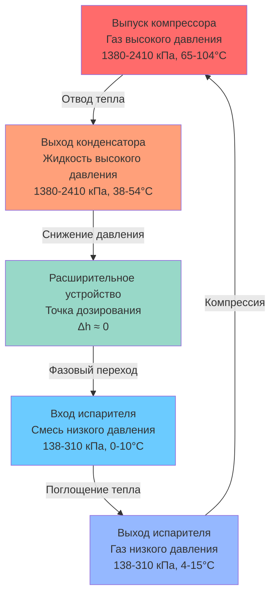
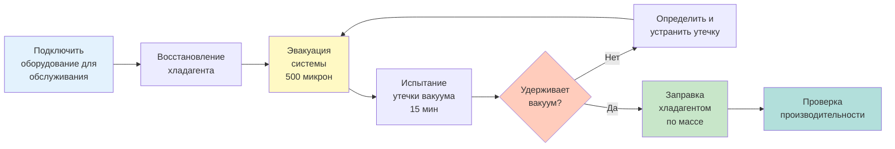

Системы кондиционирования воздуха автомобилей работают в уникальных условиях, которые отличаются от стационарных HVAC приложений. Контур хладагента должен функционировать при переменных оборотах двигателя, температурах окружающей среды в диапазоне от -40°C до 60°C и различных ориентациях транспортного средства, что создает динамические проблемы с возвратом масла. Понимание свойств хладагента и требований к проектированию системы необходимо для надлежащего обслуживания и оптимизации производительности.

## Термодинамические свойства и критерии выбора

Переход от R-134a (1,1,1,2-тетрафторэтан) к R-1234yf (2,3,3,3-тетрафторпропен) представляет ответ автомобильной промышленности на экологические нормативные акты, нацеленные на хладагенты с высоким потенциалом глобального потепления (GWP). Этот переход кардинально изменяет процедуры обслуживания, сохраняя при этом аналогичную производительность охлаждения.

### Сравнение свойств хладагентов

| Свойство | R-134a | R-1234yf | Значение |
|----------|--------|----------|---------|
| Молярная масса | 102,03 г/моль | 114,04 г/моль | Влияет на перепад давления |
| Критическая температура | 101°C | 94,7°C | Ограничивает производительность на высокой стороне |
| Критическое давление | 4055 кПа | 3575 кПа | Требование к расчетному давлению |
| GWP (100 лет) | 1430 | 4 | Воздействие на окружающую среду |
| ODP | 0 | 0 | Безопасность озона |
| Воспламеняемость | A1 (невоспламеняющийся) | A2L (слабо воспламеняющийся) | Классификация безопасности |
| Давление насыщения при 25°C | 605 кПа | 631 кПа | Аналогичный диапазон работы |

Более низкая критическая температура R-1234yf снижает доступный температурный перепад между конденсацией и условиями окружающей среды при экстремальной жаре, что требует улучшенного конструирования конденсатора или увеличения площади поверхности теплообмена для поддержания эквивалентного переохлаждения.

### Анализ цикла паровой компрессии

Хладагент претерпевает четыре фундаментальных изменения состояния в системе мобильного кондиционирования. Термодинамическая эффективность зависит от соотношения давления и энтальпии, уникального для каждого хладагента.

Коэффициент производительности (COP) для автомобильных систем обычно находится в диапазоне от 1,5 до 2,5 и рассчитывается как:

$$\text{COP}_{\text{охлаждение}} = \frac{Q_{\text{испаритель}}}{W_{\text{комп}}} = \frac{h_1 - h_4}{h_2 - h_1}$$

где $h_1$ — энтальпия на выходе испарителя, $h_2$ — энтальпия на выпуске компрессора, а $h_4$ — энтальпия на входе расширительного устройства (все в кДж/кг).

## Требования к заправке хладагентом

Точная заправка хладагентом критична в автомобильных системах из-за небольшого общего объема заправки и жестких допусков. Недостаточная заправка снижает охлаждающую мощность и может вызвать повреждение компрессора от недостаточной смазки. Чрезмерная заправка увеличивает давление на высокой стороне и снижает эффективность системы.

### Методы определения заправки

**Массовая заправка** (согласно SAE J2788): Наиболее точный метод, измеряющий массу хладагента напрямую с использованием калиброванного оборудования для заправки. Типовые системы легковых автомобилей содержат:

- **Системы R-134a**: 510-910 граммов
- **Системы R-1234yf**: 450-795 граммов

Сниженное количество заправки в системах R-1234yf обусловлено более высокой плотностью пара при рабочих условиях, позволяющей эквивалентному массовому потоку хладагента работать с меньшим общим запасом.

**Метод давления-температуры**: Сравнивает давления в системе с кривыми насыщения при температуре окружающей среды. Для R-134a при 27°C окружающей среды с двигателем при 1500 об/мин:

- Низкая сторона: 193-221 кПа (соответствует температуре испарителя 0-2°C)
- Высокая сторона: 1241-1517 кПа (соответствует температуре конденсации 46-57°C)

Перегрев на выходе испарителя должен быть:

$$\Delta T_{\text{перегрев}} = T_{\text{линия всасывания}} - T_{\text{нас}}(P_{\text{низкая сторона}})$$

Целевой перегрев: 4-8°C для систем TXV, 3-5°C для систем с калиброванным отверстием.

### Миграция хладагента и транспортировка масла

Автомобильные системы сталкиваются с уникальными проблемами возврата масла из-за переменных оборотов компрессора и ориентации транспортного средства. Масло PAG (полиалкиленгликоль), используемое с R-134a, гигроскопично и несовместимо с системами R-1234yf, которые требуют масла POE (полиловый эфир).

Степень циркуляции масла (OCR) должна оставаться между 1-3% массового потока хладагента:

$$\text{OCR} = \frac{\dot{m}_{\text{масло}}}{\dot{m}_{\text{хладагент}}} \times 100\%$$

Недостаточный возврат масла вызывает отказ подшипников компрессора, в то время как избыточное масло снижает эффективность теплопередачи, покрывая поверхности теплообменника.

## Компоненты и конструкция системы

### Выбор расширительного устройства

**Термостатический расширительный вентиль (TXV)**: Модулирует поток хладагента на основе перегрева на выходе испарителя. Баланс сил открытия клапана:

$$F_{\text{колба}} = F_{\text{пружина}} + F_{\text{испаритель}}$$

где давление колбы создает силу открытия, пружина обеспечивает силу закрытия, а давление испарителя действует на нижнюю часть диафрагмы.

**Калиброванное отверстие**: Простое ограничение, создающее перепад давления за счет уменьшения площади потока. Перепад давления следует:

$$\Delta P = \frac{8\rho v^2}{C_d^2}\left(\frac{1}{A_2^2} - \frac{1}{A_1^2}\right)$$

где $C_d$ — коэффициент расхода (обычно 0,61-0,64), $A_1$ — площадь выше по потоку и $A_2$ — площадь отверстия.

### Технологии компрессоров

| Тип | Управление рабочим объемом | Эффективность | Применение |
|-----|---------------------------|---------------|-----------|
| Фиксированный рабочий объем | Циклирование муфты | Средняя | Экономичные автомобили, R-134a |
| Переменный рабочий объем | Угол шатуна | Высокая | Большинство современных систем |
| Электрический спиральный | Инверторный привод | Очень высокая | Гибридные/электрические автомобили |
| Электрический переменный | Модуляция скорости | Очень высокая | Премиум-приложения |

Компрессоры переменного рабочего объема регулируют мощность от 2-100%, изменяя угол шатуна, устраняя циклирование муфты и обеспечивая более плавное управление температурой в салоне.

## Процедуры обслуживания и безопасность

### Требования к обслуживанию R-1234yf

SAE J2843 устанавливает требования к оборудованию для обслуживания R-1234yf из-за его классификации воспламеняемости A2L:

1. **Сертификация оборудования**: Сервисные машины должны соответствовать стандартам SAE J2843 с датчиками углеводородов
2. **Чувствительность обнаружения утечек**: Минимальная чувствительность 120,5 г/год (4,25 г/год)
3. **Вентиляция**: Адекватный воздушный поток для предотвращения накопления хладагента ниже нижнего предела воспламеняемости (LFL = 6,2% по объему)
4. **Предотвращение загрязнения**: Выделенное оборудование для обслуживания предотвращает перекрестное загрязнение с R-134a

### Восстановление и эвакуация

Надлежащая эвакуация удаляет неконденсируемые вещества и влагу, которые снижают производительность. Целевой вакуум: 500 микрон, выдерживаемый минимум 15 минут.

Содержание влаги должно оставаться ниже 10 ppm, чтобы предотвратить:
- Коррозию алюминиевых компонентов
- Образование плавиковой кислоты
- Образование ледяных кристаллов в расширительном устройстве

## Проверка производительности

После обслуживания производительность системы должна быть проверена в контролируемых условиях согласно SAE J2765:

**Условия испытания**:
- Температура окружающей среды: 35°C
- Обороты двигателя: 1500 об/мин
- Вентилятор: максимальная скорость
- Режим рециркуляции

**Критерии приемки**:
- Температура центрального вентиля: 3-7°C
- Перепад температуры: 28-33°C ниже окружающей среды
- Давление на высокой стороне: 1379-1724 кПа
- Давление на низкой стороне: 172-241 кПа

Температурный перепад через испаритель указывает на мощность поглощения тепла:

$$Q_{\text{испаритель}} = \dot{m}_{\text{воздух}} \times c_p \times (T_{\text{вход}} - T_{\text{выход}})$$

Типичные автомобильные испарители передают 9,3-20,9 кВт при номинальных условиях, обеспечивая быстрое охлаждение салона, необходимое для комфорта пассажиров.

## Ссылки

- SAE J2788: Оборудование для восстановления хладагента AC для HFO-1234yf
- SAE J2843: Фитинги шланга для обслуживания R-1234yf
- SAE J2765: Процедура измерения COP системы мобильного кондиционирования воздуха
- SAE J639: Стандарты безопасности для систем паровой компрессии хладагента автомобилей
