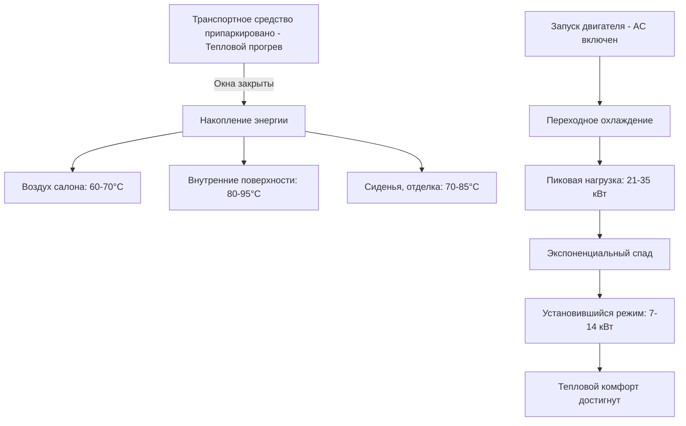

Тепловые нагрузки салона транспортного средства представляют собой общее количество теплоэнергии, которое должна удалить система HVAC для обеспечения комфорта пассажиров. В отличие от стационарных зданий, автомобильные приложения сталкиваются с экстремальными переходными условиями, высокими солнечными нагрузками относительно объёма корпуса и быстро изменяющимися граничными условиями во время работы.

## Расчет общей охлаждающей нагрузки

Полная мгновенная охлаждающая нагрузка для салона транспортного средства представляет собой сумму нескольких компонентов теплопередачи:

$$Q_{total} = Q_{solar} + Q_{cond} + Q_{occupant} + Q_{equipment} + Q_{ventilation}$$

где все члены выражены в ваттах или кДж/ч. Это уравнение применимо как к анализу в установившемся режиме, так и к переходному анализу, хотя величина и относительный вклад каждого члена значительно варьируются в зависимости от условий эксплуатации.

## Солнечный теплопритик

Солнечная радиация доминирует в профиле тепловой нагрузки транспортных средств из-за высокого отношения площади остекления к объёму. Солнечный теплопритик через остекление рассчитывается как:

$$Q_{solar} = \sum_{i} A_i \cdot SHGC_i \cdot I_i \cdot \cos(\theta_i)$$

где:
- $A_i$ = площадь остеклённой поверхности $i$ (м²)
- $SHGC_i$ = коэффициент солнечного теплопритика (безразмерный, 0-1)
- $I_i$ = интенсивность падающей солнечной радиации (Вт/м²)
- $\theta_i$ = угол падения относительно нормали к поверхности

Угол падения непрерывно изменяется в зависимости от ориентации транспортного средства, времени суток и географической широты. Пиковые солнечные нагрузки возникают, когда солнце расположено для прямого облучения больших площадей остекления — обычно при низком угле солнца через лобовое стекло или боковое стекло. SAE J2765 определяет стандартные условия солнечной нагрузки для испытаний, используя полную радиацию 1000 Вт/м² со спектральным распределением, соответствующим воздушной массе 1,5.

### Свойства остекления

| Тип остекления | SHGC | Видимый коэффициент пропускания | U-коэффициент (Вт/м²·K) |
|--------------|------|----------------------|-------------------|
| Прозрачное стекло | 0,76 | 0,88 | 5,8 |
| Тонированное | 0,62 | 0,65 | 5,6 |
| ИК-отражающее | 0,38 | 0,70 | 4,2 |
| Акустический ламинат | 0,55 | 0,75 | 5,2 |

Передовые технологии остекления значительно снижают солнечный теплопритик без пропорционального снижения видимого светопропускания, улучшая как тепловой комфорт, так и охлаждающую нагрузку.

## Теплопередача теплопроводностью

Теплопроводность происходит через все поверхности оболочки салона. Тепловой поток через каждую поверхность следует закону Фурье:

$$Q_{cond} = \sum_{i} U_i \cdot A_i \cdot (T_{ambient,i} - T_{cabin})$$

где:
- $U_i$ = общий коэффициент теплопередачи для поверхности $i$ (Вт/м²·K)
- $T_{ambient,i}$ = температура прилегающей среды (°C)
- $T_{cabin}$ = температура внутреннего воздуха (°C)

Температура окружающей среды варьируется по поверхностям: поверхности крыши и капота, подверженные прямой солнечной радиации, достигают температур на 30-50°C выше температуры воздуха из-за солнечного поглощения. Тёмная крыша при солнечной нагрузке 1000 Вт/м² может превышать 80°C, когда температура воздуха 35°C. Это создаёт значительную проводящую нагрузку даже при умеренной разности температур внутреннего и внешнего воздуха.

Нижние поверхности теряют тепло потоку более холодного воздуха в нижней части корпуса, в то время как дверные панели и боковые панели испытывают промежуточные условия. Точный расчёт нагрузки требует поверхностно-специфичных граничных условий температуры, а не единой температуры окружающей среды.

## Тепловыделение от пассажиров

Каждый пассажир выделяет метаболическое тепло, которое должна удалить система HVAC. Скорость выделения тепла зависит от уровня активности:

| Активность | Явное тепло (Вт) | Скрытое тепло (Вт) | Всего (Вт) |
|----------|-------------------|-----------------|-----------|
| Сидящий, отдыхающий | 60 | 40 | 100 |
| Лёгкая офисная работа | 70 | 45 | 115 |
| Вождение | 75 | 50 | 125 |

Для полностью занятого пятиместного транспортного средства с водителем и четырьмя пассажирами в умеренной активности общая нагрузка от пассажиров составляет приблизительно 500-625 Вт. Компонент скрытого тепла способствует накоплению влажности и должен быть учтён при адекватной вентиляции и производительности осушения.

## Тепловые нагрузки от оборудования

Внутреннее оборудование генерирует дополнительное явное тепло:
- **Панель приборов и дисплеи**: 50-150 Вт в зависимости от размера экрана и яркости
- **Силовая электроника**: 20-80 Вт от портов зарядки, усилителей
- **Обогреватели сидений/вентиляторы вентиляции**: 10-30 Вт на сиденье при работе
- **Управление тепловым режимом батареи** (электромобили): может добавить 200-500 Вт во время быстрой зарядки, если тепло батареи отводится в контур салона

## Вентиляционная нагрузка

Вентиляция подаёт наружный воздух в салон для качества воздуха и создания давления. Явное и скрытое тепло, связанное с этой воздушной массой:

$$Q_{vent,sensible} = \dot{m} \cdot c_p \cdot (T_{outdoor} - T_{cabin})$$

$$Q_{vent,latent} = \dot{m} \cdot h_{fg} \cdot (\omega_{outdoor} - \omega_{cabin})$$

где:
- $\dot{m}$ = массовый расход вентиляционного воздуха (кг/с)
- $c_p$ = удельная теплоёмкость воздуха (1005 Дж/кг·K)
- $h_{fg}$ = скрытая теплота испарения (2,45 МДж/кг при 25°C)
- $\omega$ = коэффициент влажности (кг воды/кг сухого воздуха)

SAE J1826 рекомендует минимальные скорости вентиляции в зависимости от занятости, обычно 0,2-0,3 м³/ч на человека (7-10 CFM на человека).

## Условия прогрева и переходный анализ

Критическое условие проектирования — **сценарий теплового прогрева**: транспортное средство припаркировано на прямом солнце со всеми закрытыми окнами. Во время прогрева температура воздуха в салоне может достигать 60-70°C, а внутренние поверхности превышают 90°C. Полная энергия, накопленная в массе салона:

$$E_{stored} = \sum_{i} m_i \cdot c_{p,i} \cdot \Delta T_i$$

Эта накопленная энергия должна быть удалена во время охлаждения, создавая переходную нагрузку, далеко превышающую требования установившегося режима. Начальная пиковая нагрузка во время охлаждения может достигать 21-35 кВт для седана среднего размера.

Переходный процесс охлаждения следует экспоненциальному спаду по мере удаления накопленной энергии и приближения температур поверхности к температуре воздуха салона. Время охлаждения для достижения теплового комфорта (воздух салона 25°C, температура поверхности <35°C) обычно требует 10-20 минут в зависимости от производительности HVAC и стратегии вентиляции.

## Определение размера системы HVAC

Автомобильные системы HVAC должны быть рассчитаны на пиковую переходную нагрузку, а не на условия установившегося режима. Рекомендации по проектированию включают:

1. **Пиковая производительность**: 120-150 Вт на кубический метр объёма салона
2. **Определение размера компрессора**: Обычно 5,3-8,8 кВт производительности охлаждения для пассажирских транспортных средств
3. **Скорость воздушного потока**: 300-500 CFM (0,15-0,24 м³/ч) в целом для надлежащего распределения воздуха
4. **Снижение температуры**: Достигнуть 25°C температуры салона в течение 15 минут из условия прогрева 60°C согласно SAE J2765

Отношение пиковой переходной нагрузки к нагрузке установившегося режима обычно составляет 2,5:1 на 3,5:1, требуя значительного завышения размера относительно требований установившегося режима.

### Сравнение компонентов нагрузки

| Компонент | Установившийся режим (Вт) | Пиковый переходный (Вт) | % пиковой нагрузки |
|----------|------------------|-------------------|----------------|
| Солнечный | 1200 | 1800 | 25% |
| Теплопроводность | 600 | 1200 | 17% |
| Пассажиры | 500 | 500 | 7% |
| Оборудование | 150 | 150 | 2% |
| Вентиляция | 800 | 1200 | 17% |
| Удаление накопленной энергии | 0 | 2350 | 32% |
| **Всего** | **3250** | **7200** | **100%** |

Компонент накопленной энергии существует только во время переходного охлаждения и представляет крупнейший единственный вклад в пиковую нагрузку. Этот компонент определяет требование к производительности для определения размера компрессора, испарителя и вентилятора.

## Соответствующие стандарты

- **SAE J2765**: Процедура измерения производительности охлаждения системы
- **SAE J1826**: Предсказание производительности системы кондиционирования воздуха
- **SAE J2842**: Измерение температуры внутри салона

Точный расчёт тепловой нагрузки требует подробного знания геометрии транспортного средства, свойств остекления, распределения тепловой массы и условий эксплуатации. Инструменты вычислительной гидродинамики (CFD) и тепловой сетевой моделирования позволяют предсказывать как установившееся, так и переходное тепловое поведение для оптимизации системы.
