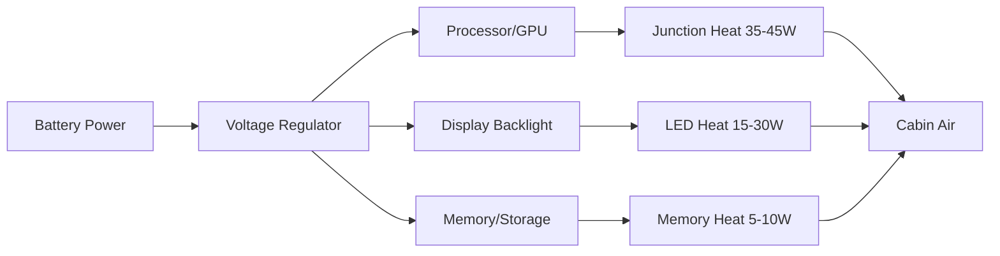
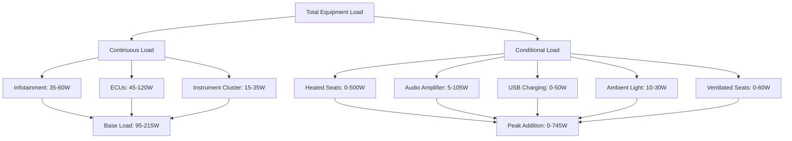

## Обзор

Тепловые нагрузки оборудования представляют все более значительную проблему теплоснабжения в современных транспортных средствах. По мере распространения электронного контента — информационно-развлекательные системы, расширенные системы помощи водителю (ADAS), обогреваемые/вентилируемые сиденья и окружающее освещение — внутренняя теплогенерация в салоне возросла с примерно 100–150 W в транспортных средствах 2000-х годов до 300–600 W в современных люксовых автомобилях. Эта внутренняя нагрузка оборудования напрямую влияет на размеры HVAC, потребление энергии и тепловой комфорт пассажиров.

## Механизмы теплогенерации

Электронное оборудование преобразует электрическую энергию в тепло благодаря резистивному рассеиванию, потерям в переходах полупроводников и механическому трению. Фундаментальное соотношение, определяющее теплогенерацию оборудования:

$$Q_{equip} = P_{input} \times (1 - \eta)$$

где:
- $Q_{equip}$ = тепло, рассеиваемое в салон (W)
- $P_{input}$ = электрическая мощность на входе (W)
- $\eta$ = коэффициент преобразования (доля мощности, преобразованная в полезную работу)

Для большинства автомобильной электроники коэффициент полезного действия составляет от 0,60 до 0,85, что означает, что 15–40% входной мощности преобразуется в тепло.

## Основные источники тепловых нагрузок оборудования

### Информационно-развлекательная система и дисплеи

Современные головные устройства информационно-развлекательных систем содержат процессоры, графические чипы, память и блоки питания, рассеивающие 20–60 W в зависимости от размера экрана и нагрузки обработки. Дисплейные панели добавляют тепловую нагрузку за счет потребления мощности подсветкой:

$$Q_{display} = A_{screen} \times L_{brightness} \times (1/\eta_{LED})$$

Типичные значения:
- 25 см (10 дюймов) дисплей: 15–25 W
- 30 см (12 дюймов) дисплей: 25–40 W
- 43 см (17 дюймов) дисплей (люксовые автомобили): 40–70 W

LED-подсветки работают с эффективностью 25–35%, остаток преобразуется в тепло на краю панели и в узле рассеивателя.

### Звуковые усилители

Усилители класса D доминируют в автомобильных аудиосистемах благодаря более высокому коэффициенту полезного действия (75–90%) по сравнению с конструкциями класса AB (50–65%). Рассеивание тепла коррелирует с выходной мощностью:

$$Q_{amp} = \frac{P_{audio,RMS}}{\eta_{amp}} - P_{audio,RMS}$$

Для типичной системы 600 W RMS с усилителями класса D с коэффициентом полезного действия 85%:

$$Q_{amp} = \frac{600}{0.85} - 600 = 105.9 \text{ W}$$

Однако средние уровни прослушивания используют только 10–20% номинальной мощности, снижая типичные тепловые нагрузки усилителя до 10–25 W при нормальной работе.

### Обогреваемые сиденья

Обогреваемые сиденья представляют наибольшую отдельную нагрузку оборудования при активации. Резистивные нагревательные элементы, встроенные в подушки и спинки сидений, обеспечивают прямое джоулево нагревание:

$$Q_{seat} = \frac{V^2}{R_{element}} \times N_{seats}$$

| Тип сиденья | Мощность на сиденье | Цикл работы | Средняя нагрузка |
|-----------|----------------|------------|--------------|
| Стандартное обогреваемое сиденье | 60–100 W | 40–60% | 25–60 W |
| Сиденье быстрого нагрева | 120–180 W | 60–80% начальный, 20–30% поддержание | 35–55 W |
| Сиденье с многозонным обогревом | 90–140 W | Переменное по зонам | 30–70 W |

В пятиместном транспортном средстве со всеми активированными обогреваемыми сиденьями общая нагрузка достигает 300–500 W во время начального прогрева, затем стабилизируется на уровне 125–275 W при установившейся работе по мере снижения цикла работы терморегулятором.

### Вентилируемые сиденья

Системы вентиляции сидений используют небольшие вентиляторы (5–15 W каждый) для вытягивания воздуха через перфорированные поверхности сидений. В отличие от обогреваемых сидений, они добавляют постоянную тепловую нагрузку от неэффективности двигателя:

$$Q_{vent} = P_{fan} \times N_{seats} = 8 \text{ W} \times 4 = 32 \text{ W (типично)}$$

### Зарядка через USB и розетки питания

Быстрые порты USB-C (45–100 W) и розетки 12 В способствуют выделению тепла из-за потерь при преобразовании напряжения. Современные DC-DC преобразователи работают с коэффициентом полезного действия 88–94%:

$$Q_{USB} = P_{charge} \times (1 - \eta_{converter}) \times N_{ports}$$

Для четырех портов USB-C, каждый подающий 45 W с коэффициентом полезного действия 90%:

$$Q_{USB} = 45 \times 0.10 \times 4 = 18 \text{ W}$$

### Щиток приборов и информационные дисплеи водителя

Цифровые щитки приборов с дисплеями TFT диагональю 31 см рассеивают 15–35 W в зависимости от параметров яркости и нагрузки обработки графики. OLED-дисплеи снижают потребление мощности на 20–30%, но концентрируют тепло в меньших областях.

### Электронные управляющие модули

Модули управления кузовом, модули шлюза и модули телематики поддерживают непрерывную работу, каждый рассеивая 3–8 W. В транспортных средствах с 15–25 электронными управляющими модулями в салоне или рядом с ним:

$$Q_{ECU,total} = \sum_{i=1}^{N} P_{ECU,i} \approx 45-120 \text{ W}$$

### Окружающее освещение

Системы окружающего LED-освещения потребляют 10–30 W в зависимости от количества зон (8–64 зон в люксовых автомобилях) и параметров яркости. Хотя светодиоды — эффективные источники света, их драйверы и свет, поглощаемый внутренними поверхностями, преобразуются в тепло.

## Расчет общей тепловой нагрузки оборудования

Общая теплогенерация оборудования следует суммированию отдельных нагрузок компонентов:

$$Q_{total,equip} = Q_{display} + Q_{amp} + Q_{seats} + Q_{vent} + Q_{USB} + Q_{cluster} + Q_{ECU} + Q_{lighting}$$

### Сценарии нагрузки

| Сценарий | Активное оборудование | Общая нагрузка (W) |
|----------|------------------|----------------|
| Минимальное использование | Информационно-развлекательная система, ЭУМ, щиток приборов | 95–215 |
| Умеренное использование | Указанное выше + аудио, 2 обогреваемых сиденья, зарядка USB | 240–430 |
| Максимальное использование | Все системы активны, включая все обогреваемые сиденья | 450–750 |

## Влияние на конструкцию системы HVAC

Нагрузки оборудования влияют на конструкцию HVAC тремя механизмами:

1. **Прямое добавление явного тепла** к воздуху салона, требующее повышения холодопроизводительности
2. **Локальные горячие точки** на поверхностях сидений, приборной панели и консоли, требующие направленного воздушного потока
3. **Временная изменчивость**, вызывающая динамические изменения нагрузки по мере активации/деактивации систем

SAE J2765 рекомендует включать нагрузки оборудования в модели теплового комфорта путем обработки их как внутренних источников тепла, распределенных по зонам салона. Стандарт предлагает использовать для размеров HVAC модели использования на уровне 85-го процентиля:

$$Q_{design,equip} = Q_{base} + 0.85 \times Q_{conditional}$$

Для вышеуказанного сценария умеренного использования:

$$Q_{design,equip} = 155 + 0.85 \times 275 = 389 \text{ W}$$

## Пути рассеивания тепла

Тепло оборудования передается воздуху салона тремя способами:

1. **Конвекция в окружающий воздух** (60–75% от общего)
2. **Проведение в монтажные конструкции**, затем конвекция (15–25%)
3. **Радиация на внутренние поверхности** (10–15%)

Коэффициент конвективной теплопередачи для естественно вентилируемой электроники в условиях салона находится в диапазоне 5–12 W/м²·K. Принудительная конвекция от воздушного потока HVAC увеличивает это значение до 15–35 W/м²·K, существенно улучшая рассеивание тепла от горячих компонентов.

## Стратегии управления теплом

Конструкторы используют несколько подходов к управлению теплом оборудования:

- **Распределенное размещение** предотвращает локальные горячие зоны
- **Направленное охлаждение** направляет воздух HVAC к высокомощным модулям
- **Материалы теплового интерфейса** улучшают теплопроводность к конструкции транспортного средства
- **Управление циклом работы** ограничивает пиковую мощность в экстремальных условиях
- **Алгоритмы бюджетирования мощности**, которые снижают некритичные нагрузки, когда холодопроизводительность HVAC ограничена

## Стандарты и ссылки

- **SAE J2765**: Процедура измерения коэффициента производительности системы мобильных систем кондиционирования воздуха на испытательном стенде
- **SAE J2234**: Процедура испытания эквивалентной температуры для оценки теплового комфорта
- **SAE J2719**: Информационный отчет по качеству воздуха HVAC

Современные системы управления HVAC все чаще включают датчики нагрузки оборудования и предсказание использования для оптимизации работы компрессора и распределения воздушного потока, снижая потребление энергии при сохранении теплового комфорта несмотря на растущий электронный контент.
