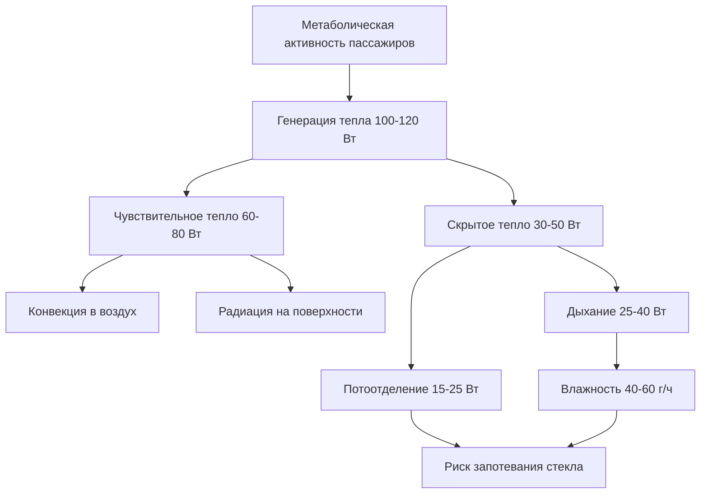

## Обзор

Тепловые нагрузки от пассажиров представляют один из наиболее переменных и значительных компонентов при проектировании автомобильных систем HVAC. В отличие от зданий, где плотность пассажиров остается относительно постоянной, автомобили испытывают значительные колебания в количестве пассажиров, уровне активности и пространственном распределении. Понимание физики теплопередачи человека позволяет выполнить точные расчеты нагрузок и оптимальный выбор размеров системы.

## Генерация метаболического тепла

Человеческое тело функционирует как постоянный источник тепла, преобразуя химическую энергию метаболизма в тепловую энергию. Для автомобильных применений метаболические показатели значительно ниже, чем для пассажиров зданий, из-за сидячего характера вождения и поездок.

### Фундаментальная генерация тепла

Полная выработка метаболического тепла следует соотношению:

$$Q_{met} = M \times A_{DuBois}$$

где:
- $Q_{met}$ = полное метаболическое тепло (Вт)
- $M$ = метаболический показатель на единицу площади (Вт/м²)
- $A_{DuBois}$ = площадь поверхности тела (м²)

Для сидящих пассажиров автомобиля, SAE J2765 определяет типичные метаболические показатели 58 Вт/м² для взрослых в состоянии покоя, что соответствует примерно 100–120 Вт общей теплоотдачи на человека. Это метаболическое тепло разделяется на чувствительные и скрытые компоненты.

### Компоненты чувствительного и скрытого тепла

Метаболическое тепло разделяется между чувствительным (зависящим от температуры) и скрытым (зависящим от влажности) компонентами в зависимости от тепловых условий и уровня активности:

$$Q_{met} = Q_{sensible} + Q_{latent}$$

Для пассажиров автомобилей коэффициент чувствительного тепла (SHR) обычно находится в диапазоне от 0,60 до 0,75 в зависимости от температуры и влажности салона:

| Условие в салоне | Чувствительное тепло (Вт) | Скрытое тепло (Вт) | SHR |
|------------------|--------------------------|-------------------|-----|
| Прохладно (20°C) | 80 | 30 | 0,73 |
| Умеренно (24°C) | 70 | 40 | 0,64 |
| Тепло (28°C) | 60 | 50 | 0,55 |

Чувствительный компонент передается через конвекцию и радиацию на поверхности салона и воздух. Скрытый компонент проявляется как влага от дыхания и потоотделения, требующая мощности осушения.

## Выделение влаги при дыхании

Влага при дыхании добавляет скрытую нагрузку в окружающую среду салона через водяной пар в выдыхаемом воздухе. Частота дыхания напрямую коррелирует с метаболической активностью и влияет на потенциал запотевания лобового стекла.

Скрытое тепло от дыхания рассчитывается как:

$$Q_{resp} = \dot{m}_{vapor} \times h_{fg}$$

где:
- $\dot{m}_{vapor}$ = скорость выделения влаги (кг/с)
- $h_{fg}$ = скрытая теплота испарения = 2450 кДж/кг при 20°C

Для сидящих взрослых типичные скорости выделения влаги составляют 40–60 г/ч на человека (11–17 мг/с), что вносит примерно 25–40 Вт скрытой нагрузки. Дети выделяют пропорционально меньше влаги в зависимости от меньшей емкости легких и более низких метаболических показателей.

## Влияние одежды на теплопередачу

Теплоизоляция одежды значительно влияет на скорость чувствительной теплопередачи от пассажиров в окружающую среду салона. Термическое сопротивление одежды изменяет эффективный коэффициент теплопередачи:

$$Q_{sensible} = \frac{T_{skin} - T_{air}}{R_{cl} + \frac{1}{h_{combined}}}$$

где:
- $T_{skin}$ = температура кожи ≈ 33°C
- $T_{air}$ = температура воздуха в салоне (°C)
- $R_{cl}$ = термическое сопротивление одежды (м²·K/Вт)
- $h_{combined}$ = комбинированный коэффициент конвекции/радиации ≈ 8–12 Вт/м²·K

Типичные значения теплоизоляции одежды для автомобильных сценариев:

| Комплект одежды | Изоляция (clo) | R-значение (м²·K/Вт) |
|----------------|----------------|----------------------|
| Легкая летняя (шорты, футболка) | 0,3 | 0,047 |
| Деловой стиль | 0,7 | 0,109 |
| Зимняя одежда | 1,2 | 0,186 |

Более высокая теплоизоляция одежды снижает чувствительную теплопередачу, потенциально увеличивая долю скрытого тепла, когда тело компенсирует увеличением потоотделения.

## Вариации количества пассажиров

В отличие от зданий с относительно стабильной заполняемостью, автомобили испытывают частые колебания в количестве пассажиров от поездки одного человека до полностью загруженных семейных путешествий. Эта изменчивость создает сложные сценарии проектирования для систем HVAC.

### Расчет нагрузки в зависимости от заполняемости

Общая нагрузка от пассажиров масштабируется линейно с количеством пассажиров:

$$Q_{total} = n \times (Q_{sensible,avg} + Q_{latent,avg})$$

| Тип транспортного средства | Макс. пассажиров | Пиковая нагрузка (Вт) | Типичная нагрузка (Вт) |
|---------------------------|------------------|----------------------|----------------------|
| Компактный седан | 5 | 500–600 | 200–240 (2 чел) |
| Внедорожник/Минивэн | 7–8 | 700–960 | 300–360 (3 чел) |
| Пассажирский фургон | 12–15 | 1200–1800 | 400–480 (4 чел) |

Системы HVAC должны справляться с условиями максимальной заполняемости в жаркую погоду, избегая чрезмерных циклов и плохого контроля влажности при частичной загрузке.

## Различия в тепловых нагрузках водителя и пассажиров

Позиция водителя испытывает уникальные тепловые условия по сравнению с пассажирами из-за асимметричной солнечной нагрузки, близости к приборной панели и более высоких метаболических показателей при активном управлении транспортным средством.

### Специфические факторы для водителя

**Различие в метаболическом показателе:** Метаболические показатели водителя в среднем на 10–15% выше, чем у пассажиров, из-за:
- Умственной нагрузки и реакции стресса
- Мышечного напряжения при рулении и управлении педалями
- Требований бдительности, повышающих базовый метаболизм

**Асимметричная солнечная нагрузка:** Водитель получает непропорциональное солнечное излучение через боковое окно с левой стороны (в автомобилях с левым рулем), создавая локализованный тепловой дискомфорт даже при приемлемой средней температуре в салоне.

**Локализованные источники тепла:** Близость к:
- Приборной панели (температуры поверхности 30–50°C)
- Рулевому колесу (потенциально 60°C+ в условиях интенсивного солнца)
- Электронике центральной консоли

### Стратегия распределения нагрузки

Эффективное проектирование HVAC учитывает различия между водителем и пассажирами через:

Системы зонного управления температурой выделяют 35–45% от общего расхода воздуха на позицию водителя, несмотря на то, что она занимает только 20–25% от занятого пространства, компенсируя повышенный тепловой стресс.

## Проектные следствия

Точная оценка тепловых нагрузок от пассажиров влияет на множество параметров проектирования HVAC:

1. **Выбор мощности охлаждения:** Должен вмещать максимальную заполняемость плюс коэффициент безопасности 20%
2. **Мощность осушения:** Скрытая нагрузка при полной заполняемости определяет выбор испарителя
3. **Распределение воздушного потока:** Позиции пассажиров требуют целевой подачи для управления локальными тепловыми шлейфами
4. **Переходная характеристика:** Высокое отношение тепловой массы пассажиров к объему салона требует быстрого отклика HVAC на изменения нагрузки

SAE J2765 предоставляет стандартизированные процедуры испытаний для оценки производительности HVAC при контролируемых условиях нагрузки от пассажиров, используя тепловые манекены, которые имитируют как чувствительную, так и скрытую генерацию тепла.

Фундаментальная сложность в управлении тепловыми нагрузками от пассажиров в автомобиле проистекает из высокого отношения тепловой массы пассажиров к объему салона. Полностью загруженный седан может иметь пассажиров, представляющих 400–500 кг тепловой массы, генерирующих 500+ Вт непрерывного тепла в объеме салона 3–4 м³, создавая тепловые постоянные времени, измеряемые минутами, а не часами, как это типично для зданий.
