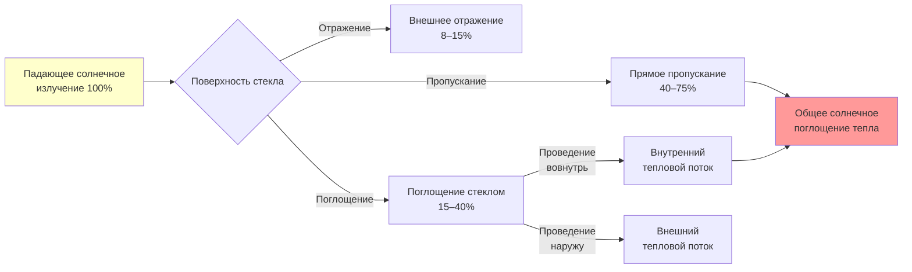
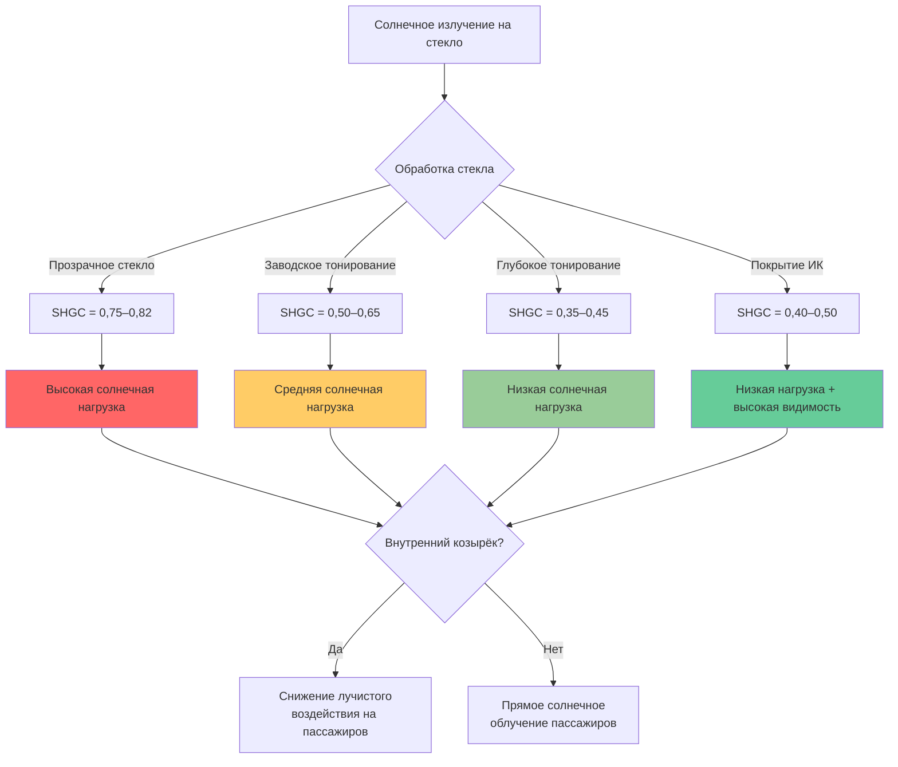

Солнечная радиация представляет собой наибольшую единичную тепловую нагрузку на салон автомобиля в условиях пиковой летней температуры, часто превышая 1000 Вт для компактных автомобилей и достигая более 2000 Вт для внедорожников и автомобилей с большой площадью остекления. Понимание физики прохождения солнечного излучения через автомобильное остекление необходимо для точного расчета систем HVAC и прогноза теплового комфорта.

## Основы поглощения солнечного тепла

Солнечное излучение, падающее на остекление автомобиля, состоит из трёх компонентов: прямого солнечного излучения, рассеянного излучения неба и отражённого от земли излучения. Общее поглощение солнечного тепла в салоне зависит от коэффициента теплопрозрачности (SHGC), площади остекления, угла падения и интенсивности солнечного излучения.

Основное уравнение для солнечной нагрузки через остекление:

$$Q_{solar} = A_{glass} \cdot I_{total} \cdot SHGC \cdot \cos(\theta)$$

где $A_{glass}$ — эффективная площадь остекления (м²), $I_{total}$ — общее падающее солнечное излучение (Вт/м²), SHGC — безразмерный коэффициент теплопрозрачности, и $\theta$ — угол падения от нормали.

SAE J2765 определяет стандартные условия испытаний при интенсивности солнечного излучения 1000 Вт/м² (850 Вт/м² прямого + 150 Вт/м² рассеянного) в солнечный полдень, что представляет наихудшие летние условия в умеренном климате.

## Характеристики пропускания света через стекло

Автомобильное остекление имеет принципиально отличные от архитектурного стекла характеристики пропускания света из-за требований безопасности, кривизны и особенностей производства.

### Свойства ветрового стекла

Ветровые стёкла используют многослойную конструкцию: два слоя отожжённого стекла, склеенные промежуточным слоем из поливинилбутираля (ПВБ). Эта конструкция обеспечивает:

- **Прозрачность для солнечного излучения**: 0,70–0,78 для прозрачного стекла (70–78 % падающего солнечного излучения проходит сквозь стекло)
- **SHGC**: 0,74–0,82 для стандартного прозрачного многослойного стекла
- **Блокирование УФ-излучения**: Промежуточный слой ПВБ блокирует >95 % УФ-излучения (<400 нм)
- **Пропускание ИК-излучения**: Высокое пропускание в ближней инфракрасной области (700–2500 нм), где сосредоточено 50 % солнечной энергии

Ветровое стекло обычно сохраняет более высокий коэффициент SHGC, чем боковое стекло, поскольку требования многослойной конструкции ограничивают возможности нанесения покрытий.

### Характеристики боковых и задних стёкол

Боковые и задние окна используют закалённое монолитное стекло, позволяющее применять различные стратегии нанесения покрытий:

- **Прозрачность для солнечного излучения**: 0,25–0,75 в зависимости от степени тонирования
- **SHGC**: 0,30–0,70 (более низкие значения указывают на лучшее отражение солнечного излучения)
- **Процесс закалки**: Позволяет равномерное тонирование по всей толщине стекла

Глубоко тонированное боковое стекло может снизить коэффициент SHGC до 0,35–0,45, что снижает поглощение солнечного тепла на 40–50 % по сравнению с прозрачным стеклом.

## Сравнение типов стекла

| Тип стекла | Видимая прозрачность | Прозрачность для солнца | SHGC | Типовое применение |
|------------|----------------------|---------------------|------|---------------------|
| Прозрачное многослойное | 0,85–0,90 | 0,75–0,78 | 0,78–0,82 | Стандартное ветровое стекло |
| Многослойное с солнечной защитой | 0,70–0,80 | 0,45–0,55 | 0,50–0,60 | Премиум ветровое стекло |
| Прозрачное закалённое | 0,88–0,92 | 0,78–0,82 | 0,75–0,80 | Прозрачное боковое стекло |
| Светлое тонированное закалённое | 0,60–0,75 | 0,50–0,65 | 0,55–0,68 | Заводское тонирование |
| Тёмное тонированное закалённое | 0,20–0,35 | 0,25–0,40 | 0,35–0,50 | Приватное стекло |
| Покрытое отражающим ИК-слоем | 0,70–0,80 | 0,35–0,50 | 0,40–0,55 | Премиум солнечная защита |

## Передовые технологии покрытий

Современное остекление с солнечной защитой использует тонкоплёночные металлические или диэлектрические покрытия, которые избирательно отражают инфракрасное излучение, сохраняя при этом пропускание видимого света.

### Спектрально-селективные покрытия

Эти покрытия используют слои нанометровой толщины из серебра, оксида индия-олова или других материалов для:

1. Пропускания видимого света (400–700 нм) с минимальным ослаблением
2. Отражения ближнего инфракрасного излучения (700–2500 нм), где происходит солнечный нагрев
3. Сохранения низкой излучательной способности для снижения теплообмена излучением

Коэффициент селективности количественно характеризует эффективность покрытия:

$$S = \frac{T_{visible}}{SHGC}$$

Высокопроизводительные покрытия достигают коэффициентов селективности 1,5–1,8, в сравнении с 1,0–1,1 для обычного тонированного стекла. Это означает 70 % прозрачность видимого света при SHGC 0,40–0,45.

### Долговечность покрытия

Автомобильные покрытия должны выдерживать:
- Циклирование температур: от −40 °C до +100 °C на поверхности стекла
- Стойкость к истиранию: обработка закалённого стекла и установка
- Химическая стойкость: моющие средства и воздействие окружающей среды
- Влажность: предотвращение коррозии металлических слоёв

## Солнечные нагрузки люков крыши

Люки крыши создают особые тепловые проблемы благодаря своей горизонтальной ориентации и большой эффективной площади:

- **Пиковый угол падения**: Близко к нормальному падению в солнечный полдень максимизирует пропускание ($\cos(\theta) \approx 1$)
- **Эффективная площадь**: 0,6–1,2 м² для типичных панорамных люков
- **Вклад солнечной нагрузки**: 250–600 Вт при пиковых условиях с прозрачным стеклом
- **Близость к пассажирам**: Прямое солнечное облучение головы и верхней части туловища

Солнечная защита необходима для люков крыши. Доступные варианты:

1. **Тонированное стекло**: SHGC 0,35–0,50, снижает нагрузку на 35–50 %
2. **Внутренний козырёк**: Блокирует пропущённое излучение, но стекло всё ещё поглощает тепло
3. **Вентилируемые люки**: Внешний козырёк с воздушным зазором отводит тепло перед входом в салон
4. **Электрохромное стекло**: Регулируемое тонирование изменяет SHGC с 0,05–0,40 по требованию

## Солнечная тепловая нагрузка припаркованного автомобиля

Солнечная тепловая нагрузка относится к условиям, когда припаркованный автомобиль поглощает солнечное излучение с минимальным отводом тепла, что приводит к экстремальным внутренним температурам.

### Физика теплового накопления

При солнечной тепловой нагрузке салон достигает теплового равновесия, когда поступление тепла равно его отводу:

$$Q_{solar} + Q_{conduction} = Q_{convection} + Q_{radiation} + Q_{ventilation}$$

При закрытых окнах вентиляция минимальна, и салон может достичь 60–80 °C с поверхностями приборной панели, превышающими 90 °C.

Пиковые нагрузки охлаждения при развязке тепловой нагрузки возникают, когда система HVAC должна удалить:
1. **Сохранённую тепловую массу**: Сиденья, приборная панель, дверные панели, ковролин (5–15 МДж накопленной энергии)
2. **Продолжающееся солнечное поглощение**: Продолжается во время начального периода охлаждения
3. **Теплопроведение от горячих поверхностей**: Внутренние поверхности излучают в воздух салона

SAE J2765 определяет 60-минутную солнечную тепловую нагрузку при 1000 Вт/м² облучённости и 43 °C окружающей температуре как стандартное испытание для определения максимальной охлаждающей способности.

### Смягчение солнечной тепловой нагрузки

Эффективные стратегии включают:

- **Отражающие козырьки на ветровое стекло**: Блокируют 85–95 % солнечного поглощения через ветровое стекло
- **Вентилируемая парковка**: Приоткрытые окна снижают пиковые температуры на 10–15 °C
- **Покрытия Low-E**: Снижают инфракрасный радиационный обмен между стеклом и интерьером
- **Светлые интерьеры**: Более низкие коэффициенты поглощения снижают температуру поверхностей
- **Дистанционное предварительное охлаждение**: Запуск HVAC перед входом пассажира снижает ощущаемый дискомфорт

## Методология расчёта

Точный расчёт солнечной нагрузки требует интегрирования вкладов от всех поверхностей остекления:

$$Q_{total} = \sum_{i=1}^{n} A_i \cdot I_i \cdot SHGC_i \cdot \cos(\theta_i)$$

Для каждой поверхности $i$ учитывайте:
- Ориентацию и угол наклона
- Затенение от стоек и конструкции крыши
- Зависящее от времени положение солнца
- Ослабление атмосферой

ASHRAE Handbook—Fundamentals, раздел 18, предоставляет данные по интенсивности солнечного излучения, в то время как SAE J2765 и J1628 определяют процедуры расчёта для автомобилей и стандартные условия испытаний.

Общая солнечная нагрузка обычно находится в диапазоне:
- **Компактный седан**: 600–1000 Вт пиковая
- **Седан среднего размера**: 800–1200 Вт пиковая
- **Внедорожник/минивэн**: 1200–1800 Вт пиковая
- **Большой внедорожник с люком крыши**: 1500–2200 Вт пиковая

Эти значения представляют 40–60 % от общей охлаждающей нагрузки при расчётных условиях, что делает солнечную защиту через передовые технологии остекления одним из наиболее эффективных методов снижения требований к системам HVAC и повышения топливной эффективности.
