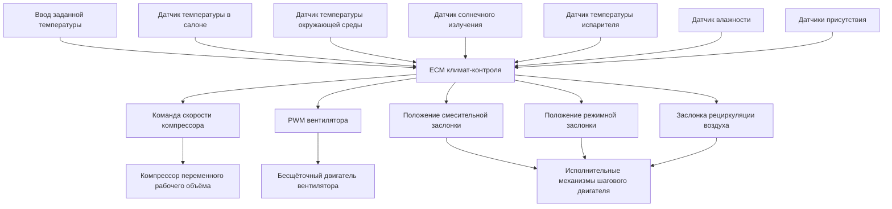

Системы автоматического климат-контроля представляют собой эволюцию от ручного управления HVAC к замкнутому управлению с обратной связью, которое поддерживает тепловой комфорт занятых лиц с минимальным вмешательством пользователя. Эти системы интегрируют датчики температуры, детекторы солнечного излучения, датчики влажности и датчики присутствия для модулирования скорости компрессора, распределения воздушного потока и положения смесительной заслонки через электронные контрольные модули (ECM).

## Эволюция от ручного к автоматическому управлению

### Ручные системы HVAC

Ручное управление автомобильным климатом требует постоянного вмешательства пользователя через три основных интерфейса:

- **Регулятор температуры**: Управляет положением смесительной заслонки ($\theta_{blend}$) от 0° (полное охлаждение) до 90° (полный нагрев)
- **Селектор скорости вентилятора**: Устанавливает напряжение электродвигателя вентилятора или коэффициент заполнения PWM
- **Селектор режима**: Направляет воздушный поток через панельные, напольные, дефростные или смешанные выходы

Тепловая реакция в ручных системах следует поведению в разомкнутом контуре, где температура в салоне ($T_{cabin}$) изменяется в соответствии с:

$$\frac{dT_{cabin}}{dt} = \frac{1}{mc_p}\left[\dot{Q}_{HVAC} - \dot{Q}_{loss} - \dot{Q}_{solar}\right]$$

Где $m$ — масса воздуха в салоне, $c_p$ — удельная теплоёмкость при постоянном давлении, $\dot{Q}_{HVAC}$ — мощность подаваемого отопления или охлаждения, $\dot{Q}_{loss}$ — потери тепла через оболочку транспортного средства, и $\dot{Q}_{solar}$ — приток солнечного тепла.

### Архитектура автоматического климат-контроля

Автоматические системы реализуют алгоритмы пропорционально-интегрально-дифференциального (PID) управления или управления с предсказанием модели (MPC) для минимизации ошибки между заданной температурой ($T_{set}$) и измеренной температурой в салоне:

$$e(t) = T_{set} - T_{cabin}(t)$$

Алгоритм управления непрерывно регулирует положение исполнительных механизмов:

$$u(t) = K_p e(t) + K_i \int_0^t e(\tau)d\tau + K_d \frac{de(t)}{dt}$$

Где $K_p$, $K_i$ и $K_d$ — коэффициенты усиления пропорциональной, интегральной и дифференциальной составляющих, настроенные в соответствии с тепловой динамикой салона.

## Архитектура электронного контрольного модуля (ECM)

ECM климат-контроля обрабатывает входные сигналы от множества датчиков и управляет исполнительными механизмами HVAC через распределённую сеть, обычно CAN-шину или протокол LIN в соответствии со стандартами SAE J2602.

### Интеграция датчиков и измерения

Современные системы автоматического климат-контроля используют следующий набор датчиков:

| Тип датчика | Диапазон измерения | Точность | Время отклика | Назначение |
|-------------|-------------------|----------|---------------|---------|
| Температура в салоне | -40°C до 85°C | ±0,5°C | <5 секунд | Управление обратной связью |
| Температура окружающей среды | -40°C до 60°C | ±1,0°C | <10 секунд | Компенсация |
| Солнечное излучение (IR) | 0–1200 Вт/м² | ±50 Вт/м² | <2 секунд | Компенсация солнечного излучения |
| Температура испарителя | -10°C до 40°C | ±0,3°C | <3 секунд | Предотвращение обледенения |
| Относительная влажность | 0–100% ОВ | ±3% ОВ | <15 секунд | Управление дефростацией |
| Присутствие (IR/емкостной) | Бинарный/многозонный | N/A | <1 секунда | Управление зонами |

**Алгоритм компенсации солнечного излучения**

Солнечное излучение создаёт асимметричный нагрев, который датчики температуры в салоне не могут обнаружить. Датчик солнечного излучения измеряет интенсивность падающего солнечного излучения ($I_{solar}$) и угол азимута. Алгоритм управления регулирует эффективную заданную температуру:

$$T_{set,effective} = T_{set} - K_{sun} \cdot I_{solar} \cdot \cos(\phi)$$

Где $K_{sun}$ — коэффициент компенсации солнечного излучения (обычно 0,01–0,03 °C·м²/Вт) и $\phi$ — угол между вектором солнца и нормалью датчика.

## Многозонный климат-контроль

Двухзонные и трёхзонные системы обеспечивают независимое управление температурой для водителя, пассажира и задней части салона. Это требует:

- **Отдельные датчики температуры** для каждой зоны
- **Независимые исполнительные механизмы смесительной заслонки** для управления температурой воздуха по зонам
- **Распределение воздушного потока, специфичное для зоны** через режимные заслонки
- **Тепловая изоляция** между зонами с использованием поролона и воздушных завес

Тепловая связь между зонами следует передаче тепла через общие поверхности:

$$\dot{Q}_{coupling} = UA(T_{zone1} - T_{zone2})$$

Где $U$ — общий коэффициент теплопередачи между зонами, а $A$ — площадь общей поверхности. Эффективное многозонное управление требует, чтобы $\dot{Q}_{coupling}$ была менее 10% от ёмкости HVAC зоны.

## Алгоритмы предиктивного климат-контроля

Продвинутые системы реализуют предиктивные алгоритмы, которые предсказывают тепловые нагрузки на основе:

### Предсказание на основе маршрута

Используя GPS и данные навигации, ECM предсказывает будущие солнечные нагрузки на основе курса транспортного средства и топографии. Для известного маршрута с углом курса $\alpha(t)$:

$$\dot{Q}_{solar,predicted}(t+\Delta t) = A_{glass} \cdot I_{solar} \cdot \cos[\theta_{sun} - \alpha(t+\Delta t)]$$

Где $\theta_{sun}$ — азимутальный угол солнца, рассчитанный по дате, времени и географическому положению в соответствии с алгоритмами определения положения солнца ASHRAE.

### Адаптация на основе присутствия

Алгоритмы машинного обучения определяют тепловые предпочтения занятых лиц путём отслеживания регулировок заданной температуры во времени. Система строит модель теплового комфорта:

$$T_{preferred}(t_{day}, T_{ambient}, I_{solar}) = f(historical\ patterns)$$

Это обеспечивает упреждающую регулировку до того, как пассажиры вручную вмешаются, снижая жалобы на дискомфорт на 30–40% согласно метрикам теплового комфорта SAE J2765.

## Умное предварительное кондиционирование

Электрические и гибридные автомобили с возможностью подключения реализуют предварительное кондиционирование салона при подключении к внешнему источнику питания, снижая потребление энергии от батареи во время вождения. Алгоритм предварительного кондиционирования рассчитывает необходимую энергию:

$$E_{precondition} = mc_p(T_{target} - T_{initial}) + \dot{Q}_{loss} \cdot t_{precondition}$$

ECM планирует работу компрессора или нагревателя PTC для достижения целевой температуры в момент отправления, минимизируя потребление энергии из сети.

## Функции климат-контроля подключённого транспортного средства

Интеграция телематики обеспечивает дистанционное управление климатом через приложения смартфона:

- **Дистанционный запуск с активацией климата**: Инициирует HVAC перед входом пассажира
- **Запланированное предварительное кондиционирование**: Активируется по времени или GPS-геозоне
- **Аналитика использования энергии**: Отслеживает закономерности потребления энергии HVAC
- **Предиктивное техническое обслуживание**: Контролирует давление хладагента, ток компрессора, производительность вентилятора

Связь соответствует протоколам инфраструктуры транспортных средств SAE J2735 для защищённой передачи данных.

## Сравнение стратегий управления

| Тип управления | Время отклика | Установившаяся ошибка | Энергоэффективность | Сложность |
|--------------|---------------|-------------------|-------------------|------------|
| Ручное (разомкнутый контур) | Немедленно | ±3–6°C | Базовая | Низкая |
| PID (замкнутый контур) | 2–5 минут | ±0,5–1°C | +15–20% | Средняя |
| Управление с предсказанием модели | 1–3 минуты | ±0,3°C | +25–30% | Высокая |
| Адаптивное AI/ML | 30–90 секунд | ±0,2°C | +30–40% | Очень высокая |

## Диагностика и калибровка

Системы автоматического климат-контроля требуют периодической калибровки:

- **Коррекция смещения датчика температуры**: Проверяется по сравнению с эталонными датчиками RTD согласно SAE J1211
- **Обратная связь положения смесительной заслонки**: Калибруется с использованием выхода потенциометра или датчика Холла
- **Выравнивание датчика солнечного излучения**: Проверяется с использованием эталонного пиранометра в контролируемых условиях
- **Настройка алгоритма управления**: Коэффициенты PID регулируются в соответствии с тепловой массой и изоляцией конкретного транспортного средства

Коды диагностических неисправностей (DTC) соответствуют стандартам SAE J2012 для отказов датчиков, неисправностей исполнительных механизмов и ошибок связи.

## Метрики производительности системы

Согласно стандартам теплового комфорта SAE J2765, производительность автоматического климат-контроля оценивается с использованием:

- **Время охлаждения**: Время достижения температуры в салоне 25°C с прогрева 50°C (целевой показатель: <15 минут)
- **Равномерность температуры**: Максимальное температурное различие между точками измерения (целевой показатель: <3°C)
- **Точность заданного значения**: Установившаяся ошибка между заданной температурой и средней температурой в салоне (целевой показатель: ±1°C)
- **Шум вентилятора**: A-взвешенный уровень звукового давления при максимальном воздушном потоке (целевой показатель: <60 дBA)

Интеграция продвинутых датчиков, предиктивных алгоритмов и подключённости преобразует автомобильный HVAC из реактивного ручного управления в упреждающее управление тепловым комфортом, снижая отвлечение водителя одновременно с улучшением энергоэффективности и удовлетворённости пассажиров.
