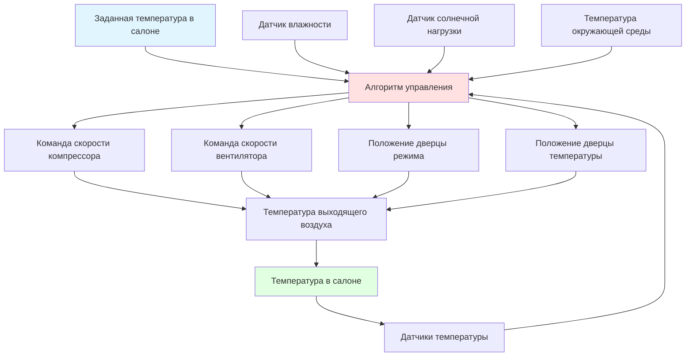
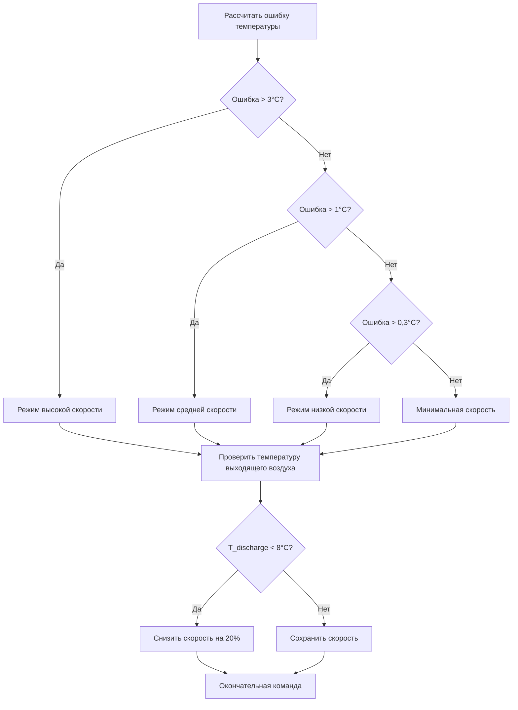

Системы автоматического управления температурой (ATC) представляют собой архитектуры замкнутого цикла управления климатом, которые поддерживают тепловые условия в салоне на устанавливаемых пользователем значениях посредством непрерывной обратной связи, модуляции исполнительных механизмов и прогностической компенсации. Эти системы интегрируют множество входных сигналов датчиков, применяют алгоритмы управления и командуют компонентами HVAC переменной производительности для минимизации тепловой ошибки при оптимизации энергопотребления и комфорта пассажиров.

## Фундаментальная архитектура управления

Системы ATC работают по парадигме управления MIMO (многовходовой, многовыходовой), где электронный модуль управления климатом (ECCM) обрабатывает данные датчиков и командует исполнительными механизмами для достижения теплового равновесия между притоком тепла и холодильной/нагревательной производительностью системы HVAC.

Основной энергетический баланс, управляющий управлением температурой в салоне:

$$Q_{HVAC} = Q_{solar} + Q_{ambient} + Q_{occupant} + Q_{equipment} + m_{vent}c_p(T_{ambient} - T_{cabin})$$

Где:
- $Q_{HVAC}$ = производительность системы HVAC (Вт)
- $Q_{solar}$ = прибыль тепла от солнечного излучения (Вт)
- $Q_{ambient}$ = теплопередача кондукцией/конвекцией через оболочку салона (Вт)
- $Q_{occupant}$ = выделение метаболического тепла пассажирами (типично 100–120 Вт на человека)
- $Q_{equipment}$ = тепло от электроники и силовой установки (Вт)
- $m_{vent}$ = массовый расход воздуха вентиляции (кг/с)
- $c_p$ = удельная теплоёмкость воздуха (1,006 кДж/кг·К)

## Стратегия управления по заданному значению

Система ATC устанавливает тепловые целевые значения на основе выбранных пользователем температур заданного значения (типично диапазон 18–32°C). Модуль управления рассчитывает требуемую температуру выходящего воздуха $T_{discharge}$ используя:

$$T_{discharge} = T_{setpoint} - K_1(T_{cabin} - T_{setpoint}) - K_2\frac{dT_{cabin}}{dt} - K_3 Q_{solar}$$

Где $K_1$, $K_2$ и $K_3$ — калибровочные коэффициенты усиления для пропорциональной, дифференциальной и компенсирующей солнечной составляющих. Это уравнение демонстрирует предварительную компенсацию (солнечная составляющая) в сочетании с управлением по обратной связи (ошибка температуры в салоне и скорость изменения).

## Реализация контура обратной связи температуры

Основной механизм обратной связи использует несколько датчиков температуры с взвешенным усреднением на основе близости пассажиров и структуры воздушного потока.

### Конфигурация датчиков и взвешивание

| Местоположение датчика | Типичный вес | Время отклика | Диапазон измерения |
|----------------|---------------|---------------|-------------------|
| Воздух в салоне (аспирируемый) | 0,50 | 10–15 секунд | −40°C до +85°C |
| Вентиляционное отверстие водителя | 0,20 | 5–8 секунд | −40°C до +100°C |
| Вентиляционное отверстие пассажира | 0,15 | 5–8 секунд | −40°C до +100°C |
| Задняя часть салона | 0,15 | 15–20 секунд | −40°C до +85°C |

Эффективная температура в салоне, используемая для управления:

$$T_{cabin,eff} = \sum_{i=1}^{n} w_i T_i$$

Где $w_i$ представляет весовой коэффициент для каждого местоположения датчика, при этом $\sum w_i = 1$.

## Управление температурой выходящего воздуха

Регулирование температуры выходящего воздуха представляет внутренний контур управления, который работает быстрее, чем контур температуры в салоне. Целевая температура выходящего воздуха должна удовлетворять:

$$\dot{m}_{air}c_p(T_{discharge} - T_{cabin}) \geq Q_{load}$$

В режиме охлаждения типичные температуры выходящего воздуха варьируются от 2°C до 18°C в зависимости от потребности в охлаждении. ECCM модулирует дверцы смешивания температуры и температуру испарителя для достижения этого целевого значения.

### Управление температурой испарителя

Температура поверхности испарителя $T_{evap}$ управляется для предотвращения образования инея при максимизации скрытого охлаждения. Минимальная температура испарителя ограничена:

$$T_{evap,min} = T_{dew,air} - \Delta T_{approach}$$

Где $\Delta T_{approach}$ типично составляет 2–4°C. Согласно SAE J2765, температура испарителя должна поддерживаться выше 2°C для предотвращения образования льда при нормальной работе.

## Управление компрессором переменной производительности

Современные системы ATC используют компрессоры с переменным объёмом вытеснения или переменной скоростью для обеспечения непрерывной модуляции производительности вместо бинарного включения/выключения. Требуемая производительность компрессора рассчитывается из:

$$\dot{Q}_{evap} = \dot{m}_{ref}(h_{evap,out} - h_{evap,in})$$

Требуемый массовый расход хладагента $\dot{m}_{ref}$ достигается путём регулирования объёма вытеснения компрессора (поршневого) или скорости вращения (спиральный/электрический). Это обеспечивает:

- Точное согласование производительности с тепловой нагрузкой
- Исключение температурных колебаний от включения/выключения
- Пониженное энергопотребление при частичной нагрузке
- Улучшенное управление влажностью за счёт непрерывной работы

### Расчёт команды компрессора

ECCM определяет команду компрессора используя ПИ-регулятор (пропорционально-интегральный):

$$u_{comp}(t) = K_p e(t) + K_i \int_0^t e(\tau)d\tau$$

Где:
- $u_{comp}$ = команда скорости или объёма вытеснения компрессора (%)
- $e(t)$ = $T_{evap,target} - T_{evap,actual}$
- $K_p$ = коэффициент пропорционального усиления
- $K_i$ = коэффициент интегрального усиления

Типичные значения $K_p$ варьируются от 5–15 %/°C, в то время как $K_i$ варьируется от 0,5–2 %/(°C·с).

## Модуляция скорости вентилятора

Скорость вентилятора прямо управляет массовым расходом воздуха, что определяет как чувствительную холодильную производительность, так и распределение воздуха в салоне. Связь между напряжением вентилятора и воздушным потоком нелинейна:

$$\dot{V}_{air} = K_{blower}V_{blower}^{1.8}$$

Где $K_{blower}$ — системная константа, определённая геометрией воздуховода и сопротивлением.

ECCM командует скоростью вентилятора на основе:

1. **Величина ошибки температуры**: Большая ошибка → более высокий поток воздуха для более быстрого отклика
2. **Температура выходящего воздуха**: Более низкая температура выходящего воздуха → более низкий поток воздуха для предотвращения ощущения чрезмерного охлаждения
3. **Выбор режима**: Размораживание требует максимального воздушного потока независимо от ошибки температуры
4. **Акустические ограничения**: Скорость ограничена для сохранения шума ниже порога (типично 50–55 дBA на уровне уха)

### Алгоритм скорости вентилятора

## Алгоритмы теплового комфорта

Продвинутые системы ATC объединяют модели Predicted Mean Vote (PMV) на основе принципов ISO 7730, адаптированные для автомобильных сред. Индекс теплового комфорта учитывает:

$$PMV = f(T_{air}, T_{radiant}, v_{air}, RH, M_{metabolic}, I_{clothing})$$

Для автомобильных применений метаболическая скорость $M$ предполагается постоянной (1,0–1,2 met для сидячего положения), а изоляция одежды $I_{clothing}$ оценивается сезонно (0,5–1,0 clo).

### Оптимизация многозонного комфорта

Двухзонные и многозонные системы поддерживают независимые заданные значения для регионов водителя и пассажира. Задача заключается в управлении тепловой связью между зонами при минимизации смешивания межзонного воздушного потока.

Коэффициент тепловой связи $\alpha$ между зонами:

$$\frac{dT_{zone1}}{dt} = \frac{Q_{HVAC1} - Q_{load1}}{m_{zone1}c_p} - \alpha(T_{zone1} - T_{zone2})$$

Типичные значения $\alpha$ варьируются от 0,05–0,15 с⁻¹ в зависимости от геометрии салона и эффективности перегородки.

## Метрики производительности и валидация

Согласно SAE J2765 (Процедура измерения системного COP мобильных систем кондиционирования воздуха), производительность системы ATC оценивается используя:

| Метрика | Целевое значение | Условие испытания |
|--------|-------------|----------------|
| Время снижения (35°C до 25°C) | < 10 минут | Окружающая среда 43°C, солнечное 1000 Вт/м² |
| Точность температуры | ±1,0°C в установившемся режиме | После 20 минут работы |
| Стабильность температуры | ±0,5°C вариация | В течение 30-минутного периода |
| Управление температурой выходящего воздуха | ±2,0°C от целевого значения | Все режимы работы |

Системный коэффициент производительности (COP) должен превышать 1,8 при стандартных условиях охлаждения (35°C окружающей среды, 50% RH) согласно требованиям SAE J2765.

## Интеграция с системами транспортного средства

Современные системы ATC взаимодействуют с сетями транспортного средства (CAN, LIN, FlexRay) для оптимизации управления энергией. Интеграция включает:

- Управление нагрузкой двигателя (отключение муфты компрессора при полностью открытой дроссельной заслонке)
- Мониторинг состояния аккумулятора (пониженная нагрузка компрессора для гибридных/электрических транспортных средств)
- Прогностическое управление на основе GPS (обнаружение туннеля, прогнозирование солнца по маршруту)
- Обнаружение пассажиров (отключение неиспользуемых зон)

Этот сетевой подход обеспечивает экономию энергии 10–15% по сравнению с автономной работой ATC благодаря координированной оптимизации в масштабе систем транспортного средства.

## Компоненты

- Работа системы ATC
- Электронное управление климатом
- Датчик температуры в салоне
- Датчик температуры окружающей среды
- Датчик температуры испарителя
- Датчик солнечной нагрузки
- Датчик влажности в салоне
- Управляющий модуль HVAC
- Алгоритм управления ПИД
- Управление нечёткой логикой
