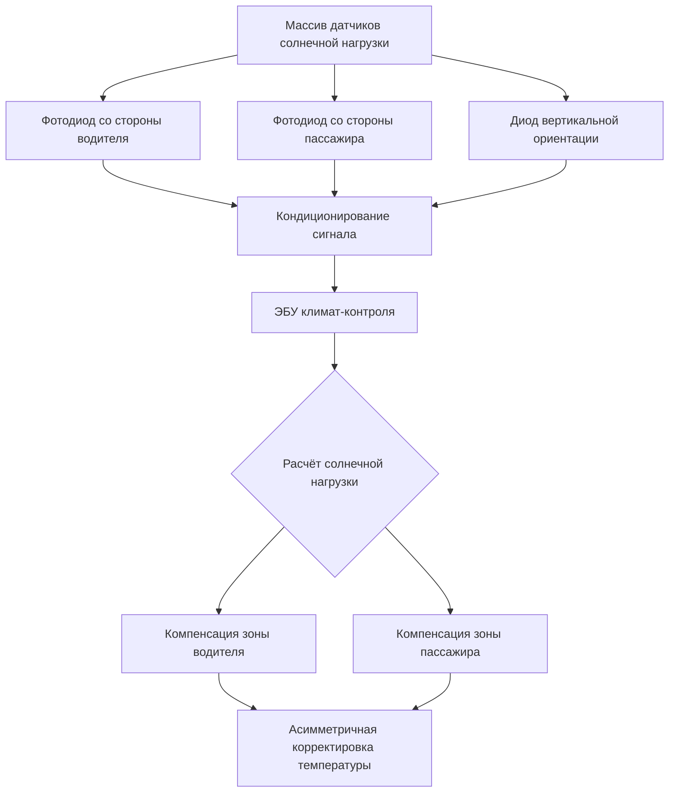
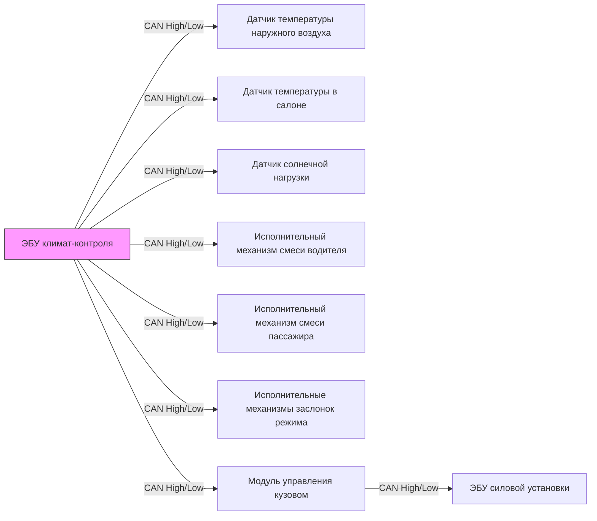

Системы автоматического климат-контроля достигают прецизионного теплового регулирования посредством интегрированных сетей датчиков и электромеханических исполнительных механизмов, которые непрерывно регулируют распределение воздушного потока и смешивание температур. Алгоритм управления обрабатывает множество входных сигналов окружающей среды для поддержания комфорта в салоне при компенсации солнечного излучения, условий окружающей среды и тепловых нагрузок от пассажиров.

## Архитектура датчиков температуры

### Измерение температуры наружного воздуха

Измерение температуры наружного воздуха использует термисторы с отрицательным температурным коэффициентом (NTC), установленные в защищённых от потока воздуха местах, чтобы предотвратить смещение от солнечного излучения и загрязнения теплом от дороги. Связь сопротивления и температуры следует уравнению Штейнхарта-Харта:

$$\frac{1}{T} = A + B \ln(R) + C (\ln(R))^3$$

где $T$ — абсолютная температура (К), $R$ — сопротивление (Ω), а $A$, $B$, $C$ — коэффициенты калибровки, зависящие от состава материала термистора.

**Типичные характеристики термистора NTC:**

| Параметр | Значение | Примечания по применению |
|-----------|----------|-------------------------|
| Сопротивление при 25°C | 10 кΩ ± 1% | Опорная точка |
| Коэффициент бета (β) | 3950 К | Определяет чувствительность |
| Время отклика | 5-15 секунд | В движущемся воздухе |
| Рабочий диапазон | -40°C до 125°C | Автомобильный класс |
| Ошибка собственного нагрева | <0,1°C | При токе 1 мА |

Упрощённое уравнение с параметром бета обеспечивает адекватную точность для автомобильных приложений:

$$R_T = R_{25} \exp\left[\beta \left(\frac{1}{T} - \frac{1}{298.15}\right)\right]$$

### Датчик температуры в салоне

Датчики температуры в салоне интегрируют вентилятор, пропускающий воздух через элемент термистора со скоростью приблизительно 0,5-1,0 м/с для обеспечения репрезентативного отбора проб и минимизации тепловой инерции. Вынужденная конвекция устанавливает предсказуемый коэффициент теплопередачи:

$$h = \frac{k \cdot Nu}{L}$$

где $Nu$ (число Нуссельта) зависит от числа Рейнольдса и геометрии воздушного потока. Аспирация исключает вариации естественной конвекции, которые вызывают неопределённость измерения ±2-3°C.

Датчик обычно монтируется рядом с панелью приборов с перфорированным корпусом, чтобы предотвратить прямое солнечное воздействие, при этом обеспечивая быстрое реагирование на реальные изменения температуры воздуха в салоне.

## Обнаружение солнечного излучения

### Физика датчика солнечной нагрузки

Датчики солнечной нагрузки на основе фотодиодов измеряют интенсивность падающего солнечного излучения для компенсации асимметричных тепловых нагрузок на оболочку салона. Фотодиод генерирует ток, пропорциональный потоку фотонов:

$$I_{ph} = q \eta A \Phi$$

где $q$ — элементарный заряд, $\eta$ — квантовая эффективность, $A$ — активная площадь, а $Φ$ — плотность потока фотонов.

Современные датчики включают несколько фотодиодов с направленной чувствительностью для различия угла солнца и интенсивности на стороне водителя и пассажира. Алгоритм управления применяет асимметричные коррекции температуры:

$$T_{setpoint,adj} = T_{setpoint} + K_{sun} \cdot I_{solar} \cdot \cos(\theta)$$

где $K_{sun}$ — коэффициент усиления компенсации солнечной нагрузки (обычно 0,05-0,15°C на Вт/м²) и $θ$ — угол между вектором солнца и нормалью к поверхности.

### Датчик влажности

Ёмкостные датчики влажности измеряют относительную влажность, обнаруживая изменения диэлектрической проницаемости полимерной плёнки:

$$C = \epsilon_0 \epsilon_r \frac{A}{d}$$

где $\epsilon_r$ изменяется в зависимости от поглощённого водяного пара. Датчик позволяет автоматически активировать рециркуляцию при превышении внешней влажности порога запотевания лобового стекла, обычно 70-80% относительной влажности при температуре ниже 10°C.

## Электромеханические исполнительные механизмы

### Управление смесительной заслонкой с помощью шагового двигателя

Исполнительные механизмы смесительной заслонки используют постоянные магниты шаговых двигателей, обеспечивающих 12-64 микрошагов на полный шаг, достигая углового разрешения 0,5-2° в диапазоне смесительной заслонки 90°. Управление положением работает в разомкнутом контуре без обратных датчиков:

$$\theta_{actual} = \theta_{commanded} + \epsilon_{step}$$

где $\epsilon_{step}$ представляет накопленную ошибку шага, обычно <1° на полном диапазоне благодаря механическим стопорам и трению.

**Сравнение исполнительных механизмов шагового двигателя:**

| Спецификация | Биполярный шаговик | Униполярный шаговик | Сервомотор |
|--------------|-------------------|-------------------|-----------|
| Точность позиционирования | ±1° | ±2° | ±0,25° |
| Удерживающий момент | 0,8-1,2 Н⋅м | 0,5-0,8 Н⋅м | 1,5-2,5 Н⋅м |
| Потребление мощности (удержание) | 2-3 Вт | 1,5-2 Вт | 0,5 Вт |
| Стоимость (относительная) | 1,0× | 0,8× | 1,8× |
| Самокалибровка | Требуется | Требуется | Непрерывная |
| Время отклика (90°) | 3-5 с | 4-6 с | 2-3 с |

### Привод заслонки режима

Заслонки режима направляют воздушный поток к дефростовке, панели или напольным вентиляционным отверстиям, используя идентичную технологию шагового двигателя. Система сохраняет положение заслонки в памяти через циклы отключения питания путём обнаружения механических концевых упоров во время последовательностей инициализации.

Подпрограмма калибровки применяет постоянный ток при мониторинге счётчика шагов до момента обнаружения застопорения:

$$I_{stall} > I_{nominal} + \Delta I_{threshold}$$

Это устанавливает абсолютную опорную точку позиции без выделенных датчиков Холла или потенциометров.

## Интеграция CAN-шины

### Архитектура сети

Датчики и исполнительные механизмы климат-контроля взаимодействуют через Controller Area Network (CAN) соответствующую SAE J1939 или собственным протоколам со скоростью передачи данных 125-500 кбит/с. Распределённая архитектура исключает проводку по принципу «точка-точка»:

### Протокол сообщений

Данные датчиков передаются в периодических кадрах (интервалы 50-200 мс), содержащих идентификатор, код длины данных и полезную нагрузку. ЭБУ климата реализует алгоритмы управления PID, обрабатывающие входные сигналы датчиков для генерирования команд исполнительных механизмов:

$$u(t) = K_p e(t) + K_i \int_0^t e(\tau)d\tau + K_d \frac{de(t)}{dt}$$

где $e(t) = T_{setpoint} - T_{measured}$ представляет сигнал тепловой ошибки.

Коды диагностики неисправностей (DTC) генерируют, когда значения датчиков превышают диапазоны правдоподобия (например, температура в салоне >70°C или <-40°C) или когда исполнительные механизмы не достигают командованных позиций в течение периодов ожидания.

## Стратегия слияния сенсорных данных

Алгоритм климат-контроля взвешивает множество входных сигналов температуры для вычисления эффективной температуры в салоне:

$$T_{effective} = w_1 T_{cabin} + w_2 T_{ambient} + w_3 f(I_{solar}) + w_4 T_{evaporator}$$

где коэффициенты взвешивания $w_i$ суммируются до единицы и адаптируются в зависимости от режима работы (отопление, охлаждение, вентиляция). Этот многопараметрический подход достигает точности установки ±0,5°C, несмотря на неопределённости измерений и тепловую стратификацию в объёме салона.

Продвинутые системы включают предсказательные алгоритмы, которые прогнозируют тепловые нагрузки на основе данных маршрута GPS, позволяя выполнить предварительное кондиционирование перед значительным воздействием солнца или изменениями температуры окружающей среды во время цикла движения.
