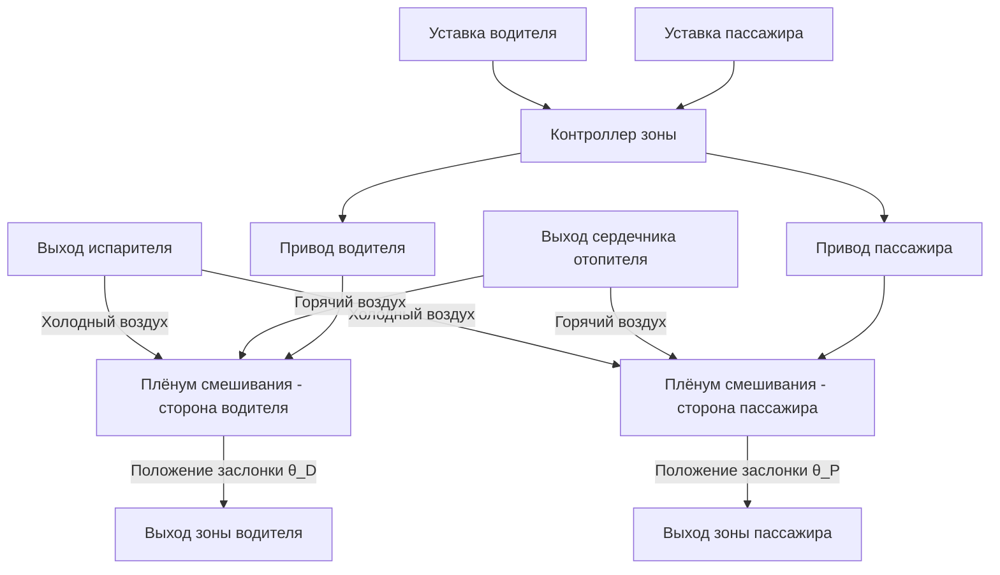
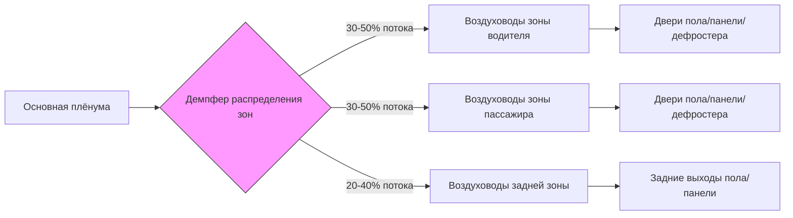
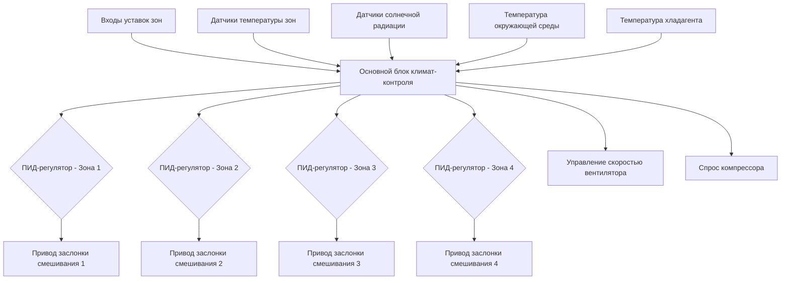

Системы зонального управления в автомобилях обеспечивают независимое управление температурой и потоком воздуха для различных областей салона, решая проблему тепловой асимметрии, присущей автомобильным средам. Передовые многозонные системы разделяют салон на отдельные контролируемые объёмы, каждый из которых регулируется выделенными приводами и датчиками температуры, работающими в рамках централизованного алгоритма управления.

## Основы теплового разбиения

Зональное управление решает фундаментальную проблему неравномерного распределения солнечной радиации и теплопередачи от пассажиров в салонах автомобилей. Водительская сторона получает большую солнечную радиацию в автомобилях с левосторонним управлением, движущихся на восток в утренних условиях, в то время как задние зоны испытывают сниженный поток воздуха из-за перепада давления в воздуховодах.

Теплопередача в каждую зону подчиняется:

$$Q_{zone} = Q_{solar} + Q_{occupant} + Q_{conduction} - Q_{supply}$$

где $Q_{supply}$ должна быть независимо управляемой для поддержания температуры уставки несмотря на переменные $Q_{solar}$ и $Q_{occupant}$ для каждой зоны.

## Архитектура двухзонного управления климатом

Двухзонные системы разделяют салон на зоны водителя и пассажира вдоль осевой линии автомобиля. Каждая зона требует:

**Компоненты управления:**
- Независимый интерфейс уставки температуры
- Датчик температуры воздуха на выходе зоны
- Выделенный привод заслонки смешивания (или общий привод с дифференциальным позиционированием)
- Двери распределения воздуха по режимам (могут быть общие или независимые)

Температура подаваемого воздуха для каждой зоны рассчитывается:

$$T_{supply,zone} = T_{setpoint,zone} - \frac{Q_{load,zone}}{\dot{m}_{zone} \cdot c_p}$$

где $\dot{m}_{zone}$ — массовый расход воздуха в зону и $c_p$ — удельная теплоёмкость воздуха (1,006 кДж/кг·К).

### Стратегия управления заслонкой смешивания

Большинство двухзонных систем используют одно из следующих решений:

1. **Двойная конфигурация заслонки смешивания** — независимые заслонки смешивания для левой/правой сторон, смешивающие холодный воздух испарителя с горячим воздухом сердечника отопителя
2. **Конструкция с разделённой плёнумом** — одна заслонка смешивания с разделённой камерой плёнума, создающей разницу температур

Положение заслонки смешивания $\theta$ управляет соотношением смешивания горячего и холодного воздуха:

$$T_{discharge} = T_{cold} + (T_{hot} - T_{cold}) \cdot \sin(\theta)$$

для типовой ротационной заслонки смешивания, где $\theta$ варьируется от 0° (максимальное охлаждение) до 90° (максимальное отопление).

## Трёхзонные и четырёхзонные системы

Люксовые автомобили используют трёхзонное (водитель, пассажир, задний ряд) или четырёхзонное (водитель, пассажир, левый задний, правый задний) управление для обеспечения пассажиров в задних рядах независимым управлением климатом.

### Сравнение конфигураций зон

| Тип системы | Контролируемые зоны | Типовые приводы | Распределение потока воздуха | Количество датчиков | Применение |
|------------|---------------|-------------------|---------------------|--------------|--------------|
| Одна зона | 1 (весь салон) | 1 заслонка смешивания | Равномерное | 1 датчик температуры салона | Экономичные автомобили |
| Две зоны | 2 (водитель/пассажир) | 2 заслонки смешивания | Разделение влево/вправо | 2-3 датчика | Седаны и внедорожники среднего класса |
| Три зоны | 3 (передняя + задняя) | 3 заслонки смешивания | Разделение передней части + задняя | 3-4 датчика | Люксовые седаны, внедорожники |
| Четыре зоны | 4 (все углы) | 4 заслонки смешивания | Независимые углы | 4-5 датчиков | Премиум внедорожники, представительские седаны |

### Проблемы управления задней зоной

Задние зоны требуют дополнительного внимания из-за:

**Перепад давления в воздуховоде:** Протяженные воздуховоды в задние кабины снижают доступное статическое давление. Для трассы воздуховода длиной 2 метра:

$$\Delta P = f \cdot \frac{L}{D} \cdot \frac{\rho V^2}{2}$$

где коэффициент трения $f \approx 0,02$ для гладких воздуховодов HVAC. При типовых скоростях 8 м/с перепад давления может превышать 50 Па, снижая расход воздуха на 15-25% по сравнению с передними зонами.

**Решение:** выделенные задние вентиляторы (распространены в трёхзонных+ системах) или воздуховоды большего диаметра для поддержания $\Delta P < 100$ Па.

**Тепловое запаздывание:** воздух на выходе задней части проходит через более длинные воздуховоды, испытывая теплопередачу:

$$Q_{duct} = U \cdot A_{duct} \cdot (T_{ambient} - T_{air})$$

где $U \approx 2-4$ Вт/м²·К для изолированных автомобильных воздуховодов. Это требует компенсации температуры прямого хода в алгоритме управления.

## Технология зональных приводов

### Приводы заслонок смешивания

Современные зональные системы используют приводы с шаговыми двигателями или приводы постоянного тока с редуктором с обратной связью по положению:

- **Шаговые двигатели:** угол шага 0,9° — 1,8°, обеспечивающие 200-400 шагов при полном ходе 90°
- **Разрешение:** точность управления температурой ±0,5°С требует разрешения привода лучше 2° для типовых характеристик заслонки смешивания
- **Время срабатывания:** 5-15 секунд для полного хода (максимальное охлаждение до максимального отопления)

Связь между ошибкой положения привода и ошибкой температуры:

$$\Delta T_{discharge} = \frac{dT}{d\theta} \cdot \Delta \theta$$

где $\frac{dT}{d\theta}$ обычно варьируется от 0,3-0,8°С на градус положения привода, в зависимости от температур испарителя и сердечника отопителя.

### Системы зональных демпферов

Распределение воздуха между зонами использует:

1. **Ротационные барабанные демпферы** — один вращающийся цилиндр с портами, направляющими поток воздуха в различные зоны
2. **Бабочечные демпферы** — множественные шарнирные двери, управляющие соотношением потоков в зоны
3. **Пропорциональные демпферы** — модулирующие демпферы, позволяющие непрерывную регулировку потока между зонами

## Передовые функции зонального управления

### Реализации в люксовых автомобилях

Премиум-системы многозонного управления включают:

**Компенсация солнечной радиации:** Датчики фотодиодов на приборной панели определяют асимметричную солнечную нагрузку. Алгоритм управления корректирует температуры зон:

$$T_{setpoint,corrected} = T_{setpoint,user} - K_{solar} \cdot I_{solar}$$

где $K_{solar} \approx 0,02-0,05$ °С/(Вт/м²) и $I_{solar}$ — измеренная солнечная радиация (0-1000 Вт/м²).

**Обнаружение занятости:** инфракрасные или ёмкостные датчики определяют занятые зоны, позволяя системе снижать поток воздуха в незанятые зоны, улучшая эффективность на 10-15%.

**Независимый выбор режима:** высокопроизводительные четырёхзонные системы позволяют каждой зоне независимо выбирать режимы пола, панели или дефростера — требуя до 12 приводов двери режима (3 режима × 4 зоны).

**Задние панели управления:** физические или сенсорные экраны в задних центральных консолях или подлокотниках обеспечивают прямую регулировку уставки без посредничества передних сидений.

## Архитектура алгоритма управления

Многозонные системы используют распределённое управление:

Каждая зона работает с независимым контуром ПИД-управления с типовыми коэффициентами усиления:
- Пропорциональное: $K_p = 5-10$ (градусов привода на °С ошибки)
- Интегральное: $K_i = 0,5-2$ (компенсирует смещение в установившемся режиме)
- Дифференциальное: $K_d = 1-3$ (демпфирование быстрых изменений температуры)

## Стандарты и критерии производительности

SAE J2765 устанавливает процедуры тестирования для оценки системы многозонного управления климатом, определяя:

- **Отклонение температуры зоны:** < 3°C от уставки в условиях установившегося состояния
- **Взаимовлияние между зонами:** < 2°C изменение температуры в соседней зоне при изменении уставки соседней зоны на 10°C
- **Производительность охлаждения:** каждая зона должна достичь уставки в течение 15 минут при прогреве с температуры 55°C
- **Управление влажностью:** операция испарителя должна поддерживать < 60% относительной влажности во всех зонах одновременно

Многозонные системы представляют сходимость точного теплового управления, сложной актуации и интеллектуальных алгоритмов для преодоления неотъемлемо неравномерной тепловой среды автомобильных салонов.
