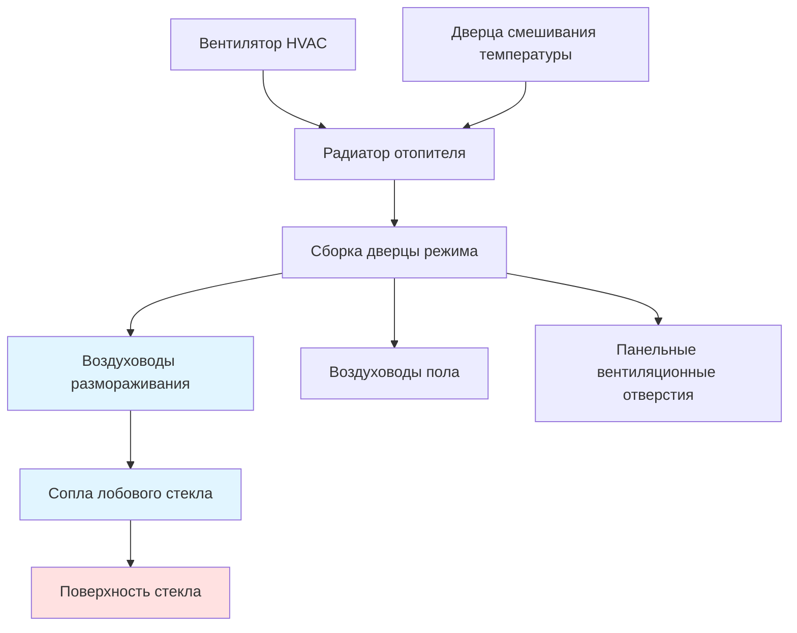

# Системы размораживания и очистки от запотевания в автомобилях

Системы размораживания и очистки от запотевания представляют критически важные элементы безопасности в конструкции автомобильных систем HVAC, непосредственно влияя на видимость водителя в неблагоприятных погодных условиях. Эти системы решают две различные физические задачи: образование льда на внешних поверхностях стекла и конденсация на внутренних поверхностях, каждая из которых требует разных тепловых и гидродинамических стратегий.

## Физические принципы образования мороза и запотевания

### Механизмы образования льда

Иней образуется на внешних поверхностях стекла, когда температура поверхности падает ниже точки росы окружающего воздуха и затем ниже 0°C. Скорость передачи тепла через автомобильное стекло описывается следующим образом:

$$Q = \frac{kA(T_{int} - T_{ext})}{L}$$

Где $Q$ — скорость передачи тепла (кДж/ч), $k$ — теплопроводность стекла (0,86-1,21 кДж/ч·м·°C), $A$ — площадь поверхности (м²), и $L$ — толщина стекла (типично 3,8-6,4 мм).

Однослойное автомобильное стекло имеет минимальное тепловое сопротивление, что позволяет быстро уравнять температуру поверхности с внешними условиями. Это требует существенного подвода тепла для поддержания температуры поверхности выше нуля.

### Физика конденсации

Внутренняя конденсация возникает, когда теплый, влажный воздух в салоне контактирует с холодной поверхностью стекла. Соотношение давления насыщенного пара определяет этот процесс:

$$P_{sat} = P_{ref} \cdot e^{\frac{L_v}{R_v}(\frac{1}{T_{ref}} - \frac{1}{T})}$$

Где $L_v$ — скрытая теплота испарения (2501 кДж/кг при 0°C), $R_v$ — газовая постоянная для водяного пара (461 Дж/кг·К), и $T$ — абсолютная температура (К).

Критическое значение: конденсация начинается, когда локальная температура поверхности стекла падает ниже точки росы воздуха в салоне. Это обычно происходит при высокой влажности в салоне (>60% ОВ) и внешних температурах ниже 4°C.

## Нормативная база

### Требования FMVSS 103

Федеральный стандарт безопасности транспортных средств 103 предъявляет специфические требования к производительности системы размораживания и очистки от запотевания. Стандарт требует:

- **Охват зоны размораживания**: Минимальная очищенная площадь на лобовом стекле, определяемая по тестовой схеме A (область просмотра водителя) и схеме B (область просмотра пассажира)
- **Временные требования**: максимум 40 минут для достижения требуемой видимости через льдистое лобовое стекло при температуре окружающей среды -29°C
- **Производительность при очистке от запотевания**: максимум 6 минут для очистки конденсации с внутренней поверхности лобового стекла

### Стандарты SAE

SAE J902 определяет процедуры тестирования для оценки производительности системы размораживания в контролируемых лабораторных условиях, указывая:

- Толщина льда: равномерное покрытие 0,79 мм
- Температура окружающей среды: -29°C ± 1,7°C
- Требования предварительной подготовки салона
- Методологии измерения для очищенной площади

## HVAC-системы размораживания

### Архитектура распределения воздуха

Режим размораживания направляет нагретый воздух исключительно или в основном на выходы лобового стекла и боковых окон. Система должна удовлетворять конкурирующим требованиям:

**Тепловой поток**: достаточная тепловая нагрузка для плавления льда и испарения конденсации
**Скорость воздуха**: адекватный массовый расход для удаления влаги с поверхности стекла
**Равномерность распределения**: однородное покрытие всей площади лобового стекла

### Требования передачи тепла

Необходимый подвод тепла для размораживания льдистого лобового стекла включает:

$$Q_{total} = Q_{sensible} + Q_{latent} + Q_{transmission}$$

Где:
- $Q_{sensible} = m \cdot c_p \cdot \Delta T$ (тепло для повышения температуры льда до 0°C)
- $Q_{latent} = m \cdot h_{fg}$ (теплота плавления, 335 кДж/кг)
- $Q_{transmission}$ = продолжающаяся потеря тепла через стекло в окружающую среду

Для типичного лобового стекла (1,4 м²) с слоем льда 0,79 мм:

$$m = \rho \cdot V = 917 \, \text{кг/м}^3 \cdot 1,4 \, \text{м}^2 \cdot 0,00079 \, \text{м} = 1,01 \, \text{кг}$$

$$Q_{latent} = 1,01 \, \text{кг} \cdot 335 \, \text{кДж/кг} = 338 \, \text{кДж}$$

### Стратегия распределения воздушного потока

| Параметр | Режим размораживания | Типичные значения |
|----------|---------------------|--------------------|
| Температура на выходе | 54-71°C | Максимально доступная |
| Объемный расход воздуха | 71-118 CFM (121-200 м³/ч) | 60-80% от полной емкости |
| Скорость воздуха в сопле | 4,1-6,1 м/с | Высокий импульс для очистки |
| Угол сопла | 30-45° к стеклу | Оптимизировано для покрытия |
| Установка рециркуляции | Свежий воздух | Предотвращение накопления влаги |

Высокоскоростной выброс воздуха создает турбулентный пограничный слой на поверхности стекла, повышая коэффициент конвективной передачи тепла с типичных значений естественной конвекции 5,7-11,4 Вт/м²·K до значений принудительной конвекции 28,4-56,8 Вт/м²·K.

## Технологии нагреваемого стекла

### Элементы резистивного нагрева

Электрически проводящие элементы, встроенные в поверхность стекла или нанесенные на нее, обеспечивают прямой поверхностный нагрев. Эти системы используют либо:

**Тонкие проволочные сетки**: провода из вольфрама или сплава серебра (0,025-0,051 мм в диаметре), ламинированные между слоями стекла
**Прозрачные проводящие покрытия**: оксид индия-олова (ITO) или покрытия на основе серебра с поверхностным сопротивлением 5-15 Ом/кв.

Требования мощности для нагреваемых лобовых стекол типично варьируются от 500 до 1500 Вт, обеспечивая тепловой поток 0,3-0,6 Вт/см² по поверхности стекла.

### Сравнение тепловой производительности

| Технология | Время размораживания | Потребление мощности | Преимущества | Ограничения |
|-----------|---------------------|--------------------|------------|-----------|
| Воздух HVAC | 15-25 мин | 100-150 Вт (вентилятор) | Без дополнительного оборудования | Медленный отклик, зависит от двигателя |
| Нагреваемое стекло | 3-8 мин | 500-1500 Вт | Быстрая очистка, равномерное распределение | Высокая электрическая нагрузка, стоимость |
| Комбинированная система | 2-5 мин | 600-1650 Вт | Оптимальная производительность | Сложность, двойной расход электроэнергии |

### Влияние на электрическую систему

Мгновенный спрос на электроэнергию от систем нагреваемого стекла влияет на архитектуру электрической системы транспортного средства:

$$I = \frac{P}{V} = \frac{1200 \, \text{Вт}}{13,5 \, \text{В}} = 88,9 \, \text{А}$$

Этот существенный ток (примерно 7,5% типичной емкости генератора 100-150 А) требует специализированных релейных цепей и надлежащим образом рассчитанных проводников (минимум 5,3 мм² сечения).

## Стратегии очистки от запотевания

### Управление влажностью

Внутренняя очистка от запотевания решает задачу конденсации через три механизма:

**Нагрев поверхности**: повышение температуры стекла выше точки росы воздуха в салоне
**Разбавление влаги**: введение сухого наружного воздуха для снижения содержания влаги в салоне
**Принудительное испарение**: высокоскоростной поток воздуха, удаляющий конденсат с поверхности

Психрометрическое соотношение для эффективности очистки от запотевания:

$$\omega_{mix} = \frac{\dot{m}_{recirc} \cdot \omega_{cabin} + \dot{m}_{fresh} \cdot \omega_{ambient}}{\dot{m}_{total}}$$

Где $\omega$ представляет влагосодержание (кг воды/кг сухого воздуха). Максимальная производительность очистки от запотевания достигается при 100% режиме свежего воздуха и минимальном влагосодержании в салоне.

### Различия между режимом размораживания и режимом очистки от запотевания

Работа кондиционирования воздуха в режиме очистки от запотевания снижает влажность воздуха через конденсацию на испарителе, при одновременном повторном нагреве воздуха до комфортных температур на выходе. Этот двойной процесс (осушение + нагрев) обеспечивает самую быструю очистку от конденсации.

## Интеграция систем и управление

Современные транспортные средства используют логику автоматического климат-контроля для оптимизации производительности размораживания/очистки от запотевания на основе входных сигналов датчиков:

- **Датчики влажности в салоне**: обнаруживают повышенные уровни влаги, активируя режим очистки от запотевания
- **Датчики внешней температуры**: активируют стратегии размораживания ниже нуля
- **Датчики солнечной нагрузки**: предвидят нагрев лобового стекла от солнечного излучения
- **Датчики температуры стекла**: прямое измерение условий на поверхности

Прогнозные алгоритмы могут инициировать цикл размораживания до видимого образования льда, поддерживая непрерывную видимость во время эксплуатации.

## Заключение

Автомобильные системы размораживания и очистки от запотевания интегрируют принципы термодинамики, механику жидкости и технологии электрического нагрева для поддержания критически важной видимости для водителя. Соответствие требованиям FMVSS 103 устанавливает минимальные базовые показатели производительности, в то время как передовые технологии нагреваемого стекла и интеллектуальные стратегии управления обеспечивают превосходную производительность в реальных условиях. Основная сложность остается неизменной: доставка достаточного количества тепловой энергии к поверхностям стекла при одновременном управлении комфортом в салоне и ограничениями потребления электроэнергии транспортного средства.
