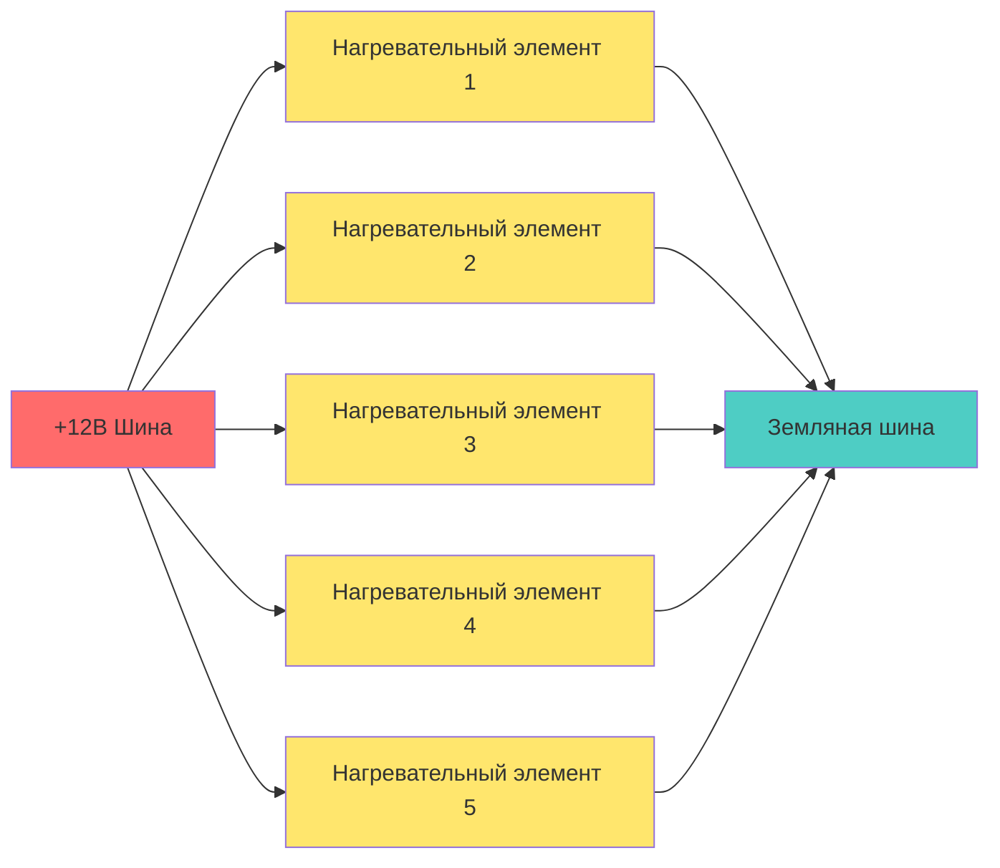
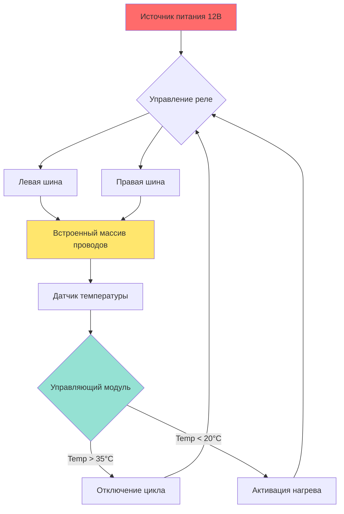
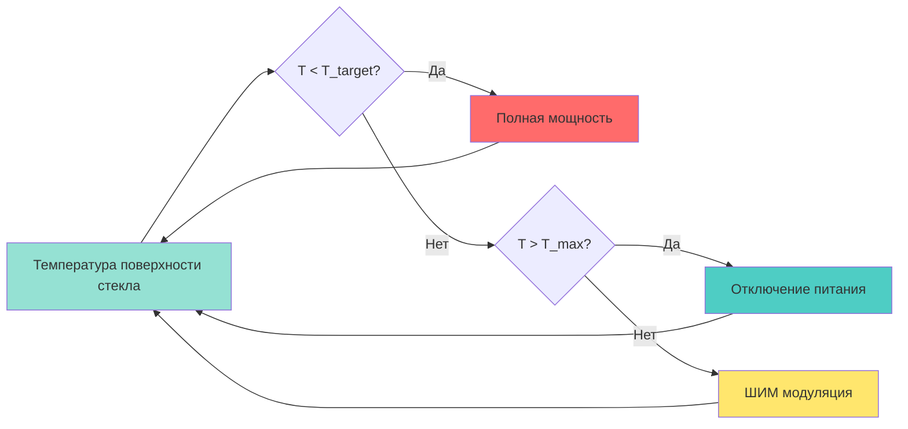

## Физика систем обогреваемого стекла

Системы обогреваемого стекла обеспечивают быстрое размораживание и удаление запотевания благодаря прямому электрическому резистивному нагреву поверхности стекла. В отличие от систем принудительного воздушного размораживания, которые полагаются на конвективный теплообмен, системы обогреваемого стекла генерируют тепло непосредственно на границе конденсации или обледенения, достигая значительно более быстрого очищения и улучшенной энергоэффективности для локализованных приложений.

### Механизм теплопередачи

Фундаментальный процесс нагрева следует первому закону Джоуля, где электрическое сопротивление преобразует поток тока в тепловую энергию:

$$Q = I^2 R t = \frac{V^2}{R} t$$

где:
- $Q$ = выделенное тепло (Дж)
- $I$ = ток (А)
- $R$ = сопротивление нагревательного элемента (Ом)
- $V$ = приложенное напряжение (В)
- $t$ = время (с)

Требуемый тепловой поток для удаления инея или конденсата зависит от массы льда и теплоты плавления:

$$q = \frac{\dot{m}_{ice} \cdot h_{fg}}{A}$$

где $\dot{m}_{ice}$ – скорость сублимации/плавления льда (кг/с), $h_{fg}$ – теплота плавления (334 кДж/кг для льда), а $A$ – площадь нагреваемой поверхности (м²).

## Конструкция сетки размораживателя заднего окна

### Конфигурация сетки

Размораживатели задних окон используют резистивные проволочные сетки, встроенные в поверхность стекла или нанесенные на нее. Типичная конфигурация состоит из горизонтальных проводников, охватывающих ширину окна, подключенных к вертикальным шинам на каждом краю.

### Расстояние между проводами и распределение тепла

Расстояние между элементами напрямую влияет на эффективность очищения. Оптимальное расстояние уравновешивает охват против требований по сопротивлению:

| Расстояние между проводами | Типичное применение | Плотность мощности | Время очищения |
|---------------------------|---------------------|-------------------|-----------------|
| 25–30 мм | Стандартные задние окна | 300–400 Вт/м² | 3–5 минут |
| 15–20 мм | Высокопроизводительные системы | 500–700 Вт/м² | 1–3 минуты |
| 40–50 мм | Экономичные приложения | 200–300 Вт/м² | 5–8 минут |

Распределение температуры между нагревательными элементами следует затухающему экспоненциальному паттерну. Максимальная температура возникает у проволоки, минимальная температура – посередине между проволоками:

$$T(y) = T_{wire} + (T_{mid} - T_{wire}) \cdot \cos\left(\frac{\pi y}{s}\right)$$

где $s$ – расстояние между проводами, а $y$ – расстояние от центральной линии проволоки.

### Электрические характеристики

Типичные сетки размораживателя заднего окна работают при напряжении аккумулятора автомобиля со следующими характеристиками:

**Стандартный пассажирский автомобиль:**
- Напряжение: 12–14,5 ВDC
- Общий ток: 10–15 A
- Общая мощность: 120–220 Вт
- Сопротивление провода: 0,8–1,2 Ом на метр
- Сопротивление сетки: 0,8–1,5 Ом (всего)

**Грузовики/крупногабаритные автомобили:**
- Напряжение: 24–28 ВDC
- Общий ток: 8–12 A
- Общая мощность: 200–340 Вт
- Сопротивление сетки: 2,0–3,5 Ом (всего)

Сопротивление каждого нагревательного элемента должно тщательно контролироваться во время производства для обеспечения равномерного распределения тока и предотвращения горячих точек, которые могут вызвать термические напряжения в стекле.

## Технология обогреваемого лобового стекла

### Системы проводящего покрытия

Современные обогреваемые лобовые стекла используют прозрачные проводящие покрытия, нанесенные на внутреннюю поверхность стекла. Эти системы используют технологии тонких пленок для достижения оптической прозрачности при сохранении достаточной электропроводности для нагрева.

**Свойства материалов:**

| Тип покрытия | Поверхностное сопротивление | Пропускание видимого света | Типичная толщина |
|--------------|----------------------------|--------------------------|-------------------|
| Оксид индия и олова (ITO) | 5–15 Ом/кв. | 85–90% | 100–300 нм |
| Оксид олова, легированный фтором (FTO) | 8–20 Ом/кв. | 80–85% | 300–500 нм |
| Серебряные нанопроводы | 10–30 Ом/кв. | 85–92% | 50–200 нм |

Поверхностное сопротивление ($R_s$) связано с объемным удельным сопротивлением покрытия ($\rho$) и толщиной ($t$):

$$R_s = \frac{\rho}{t}$$

Плотность мощности для системы проводящего покрытия с приложенным напряжением $V$ на расстоянии $L$:

$$P = \frac{V^2 \cdot W}{R_s \cdot L}$$

где $W$ – перпендикулярное измерение (ширина).

### Системы с встроенными тонкими проводами

Альтернативная конструкция обогреваемого лобового стекла встраивает чрезвычайно тонкие вольфрамовые провода (диаметр 20–40 мкм) в промежуточный слой ламината. Эти провода разнесены на 10–15 мм по вертикали по всему лобовому стеклу.

**Преимущества проволочной системы:**
- Возможность более высокой плотности мощности (до 1000 Вт/м²)
- Более быстрое время размораживания (30–90 секунд для полного очищения)
- Возможны локализованные зоны нагрева
- Минимальное оптическое искажение

**Ограничения конструкции:**
- Видимость проволоки при определенных условиях освещения
- Повышенная сложность производства
- Увеличенная толщина ламината (0,1–0,2 мм)

## Системы обогревателя парковки стеклоочистителей

### Объективы конструкции

Обогреватели парковки стеклоочистителей предотвращают прилипание льда в основании лобового стекла, где находятся щетки стеклоочистителей. Эта локализованная зона нагрева обеспечивает отпускание щетки щеткоочистителя в холодных условиях и предотвращает повреждение замороженного механизма стеклоочистителя.

### Конфигурация

Обогреватели парковки стеклоочистителей обычно состоят из:

1. **Нагревательный элемент:** резистивный провод или печатный нагреватель (50–100 Вт)
2. **Термоизоляция:** предотвращает потери тепла в конструкцию автомобиля
3. **Датчик температуры:** ограничивает максимальную температуру поверхности (обычно 60–70°C)
4. **Управляющее реле:** активируется вместе с размораживателем заднего окна или независимо

Нагревательный элемент охватывает всю ширину хода щетки (обычно 800–1200 мм) с сосредоточенной плотностью мощности в положении парковки:

$$P_{zone} = \frac{P_{total} \cdot L_{park}}{L_{total}}$$

## Требования к мощности и проектирование системы

### Анализ электрической нагрузки

Системы обогреваемого стекла представляют значительные электрические нагрузки на электрическую систему автомобиля. Общая нагрузка размораживания для полностью оборудованного автомобиля:

| Компонент системы | Потребляемая мощность | Режим работы |
|-------------------|----------------------|-------------|
| Размораживатель заднего окна | 120–220 Вт | Непрерывно (3–10 мин) |
| Обогреваемое лобовое стекло | 400–700 Вт | Непрерывно (1–5 мин) |
| Обогреватель парковки стеклоочистителя | 50–100 Вт | Непрерывно (переменный) |
| Обогреваемые боковые зеркала | 30–60 Вт | Непрерывно (3–10 мин) |
| **Пиковая нагрузка** | **600–1080 Вт** | **50–90 A при 12В** |

### Управление тепловыми процессами

Температура поверхности должна контролироваться для предотвращения термических напряжений в многослойном стекле. Максимальный безопасный перепад температуры по толщине стекла:

$$\Delta T_{max} = \frac{\sigma_{allow} \cdot (1-\nu)}{E \cdot \alpha}$$

где:
- $\sigma_{allow}$ = допустимое напряжение растяжения (обычно 40–50 МПа для закаленного стекла)
- $\nu$ = коэффициент Пуассона (0,22 для содо-известкового стекла)
- $E$ = модуль Юнга (70 ГПа для стекла)
- $\alpha$ = коэффициент теплового расширения (9 × 10⁻⁶ К⁻¹)

Для автомобильного стекла ограничение температуры поверхности до 60–70°C предотвращает растрескивание от термических напряжений при обеспечении адекватной производительности размораживания.

### Метрики производительности размораживания

Согласно SAE J953 (системы размораживания лобового стекла для легковых автомобилей), системы обогреваемого лобового стекла должны очищать минимальные зоны в установленные сроки:

**Требования к очищению:**
- Зона A (критическое поле зрения водителя): 80% очищено за 40 секунд
- Зона B (полное переднее поле зрения): 80% очищено за 10 минут
- Максимальная температура поверхности: 85°C

Системы обогреваемого лобового стекла значительно превосходят эти требования, обычно достигая очищения зоны A за 30–60 секунд.

## Стратегии управления

### Управление на основе температуры

Продвинутые системы используют замкнутое управление температурой для оптимизации потребления электроэнергии и предотвращения перегрева:

Широтно-импульсная модуляция (ШИМ) поддерживает целевую температуру после начального очищения, снижая среднее потребление мощности на 40–60%.

### Активация на основе окружающей среды

Интеллектуальные системы активируют обогреваемое стекло на основе множества входов:

- Наружная температура < 5°C
- Внутренняя влажность > 70% ОВ
- Обнаружение датчиком дождя
- Вызов автоматического климат-контроля

Эта прогнозирующая активация предотвращает образование инея, а не требует реактивного очищения.

## Сравнительная производительность

### Обогреваемое стекло в сравнении с принудительным воздушным размораживанием

| Метрика производительности | Обогреваемое стекло | Принудительный воздух (HVAC) |
|---------------------------|-------------------|------------------------------|
| Время начального очищения | 1–3 минуты | 5–15 минут |
| Потребление электроэнергии | 400–700 Вт | 800–2000 Вт (вентилятор + теплоноситель) |
| Энергоэффективность | Высокая (прямой нагрев) | Средняя (конвективные потери) |
| Область покрытия | Ограничена стеклом | Полное лобовое стекло возможно |
| Возможность холодного запуска | Немедленная | Требуется прогрев двигателя |
| Сложность | Низкая (только электрическая) | Высокая (управление тепловыми процессами) |

**Оптимальное применение:** Системы обогреваемого стекла превосходны для задних окон и обеспечивают дополнительное размораживание переднего лобового стекла, в то время как системы принудительного воздуха остаются необходимыми для комплексной внутренней осушки.

## Проектные соображения

### Термические напряжения в стекле

Тепловое напряжение, вызванное неравномерным нагревом:

$$\sigma = \frac{E \cdot \alpha \cdot \Delta T}{1-\nu}$$

Для типичного перепада температуры 30°C (типичный при размораживании):

$$\sigma = \frac{70 \times 10^9 \cdot 9 \times 10^{-6} \cdot 30}{1-0.22} = 24.2 \text{ МПа}$$

Этот уровень напряжения остается значительно ниже прочности на растяжение 40–50 МПа закаленного автомобильного стекла, обеспечивая адекватный запас прочности.

### Электромагнитная совместимость

Проводящие покрытия и проволочные сетки могут вызывать помехи в системах радиочастотного диапазона. Стратегии снижения конструктивного риска включают:

- Зазорные зоны для мест монтажа антенн
- Формулировки покрытий, прозрачных для RF
- Фильтрованные подключения источника питания для минимизации проводимых излучений

SAE J551 определяет требования электромагнитной совместимости для автомобильных электрических систем, включая максимальные излучаемые электромагнитные помехи от систем обогреваемого стекла.

## Заключение

Системы обогреваемого стекла обеспечивают быстрое и энергоэффективное размораживание благодаря прямому резистивному нагреву на поверхности стекла. Основанная на физике конструкция расстояния между проводами сетки, свойств проводящего покрытия и подачи питания обеспечивает эффективное удаление льда и тумана при сохранении структурной целостности и оптического качества стекла. Интеграция интеллектуального управления оптимизирует производительность при минимизации нагрузок на электрическую систему, делая технологию обогреваемого стекла необходимой для современных систем видимости и безопасности автомобилей.
