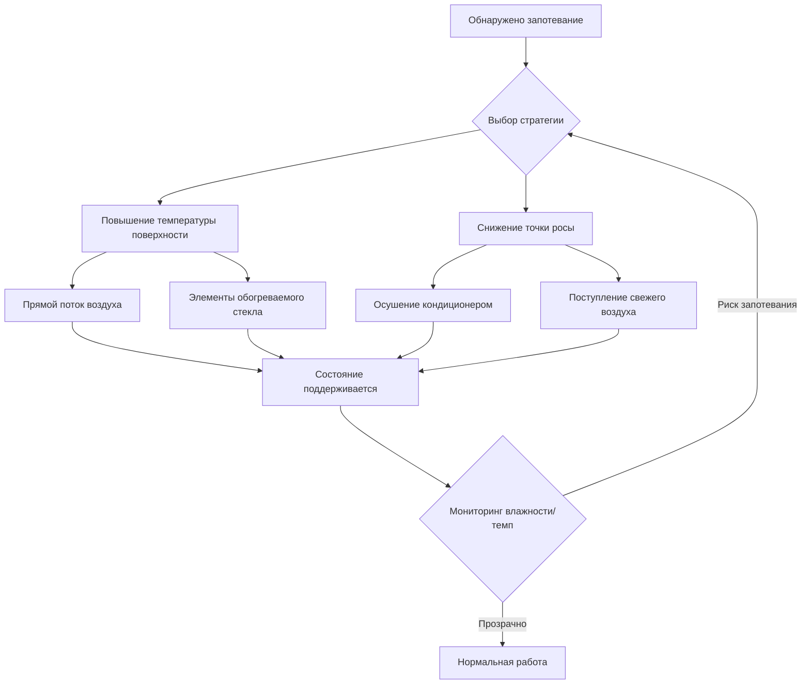
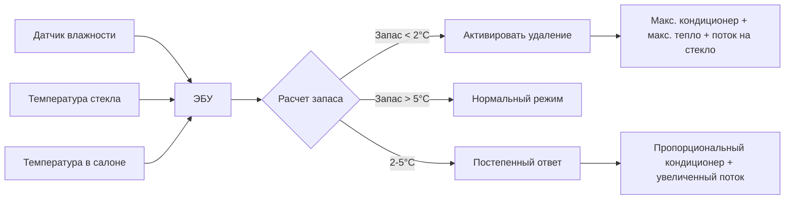

## Обзор

Удаление конденсата со стекол в автомобильных приложениях представляет критическую функцию безопасности, при которой психрометрическое управление предотвращает образование конденсата, который снижает видимость водителя. В отличие от разморозки, которая удаляет лед с наружных поверхностей, удаление конденсата устраняет влажную конденсацию на внутренних поверхностях стекла, когда температура поверхности падает ниже точки росы воздуха в салоне.

## Физика конденсации

### Основы точки росы

Конденсация происходит, когда температура поверхности стекла $T_s$ падает ниже температуры точки росы $T_{dp}$ прилегающего воздуха. Соотношение определяется следующим образом:

$$T_{dp} = T_{db} - \frac{100 - RH}{5}$$

Где:
- $T_{dp}$ = Температура точки росы (°C)
- $T_{db}$ = Температура по сухому термометру (°C)
- $RH$ = Относительная влажность (%)

Это приближение действительно для типичных условий в салоне автомобиля (0–30°C, 30–90% RH).

### Теплопередача на поверхности стекла

Температура поверхности зависит от теплопередачи как из воздуха в салоне, так и из окружающей среды:

$$q = \frac{T_{cabin} - T_{outdoor}}{R_{total}}$$

Где:

$$R_{total} = \frac{1}{h_i} + \frac{t}{k} + \frac{1}{h_o}$$

Для автомобильного стекла:
- $h_i$ = Коэффициент конвекции внутренней поверхности (5–15 Вт/м²·K в зависимости от потока воздуха)
- $t$ = Толщина стекла (типично 4–5 мм)
- $k$ = Теплопроводность стекла (≈1,0 Вт/м·K)
- $h_o$ = Коэффициент конвекции наружной поверхности (20–100 Вт/м²·K при скоростях автомагистрали)

Температура поверхности с внутренней стороны:

$$T_s = T_{cabin} - q \cdot \frac{1}{h_i}$$

## Стратегии удаления конденсата

### Стратегия 1: Повышение температуры поверхности

**Метод прямого потока воздуха**

Направление нагретого воздуха на лобовое стекло повышает как $T_s$, так и $h_i$. SAE J902 определяет минимальные скорости потока воздуха 0,071–0,094 м³/с для удаления конденсата с лобового стекла в легковых автомобилях. Коэффициент конвекции увеличивается приблизительно в соответствии с:

$$h_i \approx 5.7 + 3.8V$$

Где $V$ — скорость воздуха (м/с) у поверхности стекла.

**Элементы обогреваемого стекла**

Задние стекла и боковые зеркала используют резистивные нагревательные сетки. Плотность мощности типично находится в диапазоне 0,3–0,5 Вт/см². Для стандартного заднего стекла (0,8 м²):

$$P = 0,4 \times 8000 = 3200 \text{ Вт}$$

Схемы таймера ограничивают работу 10–20 минутами, чтобы предотвратить чрезмерный расход батареи.

### Стратегия 2: Снижение точки росы

**Осушение испарителем кондиционера**

Наиболее эффективный метод удаления конденсата сочетает нагрев с кондиционированием воздуха. Когда воздух в салоне проходит над змеевиком испарителя (типично 2–5°C), влага конденсируется и отводится. Производительность осушения определяется формулой:

$$\dot{m}_w = \dot{m}_a (W_1 - W_2)$$

Где:
- $\dot{m}_w$ = Скорость удаления влаги (кг/с)
- $\dot{m}_a$ = Массовый расход воздуха (кг/с)
- $W_1, W_2$ = Коэффициенты влажности до/после испарителя (кг воды/кг сухого воздуха)

Для типичной работы в режиме удаления конденсата:
- Температура змеевика испарителя: 3–6°C
- Снижение коэффициента влажности подаваемого воздуха: 0,004–0,008 кг/кг
- Поток воздуха: 0,142–0,236 м³/с (0,14–0,24 кг/с)

Это дает скорость удаления влаги 0,56–1,92 г/с.

**Поступление свежего воздуха**

В холодную погоду наружный воздух имеет более низкую абсолютную влажность несмотря на высокую относительную влажность. Введение свежего воздуха при -5°C и 80% RH (коэффициент влажности ≈0,002 кг/кг) и нагрев его до 20°C снижает относительную влажность до примерно 13%, что значительно снижает тенденцию к запотеванию.

## Автоматические системы удаления конденсата

Современные автомобили используют системы на основе датчиков, соответствующие рекомендациям SAE J1503.

### Технология определения влажности

**Емкостные датчики влажности**

Установленные на лобовом стекле или в корпусе HVAC, эти датчики измеряют относительную влажность с точностью ±2–3%. Сигнал датчика запускает режим удаления конденсата при:

$$RH > f(T_{glass}, T_{cabin})$$

Где $f$ — откалиброванная функция, учитывающая тепловую задержку стекла.

**Оптические датчики конденсации**

Передовые системы используют инфракрасную отражательную способность для обнаружения начала конденсации. Светодиод излучает инфракрасный свет на границе раздела стекло-воздух; интенсивность отраженного света изменяется при образовании конденсата из-за изменения условий на границе раздела показателя преломления.

### Логика управления

Расчет запаса:

$$\Delta T = T_{glass} - T_{dp,cabin}$$

Автоматические системы обычно активируются при $\Delta T < 2–3°C$ для предотвращения образования конденсата до его появления.

## Сравнение производительности

| Метод | Эффективность | Время отклика | Энергия (Вт) | Применение |
|--------|---------------|---------------|------------|-------------|
| Только нагретый воздух | Средняя | 2–5 мин | 1500–3000 | Лобовое стекло |
| Кондиционер + тепло | Отличная | 1–3 мин | 2500–5000 | Все стекла |
| Обогреваемое стекло | Отличная | 3–8 мин | 1200–3200 | Заднее стекло, зеркала |
| Свежий воздух | Хорошая (холодный климат) | 4–6 мин | 1500–2000 | Профилактика |

## Проблемы удаления конденсата с боковых стекол

Боковые стекла получают ограниченный прямой поток воздуха по сравнению с лобовым стеклом. SAE J902 требует адекватного потока воздуха к передним боковым стеклам, но физические ограничения снижают эффективность:

- Распределение потока воздуха приборной панели: 60–70% лобовое стекло, по 15–20% каждое боковое стекло
- Длинный путь потока воздуха увеличивает падение температуры перед достижением стекла
- Зоны застоя в углах создают низкие значения $h_i$, подверженные стойкому запотеванию

Решения включают:
- Выделенные боковые вентиляционные отверстия, расположенные у основания стойки A
- Элементы обогреваемого стекла (люксовые автомобили)
- Дополнительные вентиляторы в двери (редко)

## Проектные соображения

**Управление энергопотреблением**

Общая мощность удаления конденсата может превысить 5 кВт. Последствия для электрической системы:

$$I = \frac{P}{V} = \frac{5000}{14} \approx 360 \text{ А}$$

Это требует:
- Высокопроизводительный генератор (150+ А)
- Мониторинг состояния заряда батареи
- Алгоритмы отключения нагрузки во время холостого хода

**Шумоподавление**

Максимальный расход воздуха для удаления конденсата генерирует 55–65 дБА на позиции водителя. Вентилятор HVAC должен работать эффективно на 4000–6000 об/мин без чрезмерного шума.

**Соответствие стандартам SAE**

- **SAE J902**: Системы разморозки лобового стекла легковых автомобилей
- **SAE J1503**: Измерение влажности и температуры в автомобильных приложениях
- **SAE J1376**: Оборудование для восстановления автомобильного хладагента

## Оптимизация системы

Оптимальная производительность удаления конденсата требует балансировки нескольких параметров. Целевая функция минимизирует время очистки с ограничением энергопотребления:

$$\min \left( t_{clear} \right) \text{ при условии } P_{total} \leq P_{max}$$

Решения обычно включают:
- Немедленную активацию компрессора кондиционера (приоритет осушения)
- Максимальный поток воздуха на лобовое стекло (повышение $h_i$)
- Отключение режима рециркуляции в начале (очистка воздуха в салоне с высокой влажностью)
- Постепенный переход на свежий воздух после снижения точки росы

Продвинутые системы используют модельное прогнозирующее управление, прогнозируя риск конденсации на основе данных о погоде и оптимизируя работу HVAC за 5–10 минут вперед.

## Компоненты

- Удаление конденсата с боковых стекол
- Удаление конденсата с заднего стекла
- Электрическая сеточная разморозка
- Обогреваемое заднее стекло
- Потребление энергии задней разморозки
- Таймерное управление задней разморозкой
- Обогреваемые боковые зеркала
- Предотвращение конденсации
