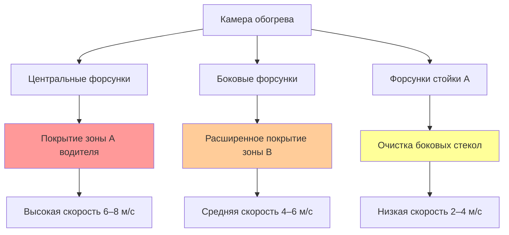
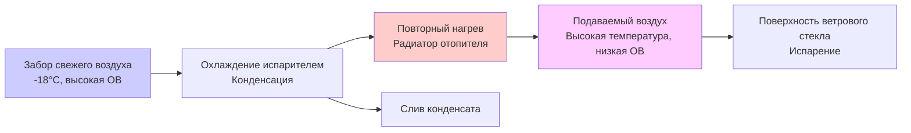

Системы обогрева ветрового стекла представляют критическую функцию безопасности в конструкции автомобильной HVAC, регулируемую Федеральным стандартом безопасности транспортных средств 103 (FMVSS 103). Эти системы должны быстро удалять мороз и конденсат с поверхности ветрового стекла, подавая горячий осушенный воздух через стекло, одновременно контролируя конденсацию с помощью точного управления температурой, влажностью и распределением воздушного потока.

## Требования FMVSS 103

FMVSS 103 устанавливает критерии производительности для систем обогрева и удаления конденсата, обеспечивающие видимость для водителя в установленных условиях окружающей среды.

### Спецификации зон видимости

Стандарт требует очистки зон, измеренных в точке глаза водителя:

| Зона | Ширина | Высота | Максимальное время очистки |
|------|--------|--------|---------------------------|
| A (прямой обзор водителя) | 15 см | Полная высота | 10 минут |
| B (расширенный обзор водителя) | 30 см | Полная высота | 20 минут |
| C (сторона пассажира) | Переменная | Полная высота | 40 минут |

Условия испытаний предусматривают температуру окружающей среды -18°C с относительной влажностью, создающей отложение инея на внутренней поверхности стекла.

### Требования испытательного протокола

SAE J902 предоставляет подробную методологию испытаний для соответствия FMVSS 103. Транспортное средство должно достичь установленной видимости в установленные сроки при работе в режиме обогрева с максимальной тепловой мощностью и расходом воздуха.

## Основы теплопередачи

Эффективность обогрева ветрового стекла зависит от трех одновременно действующих механизмов теплопередачи на границе раздела воздух-стекло.

### Конвективная теплопередача

Основной механизм удаления инея — это вынужденная конвекция от горячего воздуха, ударяющегося о поверхность стекла. Конвективный тепловой поток выражается как:

$$q_{conv} = h \cdot A \cdot (T_{air} - T_{glass})$$

Где:
- $q_{conv}$ = скорость конвективной теплопередачи (Вт)
- $h$ = коэффициент конвективной теплопередачи (Вт/м²·К)
- $A$ = площадь ветрового стекла (м²)
- $T_{air}$ = температура подаваемого воздуха (К)
- $T_{glass}$ = температура поверхности стекла (К)

Коэффициент теплопередачи $h$ существенно зависит от скорости и турбулентности воздушного потока у поверхности стекла. Типичные значения находятся в диапазоне 15–45 Вт/м²·К для скоростей воздуха обогрева между 3–8 м/с.

### Массопередача при удалении конденсата

Удаление конденсата требует испарения конденсированной влаги, регулируемого коэффициентом массопередачи:

$$\dot{m}_{evap} = h_m \cdot A \cdot (C_{sat} - C_{air})$$

Где:
- $\dot{m}_{evap}$ = скорость испарения (кг/с)
- $h_m$ = коэффициент массопередачи (м/с)
- $C_{sat}$ = концентрация водяного пара при насыщении при температуре стекла (кг/м³)
- $C_{air}$ = концентрация влаги в подаваемом воздухе (кг/м³)

Отношение Льюиса связывает теплопередачу и массопередачу: $h_m = h/(ρ \cdot c_p \cdot Le^{2/3})$, где $Le$ — число Льюиса (приблизительно 0,9 для воздушно-водяного пара).

### Требования энергии для сублимации

Удаление инея требует энергии сублимации, значительно превышающей энергию испарения. Общая энергия, требуемая для очистки инея:

$$Q_{total} = m_{frost} \cdot L_{sub} + m_{frost} \cdot c_p \cdot \Delta T$$

Где:
- $m_{frost}$ = масса отложения инея (кг)
- $L_{sub}$ = скрытая теплота сублимации (2838 кДж/кг при 0°C)
- $c_p$ = удельная теплоемкость водяного пара (1,86 кДж/кг·К)
- $\Delta T$ = повышение температуры от температуры инея до комнатной температуры

## Конструкция форсунок обогрева

Геометрия форсунки управляет распределением воздушного потока по ветровому стеклу, определяя картину видимости и производительность по времени очистки.

### Картины распределения воздушного потока

### Профили скорости форсунок

Оптимальная конструкция форсунки уравновешивает скорость и охват. Высокая скорость увеличивает $h$, но может вызвать чрезмерный шум и снижение площади охвата. Скорость выхода из форсунки определяется как:

$$V_{nozzle} = \frac{\dot{V}_{total}}{n \cdot A_{nozzle}}$$

Где:
- $V_{nozzle}$ = скорость выхода из форсунки (м/с)
- $\dot{V}_{total}$ = общий объемный расход (м³/с)
- $n$ = количество форсунок
- $A_{nozzle}$ = площадь отдельной форсунки (м²)

Типичные системы обогрева используют 5–7 форсунок с общим расходом 180–250 CFM (85–118 м³/ч).

### Углы присоединения и расширения

Присоединение форсунки к ветровому стеклу зависит от эффекта Коанда и импульса струи. Расстояние присоединения определяется как:

$$L_{attach} = \frac{V_{nozzle} \cdot d}{\beta \cdot g \cdot \sin(\theta)}$$

Где:
- $L_{attach}$ = расстояние присоединения (м)
- $d$ = диаметр форсунки (м)
- $\beta$ = параметр плавучести
- $\theta$ = угол ветрового стекла от горизонтали

Оптимальные углы расширения находятся в диапазоне 40–60° для максимизации охвата при сохранении достаточной скорости удара.

## Режим свежего воздуха и осушение

Эффективный обогрев требует осушенного воздуха для установления градиента концентрации влаги, способствующего испарению.

### Стратегия удаления влаги

Психрометрический процесс подготовки воздуха обогрева включает:

### Работа компрессора кондиционера во время обогрева

Современные системы активируют компрессор кондиционера в режиме обогрева для снижения влажности подаваемого воздуха. Пропускная способность удаления влаги составляет:

$$\dot{m}_{water} = \dot{m}_{air} \cdot (W_{in} - W_{out})$$

Где:
- $\dot{m}_{water}$ = скорость удаления воды (кг/с)
- $\dot{m}_{air}$ = массовый расход сухого воздуха (кг/с)
- $W_{in}$ = входное соотношение влажности (кг воды/кг сухого воздуха)
- $W_{out}$ = соотношение влажности на выходе после испарителя

Типичная работа испарителя при -18°C окружающей среды снижает соотношение влажности с 0,0008 до 0,0003 кг/кг, затем повторный нагрев до 54–66°C обеспечивает подаваемый воздух с относительной влажностью ниже 10%.

### Логика отключения рециркуляции

Режим обогрева отключает рециркуляцию, чтобы предотвратить накопление влаги из дыхания пассажиров. Каждый пассажир генерирует приблизительно 40–60 г/ч влаги через дыхание. При рециркуляции эта влага насыщает воздух в кабине, устраняя движущую силу для испарения конденсата.

## Анализ времени очистки

Время очистки зависит от массы инея, условий подаваемого воздуха и эффективности распределения воздушного потока.

### Переходная модель теплопередачи

Эволюция температуры ветрового стекла следует:

$$m_{glass} \cdot c_{p,glass} \cdot \frac{dT_{glass}}{dt} = q_{conv} - q_{cond,out} - q_{sublimation}$$

Где:
- $m_{glass}$ = масса ветрового стекла (кг)
- $c_{p,glass}$ = удельная теплоемкость стекла (840 Дж/кг·К)
- $q_{cond,out}$ = теплопроводность во внешнюю среду (Вт)
- $q_{sublimation}$ = энергия, потребляемая сублимацией инея (Вт)

### Параметры производительности

Ключевые факторы, влияющие на время очистки:

| Параметр | Типичный диапазон | Влияние на время очистки |
|----------|------------------|--------------------------|
| Температура подаваемого воздуха | 54–71°C | -2 мин на 5,6°C увеличения |
| Расход воздуха | 180–250 CFM | -1,5 мин на 9,5 м³/ч увеличения |
| Начальная толщина инея | 0,5–2,0 мм | +3 мин на мм |
| Температура окружающей среды | -29 до -7°C | +1 мин на 2,8°C снижения |
| Угол ветрового стекла | 25–35° | -0,5 мин на 2,8° увеличения |

### Стратегии быстрого обогрева

Передовые системы применяют несколько приемов для сокращения времени очистки:

1. **Активация максимальной тепловой мощности/максимального вентилятора**: Немедленно устанавливает максимальный коэффициент конвекции
2. **Элементы нагреваемого ветрового стекла**: Дополнительный резистивный нагрев (400–1000 Вт), встроенный в стекло
3. **Оптимизированное нацеливание форсунок**: Приоритет охвата зоны A с 40–50% общего воздушного потока
4. **Предварительная активация компрессора кондиционера**: Начинает осушение перед входом пассажира
5. **Координация обогрева заднего окна**: Предотвращает миграцию влаги от задней части к передней

## Проверка конструкции при испытаниях

Помимо соответствия FMVSS 103, производители проводят дополнительную валидацию:

- **Испытания при холодном пуске**: Транспортное средство стабилизировано при температуре испытания 4+ часа
- **Измерение толщины инея**: Оптические или емкостные датчики проверяют равномерное отложение
- **Документирование картины очистки**: Высокоскоростная съемка фиксирует прогресс
- **Оценка уровня шума**: Измерения микрофоном в позиции уха пассажира
- **Анализ потребления энергии**: Влияние электрической нагрузки и расхода топлива

Подход на основе физики обеспечивает, что системы обогрева ветрового стекла достигают нормативного соответствия при оптимизации комфорта пассажиров, энергоэффективности и производительности очистки в разнообразных условиях окружающей среды.

## Компоненты

- Работа в режиме обогрева
- Обогрев при максимальном расходе воздуха
- Обогрев при максимальной тепловой мощности
- Распределение воздуха на ветровом стекле
- Конструкция форсунки обогрева
- Картина удаления конденсата
- Воздуховоды обогрева
- Отключение рециркуляции при обогреве
- Стратегии быстрого обогрева
