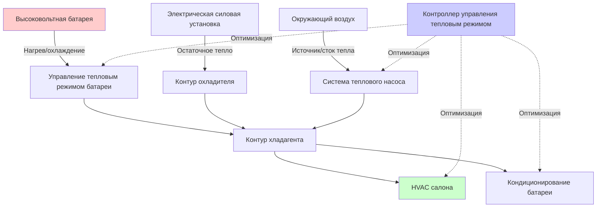

HVAC системы электромобилей представляют собой фундаментальный отход от традиционного автомобильного климат-контроля в связи с отсутствием остаточного тепла двигателя. Каждый ватт, потребляемый системой HVAC, непосредственно снижает дальность движения, что делает управление тепловым режимом одной из самых критических задач проектирования электромобилей. Современные системы управления тепловым режимом электромобилей интегрируют кондиционирование салона, управление температурой батареи и охлаждение силовой установки в унифицированные архитектуры, оптимизирующие использование энергии во всех тепловых нагрузках.

## Фундаментальные энергетические ограничения

Энергетический штраф за работу HVAC в электромобилях существенно отличается от автомобилей с двигателем внутреннего сгорания. В обычных транспортных средствах двигатель отводит примерно 60-70% энергии топлива в виде остаточного тепла, обеспечивая достаточное количество тепловой энергии для отопления салона при минимальных затратах на эффективность. Электрические силовые установки работают с эффективностью 85-95%, производя минимальное остаточное тепло, при этом требуя энергии батареи для всех тепловых нагрузок.

Соотношение потребления энергии описывается следующим образом:

$$E_{HVAC} = \frac{Q_{тепловая}}{\eta_{система}} = \frac{Q_{отопление}}{COP_{нагрев}} + \frac{Q_{охлаждение}}{EER_{охлаждение}}$$

где $E_{HVAC}$ представляет потребляемую электроэнергию, $Q_{тепловая}$ — тепловая нагрузка, $COP_{нагрев}$ — коэффициент производительности для отопления, а $EER_{охлаждение}$ — коэффициент энергоэффективности для охлаждения.

Для типичной нагрузки отопления 5 кВ в холодную погоду:
- Резистивное отопление: $E = 5 кВ / 1,0 = 5 кВ$ потребления электроэнергии
- Тепловой насос (COP = 2,5): $E = 5 кВ / 2,5 = 2 кВ$ потребления электроэнергии

Эта экономия энергии на 60% напрямую переводится в сохранение дальности вождения.

## Тепловой насос в сравнении с резистивным отоплением

Электромобили используют две основные стратегии отопления, каждая с отличительными характеристиками производительности и профилями эффективности.

| Параметр | Резистивное (PTC) отопление | Система теплового насоса |
|-----------|------------------------|------------------|
| **Диапазон COP** | 0,95-1,0 | 1,5-4,0 (зависит от температуры) |
| **Производительность при низкой температуре** | Стабильная | Деградирует ниже -10°C |
| **Сложность системы** | Минимальная | Высокая (обратимая холодильная система) |
| **Капитальные затраты** | Низкие | В 3-5 раз выше |
| **Время прогрева** | Быстрое (секунды) | Умеренное (1-3 минуты) |
| **Эффективность при -20°C** | 100% номинальной | 40-60% пиковой COP |

### Физика резистивного отопления

Нагреватели с положительным температурным коэффициентом (PTC) работают на основе принципа тепловыделения Джоуля:

$$Q = I^2 R t$$

Характеристика PTC обеспечивает саморегулирующееся поведение — по мере увеличения температуры сопротивление растет, снижая ток и предотвращая тепловой пробой. Нагреватели PTC обеспечивают мгновенное тепло с единичной эффективностью, но потребляют энергию батареи в соотношении 1:1.

### Работа теплового насоса

Тепловые насосы электромобилей извлекают тепловую энергию из окружающего воздуха, жидкости охлаждения батареи или компонентов силовой установки, используя цикл холодильной машины с паровой компрессией в обратном направлении. Фундаментальное термодинамическое соотношение:

$$COP_{нагрев} = \frac{Q_H}{W_{компр}} = \frac{T_H}{T_H - T_C}$$

где $T_H$ — абсолютная температура горячей стороны, $T_C$ — абсолютная температура холодной стороны, $W_{компр}$ — работа компрессора. Предел Карно демонстрирует, почему COP деградирует при низких температурах окружающей среды — температурный перепад увеличивается, требуя большего сжатия на единицу доставленного тепла.

Современные тепловые насосы электромобилей используют несколько методов для поддержания производительности в холодном климате:
- **Впрыск пара** увеличивает массовый расход хладагента и управление перегревом
- **Интеграция нескольких источников тепла** извлекает остаточное тепло от батареи и силовой электроники
- **Обход газа вспышки** улучшает емкость при низкой температуре
- **Компрессоры спирального типа переменной скорости** оптимизируют эффективность во всех режимах работы

## Интегрированная архитектура управления тепловым режимом

Продвинутые электромобили объединяют HVAC салона, кондиционирование батареи и охлаждение силовой установки в интегрированные системы управления тепловым режимом (ITMS), которые оптимизируют общую эффективность системы.

### Интеграция управления тепловым режимом батареи

Литий-ионные батареи требуют поддержания температуры в диапазоне 15-35°C для оптимальной производительности и долговечности. Система управления тепловым режимом батареи должна:

**Режим отопления:** Предварительное кондиционирование холодных батарей перед зарядкой или вождением для улучшения доставки мощности и снижения риска литиевого покрытия. Источники тепла включают:
- Нагреватели PTC в контуре охладителя
- Теплообменник теплового насоса (чиллер, работающий в обратном направлении)
- Восстановленное остаточное тепло от силовой установки

**Режим охлаждения:** Удаление тепла, выделяемого при быстрой зарядке или высокомощном разряде:

$$Q_{батарея} = I^2 R_{внутреннее} + I \cdot V_{поляризация}$$

Для батареи 800 В, заряжаемой при 250 кВ с потерями внутреннего сопротивления 2%, выделение тепла достигает 5 кВ, требуя активного жидкостного охлаждения для предотвращения теплового пробоя.

### Восстановление тепла из нескольких источников

Интегрированные системы собирают остаточное тепло из нескольких источников:

| Источник тепла | Диапазон температур | Типичная доступная мощность |
|-------------|------------------|------------------------|
| Силовая электроника | 60-80°C | 1-3 кВ (движение по шоссе) |
| Электрический двигатель | 70-90°C | 2-5 кВ (непрерывная нагрузка) |
| Резистивные потери батареи | 25-45°C | 0,5-5 кВ (зависит от заряда/разряда) |
| Занятость салона/солнечная радиация | 20-40°C | 0,3-1 кВ |

Эффективность восстановления тепла описывается следующим образом:

$$\epsilon = \frac{Q_{восстановленное}}{Q_{доступное}} = \frac{C_{мин}(T_{г,вход} - T_{х,выход})}{C_{мин}(T_{г,вход} - T_{х,вход})}$$

где $C_{мин}$ — минимальная теплоемкость потока между горячим и холодным потоками.

## Стратегии энергоэффективности

Сохранение дальности требует агрессивной оптимизации эффективности во всех условиях работы:

**Зональное отопление:** Прямое отопление салона с использованием радиационных панелей, обогреваемых сидений и рулевого колеса снижает нагрузки на воздушное отопление на 30-50%. Уравнение метаболического комфорта:

$$M - W = Q_{конвекция} + Q_{радиация} + Q_{испарение} + Q_{дыхание}$$

демонстрирует, что комфорт зависит от полного теплового баланса, а не от температуры воздуха в одиночку. Радиационное отопление мощностью 60-80 Вт/м² позволяет снизить температуру воздуха в салоне с 22°C до 18°C при сохранении эквивалентного комфорта.

**Предварительное кондиционирование:** Кондиционирование салона и батареи при подключении к сетевой электросети устраняет штраф на энергию при вождении. Для типичного транспортного средства, требующего 3 кВч для прогрева от -10°C до 20°C, предварительное кондиционирование сохраняет 15-25 км дальности вождения в зимний период.

**Прогнозное управление тепловым режимом:** Оптимизация теплового режима на основе маршрута использует данные навигации для упреждающего прогнозирования остановок зарядки и проактивной регулировки температуры батареи, обеспечивая оптимальные скорости приемки заряда без избыточного потребления энергии.

**Выбор хладагента:** Хладагенты с низким потенциалом глобального потепления (R-1234yf, R-744/CO₂) обеспечивают экологические преимущества. Системы на основе R-744 обеспечивают превосходную емкость отопления в холодную погоду благодаря высоким коэффициентам давления и различиям энтальпии, но требуют специальных компонентов высокого давления, рассчитанных на 140 бар.

## Стандарты и справочные материалы по проектированию

Проектирование системы HVAC электромобилей следует стандартам SAE J2765 (требования к охлаждению батареи), SAE J2889 (измерение теплового режима батареи) и SAE J2946 (тестирование производительности системы HVAC). Протоколы тестирования учитывают влияние температуры окружающей среды как на эффективность HVAC, так и на производительность батареи, используя составные циклы вождения, представляющие реальные режимы потребления энергии.

Система управления тепловым режимом представляет 20-30% от общего потребления энергии транспортного средства в экстремальных климатах, что делает оптимизацию HVAC критически важной для достижения приемлемой дальности вождения в любую погоду и удовлетворения клиентов.
