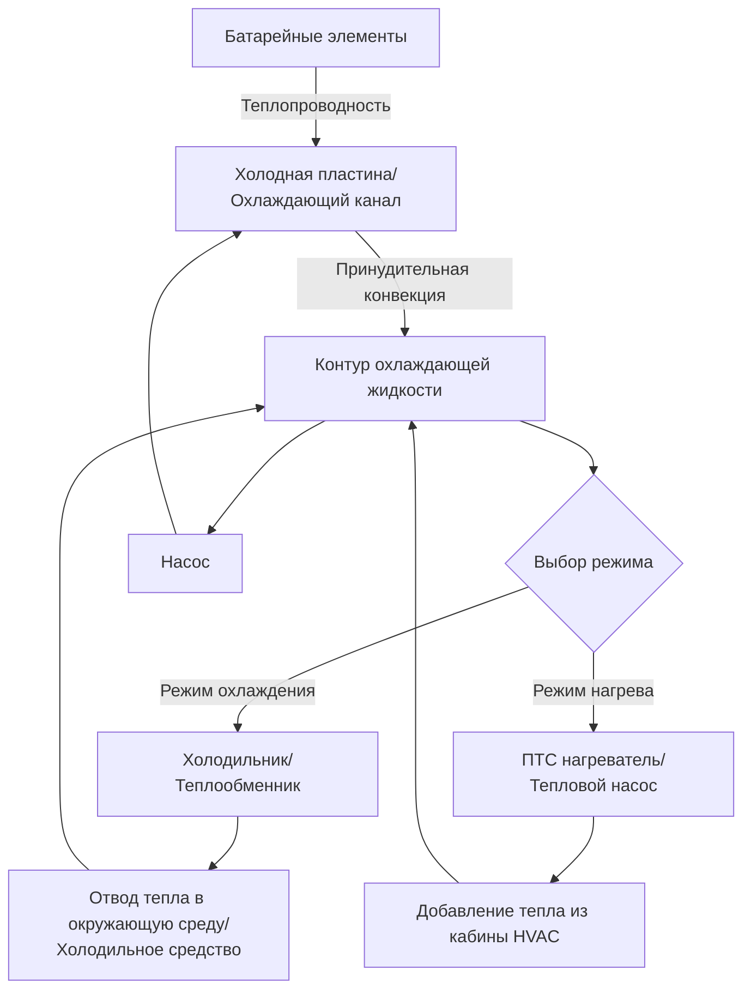
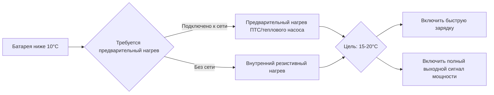

Системы терморегулирования батареи (BTMS) представляют критический интерфейс между электрохимическим накоплением энергии и системой климат-контроля транспортного средства. Поддержание литий-ионных элементов в оптимальном диапазоне температур 20-40°C непосредственно влияет на мощность, восприятие зарядки, цикличность и запасы безопасности.

## Характеристики тепловой нагрузки

Генерирование тепла в батарейном модуле проистекает из двух источников: необратимого резистивного нагрева и обратимых энтропийных эффектов. Общая скорость генерирования тепла следует:

$$Q_{total} = I^2 R_{internal} + IT\frac{dU}{dT}$$

Где $I$ — ток, $R_{internal}$ — внутреннее сопротивление элемента, $T$ — абсолютная температура, и $\frac{dU}{dT}$ — коэффициент энтропии. При высокоскоростном разряде (ускорение) или быстрой зарядке доминирует резистивный нагрев. Типичный модуль мощностью 75 кВт·ч, потребляющий 200 кВт, может генерировать 4-8 кВт отходящего тепла.

**Зависящие от температуры эффекты производительности:**

| Диапазон температур | Сохранение ёмкости | Мощностная способность | Скорость деградации |
|-------------------|-------------------|------------------|------------------|
| −20°C до 0°C | 60-80% | 40-60% | Риск литиевого покрытия |
| 0°C до 20°C | 85-95% | 70-90% | Минимальная |
| 20°C до 40°C | 95-100% | 95-100% | 0,5-1% в год |
| 40°C до 60°C | 90-98% | 100% | 3-8% в год |
| Выше 60°C | Изменяемая | Изменяемая | Ускоренное старение |

## Архитектура системы жидкостного охлаждения

Жидкостная BTMS использует контур охлаждающей жидкости (обычно 50:50 вода-гликоль), циркулирующей через холодные пластины или охлаждающие каналы, интегрированные в структуру батарейного модуля. Передача тепла происходит через три сопротивления последовательно:

$$\frac{1}{U_{overall}} = \frac{1}{h_{cell}} + \frac{t_{plate}}{k_{aluminum}} + \frac{1}{h_{coolant}}$$

Где $U_{overall}$ — общий коэффициент теплопередачи, $h_{cell}$ — коэффициент конвекции на поверхности элемента, $t_{plate}$ — толщина холодной пластины, $k_{aluminum}$ — теплопроводность, и $h_{coolant}$ — коэффициент конвекции со стороны охлаждающей жидкости.

**Производительность системы жидкостного охлаждения:**

- **Расход охлаждающей жидкости**: 10-30 л/мин типично для модулей 60-100 кВт·ч
- **Перепад температуры**: 3-8°C от входа к выходу при умеренной нагрузке
- **Мощность насоса**: 100-400 Вт (0,3-1% от мощности разряда модуля)
- **Время тепловой реакции**: 5-15 минут для стабилизации после тепловой ситуации

## Прямое холодильное охлаждение

Передовая BTMS интегрирует охлаждение батареи непосредственно в холодильный контур транспортного средства. Испаритель обвивает или размещается между модулями элементов, исключая промежуточный контур охлаждающей жидкости. Поглощение тепла происходит при температуре насыщения холодильного средства:

$$Q_{evap} = \dot{m}_{ref} \cdot h_{fg}$$

Где $\dot{m}_{ref}$ — массовый расход холодильного средства и $h_{fg}$ — теплота парообразования.

**Сравнение: жидкостное vs. холодильное охлаждение**

| Параметр | Жидкостный охладитель | Прямое холодильное средство |
|-----------|---------------|-------------------|
| Коэффициент теплопередачи | 500-1500 Вт/м²·К | 2000-5000 Вт/м²·К |
| Сложность системы | Умеренная | Высокая |
| Холодильная мощность | 3-6 кВт типично | 6-12 кВт типично |
| Низкотемпературная способность | Ограничена точкой замерзания | До −20°C |
| Вес | Выше (масса охлаждающей жидкости) | Ниже (без охлаждающей жидкости) |
| Стоимость | Ниже | На 15-25% выше |
| Вспомогательная мощность | 200-400 Вт | 800-1500 Вт |

Прямое холодильное охлаждение превосходно при быстрой DC зарядке, где генерирование тепла может достигать 10-15 кВт постоянно. Превосходный коэффициент теплопередачи поддерживает температуры элементов ниже 45°C даже при скоростях заряда 3C.

## Стратегии холодного предварительного нагрева

Литий-ионные элементы проявляют серьёзно ухудшенную производительность ниже 10°C из-за повышенной вязкости электролита и сниженной подвижности литиевых ионов. Сопротивление переноса заряда увеличивается экспоненциально:

$$R_{ct} = R_{ct,ref} \cdot exp\left[\frac{E_a}{R}\left(\frac{1}{T} - \frac{1}{T_{ref}}\right)\right]$$

Где $E_a$ — энергия активации (обычно 35-55 кДж/моль для литий-ионных батарей), $R$ — газовая постоянная, и $T$ — абсолютная температура.

**Методы предварительного нагрева:**

1. **ПТС резистивный нагрев**: 2-6 кВт электрические нагреватели для нагрева контура охлаждающей жидкости
   - Энергетические затраты: 0,5-1,5 кВт·ч для повышения модуля с −10°C до 20°C
   - Требуемое время: 15-30 минут в зависимости от тепловой ёмкости модуля

2. **Интеграция теплового насоса**: Извлечение тепла из окружающей среды или источников отходящего тепла
   - COP: 1,5-2,5 при умеренных температурах окружающей среды
   - Энергетические затраты: 0,3-0,8 кВт·ч для такого же повышения температуры

3. **Внутренний резистивный нагрев**: Контролируемая циклировка заряда-разряда
   - Генерирует тепло внутренне: $P = I^2 R_{internal}$
   - Используется когда внешнее питание недоступно

## Требования к терморегулированию при быстрой зарядке

DC быстрая зарядка при скоростях выше 2C генерирует значительное тепло, которое должно постоянно отводиться. Тепловой проект должен удовлетворять:

$$Q_{removal} \geq P_{charge} \cdot (1 - \eta_{charge})$$

Для зарядного устройства на 800В, 250 кВт, работающего при КПД 95%, необходимо отвести 12,5 кВт. Стандарты SAE J2954 и J1772 определяют предельные температуры элементов при зарядке.

**Требования к терморегулированию при быстрой зарядке:**

- **Пиковая холодильная мощность**: 8-15 кВт для зарядных устройств 150-350 кВт
- **Лимит повышения температуры**: Менее 10°C во время сеанса зарядки
- **Максимальная температура элемента**: 45°C согласно рекомендациям SAE
- **Температура входа охлаждающей жидкости**: 15-25°C оптимально
- **Время предварительного охлаждения**: 2-5 минут перед началом зарядки

Активное предварительное охлаждение с использованием холодильника перед началом быстрой зарядки снижает пиковые температуры на 5-8°C и увеличивает восприятие заряда на протяжении всего сеанса.

## Влияние на долговечность батареи

Деградация ёмкости следует соотношению Аррениуса с температурой:

$$\frac{dC}{dt} = -A \cdot exp\left(-\frac{E_a}{RT}\right)$$

Постоянная работа при 40°C в сравнении с 25°C примерно удваивает скорость деградации. Терморегулирование напрямую определяет соответствие гарантии и остаточную стоимость.

**Влияние терморегулирования на цикличность:**

- **Поддерживаемая на уровне 25°C**: 1500-2000 циклов до 80% ёмкости
- **Поддерживаемая на уровне 35°C**: 1000-1400 циклов до 80% ёмкости
- **Поддерживаемая на уровне 45°C**: 500-800 циклов до 80% ёмкости
- **Температурная циклировка (0-40°C)**: Добавляет 10-20% деградации в сравнении с изотермальной

Пиковая температура элемента при эксплуатации имеет большее значение, чем средняя температура. Эффективная BTMS ограничивает температурные отклонения, сокращая механический стресс от температурных расширений из-за несоответствия между компонентами элемента.

## Интеграция с кабинной системой HVAC

Современные ЭМ используют интегрированные тепловые архитектуры, где охлаждение батареи, кабины и силовой установки используют совместные компоненты. Четырёхходовой клапанный узел направляет холодильное средство между испарителями и конденсаторами, позволяя:

- Работу теплового насоса с использованием отходящего тепла батареи для обогрева кабины
- Отвод охлаждения кабины к контуру охлаждающей жидкости батареи, когда окружающая среда холодная
- Координированное предварительное кондиционирование с использованием сетевого питания перед выездом

Эта интеграция повышает общую эффективность транспортного средства на 8-15% в сравнении с независимыми системами, в частности при холодной погоде, когда преимущества COP теплового насоса от доступности отходящего тепла батареи.
