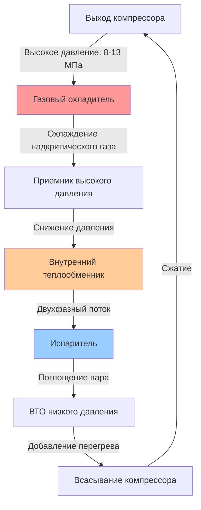
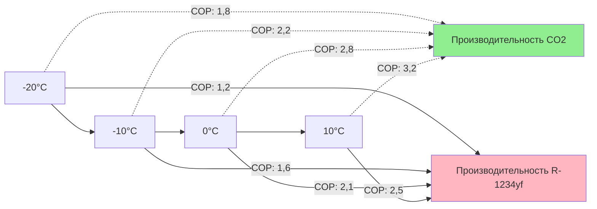

## Свойства диоксида углерода R-744

CO2 (R-744) работает как натуральный хладагент с уникальными термодинамическими свойствами, которые отличают его от обычных синтетических хладагентов в автомобильных приложениях.

**Характеристики критической точки:**

| Свойство | Значение | Сравнение с R-134a |
|----------|----------|----------------------|
| Критическая температура | 31,1°C (88°F) | 101,1°C (214°F) |
| Критическое давление | 7,38 МПа (1070 фунт/кв. дюйм) | 4,06 МПа (589 фунт/кв. дюйм) |
| Тройная точка | -56,6°C при 0,518 МПа | -103,3°C при 0,0039 кПа |
| ПГП (100 лет) | 1 | 1430 |
| ПОЗ | 0 | 0 |
| Воспламеняемость | A1 (невоспламеняющийся) | A1 (невоспламеняющийся) |

Критическая температура 31,1°C означает, что CO2 работает в трансритическом цикле при типичных условиях окружающей среды, что принципиально изменяет процесс отвода тепла с конденсации на охлаждение газа.

## Работа трансритического цикла CO2

Трансритический цикл работает выше критического давления при отводе тепла, устраняя изотермический процесс конденсации, характерный для подкритических систем.

**Зависимость давление-энтальпия:**

В надкритической области температура на выходе газового охладителя изменяется нелинейно с давлением. Оптимальное высокое давление максимизирует COP:

$$P_{opt} = 2,778 \cdot T_{gc,out} - 0,0065 \cdot T_{gc,out}^2$$

где $P_{opt}$ в МПа, а $T_{gc,out}$ — температура на выходе газового охладителя в °C (Liao et al., SAE 2000-01-0968).

Трансритический COP:

$$COP_{cooling} = \frac{h_1 - h_4}{h_2 - h_1}$$

где:
- $h_1$ = энтальпия на всасывании компрессора (кДж/кг)
- $h_2$ = энтальпия на выходе компрессора (кДж/кг)
- $h_4$ = энтальпия на входе расширительного клапана (кДж/кг)

## Конструктивные особенности при высоком давлении

Рабочие давления в системах CO2 значительно превышают давления в обычных автомобильных системах HVAC, что требует специализированной конструкции компонентов.

**Типичные рабочие давления:**

| Режим работы | Давление низкой стороны | Давление высокой стороны |
|----------------|-------------------|--------------------|
| Охлаждение (35°C окружающей среды) | 3,5-4,5 МПа (508-653 фунт/кв. дюйм) | 9-11 МПа (1305-1595 фунт/кв. дюйм) |
| Обогрев (-10°C окружающей среды) | 2,0-3,0 МПа (290-435 фунт/кв. дюйм) | 8-10 МПа (1160-1450 фунт/кв. дюйм) |
| Максимальное проектное | 5,5 МПа (798 фунт/кв. дюйм) | 14 МПа (2030 фунт/кв. дюйм) |

**Расчет толщины стенки трубки:**

Для высоконапорной трубки минимальная толщина стенки определяется по формуле:

$$t = \frac{P \cdot D}{2 \cdot \sigma_{allow} \cdot \eta - P}$$

где:
- $t$ = минимальная толщина стенки (мм)
- $P$ = максимальное рабочее давление (МПа)
- $D$ = внешний диаметр (мм)
- $\sigma_{allow}$ = допустимое напряжение (МПа)
- $\eta$ = коэффициент эффективности сварного соединения (обычно 1,0 для бесшовных)

Для медно-никелевой трубки, рассчитанной на 14 МПа с $\sigma_{allow}$ = 200 МПа и 8 мм наружный диаметр:

$$t = \frac{14 \cdot 8}{2 \cdot 200 \cdot 1,0 - 14} = \frac{112}{386} = 0,29 \text{ мм}$$

Практическая толщина стенки включает коэффициенты безопасности, обычно 1,0-1,5 мм для автомобильных приложений.

## Конструкция газового охладителя в сравнении с обычным конденсатором

Газовый охладитель заменяет конденсатор в трансритических системах CO2, работая принципиально по-другому из-за надкритического отвода тепла.

**Сравнение теплопередачи:**

| Параметр | Подкритический конденсатор | Надкритический газовый охладитель |
|-----------|----------------------|--------------------------|
| Процесс отвода тепла | Изотермическое фазовое изменение | Непрерывное изменение температуры |
| Приближение температуры | 3-8°C переохлаждения | 2-5°C приближение к окружающей среде |
| Коэффициент теплопередачи | 3000-5000 Вт/м²·K | 1500-3000 Вт/м²·K |
| Чувствительность к перепаду давления | Низкое воздействие на производительность | Критично для работы |
| Оптимальное управление | Перегрев/переохлаждение | Давление высокой стороны |

Мощность отвода тепла газовым охладителем:

$$\dot{Q}_{gc} = \dot{m} \cdot (h_{comp,out} - h_{gc,out}) = \dot{m} \cdot c_p \cdot \Delta T_{glide}$$

где удельная теплоемкость $c_p$ значительно изменяется в надкритической области, достигая максимальных значений у критической точки.

## Важность внутреннего теплообменника (ВТО)

ВТО критически важен в системах CO2, обеспечивая улучшение COP на 5-15% путем переохлаждения хладагента высокой стороны при одновременном перегреве всасывающего газа.

**Эффективность ВТО:**

$$\varepsilon_{IHX} = \frac{h_{gc,out} - h_{exp,in}}{h_{gc,out} - h_{evap,out}} = \frac{T_{gc,out} - T_{exp,in}}{T_{gc,out} - T_{evap,out}}$$

Типичная эффективность автомобильного CO2 ВТО находится в диапазоне от 0,6 до 0,8. Прирост производительности:

$$\Delta \dot{Q}_{evap} = \dot{m} \cdot (h_{exp,in,no-IHX} - h_{exp,in,with-IHX})$$

## Эффективность режима теплового насоса CO2

Системы CO2 демонстрируют превосходную производительность отопления в холодном климате по сравнению с R-134a или R-1234yf благодаря благоприятным термофизическим свойствам.

**COP отопления в холодную погоду:**

**COP отопления при -10°C окружающей среды:**

$$COP_{heating} = \frac{h_2 - h_3}{h_2 - h_1} = \frac{Q_{heating}}{W_{comp}}$$

Для типичного теплового насоса CO2 электромобиля при -10°C окружающей среды, подача воздуха в кабину 35°C:
- Выход компрессора: 90-100°C
- Мощность отопления: 3,5-5,0 кВ
- COP: 2,0-2,4
- Влияние на дальность: 15-20% в сравнении с электрическим нагревателем

## Оптимальное управление давлением высокой стороны

Трансритические системы CO2 требуют активного управления давлением высокой стороны для максимизации эффективности при различных условиях окружающей среды.

**Стратегии управления:**

| Метод | Реализация | Эффективность | Сложность |
|--------|----------------|------------|------------|
| Электронный расширительный клапан | Модуляция открытия клапана | Хорошая | Низкая |
| Компрессор переменного вытеснения | Регулировка потока хладагента | Лучше | Средняя |
| Управление вентилятором газового охладителя | Изменение расхода воздуха | Оптимальная | Средняя |
| Интегрированное управление | Все методы в комбинации | Оптимальная | Высокая |

Корреляция оптимального давления (Kim et al., SAE 2004-01-0450):

$$P_{opt} = a + b \cdot T_{gc,out} + c \cdot T_{evap,out}$$

Типичные коэффициенты для автомобильных приложений:
- $a$ = 0,8-1,2 МПа
- $b$ = 0,26-0,32 МПа/°C
- $c$ = 0,02-0,05 МПа/°C

## Экологические преимущества и соответствие нормативным требованиям

CO2 обеспечивает значительные экологические преимущества по сравнению с синтетическими хладагентами, обусловливая его внедрение на европейском и азиатском автомобильных рынках.

**Экологическое сравнение:**

| Хладагент | ПГП (AR5) | Заправка (кг) | Эквивалент CO2 (кг) | Соответствие Регламенту ЕС F-Gas |
|-------------|-----------|-------------|---------------------|---------------------|
| R-744 (CO2) | 1 | 0,7-1,2 | 0,7-1,2 | Полностью соответствует |
| R-1234yf | 4 | 0,5-0,8 | 2,0-3,2 | Соответствует |
| R-134a | 1430 | 0,6-1,0 | 858-1430 | Снятие с производства в 2017 г. |

Полный эквивалент потенциала глобального потепления (TEWI) включает прямые и косвенные выбросы:

$$TEWI = GWP \cdot L_{annual} \cdot n + GWP \cdot m \cdot (1-\alpha_{recovery}) + n \cdot E_{annual} \cdot \beta$$

где:
- $L_{annual}$ = годовой уровень утечки (кг/год)
- $n$ = срок службы системы (лет)
- $m$ = заправка хладагентом (кг)
- $\alpha_{recovery}$ = уровень извлечения в конце срока службы
- $E_{annual}$ = годовое энергопотребление (кВт·ч)
- $\beta$ = коэффициент выбросов CO2 (кг CO2/кВт·ч)

## Преимущества безопасности

Несмотря на высокие рабочие давления, CO2 предлагает преимущества безопасности как натуральный, нетоксичный, невоспламеняющийся хладагент (ASHRAE 34, класс A1).

**Характеристики безопасности:**

- Отсутствие риска воспламенения (в отличие от R-290, R-152a)
- Нетоксичен при концентрациях ниже 3% (30 000 ppm)
- Ароматизатор не требуется (обнаруживается человеком при 3-5%)
- Компоненты высокого давления проверены на давление в 2-3 раза выше рабочего
- Минимальное воздействие от случайного выброса (натуральный атмосферный компонент)
- Совместим со стандартными смазочными материалами (масла POE)

**Концентрация CO2 в кабине при полной утечке заправки:**

Для типичного салона пассажирского автомобиля объемом 3,5 м³ и заправки 1,0 кг CO2:

$$C_{CO2} = \frac{m_{refrigerant}}{V_{cabin} \cdot \rho_{air}} \times 10^6$$

$$C_{CO2} = \frac{1000 \text{ г}}{3,5 \text{ м}^3 \cdot 1,2 \text{ кг/м}^3} \times 10^6 = 238 000 \text{ ppm} = 23,8\%$$

Это превышает безопасные пределы (5% TWA), но быстрая вентиляция с открытыми окнами снижает концентрацию до безопасных уровней в течение 30-60 секунд. Современные системы включают обнаружение утечек и автоматическую активацию вентиляции.

## Спецификации компонентов системы CO2

**Требования к компрессору:**

- Тип: Наклонная шайба, спиральный или электрический спиральный
- Рабочий объем: 15-40 см³/об
- Максимальная скорость: 8000-12 000 об/мин
- Номинальное давление на выходе: минимум 14 МПа
- Эффективность: Изоэнтропная эффективность 0,65-0,75
- Смазка: Масло PAG или POE, заправка 120-200 см³

**Спецификации газового охладителя:**

- Конструкция сердечника: Алюминиевый микроканальный
- Диаметр трубки: 1,0-2,0 мм гидравлический диаметр
- Лицевая площадь: 0,3-0,5 м²
- Скорость на лицевой стороне со стороны воздуха: 2,5-4,0 м/с
- Отвод тепла: 5-12 кВ при расчетных условиях
- Допустимый перепад давления: 0,2-0,4 МПа со стороны хладагента

**Конструкция испарителя:**

- Тип: Пластинчато-реберный или микроканальный
- Производительность: 3-6 кВ охлаждения
- Температура испарения: -5–10°C
- Управление перегревом: 5-8°C на всасывании компрессора
- Защита от замерзания: Интеграция цикла разморозки
- Эффективность со стороны воздуха: 0,6-0,75

Эти спецификации позволяют системам CO2 обеспечивать эквивалентную или превосходящую производительность климатизации по сравнению с обычными хладагентами при одновременном предоставлении значительных экологических преимуществ и преимуществ отопления в холодную погоду, критически важных для сохранения дальности электромобилей.

---

**Ссылки:**
- SAE J2765: Процедура измерения системного COP мобильной системы кондиционирования воздуха на испытательном стенде
- SAE J2842: Оборудование для восстановления/переработки/перезарядки R-744 (CO2)
- Стандарт ASHRAE 34: Обозначение и классификация безопасности хладагентов
