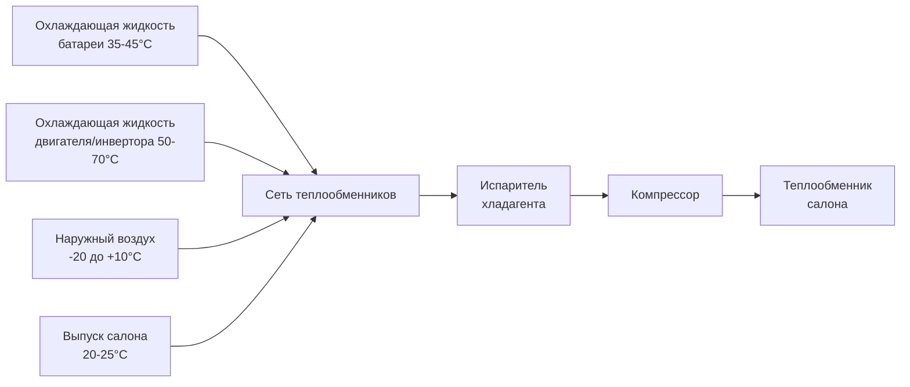
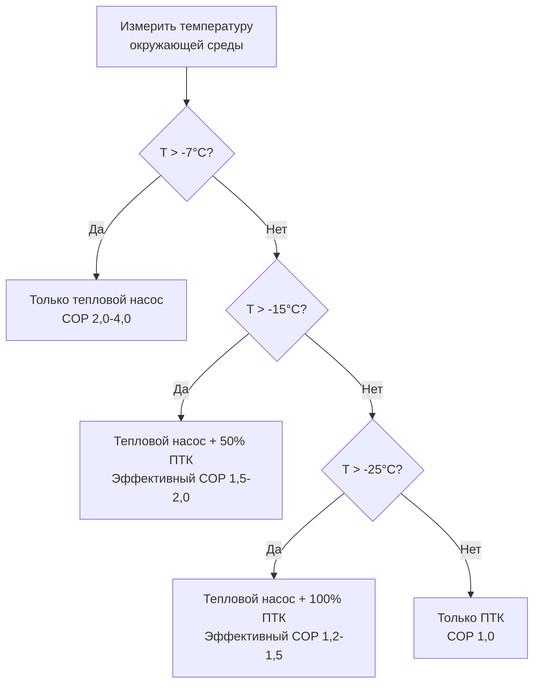

## Обратимый тепловой насос парокомпрессионного цикла

Тепловые насосы электромобилей используют обратимые холодильные циклы для обеспечения как обогрева, так и охлаждения салона одной системой, максимизируя энергетическую эффективность и расширяя дальность поездки. В отличие от обычного резистивного обогрева, тепловые насосы перемещают тепловую энергию, а не генерируют её через электрическое сопротивление.

### Фундаментальный принцип работы

Тепловой насос работает на цикле парокомпрессии с обратимым потоком хладагента, управляемым четырёхходовым клапаном. Коэффициент производительности (COP) количественно определяет эффективность:

$$COP_{heating} = \frac{Q_H}{W_{comp}}$$

Где $Q_H$ - тепловая мощность (кВ) и $W_{comp}$ - работа компрессора (кВ). Типичные тепловые насосы электромобилей достигают COP 2,5-4,0 при умеренных температурах окружающей среды, доставляя 2,5-4,0 кВ тепла на каждый кВ электрической энергии.

### Предел эффективности Карно

Теоретический максимальный COP режима обогрева следует эффективности цикла Карно:

$$COP_{Carnot} = \frac{T_H}{T_H - T_L}$$

Где $T_H$ - абсолютная температура конденсатора (К) и $T_L$ - абсолютная температура испарителя (К). Реальные системы достигают 40-60% эффективности Карно из-за необратимостей.

## Архитектура обратимого потока хладагента

Четырёхходовой переключающий клапан перенаправляет поток хладагента, переключая функции теплообменников между ролями конденсатора и испарителя. SAE J2765 предоставляет стандартизованные процедуры тестирования для валидации характеристик HVAC электромобилей.

## Системы тепловых насосов на CO2 (R-744)

Хладагент диоксид углерода предлагает преимущества для приложений электромобилей благодаря превосходной производительности при низких температурах и экологическим свойствам (ПГП=1, ПДС=0).

### Трансккритический цикл CO2

Тепловые насосы на CO2 работают в трансккритическом цикле при температурах окружающей среды выше критической точки (31,1°C, 73,8 бар). Отвод тепла происходит выше критического давления:

$$Q_{gc} = \dot{m} \cdot (h_{gc,out} - h_{gc,in})$$

Где $\dot{m}$ - массовый расход хладагента, $h_{gc,out}$ и $h_{gc,in}$ - удельные энтальпии на выходе и входе газоохладителя (кДж/кг).

### Преимущество при низких температурах

CO2 поддерживает более высокое давление насыщенного пара при низких температурах по сравнению с R-134a или R-1234yf:

| Хладагент | Давление пара при -20°C | Давление пара при 0°C |
|-----------|--------------------------|----------------------|
| R-744 (CO2) | 19,7 бар | 34,9 бар |
| R-134a | 1,06 бар | 2,93 бар |
| R-1234yf | 0,96 бар | 2,73 бар |

Более высокое давление пара обеспечивает эффективное сжатие и тепловой насос при температурах ниже нуля, где обычные хладагенты испытывают затруднения.

## Интеграция рекуперации тепла

Современные тепловые насосы электромобилей интегрируют несколько источников тепла для максимизации COP и минимизации расхода батареи:

### Эффективность рекуперации тепла

Эффективность теплообменника количественно определяет производительность рекуперации отходящего тепла:

$$\varepsilon = \frac{Q_{actual}}{Q_{max}} = \frac{\dot{m}_c c_{p,c}(T_{c,in} - T_{c,out})}{\dot{m}_{min} c_p (T_{c,in} - T_{r,in})}$$

Где индексы $c$ и $r$ обозначают потоки охлаждающей жидкости и хладагента. Типичная эффективность в диапазоне 0,6-0,8 для компактных паяных пластинчатых теплообменников.

## Характеристики при низких температурах

COP теплового насоса снижается при уменьшении температуры окружающей среды из-за увеличения температурного перепада и снижения мощности испарителя:

| Температура окружающей среды | COP обогрева | Тепловая мощность | Примечания |
|------------------------------|--------------|-------------------|-----------|
| +10°C | 3,5-4,0 | 4,5-5,5 кВ | Оптимальная производительность |
| 0°C | 2,5-3,2 | 3,5-4,5 кВ | Хорошая эффективность сохранена |
| -10°C | 1,8-2,5 | 2,5-3,5 кВ | Умеренное снижение |
| -20°C | 1,2-1,8 | 1,5-2,5 кВ | Значительная потеря мощности |
| -30°C | 0,8-1,2 | 0,8-1,5 кВ | Требуется дополнительный обогрев |

Значения производительности в соответствии с протоколами тестирования в установившемся режиме SAE J2765.

### Физика снижения мощности

Мощность испарителя уменьшается с температурой из-за снижения плотности и разницы энтальпии:

$$Q_{evap} = \dot{m} \cdot (h_{evap,out} - h_{evap,in}) = \rho \cdot \dot{V} \cdot \Delta h$$

Более низкие температуры воздуха снижают как плотность хладагента $\rho$, так и изменение энтальпии $\Delta h$, требуя более высоких объёмных расходов $\dot{V}$ или дополнительного обогрева.

## Интеграция дополнительного обогрева

Ниже температуры баланса (обычно -7 до -10°C) мощность теплового насоса становится недостаточной, требуя дополнительного обогрева:

### Резервный ПТК нагреватель

Керамические нагреватели с положительным температурным коэффициентом обеспечивают быстрый отклик нагрева:

$$Q_{PTC} = \frac{V^2}{R(T)} = V \cdot I$$

Где сопротивление $R(T)$ увеличивается с температурой, обеспечивая саморегулирующееся поведение. ПТК нагреватели работают с COP=1,0, но обеспечивают адекватный обогрев при экстремальных температурах.

### Гибридная стратегия управления

Оптимальное управление минимизирует использование ПТК при сохранении комфорта салона в соответствии с критериями теплового комфорта SAE J2765.

## Энергетическая эффективность в сравнении с ПТК нагревателями

### Сравнительное потребление энергии

При нагреве мощностью 3 кВ в течение 1 часа эксплуатации:

| Тип системы | Температура окружающей среды | COP | Необходимая энергия | Влияние на дальность |
|-------------|-------------------------------|-----|----------------------|----------------------|
| Тепловой насос | +5°C | 3,5 | 0,86 кВч | Минимальное |
| Тепловой насос | -5°C | 2,3 | 1,30 кВч | Умеренное |
| Тепловой насос | -15°C | 1,6 | 1,88 кВч | Значительное |
| ПТК нагреватель | Любая | 1,0 | 3,00 кВч | Максимальное |

Системы тепловых насосов снижают потребление энергии HVAC на 40-70% по сравнению с ПТК нагревателями при типичных зимних температурах.

### Расчёт увеличения дальности

Для батареи 60 кВч с запасом хода 250 км по EPA:

$$\Delta Range = \frac{(E_{PTC} - E_{HP}) \cdot t_{drive}}{E_{battery}} \cdot Range_{EPA}$$

Работа теплового насоса в сравнении с ПТК в течение 2-часовой поездки при 0°C:
- Экономия энергии: $(3,0 - 1,3) \times 2 = 3,4$ кВч
- Увеличение дальности: $\frac{3,4}{60} \times 250 = 14,2$ км

Системы тепловых насосов могут расширить зимний запас хода на 10-20% по сравнению с только резистивным обогревом.

## Соображения конструкции системы

Ключевые инженерные параметры конструкции теплового насоса электромобиля:

**Выбор компрессора**: Компрессор переменной производительности спирального типа или электрический компрессор с диапазоном рабочих оборотов 2000-8000 об/мин, модуляция мощности 20-100%.

**Заправка хладагентом**: Критическая оптимизация для трансккритических систем CO2; обычно 800-1200 г для легковых автомобилей.

**Определение размеров теплообменника**: Площадь наружного теплообменника 0,8-1,2 м², внутреннего 0,4-0,6 м² с улучшенной геометрией оребрения для устойчивости к обледенению.

**Архитектура управления**: Прогнозное управление моделью (MPC) с циклом обновления 30 секунд, интегрирующее управление тепловым режимом батареи и предварительное кондиционирование салона.

SAE J2765 и SAE J2953 устанавливают стандартизованные процедуры тестирования для валидации тепловых характеристик и измерения потребления энергии.
