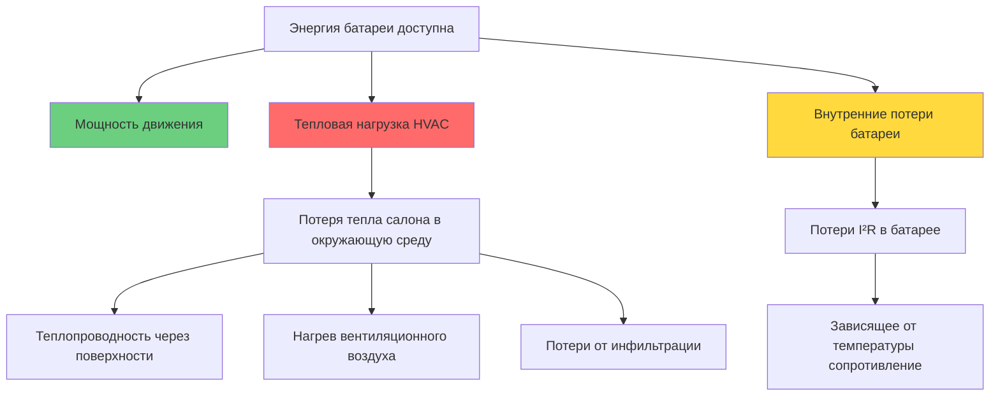
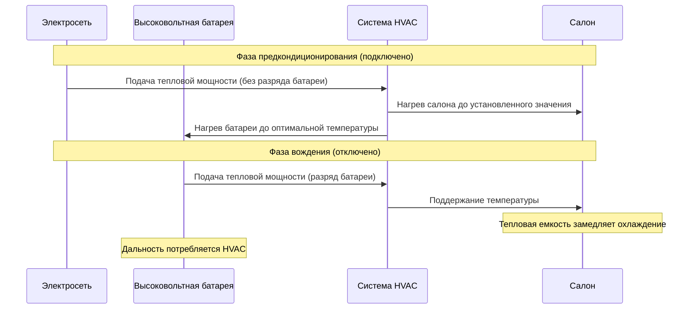

Системы HVAC электромобилей представляют наибольшее вспомогательное потребление энергии батареи после приведения в движение, принципиально ограничивая запас хода прямым расходом энергии. В отличие от автомобилей с двигателями внутреннего сгорания, которые используют отходящее тепло двигателя, EV должны генерировать тепловую энергию из электроэнергии, накопленной в батарее, создавая прямой компромисс между комфортом салона и дальностью поездки транспортного средства.

## Потребление энергии системой отопления

Резистивные нагревательные элементы в EV потребляют **3-6 кВт** электрической мощности при стационарном отоплении салона, пиковые нагрузки достигают 8 кВт при холодном пуске. Это потребление мощности напрямую сокращает доступную энергию для движения.

Мгновенное влияние на дальность можно количественно оценить через энергетический баланс:

$$P_{\text{total}} = P_{\text{propulsion}} + P_{\text{HVAC}} + P_{\text{accessories}}$$

Для транспортного средства, движущегося на скорости шоссе (30 м/с) с базовой эффективностью 250 Вт·ч/км:

$$\text{Range}_{\text{HVAC on}} = \frac{E_{\text{battery}}}{P_{\text{propulsion}} + P_{\text{HVAC}}} \times v$$

Где $E_{\text{battery}}$ — полезная емкость батареи (кВт·ч), $v$ — скорость, силовые характеристики указаны в кВт.

### Снижение дальности в холодную погоду

Полевые данные испытаний SAE J2951 демонстрируют **снижение дальности на 30-50%** при температурах ниже -7°C по сравнению с базовыми условиями 23°C. Это снижение результат трех связанных механизмов:

| Температура | Снижение дальности | Основные факторы |
|-------------|-----------------|-----------------|
| 10°C до 0°C | 15-20% | Умеренная тепловая нагрузка, увеличение сопротивления батареи |
| 0°C до -10°C | 25-35% | Высокая тепловая нагрузка (4-6 кВт), повышенный импеданс батареи |
| Ниже -10°C | 35-50% | Максимальная тепловая нагрузка (6-8 кВт), значительная деградация батареи |

Тепловая нагрузка салона следует принципам нестационарной теплопередачи:

$$Q_{\text{heating}} = UA(T_{\text{cabin}} - T_{\text{ambient}}) + \dot{m}c_p(T_{\text{cabin}} - T_{\text{ambient}})$$

Где $UA$ представляет общую теплопроводность оболочки салона (обычно 50-80 Вт/К), а $\dot{m}$ — расход массы вентиляционного воздуха.

## Системы тепловых насосов: преимущества эффективности

Системы тепловых насосов достигают значений коэффициента производительности (COP) 2-3 в умеренных условиях, снижая потребление электроэнергии по сравнению с резистивным отоплением:

$$\text{COP} = \frac{Q_{\text{delivered}}}{W_{\text{electrical}}}$$

Тепловой насос, подающий 4 кВт тепла в салон при COP = 2,5, потребляет всего 1,6 кВт электрической мощности, по сравнению с 4 кВт для резистивного отопления. Это снижение мощности на 60% преобразуется в пропорциональное увеличение дальности.

Однако производительность тепловых насосов значительно снижается ниже -10°C, поскольку ограничения по давлению насыщения хладагента становятся ограничивающим фактором, а образование льда на наружных змеевиках требует циклов оттаивания. Соотношение эффективного COP следует:

$$\text{COP}_{\text{actual}} = \text{COP}_{\text{ideal}} \times \eta_{\text{compressor}} \times \eta_{\text{defrost}} \times \eta_{\text{cycle}}$$

## Потребление энергии системой охлаждения

Системы кондиционирования воздуха потребляют **1-3 кВт** во время работы охлаждения, что представляет более скромное влияние на дальность, чем отопление. При нагрузке компрессора 65 кПа и температуре окружающей среды 25°C типичное снижение дальности составляет **10-20%**.

| Условие эксплуатации | Потребление переменного тока | Влияние на дальность |
|---------------------|---------------|--------------|
| Режим рециркуляции, умеренная температура окружающей среды | 1,0-1,5 кВт | 10-15% |
| Режим свежего воздуха, высокая температура (>35°C) | 2-3 кВт | 15-20% |
| Макс. кондиционирование при тепловой нагрузке | 3-4 кВт (пик) | 20-25% (переходный) |

Эффективность цикла охлаждения определяет требуемую мощность охлаждения:

$$\text{EER} = \frac{Q_{\text{cooling}}}{W_{\text{compressor}}}$$

Современные системы кондиционирования EV достигают значений коэффициента энергоэффективности (EER) 8-12 BTU/Вт·ч (2,3-3,5 В/В) при номинальных условиях.

## Стратегия предкондиционирования

Предкондиционирование во время подключения к сетевой электросети исключает штраф дальности HVAC на начальных этапах вождения. Тепловая емкость салона и аккумуляторного модуля определяет эффективность предкондиционирования:

$$Q_{\text{stored}} = mc_p\Delta T$$

Для типичного салона с эффективной тепловой массой 150 кг и удельной теплоемкостью 1000 Дж/кг·К предварительный нагрев от -10°C до 20°C накапливает:

$$Q_{\text{stored}} = 150 \times 1000 \times 30 = 4,5 \text{ МДж} = 1,25 \text{ кВт·ч}$$

Эта накопленная тепловая энергия задерживает начало работы питаемого батареей отопления, увеличивая эффективную дальность во время коротких поездок.

## Стратегии управления энергией

Передовые системы теплового управления используют иерархические стратегии управления для минимизации потребления энергии HVAC:

1. **Приоритизация зонального отопления**: подача нагретого воздуха только в занятые зоны, снижение среднего значения установленной температуры в салоне на 3-5°C
2. **Предпочтение поверхностного нагрева**: использование подогревов сиденья (50-100 Вт) и подогревов рулевого колеса (30-50 Вт) для поддержания теплового комфорта занимающихся при более низких температурах воздуха
3. **Эксплуатация в режиме Eco**: снижение скорости вентилятора и допуск более широких температурных гистерезисов (±2°C вместо ±0,5°C)
4. **Предсказательное тепловое управление**: предварительное охлаждение или предварительный нагрев на основе данных маршрута навигации и прогноза температуры окружающей среды

Относительная эффективность локализованных методов нагрева демонстрирует значительную экономию энергии:

| Метод нагрева | Потребление мощности | Эквивалентное повышение температуры воздуха |
|----------------|-------------------|-------------------------------------|
| Нагрев воздуха в салоне | 4000 Вт | 20°C → 22°C (весь салон) |
| Подогрев сидений (оба передних) | 150 Вт | Эквивалент теплового комфорта +3°C воздуха |
| Подогрев рулевого колеса | 40 Вт | Комфорт рук поддерживается |
| Лучистый панельный нагрев | 800 Вт | Зона занимающихся эквивалентна +4°C воздуха |

Эти локализованные стратегии обеспечивают тепловой комфорт, потребляя на 85-95% меньше мощности, чем полный нагрев воздуха салона, напрямую преобразуясь в пропорциональное увеличение дальности при эксплуатации в холодную погоду.

## Компоненты

- Потребление энергии HVAC
- Снижение дальности при отоплении
- Снижение дальности при охлаждении
- Эффективность климат-контроля
- Климат-контроль в режиме Eco
- Эффективность подогрева сидений
- Подогрев рулевого колеса
- Лучистый нагрев салона
- Стратегии зонального отопления
- Предкондиционирование во время зарядки
