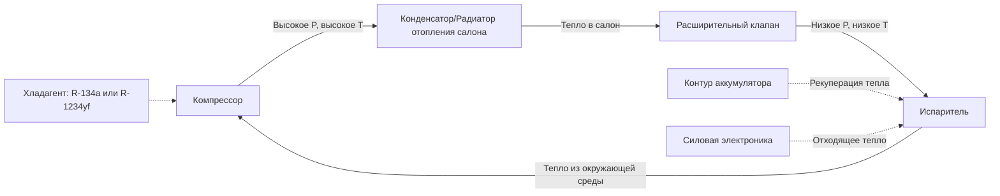

Автомобильные системы отопления обеспечивают тепловой комфорт пассажиров транспортного средства с использованием трёх основных технологий: отопление на основе охлаждающей жидкости двигателя, электронагреватели с положительным температурным коэффициентом (PTC) и системы тепловых насосов. Основная сложность автомобильного отопления отличается от стационарных приложений HVAC из-за переходных режимов работы, ограниченной доступности энергии и строгих ограничений по размещению оборудования.

## Отопление на основе охлаждающей жидкости двигателя

### Принципы работы

Традиционные автомобили с двигателем внутреннего сгорания (ДВС) используют избыточное тепло из системы охлаждения двигателя. Тепловой поток включает:

1. **Генерация тепла** в камере сгорания и на поверхностях трения
2. **Поглощение тепла охлаждающей жидкостью** из отходящего тепла двигателя
3. **Принудительная конвекция** через радиатор отопления
4. **Теплопередача со стороны воздуха** в воздух салона

Доступная теплоотдача от охлаждающей жидкости определяется соотношением:

$$Q_{available} = \dot{m}_c \cdot c_{p,c} \cdot (T_{engine} - T_{return})$$

Где:
- $Q_{available}$ = доступная теплоотдача (Вт)
- $\dot{m}_c$ = расход охлаждающей жидкости (кг/с)
- $c_{p,c}$ = удельная теплоёмкость охлаждающей жидкости, типично 3,5–4,0 кДж/(кг·К) для смесей этиленгликоля
- $T_{engine}$ = температура выхода двигателя (85–95°C)
- $T_{return}$ = температура возврата радиатора отопления (°C)

### Производительность радиатора отопления

Радиатор отопления функционирует как теплообменник жидкость-воздух, обычно с конструкцией трубок и ребер типа змеевик. Метод эффективности-NTU характеризует производительность:

$$\epsilon = \frac{Q_{actual}}{Q_{max}} = \frac{1 - e^{-NTU(1-C_r)}}{1 - C_r \cdot e^{-NTU(1-C_r)}}$$

Где $C_r$ — коэффициент отношения тепловых мощностей, $NTU$ — число единиц передачи. Типичные радиаторы отопления достигают $\epsilon$ = 0,65–0,80 с коэффициентами теплопередачи со стороны воздуха 40–80 Вт/(м²·К).

**Критические параметры проектирования:**

| Параметр | Типичный диапазон | Влияние на проектирование |
|----------|-------------------|--------------------------|
| Площадь поверхности радиатора | 0,15–0,30 м² | Компромисс падения давления и мощности |
| Плотность оребрения | 8–12 рёбер/дюйм | Теплопередача против сопротивления потоку воздуха |
| Расход охлаждающей жидкости | 10–20 л/мин | Мощность насоса против времени отклика |
| Скорость воздуха | 3–8 м/с | Шум против коэффициента теплопередачи |

### Проблема холодного пуска

Основным ограничением отопления на основе охлаждающей жидкости является тепловая инерция при холодном пуске. Время прогрева двигателя следует экспоненциальному соотношению:

$$T_{engine}(t) = T_{ambient} + (T_{operating} - T_{ambient})(1 - e^{-t/\tau})$$

Где $\tau$ — постоянная времени системы (типично 5–15 минут в зависимости от условий окружающей среды и цикла вождения). Это задержание вызывает дискомфорт у пассажиров в течение первых 5–10 минут работы.

## Электронагреватели PTC

### Физика материалов PTC

Электронагреватели с положительным температурным коэффициентом используют керамические материалы (обычно титанат бария), которые проявляют резко возрастающее электрическое сопротивление выше точки Кюри. Такое саморегулирующееся поведение предотвращает перегрев без внешних органов управления.

Зависимость удельного сопротивления от температуры следует:

$$\rho(T) = \rho_0 \cdot e^{\beta(T - T_c)}$$

Где $T_c$ — температура Кюри (типично 60–120°C для автомобильных приложений), $\beta$ — материальный температурный коэффициент.

### Подача мощности и управление

Нагреватели PTC обеспечивают немедленный выход тепла без задержки прогрева двигателя. Типичные автомобильные системы PTC доставляют 2–6 кВт посредством нескольких нагревательных элементов, активируемых поэтапно на основе спроса на отопление.

**Спецификации нагревателя PTC:**

| Характеристика | Диапазон | Примечания |
|----------------|----------|-----------|
| Мощность | 2–6 кВт | Поэтапная активация (1–3 кВт за этап) |
| Рабочее напряжение | 200–400 VDC | Только высоковольтные системы |
| Температура поверхности | 180–220°C | Саморегулирование через PTC эффект |
| Тепловой отклик | <30 сек | Почти мгновенный по сравнению с охлаждающей жидкостью |
| Эффективность | 95–98% | Эффективность резистивного нагрева |

Основное ограничение — потребление электроэнергии. Для аккумуляторного электромобиля (BEV) энергия отопления прямо снижает дальность пробега:

$$\Delta Range = \frac{P_{heater} \cdot t_{operation}}{E_{battery}} \cdot Range_{total}$$

Нагреватель PTC мощностью 3 кВт, работающий 1 час, потребляет 3 кВт·ч, что может снизить дальность пробега на 15–25 км в типичном электромобиле.

## Системы тепловых насосов для электромобилей и гибридов

### Термодинамические преимущества

Тепловые насосы переносят тепловую энергию из окружающего воздуха (или компонентов трансмиссии) в салон, обеспечивая отопление с коэффициентом производительности (COP), значительно превышающим единицу:

$$COP_{heating} = \frac{Q_{heating}}{W_{compressor}} = \frac{T_{condensing}}{T_{condensing} - T_{evaporating}}$$

Для теплового насоса, работающего при $T_{condensing}$ = 50°C (323 K) и $T_{evaporating}$ = 0°C (273 K), идеальный COP Карно = 6,46. Реальные системы достигают COP = 2,0–3,5 в зависимости от условий окружающей среды.

**Сравнение теплового насоса с PTC:**

| Условие | COP теплового насоса | Экономия энергии vs PTC |
|---------|----------------------|------------------------|
| +10°C окружающая среда | 3,0–3,5 | Снижение на 65–70% |
| 0°C окружающая среда | 2,2–2,8 | Снижение на 55–65% |
| -10°C окружающая среда | 1,5–2,0 | Снижение на 33–50% |
| -20°C окружающая среда | 1,0–1,5 | Снижение на 0–33% |

### Архитектура системы

Современные тепловые насосы электромобилей используют несколько источников тепла:

- **Окружающий воздух** (первичный источник)
- **Отходящее тепло аккумулятора** (во время зарядки/разряда)
- **Контур охлаждения силовой электроники** (инвертор, мотор, зарядное устройство)
- **Рекуперация выхлопного тепла** (для гибридных автомобилей)

### Производительность при низких температурах

Мощность теплового насоса снижается при низких температурах окружающей среды из-за:

1. **Уменьшение расхода хладагента** из-за более низкого давления испарения
2. **Увеличение коэффициента сжатия**, снижающее объёмную эффективность
3. **Образование льда** на наружном батареннике, требующее циклов оттайки

Ниже -10°C большинство систем дополняют нагревателем PTC или полностью переходят на резистивное отопление. Стандарт SAE J2765 определяет процедуры испытаний для оценки производительности автомобильного теплового насоса в диапазоне условий окружающей среды.

## Стратегии управления температурой

### Модуляция смесительной заслонки

Управление температурой салона в автомобилях с ДВС обычно использует смесительную заслонку, которая смешивает нагретый воздух из радиатора отопления с воздухом обхода:

$$T_{supply} = T_{heater} \cdot x + T_{bypass} \cdot (1-x)$$

Где $x$ — положение смесительной заслонки (0 = полностью холод, 1 = полностью горячо). Это обеспечивает пропорциональное управление без модуляции расхода охлаждающей жидкости.

### Реализация ПИД управления

Современные автомобильные системы HVAC используют ПИД (пропорционально-интегрально-дифференциальное) управление со следующей структурой:

$$u(t) = K_p \cdot e(t) + K_i \int_0^t e(\tau)d\tau + K_d \frac{de(t)}{dt}$$

Где $e(t) = T_{setpoint} - T_{cabin}$ — ошибка температуры. Типичные параметры настройки для автомобильных приложений:
- $K_p$ = 0,5–1,5 (коэффициент пропорциональности)
- $K_i$ = 0,1–0,3 (коэффициент интегрирования)
- $K_d$ = 0,05–0,15 (коэффициент дифференцирования)

### Тепловое моделирование салона

Точное управление требует моделирования салона как тепловой системы:

$$C_{cabin} \frac{dT_{cabin}}{dt} = Q_{HVAC} - UA(T_{cabin} - T_{ambient}) - Q_{solar} - Q_{occupants}$$

Где:
- $C_{cabin}$ = тепловая ёмкость воздуха салона и внутренних поверхностей (кДж/К)
- $UA$ = произведение коэффициента теплопередачи на площадь (Вт/К)
- $Q_{solar}$ = поступление солнечного тепла через остекление (Вт)
- $Q_{occupants}$ = метаболическое тепло от пассажиров (~100 Вт на человека)

## Требования к тепловому комфорту пассажиров

### Метрики теплового комфорта

Автомобильный тепловой комфорт выходит за пределы температуры воздуха и включает:

- **Среднюю температуру излучения** от нагретых солнцем поверхностей
- **Скорость воздуха** на уровне пассажира (предпочтительно 0,2–0,5 м/с)
- **Относительную влажность** (оптимально 40–60%)
- **Температуры поверхностей** контактируемых материалов (руль, сиденья)

Стандарт SAE J2765 определяет процедуры оценки комфорта, включая:
- Тест выдержки при 35°C окружающей среды
- Измерение скорости охлаждения
- Распределение температуры в установившемся режиме

### Целевые показатели производительности отопления

Отраслевые эталоны производительности отопления:

| Метрика | Цель | Условие испытания |
|---------|------|------------------|
| Время прогрева до 20°C | <10 минут | -18°C окружающая среда, запуск двигателя |
| Температура подаваемого воздуха | 50–70°C | Максимальный спрос на отопление |
| Равномерность температуры | ±2°C | Между передними левой/правой зонами |
| Время очистки лобового стекла | <5 минут | -18°C окружающая среда, SAE J902 |

Требование к очистке стекла часто определяет размер радиатора отопления из-за большой площади остекления и высокого коэффициента теплопередачи лобовых стёкол (U ≈ 5–6 Вт/(м²·К) для современного многослойного стекла).

## Заключение

Проектирование автомобильной системы отопления представляет сложную оптимизацию энергетической эффективности, теплового комфорта и стоимости. Системы охлаждающей жидкости двигателя обеспечивают нулевые дополнительные энергетические затраты, но страдают от задержки прогрева. Нагреватели PTC обеспечивают мгновенное тепло, но потребляют значительную электроэнергию. Тепловые насосы обеспечивают превосходную эффективность в умеренном климате, но требуют дополнительного отопления в экстремальном холоде. Тенденция к электрификации транспортных средств продолжает стимулировать инновации в технологии тепловых насосов и решениях по накоплению тепловой энергии для минимизации влияния на дальность пробега при сохранении комфорта пассажиров во всех условиях эксплуатации.
