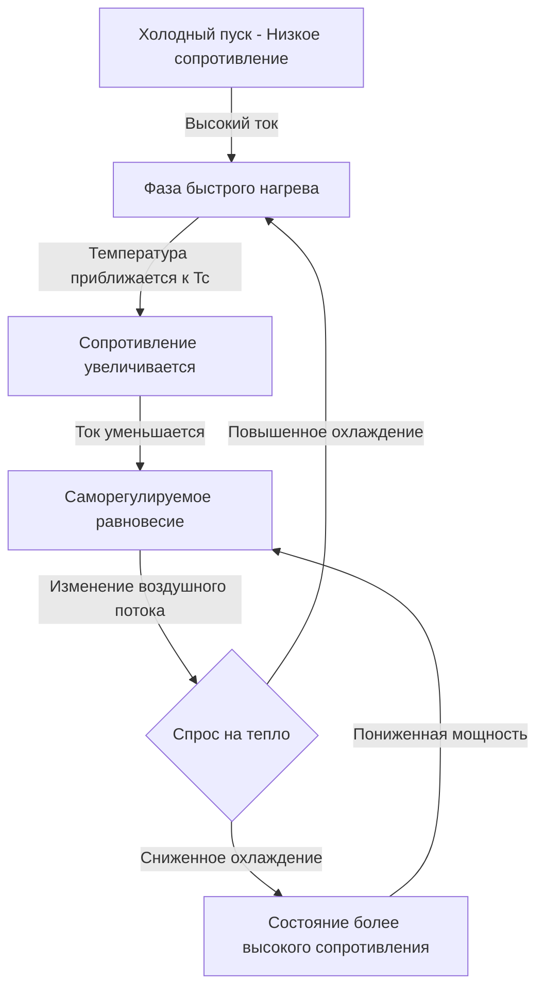

Системы электрического отопления стали важнейшими компонентами современных автомобильных систем HVAC, особенно для аккумуляторных электромобилей (BEV) и подключаемых гибридных электромобилей (PHEV), которым не хватает избыточного тепла от двигателей внутреннего сгорания. Эти системы обеспечивают мгновенное отопление салона посредством прямого преобразования электрической энергии, работая при напряжениях от 12 В постоянного тока для дополнительных приложений до 800 В постоянного тока в высокопроизводительных архитектурах EV.

## Физические принципы электрического отопления

Электрическое отопление в автомобильных приложениях основано на нагреве Джоуля, где электрический ток, проходящий через резистивный элемент, генерирует тепловую энергию в соответствии с:

$$P = I^2 R = \frac{V^2}{R}$$

Где $P$ — рассеиваемая мощность в виде тепла (Вт), $I$ — ток (А), $R$ — сопротивление (Ом), а $V$ — приложенное напряжение (В). Произведенная тепловая энергия непосредственно нагревает воздушный поток, проходящий над поверхностью элемента, при передаче тепла, управляемой принудительной конвекцией:

$$Q = h \cdot A \cdot (T_s - T_{\infty})$$

Где $Q$ — скорость конвективной передачи тепла (Вт), $h$ — коэффициент конвективной передачи тепла (Вт/м²·К), $A$ — площадь поверхности (м²), $T_s$ — температура поверхности (К), а $T_{\infty}$ — температура воздушного потока (К). Коэффициент $h$ сильно зависит от скорости воздуха и обычно находится в диапазоне 25-250 Вт/м²·К для приложений автомобильного HVAC.

## Технология нагревателей PTC

Нагреватели с положительным температурным коэффициентом (PTC) используют керамические полупроводниковые материалы (обычно титанат бария, легированный редкоземельными элементами), которые демонстрируют экспоненциально возрастающее сопротивление с температурой. Эта саморегулирующаяся характеристика обеспечивает неотъемлемую тепловую безопасность и модуляцию мощности.

### Поведение материала PTC

Соотношение между сопротивлением и температурой следует:

$$R(T) = R_0 \cdot e^{\beta(T - T_c)}$$

Где $R_0$ — базовое сопротивление (Ом), $\beta$ — материальная константа (К⁻¹), $T$ — рабочая температура (К), а $T_c$ — температура Кюри (К). По мере того, как элемент PTC нагревается выше $T_c$, сопротивление резко увеличивается, ограничивая ток и предотвращая тепловой разгон.

### Конструкция элемента PTC

Современные автомобильные нагреватели PTC состоят из нескольких керамических пластин, расположенных между алюминиевыми ребрами теплообменника. Узел обеспечивает:

- **Электрический контакт**: Проводящие электроды, приклеенные к граням керамики PTC
- **Усиление теплопередачи**: Расширенные ребристые поверхности увеличивают конвективную площадь
- **Структурная целостность**: Рамы сжатия поддерживают давление контакта
- **Электрическая изоляция**: Изолирующие слои предотвращают короткие замыкания на корпус

Типичные размеры пластины PTC варьируются от 15-25 мм в квадрате с толщиной 3-5 мм. Спецификации температуры переключения ($T_c$) варьируются от 120°C до 280°C в зависимости от требований приложения в соответствии с SAE J2842.

## Высоковольтные системы отопления

Аккумуляторные электромобили используют высоковольтные системы отопления (200-800 В постоянного тока) для минимизации требований к току и резистивных потерь в проводке распределения. Мощность масштабируется с напряжением в соответствии с $P = V \cdot I$, обеспечивая компактные, легкие конструкции.

### Сравнение архитектур напряжения

| Системное напряжение | Типичная мощность | Ток потребления | Сечение кабеля | Приложение |
|----------------|---------------|--------------|-------------|-------------|
| 12 В постоянный ток | 150-300 Вт | 12-25 А | 10-12 AWG | Подогревы сидений, зеркала |
| 48 В постоянный ток | 1-2 кВт | 20-40 А | 6-8 AWG | Мягкие гибриды, дополнительный |
| 400 В постоянный ток | 5-7 кВт | 12-18 А | 10-12 AWG | Первичное отопление BEV/PHEV |
| 800 В постоянный ток | 7-10 кВт | 9-12 А | 12-14 AWG | Высокопроизводительный BEV |

Работа при более высоком напряжении снижает потери $I^2 R$ в проводке распределения. Для нагревателя мощностью 5 кВт потери в кабеле при 400 В против 12 В:

При 400 В: $I = 5000/400 = 12,5$ А, потеря в кабеле (0,01 Ом) = $12,5^2 \times 0,01 = 1,56$ Вт

При 12 В: $I = 5000/12 = 417$ А, потеря в кабеле (0,001 Ом) = $417^2 \times 0,001 = 174$ Вт

Система 400 В снижает потери проводки на 99% при обеспечении проводников меньшего размера.

## Потребление мощности и производительность отопления

Эффективность электрического отопления принципиально ограничена преобразованием химической энергии (батареи) в тепловую энергию. Коэффициент производительности (COP) для чистого резистивного отопления составляет:

$$\text{COP} = \frac{Q_{\text{out}}}{W_{\text{in}}} \approx 1,0$$

Это контрастирует с тепловыми насосами, достигающими значений COP 2-4. Однако электрические нагреватели обеспечивают преимущества в:

- **Мгновенный отклик**: Нет задержки прогрева (< 30 секунд до полной мощности)
- **Простота**: Меньше компонентов, чем в системах тепловых насосов
- **Низкотемпературная работоспособность**: Эффективная работа ниже -20°C, где тепловые насосы теряют производительность
- **Стоимость**: Более низкая начальная стоимость системы

Типичные тепловые нагрузки для пассажирских автомобилей варьируются от 3-7 кВт в зависимости от условий окружающей среды и объема салона. Потребление энергии напрямую влияет на дальность поездки в BEV:

$$\Delta \text{Дальность} = \frac{P_{\text{heat}} \cdot t}{\text{Емкость батареи} \times \text{Эффективность}} \times \text{EPA дальность}$$

Эксплуатация нагревателя мощностью 5 кВт в течение 1 часа в BEV емкостью 75 кВтч (480 км дальность) снижает дальность примерно на:

$$\Delta \text{Дальность} = \frac{5 \times 1}{75 \times 0,9} \times 480 = 35 \text{ км}$$

## Характеристики теплового отклика

Системы электрического отопления обеспечивают быстрый тепловой отклик по сравнению с отоплением на основе двигателя. Временная постоянная для повышения температуры в салоне следует динамике первого порядка:

$$T_{\text{cabin}}(t) = T_{\infty} + (T_0 - T_{\infty}) \cdot e^{-t/\tau}$$

Где $\tau$ — постоянная времени теплопередачи (с), $T_0$ — начальная температура (°C), а $T_{\infty}$ — температура в установившемся состоянии (°C). Постоянная времени зависит от:

$$\tau = \frac{m \cdot c_p}{h \cdot A + \dot{m}_{\text{air}} \cdot c_{p,\text{air}}}$$

Где $m$ — тепловая масса салона (кг), $c_p$ — удельная теплоемкость (Дж/кг·К), а $\dot{m}_{\text{air}}$ — скорость вентиляции (кг/с). Типичные автомобильные салоны демонстрируют постоянные времени 300-600 секунд.

## Стратегии применения в гибридных и электромобилях

Современные электрифицированные транспортные средства используют сложные стратегии отопления для баланса комфорта и эффективности:

**Аккумуляторные электромобили (BEV)**:
- Высоковольтные нагреватели PTC в качестве первичного источника тепла (5-7 кВт)
- Системы тепловых насосов для мягких условий (повышение общей эффективности)
- Резистивное отопление для экстремального холода (гарантированная производительность)
- Тепловое предварительное кондиционирование батареи при зарядке

**Подключаемые гибридные электромобили (PHEV)**:
- Дополнительное электрическое отопление при работе в режиме EV
- Отопление охлаждающей жидкости двигателя при работе ICE
- Смешанные стратегии управления, оптимизирующие топливо в сравнении с электрической энергией

**Мягкие гибриды (48 В)**:
- Дополнительное отопление для ускорения прогрева
- Снижение неработающего двигателя для отопления салона
- Повышенная производительность размораживания

В соответствии с SAE J2954 и J2907 системы электрического отопления должны координироваться с управлением тепловыми процессами батареи, чтобы предотвратить чрезмерные темпы разряда во время работы в холодную погоду. Современные системы реализуют упреждающее предварительное кондиционирование салона при подключении к сетевому питанию, минимизируя влияние на дальность.

Фундаментальный компромисс при электрическом отоплении транспортных средств остается энергетической плотностью: бензин содержит 12,5 кВтч/л химической энергии, в то время как батарейные блоки обеспечивают 150-200 Втч/кг. Эффективные стратегии отопления напрямую влияют на полезность транспортного средства в холодном климате.
