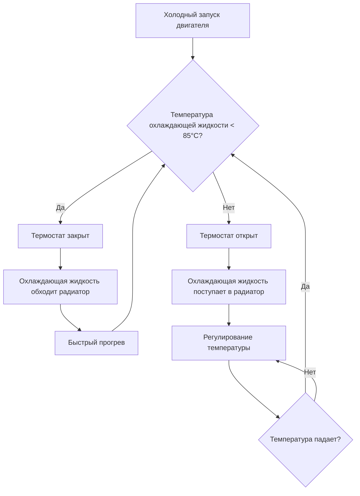

## Обзор

Системы отопления охлаждающей жидкостью двигателя восстанавливают отходящее тепло от двигателя внутреннего сгорания для обеспечения отопления салона автомобилей. В отличие от специализированных систем отопления, автомобильное отопление использует 60-75% энергии топлива, отводимой в виде отходящего тепла через систему охлаждения, что делает его высокоэффективным паразитным источником тепла. Система работает как сеть теплообменника жидкость-воздух, передавая тепловую энергию от охлаждающей жидкости двигателя (обычно смесь этиленгликоля/воды) в воздух салона через сердечник обогревателя.

## Термодинамические принципы

### Рекуперация отходящего тепла

Двигатели внутреннего сгорания преобразуют только 25-35% химической энергии топлива в механическую работу. Остаток распределяется между потерями в выхлопных газах (30-40%) и отводом тепла системой охлаждения (30-35%). Количество отводимого охлаждающей жидкостью тепла можно рассчитать по формуле:

$$Q_{reject} = \dot{m}_{coolant} \cdot c_p \cdot (T_{out} - T_{in})$$

где $\dot{m}_{coolant}$ — расход охлаждающей жидкости по массе (обычно 0,5-2,0 кг/с), $c_p$ — удельная теплоёмкость смеси охлаждающей жидкости (приблизительно 3,5 кДж/кг·К для смеси этиленгликоля/воды 50/50), $T_{out}$ — температура на выходе из двигателя (85-105°C) и $T_{in}$ — температура на входе (75-90°C).

Для типичного двигателя объёмом 2,0 л на 3000 об/мин, производящего 50 кВт механической мощности, отвод тепла охлаждающей жидкостью составляет приблизительно 20-30 кВ, значительно превышая типичные потребности салона в отоплении 3-6 кВ при умеренных наружных температурах.

### Теплопередача от охлаждающей жидкости к воздуху

Сердечник обогревателя функционирует как перекрёстный теплообменник с потоком охлаждающей жидкости через трубки и воздухом, проходящим над рёбристыми поверхностями. Интенсивность теплопередачи определяется уравнением:

$$Q = UA \cdot LMTD$$

где $U$ — общий коэффициент теплопередачи (обычно 200-400 Вт/м²·К для автомобильных сердечников обогревателей), $A$ — площадь поверхности теплопередачи (0,5-1,5 м² для легковых автомобилей) и $LMTD$ — логарифмическая средняя температурная разность:

$$LMTD = \frac{(T_{c,in} - T_{a,out}) - (T_{c,out} - T_{a,in})}{\ln\left(\frac{T_{c,in} - T_{a,out}}{T_{c,out} - T_{a,in}}\right)}$$

## Компоненты системы и управление

### Работа термостата

Термостат охлаждающей жидкости двигателя выполняет двойное назначение: поддержание оптимальной температуры двигателя (обычно 85-95°C согласно SAE J2534) и регулирование доступности тепла для отопления салона. Восковые термостаты работают на принципах теплового расширения:

Температура открытия термостата влияет на производительность отопления салона. Более высокая уставка (90-95°C) обеспечивает большую тепловую мощность, но может увеличить время прогрева на 15-25% по сравнению с термостатом на 82-88°C.

### Управление потоком охлаждающей жидкости

Циркуляция охлаждающей жидкости осуществляется либо механическими водяными насосами (приводными), либо электрическими насосами в современных автомобилях. Стратегии управления расходом включают:

| Метод управления | Регулирование потока | Преимущества | Недостатки |
|------------------|----------------------|-------------|-----------|
| Фиксированный механический насос | Отсутствует (скорость пропорциональна об/мин двигателя) | Простота, надёжность | Переохлаждение на холостом ходу, паразитные потери |
| Электрический насос переменной скорости | ШИМ управление 0-100% | Оптимизированный поток, сниженное энергопотребление | Дополнительная электрическая нагрузка, сложность |
| Механический двухскоростной | Включение муфты | Улучшенная работа на низких скоростях | Ограниченное разрешение управления |

Электрические насосы обеспечивают точное управление потоком с типичным энергопотреблением 50-150 Вт, позволяя циркулировать охлаждающую жидкость при выключенном двигателе для вспомогательных обогревателей или электромобилей.

### Расчет размера сердечника обогревателя

Тепловая мощность сердечника обогревателя должна удовлетворять пиковым потребностям в отоплении при минимизации перепада давления и объёма упаковки. Расчеты размеров соответствуют:

$$Q_{required} = \dot{m}_{air} \cdot c_{p,air} \cdot (T_{discharge} - T_{ambient})$$

Для среднегабаритного седана, требующего 50 г/с расхода воздуха при температуре на выходе 45°C в условиях -20°C:

$$Q_{required} = 0,05 \times 1,006 \times (45 - (-20)) = 3,27 \text{ кВ}$$

При температуре охлаждающей жидкости на входе 90°C и расчётной температуре на выходе 70°C (перепад 20°C) требуемый расход охлаждающей жидкости составляет:

$$\dot{m}_{coolant} = \frac{Q_{required}}{c_p \cdot \Delta T} = \frac{3270}{3500 \times 20} = 0,047 \text{ кг/с}$$

## Анализ времени прогрева

Время прогрева при холодном запуске критически влияет на комфорт пассажиров и производительность оттаивания. Переходный процесс прогрева можно моделировать как:

$$M_{coolant} \cdot c_p \cdot \frac{dT}{dt} = Q_{combustion} - Q_{radiator} - Q_{heatercore} - Q_{losses}$$

где $M_{coolant}$ — общая масса охлаждающей жидкости (4-8 кг, типично). Для упрощённого случая с закрытым термостатом (без потока в радиатор) и выключенным сердечником обогревателя:

$$t_{warmup} = \frac{M_{coolant} \cdot c_p \cdot \Delta T}{P_{engine} \cdot \eta_{heating}}$$

Для системы охлаждающей жидкости массой 5 кг, прогреваемой с 0°C до 85°C при 30 кВ двигателя с эффективностью нагрева 40%:

$$t_{warmup} = \frac{5 \times 3500 \times 85}{30000 \times 0,4} = 124 \text{ сек} \approx 2,1 \text{ мин}$$

Фактические времена прогрева составляют 5-10 минут из-за тепловых нагрузок в салоне, потерь в радиаторе и переменной мощности двигателя во время движения.

## Вспомогательные системы отопления

Современные автомобили используют вспомогательные обогреватели для снижения дискомфорта при холодном запуске:

Вспомогательные жидкостные обогреватели, работающие на топливе (согласно SAE J2757), обеспечивают тепловую мощность 2-5 кВ независимо от работы двигателя при расходе 0,2-0,5 л/ч топлива. Эти системы предварительно нагревают контур охлаждающей жидкости, сокращая время прогрева на 50-70% и улучшая холодный пуск выбросов.

## Соображения по производительности

Эффективность теплопередачи от охлаждающей жидкости к воздуху зависит от множества факторов:

- **Температура охлаждающей жидкости**: Каждое увеличение температуры охлаждающей жидкости на 10°C дает приблизительное увеличение тепловой мощности на 15-20% при постоянном расходе воздуха
- **Расход воздуха**: Тепловая мощность увеличивается почти линейно с расходом воздуха вплоть до точки, где воздушное тепловое сопротивление доминирует
- **Эффекты высоты**: Сниженная плотность воздуха на высоте уменьшает массовый расход приблизительно на 3% на каждые 305 м высоты
- **Концентрация гликоля**: Более высокое содержание гликоля (>50%) снижает удельную теплоёмкость и теплопроводность, уменьшая теплопередачу на 5-10%

## Стандарты и тестирование

SAE J2765 определяет процедуры испытаний для автомобильных систем HVAC, включая:
- Измерение тепловой мощности в установившемся режиме при наружной температуре -18°C, 0°C и 20°C
- Переходные характеристики прогрева при холодном запуске
- Характеристика расхода охлаждающей жидкости и перепада давления
- Рейтинг эффективности сердечника обогревателя
