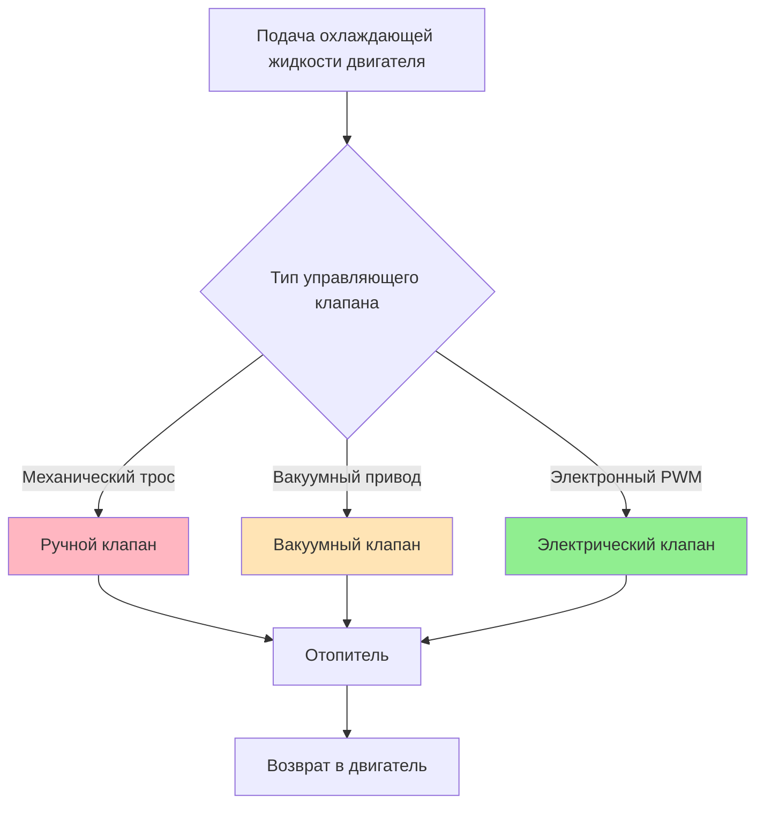
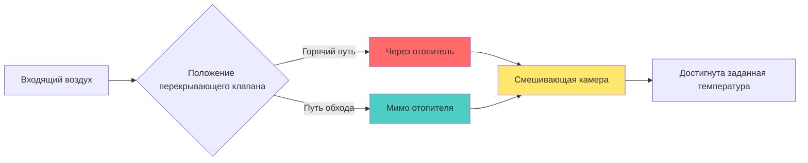

Системы отопителя автомобиля функционируют как жидкостно-воздушные теплообменники, которые передают тепловую энергию от охлаждающей жидкости двигателя в воздух салона. Отопитель представляет собой основной источник тепла для обогрева пассажирского отделения и удаления обледенения лобового стекла в большинстве традиционных транспортных средств.

## Конструкция теплообменника

### Архитектура трубчато-пластинчатого типа

Современные отопители используют две основные конструктивные методологии: медно-латунные и алюминиевые конструкции. Фундаментальная архитектура состоит из параллельных трубок охлаждающей жидкости с вторичными поверхностями теплопередачи (пластинками) для повышения производительности со стороны воздуха.

**Параметры конструкции:**

| Параметр | Медь-латунь | Алюминий |
|----------|-------------|----------|
| Толщина стенки трубки | 0,3-0,4 мм | 0,2-0,3 мм |
| Плотность пластинок | 8-12 FPI | 10-16 FPI |
| Глубина сердечника | 25-40 мм | 20-35 мм |
| Рабочее давление | 138-207 кПа | 138-207 кПа |

Общий коэффициент теплопередачи зависит от тепловых сопротивлений со стороны жидкости и воздуха:

$$\frac{1}{UA} = \frac{1}{h_{\text{coolant}} A_{\text{tube}}} + \frac{t_{\text{wall}}}{k_{\text{wall}} A_{\text{avg}}} + \frac{1}{\eta_{\text{fin}} h_{\text{air}} A_{\text{total}}}$$

где $\eta_{\text{fin}}$ представляет эффективность пластинки, обычно 0,75-0,85 для автомобильных приложений.

Алюминиевые сердечники обеспечивают снижение массы на 45-50% по сравнению с медно-латунными при сохранении эквивалентной тепловой производительности благодаря повышенной плотности пластинок и улучшенной эффективности пластинок за счет превосходной теплопроводности.

## Теплопередача со стороны охлаждающей жидкости

Охлаждающая жидкость двигателя поступает в отопитель при температурах в диапазоне 80-95°C при нормальной работе. Расход жидкости через сердечник зависит от положения управляющего клапана отопителя и перепада давления в системе.

Коэффициент теплопередачи со стороны жидкости следует корреляции Диттуса-Бёльтерта для турбулентного потока:

$$Nu_D = 0.023 Re_D^{0.8} Pr^{0.4}$$

$$h_{\text{coolant}} = \frac{Nu_D \cdot k_{\text{coolant}}}{D_h}$$

Типичные числа Рейнольдса для охлаждающей жидкости варьируются от 2000-8000 в зависимости от расхода и диаметра трубки. Гидравлический диаметр $D_h$ для прямоугольных трубок:

$$D_h = \frac{4 \cdot A_c}{P_{\text{wetted}}}$$

### Управление потоком охлаждающей жидкости

Три основные технологии управляющих клапанов регулируют поток охлаждающей жидкости:

**Сравнение управляющих клапанов:**

| Тип | Время отклика | Разрешение управления | Потребление мощности |
|-----|----------------|----------------------|----------------------|
| Механический трос | 2-5 с | Ступенчатое (вкл/выкл) | 0 Вт |
| Вакуумный привод | 1-3 с | Переменное | 0 Вт |
| Электронный PWM | 0,5-1,5 с | Непрерывное | 15-30 Вт |

Электронные клапаны обеспечивают превосходное управление температурой посредством импульсно-широтной модуляции, обеспечивая точную модуляцию потока в соответствии с протоколами управления климатом SAE J2765.

## Теплопередача со стороны воздуха

Воздух салона протекает поперек пластинчатой поверхности, создавая конвективную теплопередачу. Двигатель вентилятора направляет воздух через корпус HVAC при объемных расходах 150-400 CFM (4,2-11,3 м³/ч) в зависимости от выбора скорости вентилятора.

Коэффициент теплопередачи со стороны воздуха:

$$h_{\text{air}} = \frac{Nu \cdot k_{\text{air}}}{D_h}$$

Число Нуссельта для компактных теплообменников с жалюзийными пластинками:

$$Nu = C \cdot Re^m \cdot Pr^{1/3}$$

где константы $C$ и $m$ зависят от геометрии пластинки (типично $C = 0,3-0,5$, $m = 0,6-0,7$).

Общий тепловой поток из отопителя:

$$\dot{Q} = \dot{m}_{\text{coolant}} c_{p,\text{coolant}} (T_{\text{in}} - T_{\text{out}}) = \dot{m}_{\text{air}} c_{p,\text{air}} (T_{\text{out}} - T_{\text{in}})$$

Для типичного автомобиля среднего класса производительность отопителя варьируется от 5-8 кВт при максимальном потоке охлаждающей жидкости и скорости вентилятора.

## Управление перекрывающим клапаном температуры

Регулирование температуры происходит посредством модуляции потока воздуха с использованием перекрывающих клапанов, а не исключительно через управление потоком охлаждающей жидкости. Перекрывающий клапан отводит различные доли воздуха через отопитель или мимо него.

Температура выходящего воздуха как функция положения перекрывающего клапана $\theta$ (0° = полный холод, 90° = полный нагрев):

$$T_{\text{discharge}} = T_{\text{ambient}} + \left(\frac{\theta}{90°}\right) \cdot \frac{\dot{Q}_{\text{core}}}{\dot{m}_{\text{air}} c_{p,\text{air}}}$$

Электронные приводы позиционируют перекрывающие клапаны с точностью ±2° для поддержания температуры в салоне в пределах ±1°C от установленного значения в соответствии с требованиями SAE J2765.

## Интеграция режима обогрева стекла

Режим обогрева стекла направляет максимальное тепловое излучение на лобовое стекло. Этот режим активирует специфические параметры работы:

**Параметры режима обогрева стекла:**
- Перекрывающий клапан: Полное горячее положение (максимальный поток через отопитель)
- Скорость вентилятора: Высокая или средне-высокая
- Распределение воздуха: 100% к выходам лобового стекла
- Клапан рециркуляции: Положение свежего воздуха
- Компрессор кондиционера: Активирован (для осушки воздуха)

Требование теплового потока режима обогрева стекла следует процедурам испытаний SAE J902:

$$\dot{q}_{\text{defrost}} = \frac{\dot{Q}_{\text{total}} \cdot \alpha_{\text{windshield}}}{A_{\text{windshield}}}$$

где $\alpha_{\text{windshield}}$ представляет долю полного потока воздуха, направляемого к выходам лобового стекла (типично 0,85-0,95 в режиме обогрева стекла).

Для удаления льда требуемый тепловой поток на лобовое стекло обычно превышает 200 Вт/м² для достижения очистки в течение 10-15 минут в соответствии со стандартами SAE J902.

## Факторы деградации производительности

Эффективность отопителя уменьшается вследствие:

1. **Загрязнение со стороны охлаждающей жидкости:** Отложения накипи снижают площадь внутреннего потока и увеличивают тепловое сопротивление
2. **Блокировка со стороны воздуха:** Накопление мусора между пластинками снижает поток воздуха на 15-30%
3. **Коррозия пластинок:** Окисление снижает эффективность пластинок с 0,80 до 0,60
4. **Ограничение потока охлаждающей жидкости:** Частичный отказ клапана ограничивает поток на 40-60% от расчетного значения

Снижение эффективности:

$$\varepsilon_{\text{degraded}} = \varepsilon_{\text{design}} \cdot (1 - f_{\text{fouling}}) \cdot (1 - f_{\text{blockage}})$$

Регулярное обслуживание системы охлаждения и замена салонного воздушного фильтра сохраняют производительность отопителя на протяжении всего срока службы автомобиля.

## Компоненты

- Конструкция отопителя
- Медно-латунный отопитель
- Алюминиевый отопитель
- Трубчато-пластинчатая конструкция
- Охлаждающая жидкость отопителя
- Управляющий клапан отопителя
- Электрический управляющий клапан отопителя
- Вакуумный управляющий клапан отопителя
- Температурный перекрывающий клапан охлаждающей жидкости
- Производительность отопителя
