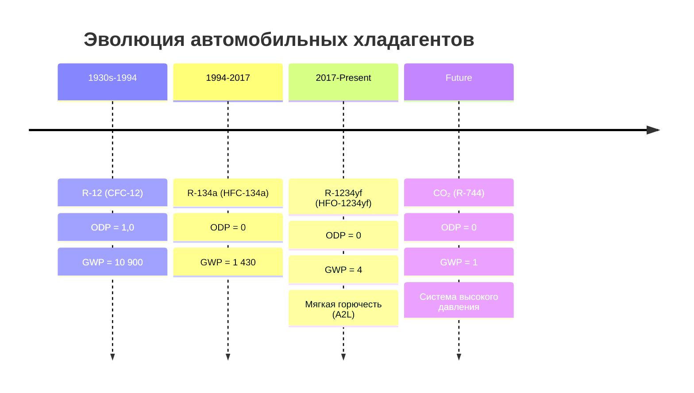
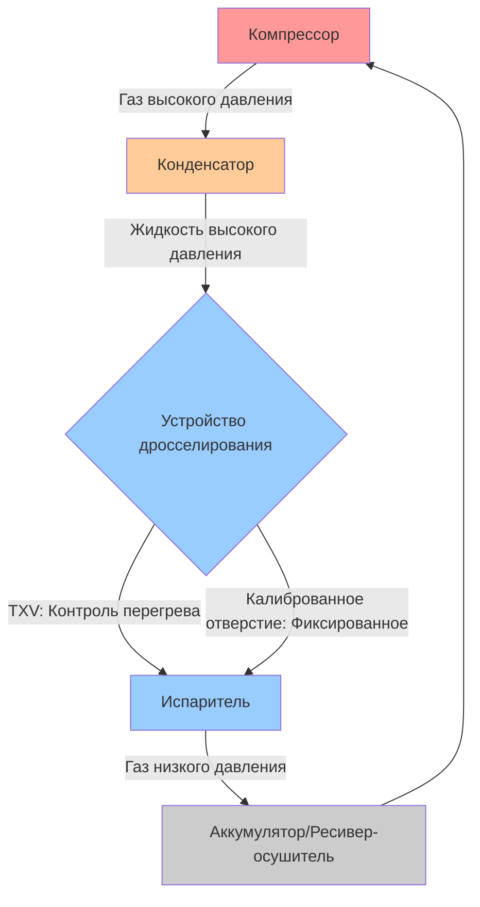

Автомобильные холодильные системы используют циклы парокомпрессии, адаптированные к уникальным ограничениям мобильных приложений, включая переменную частоту вращения, высокие температуры окружающей среды, ограниченное пространство упаковки и строгие требования к массе. Эволюция хладагентов, используемых в системах мобильного кондиционирования воздуха (MAC), отражает ответную реакцию промышленности на экологические проблемы при сохранении тепловой производительности.

## Временная шкала эволюции хладагентов

Переход от хладагентов на основе хлорофторуглеродов к хладагентам с низким ПГП представляет одну из самых значительных инженерных проблем в истории автомобильных HVAC систем.

## Сравнение свойств хладагентов

Выбор автомобильных хладагентов балансирует термодинамическую производительность, экологическое воздействие, безопасность и совместимость с существующей инфраструктурой.

| Свойство | R-12 | R-134a | R-1234yf | CO₂ (R-744) |
|----------|------|--------|----------|-------------|
| **Молекулярная формула** | CCl₂F₂ | CH₂FCF₃ | CF₃CF=CH₂ | CO₂ |
| **Молекулярная масса** | 120,9 | 102,0 | 114,0 | 44,0 |
| **Температура кипения (°C)** | -29,8 | -26,1 | -29,4 | -78,4 (сублимация) |
| **Критическая температура (°C)** | 112,0 | 101,1 | 94,7 | 31,1 |
| **Критическое давление (бар)** | 41,4 | 40,6 | 33,8 | 73,8 |
| **ODP** | 1,0 | 0 | 0 | 0 |
| **GWP (100 лет)** | 10 900 | 1 430 | 4 | 1 |
| **Безопасность ASHRAE** | A1 | A1 | A2L | A1 |
| **Удельный объем (л/кВт)** | 100% | 112% | 107% | 8% |
| **Температура нагнетания (°C)** | 65-75 | 70-80 | 65-75 | 90-120 |

## Анализ термодинамической производительности

Эффективность цикла парокомпрессии в автомобильных приложениях зависит от рабочего объема компрессора, свойств хладагента и условий эксплуатации.

### Коэффициент производительности

Теоретический COP для цикла парокомпрессии, работающего между температурой испарителя $T_e$ и температурой конденсатора $T_c$:

$$\text{COP}_{\text{ideal}} = \frac{T_e}{T_c - T_e}$$

При типичных автомобильных условиях ($T_e = 5°C = 278K$, $T_c = 55°C = 328K$):

$$\text{COP}_{\text{ideal}} = \frac{278}{328 - 278} = \frac{278}{50} = 5,56$$

Фактические автомобильные системы кондиционирования достигают значений COP от 1,5 до 2,5 из-за:
- Неэффективности компрессора (механические и объемные)
- Потерь давления в теплообменниках и трубопроводах
- Необратимостей теплопередачи
- Работы с переменной частотой вращения
- Неидеального поведения хладагента

### Расчет холодопроизводительности

Холодильный эффект на единицу массы хладагента:

$$q_e = h_1 - h_4$$

Где $h_1$ — энтальпия, выходящая из испарителя, а $h_4$ — энтальпия, поступающая в испаритель после дросселирования.

Полная холодопроизводительность зависит от массового расхода:

$$\dot{Q}_e = \dot{m} \cdot (h_1 - h_4) = \dot{m} \cdot q_e$$

Для компрессора переменного рабочего объема массовый расход зависит от:

$$\dot{m} = \frac{\eta_v \cdot V_d \cdot N \cdot \rho_{\text{suction}}}{60}$$

Где:
- $\eta_v$ = объемный КПД (0,70-0,85)
- $V_d$ = рабочий объем на один оборот (см³/об)
- $N$ = частота вращения компрессора (об/мин)
- $\rho_{\text{suction}}$ = плотность хладагента на входе компрессора (кг/м³)

### Мощность, требуемая компрессором

Потребление электроэнергии компрессором напрямую влияет на экономию топлива и выбросы транспортного средства:

$$\dot{W}_{\text{comp}} = \dot{m} \cdot (h_2 - h_1) = \dot{m} \cdot \frac{h_{2s} - h_1}{\eta_{\text{isen}}}$$

Где $h_{2s}$ — энтальпия нагнетания при изоэнтропийном процессе, а $\eta_{\text{isen}}$ — изоэнтропийный КПД (0,60-0,75 для автомобильных компрессоров).

## Требования к компонентам системы

Автомобильные холодильные системы должны выдерживать экстремальные условия эксплуатации, минимизируя при этом вес и стоимость.

### Диапазоны давления на высокой стороне

| Хладагент | На холостом ходу (бар) | На шоссе (бар) | Макс. расчетное (бар) | Стандарт SAE |
|-----------|------------------------|-----------------|----------------------|--------------|
| R-12 | 10-12 | 14-16 | 24,8 | SAE J639 |
| R-134a | 8-10 | 12-15 | 31,7 | SAE J2064 |
| R-1234yf | 8-10 | 12-15 | 31,0 | SAE J2843 |
| CO₂ | 75-85 | 90-110 | 140 | SAE J2842 |

### Совместимость материалов компонентов

Переход на R-1234yf потребовал оценки совместимости материалов, особенно с эластомерами и смазочными маслами.

**Совместимость эластомеров:**
- Уплотнения EPDM (этилен-пропиленовый диеновый каучук)
- HNBR (гидрированный нитрил-бутадиеновый каучук) для высокотемпературных приложений
- Фторэластомеры для уплотнений вала компрессора

**Требования к смазочным маслам:**
- R-12: Минеральное масло
- R-134a: PAG (полиалкиленгликоль) или POE (полиоловый эфир)
- R-1234yf: Масло PAG (вязкость ISO 46 или ISO 100)
- CO₂: PAG или POE с добавками повышенной смазывающей способности

## Экологические нормы

### Программа EPA SNAP

Программа EPA по Значимым Новым Альтернативам (SNAP) оценивает приемлемость хладагента на основе:
- Потенциала разрушения озонового слоя (ODP)
- Глобального потенциала потепления (ПГП)
- Горючести и токсичности
- Влияния на энергоэффективность

С 2017 года R-134a неприемлем для новых легковых автомобилей в Соединенных Штатах, что способствует внедрению R-1234yf (40 CFR Part 82).

### Европейская директива MAC

Директива ЕС 2006/40/EC требует, чтобы хладагенты в новых типах транспортных средств имели ПГП < 150, что фактически требует использования систем R-1234yf или CO₂ для автомобилей, одобренных типом после 1 января 2017 года.

### Стандарты SAE для хладагентов с низким ПГП

**SAE J2843** — Соединения для шлангов обслуживания R-1234yf
- Указывает уникальные соединения (резьба ACME 16 мм) для предотвращения перекрестного загрязнения с R-134a
- Требует испытаний совместимости сервисного оборудования

**SAE J2851** — Чистота хладагента R-1234yf и требования к контейнерам
- Минимальная чистота: 99,5% по массе
- Максимальное содержание влаги: 10 ppm
- Воздух и неконденсирующиеся вещества: <1,5% по объему

**SAE J3030** — Процедура промывки системы автомобильного холодильного средства
- Критична для предотвращения перекрестного загрязнения при обслуживании
- Указывает типы промывочных жидкостей и процедуры

## Требования к испытаниям производительности

### SAE J2765 — Испытание производительности системы MAC

Стандартные условия испытаний для измерения холодопроизводительности и COP:
- Температура окружающей среды: 35°C (95°F)
- Относительная влажность: 50%
- Скорость транспортного средства: 48 км/ч (30 миль/ч)
- Частота вращения двигателя: 1500 об/мин
- Вентилятор: Высокая скорость
- Рециркуляция: 100%

Холодопроизводительность при стандартных условиях обычно находится в диапазоне от 3,5 до 6,5 кВт для легковых автомобилей.

### Обнаружение утечек и потеря хладагента

Автомобильные системы испытывают более высокие темпы утечек, чем стационарные системы, из-за вибрации, термического циклирования и гибких соединений. SAE J2727 указывает максимально допустимые скорости утечки:

$$\text{Скорость утечки} < 14 \text{ г/год (0,5 унции/год)}$$

Это соответствует потере менее 3% годовой зарядки для типичных систем (450-650g зарядки).

## Сравнение архитектур системы

**Системы с TXV (Термический расширительный клапан):**
- Лучший контроль перегрева (5-8°C)
- Улучшенная эффективность при переменных нагрузках
- Осушитель на высокой стороне
- Более высокая стоимость и сложность

**Системы с калиброванным отверстием:**
- Фиксированное ограничение дросселирования
- Аккумулятор на низкой стороне предотвращает гидравлический удар жидкостью
- Более низкая стоимость, более высокая надежность
- Менее эффективны при работе с частичной нагрузкой

## Проблемы внедрения R-1234yf

### Соображения мягкой горючести

R-1234yf имеет классификацию ASHRAE A2L (более низкая горючесть, более низкая токсичность). Нижний предел взрываемости (LFL) составляет 6,2% по объему в воздухе.

**Реализованные меры безопасности:**
- Сниженная зарядка хладагентом (обычно 450-600g против 600-800g для R-134a)
- Улучшенное обнаружение утечек
- Улучшения уплотнения вала компрессора
- Надлежащие процедуры обслуживания в соответствии с SAE J2845

### Стоимость и инфраструктура обслуживания

Начальные проблемы внедрения R-1234yf включали:
- Стоимость хладагента: $50-70/фунт против $5-8/фунт для R-134a (цены 2018 года)
- Требуется специальное сервисное оборудование (без перекрестного загрязнения)
- Обучение и сертификация технических специалистов
- Уникальные соединения и цветовая кодировка (светло-голубая для R-134a темно-голубой)

## Будущие тенденции: системы с CO₂

Трансритические системы с CO₂ работают выше критической точки (31,1°C, 73,8 бар) при высоких температурах окружающей среды, требуя различных стратегий отвода тепла.

**Преимущества:**
- Самый низкий ПГП (ПГП = 1)
- Негорючий, нетоксичный
- Превосходные свойства теплопередачи
- Может обеспечить обогрев через газовый охладитель

**Вызовы:**
- Высокие рабочие давления (до 140 бар)
- Требуются сложные системы управления
- Более высокие затраты на компоненты
- Более низкая эффективность при высоких температурах окружающей среды без эжектора или параллельного сжатия

Термодинамический недостаток при высоких температурах окружающей среды способствует разработке расширенных модификаций цикла, включая внутренние теплообменники, эжекторы и двухступенчатое сжатие с промежуточным охлаждением.

---

**Ссылки:**
- SAE J2843: R-1234yf (HFO-1234yf) Соединения для шлангов обслуживания
- SAE J2765: Процедура измерения системного COP мобильных систем A/C
- SAE J2851: Чистота хладагента R-1234yf и требования к контейнерам
- EPA 40 CFR Part 82: Защита стратосферного озона
- Директива ЕС 2006/40/EC: Директива MAC по системам мобильного кондиционирования воздуха
