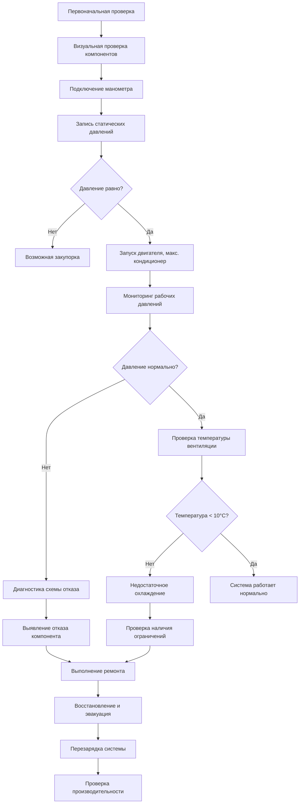

Диагностика и техническое обслуживание автомобильных кондиционеров требуют систематических процедур, сочетающих анализ давления и температуры, методы обнаружения утечек и протоколы работы с хладагентом. Физика паровой компрессии предусматривает определенные соотношения давлений, которые раскрывают состояние системы, а правильные процедуры обслуживания сохраняют чистоту хладагента и целостность системы в соответствии со стандартами SAE J2788.

## Диагностика манометра

### Соотношения давления и температуры

Давление насыщенного пара хладагента в испарителе и конденсаторе обеспечивает диагностическую информацию. Для R-134a давление насыщения следует соотношению Клаузиуса-Клапейрона:

$$\frac{dP}{dT} = \frac{h_{fg}}{T \cdot v_{fg}}$$

где $h_{fg}$ — скрытая теплота испарения и $v_{fg}$ — изменение удельного объема при фазовом переходе.

Типовые рабочие давления при температуре окружающей среды 35°C:

| Состояние системы | Низкая сторона (кПа) | Высокая сторона (кПа) | Диагноз |
|------------------|----------------------|----------------------|---------|
| Нормальная работа | 170–240 | 1380–1720 | Надлежащий заряд, функционирующие компоненты |
| Низкий хладагент | 100–140 | 1100–1380 | Недостаточный заряд, возможна утечка |
| Перезарядка | 280–340 | 1900–2410 | Избыток хладагента, пониженная эффективность |
| Заблокированное отверстие | 70–100 | 1550–1900 | Низкий поток испарителя, высокий перегрев |
| Заблокированный конденсатор | 210–280 | 2070–2760 | Недостаточное отведение тепла |
| Отказ компрессора | 140–210 | 1030–1380 | Плохое сжатие, низкое соотношение давлений |

### Анализ перегрева и переохлаждения

Перегрев на выходе испарителя указывает на полное испарение:

$$\Delta T_{перегрев} = T_{выход} - T_{нас,испаритель}$$

Надлежащий диапазон перегрева составляет 5–8°C для систем с терморегулирующим вентилем (TXV) и 10–15°C для систем с дроссельным отверстием. Переохлаждение на выходе конденсатора подтверждает полную конденсацию:

$$\Delta T_{переохлаждение} = T_{нас,конденсатор} - T_{выход}$$

Целевое переохлаждение составляет 8–12°C, что обеспечивает поступление жидкого хладагента на устройство расширения без образования паровых пузырей.

## Рабочий процесс диагностического обслуживания

## Методы обнаружения утечек

### Электронное обнаружение утечек

Детекторы утечек электронные, чувствительные к галогену, обнаруживают молекулы хладагента при концентрациях всего 3–5 граммов в год. Чувствительный элемент работает по принципу нагреваемого диода или коронного разряда, при котором молекулы хладагента изменяют электрическую проводимость.

Чувствительность детектора:

$$S_{детектор} = \frac{\Delta R}{R_0} \cdot \frac{1}{C_{хладагент}}$$

где $\Delta R$ — изменение сопротивления и $C_{хладагент}$ — концентрация хладагента в ppm.

### Обнаружение утечек с использованием УФ-красителя

Флуоресцентный краситель, введенный в контур хладагента, концентрируется в местах утечки. При освещении УФ светом (длина волны 365 нм) краситель флуоресцирует, выявляя утечки, невидимые другими методами. Концентрация красителя обычно составляет 7–14 мл на систему без влияния на тепловые свойства.

### Тестирование падения давления

Статическое тестирование давления количественно определяет скорость утечки путем мониторинга падения давления с течением времени. Для системы при температуре $T$ с объемом $V$:

$$\dot{m}_{утечка} = -\frac{V}{RT} \cdot \frac{dP}{dt}$$

Надлежащо герметичная система показывает падение давления менее 35 кПа за 30 минут.

## Процедуры восстановления и эвакуации

### Восстановление хладагента

SAE J2788 требует восстановления до вакуума 102 мм рт. ст. (13,6 кПа) или ниже в течение 5 минут, чтобы минимизировать выброс хладагента. Машины для восстановления используют компрессор и конденсатор для передачи хладагента из системы автомобиля в баллон для хранения.

Эффективность восстановления:

$$\eta_{восстановление} = \frac{m_{восстановлено}}{m_{первоначально}} \times 100\%$$

Современное оборудование достигает эффективности восстановления 95–98%, при этом остаточный хладагент остается в масле компрессора.

### Эвакуация системы

Глубокий вакуум удаляет влагу и неконденсируемые вещества. Давление насыщенного пара воды экспоненциально снижается с глубиной вакуума:

| Глубина вакуума (мм рт. ст.) | Точка кипения воды (°C) | Скорость испарения |
|------------------------------|------------------------|--------------------|
| 760 (атмосферное) | 100 | Базовое значение |
| 200 | 66 | 3,8× быстрее |
| 50 | 38 | 15× быстрее |
| 2 | 5 | 380× быстрее |

Целевой вакуум составляет 500 микрон (0,5 мм рт. ст.), поддерживаемый в течение 10–30 минут. Содержание влаги должно оставаться ниже 50 ppm, чтобы предотвратить коррозию системы и образование кислоты.

## Процедуры перезарядки

### Определение количества хладагента

Зарядка по весу обеспечивает точное количество хладагента в соответствии со спецификациями производителя. Перезарядка на 10% увеличивает давление на высокой стороне примерно на 200 кПа и снижает холодопроизводительность на 5–8% из-за затопления конденсатора.

Требование точности заряда:

$$\Delta m_{заряд} \leq \pm 25 \text{ граммов}$$

для систем с номинальными зарядами 400–900 граммов.

### Зарядка по методу переохлаждения

Для систем без смотрового окна зарядка до надлежащего переохлаждения обеспечивает оптимальную производительность:

1. Добавьте хладагент порциями по 25 граммов
2. Дайте 2–3 минуты стабилизации между добавлениями
3. Измерьте температуру линии жидкости и давление на высокой стороне
4. Рассчитайте переохлаждение и сравните с целевым значением (8–12°C)
5. Остановитесь, когда переохлаждение достигнет спецификации

## Проверка производительности системы

### Тестирование температурного дифференциала

Температура на выходе центрального вентиля при максимальном охлаждении и режиме рециркуляции должна достичь:

$$T_{вентиль} = T_{окружающая} - \Delta T_{производительность}$$

где $\Delta T_{производительность}$ составляет 22–28°C при температуре окружающей среды 35°C, 50% относительной влажности и 1500 об/мин двигателя.

### Проверка мощности компрессора

Рабочий объем компрессора определяет теоретический массовый расход:

$$\dot{m}_{теоретический} = \frac{V_{рабочий} \cdot N \cdot \rho_{всасывание}}{60}$$

где $V_{рабочий}$ — объем вытеснения за оборот, $N$ — об/мин компрессора и $\rho_{всасывание}$ — плотность хладагента при условиях всасывания. Фактический массовый расход снижается на объемный КПД (обычно 75–85%).

### Измерение COP системы

Коэффициент производительности связывает холодопроизводительность с работой компрессора:

$$COP = \frac{Q_{испаритель}}{W_{компрессор}} = \frac{\dot{m} \cdot (h_{испаритель,выход} - h_{испаритель,вход})}{T_{компрессор} \cdot \dot{m} \cdot (h_{компрессор,выход} - h_{компрессор,вход})}$$

Автомобильные системы достигают значений COP 1,8–2,5 при конструктивных условиях, что ниже, чем стационарное оборудование, из-за переменного режима работы и ограничений по упаковке.

## Тестирование чистоты хладагента

### Обнаружение загрязнения

Идентификаторы хладагента анализируют состав с использованием инфракрасной спектроскопии или теплопроводности. SAE J2788 требует чистоты более 98% для R-134a и 99% для R-1234yf. Обычные загрязнители включают:

- Воздух (неконденсируемый): увеличивает давление на высокой стороне, снижает мощность
- Влага: образует кислоты, разрушает компоненты
- Другие хладагенты: изменяет соотношения давления и температуры
- Масляный унос: допускается до 4000 ppm по весу

### Разделение масла и его измерение

Во время восстановления масло компрессора отделяется и измеряется. Потеря масла, превышающая 60 мл, указывает на утечку в системе, требующую замены масла для поддержания надлежащего уровня смазки в диапазоне 100–150 мл общего заряда системы.

## Требования к сервисному оборудованию

Профессиональное техническое обслуживание кондиционеров автомобилей требует:

- Машина для восстановления/переработки/перезарядки (RRR), соответствующая SAE J2788
- Набор манометра с разрешением 0,1 бара
- Электронный детектор утечек с чувствительностью 5 г/год
- Вакуумный насос, достигающий 50 микрон
- Весы для хладагента с точностью ±5 граммов
- Термометр с точностью ±0,5°C
- Идентификатор хладагента

Все оборудование должно калиброваться ежегодно для сохранения диагностической точности и обеспечения надлежащего обслуживания системы в соответствии с требованиями производителя и нормативными требованиями.

---

## Компоненты

- Обнаружение утечек хладагента
- Электронный детектор утечек
- Обнаружение утечек с УФ-красителем
- Система тестирования давления
- Процедура тестирования вакуума
- Процедура эвакуации
- Процедура перезарядки автомобиля
- Идентификатор хладагента
- Тестирование чистоты хладагента
- Сервисное оборудование для кондиционеров
