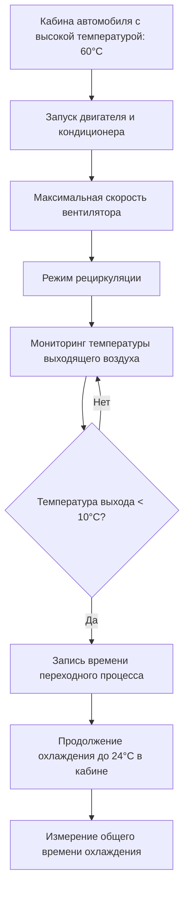

## Обзор

Тестирование производительности автомобильной системы хладагента количественно определяет холодопроизводительность, эффективность и характеристики теплового отклика мобильных систем кондиционирования воздуха в контролируемых условиях. В отличие от стационарных систем HVAC, автомобильные приложения сталкиваются с уникальными проблемами, включая переменные обороты двигателя, экстремальные условия окружающей среды, солнечное излучение и динамические картины потока воздуха, которые требуют специализированных протоколов тестирования.

## Тест холодопроизводительности SAE J2765

SAE J2765 устанавливает стандартную методологию для измерения холодопроизводительности в установившемся режиме в системах климат-контроля автомобилей. Тест количественно определяет общую скорость удаления тепла при указанных условиях работы.

### Требования к установке испытательного стенда

Автомобиль размещается в климатической камере с точным управлением следующими параметрами:

| Параметр | Спецификация | Допуск |
|-----------|---------------|-----------|
| Температура окружающей среды | 35°C | ±1,1°C |
| Относительная влажность | 40% | ±5% |
| Солнечная нагрузка | 850 Вт/м² | ±50 Вт/м² |
| Имитация скорости автомобиля | 48 км/ч эквивалент | ±3,2 км/ч |

Частота вращения двигателя стабилизируется на указанной производителем холостой скорости или 1500 об/мин, поддерживая постоянный рабочий объем компрессора хладагента. Система работает минимум 30 минут для достижения теплового равновесия перед началом измерений.

### Расчет холодопроизводительности

Общая холодопроизводительность объединяет удаление явного и скрытого тепла:

$$Q_{total} = Q_{sensible} + Q_{latent}$$

где:

$$Q_{sensible} = \dot{m}_{air} \cdot c_{p,air} \cdot (T_{in} - T_{out})$$

$$Q_{latent} = \dot{m}_{air} \cdot (W_{in} - W_{out}) \cdot h_{fg}$$

Определение переменных:
- $\dot{m}_{air}$ = массовый расход воздуха (кг/с)
- $c_{p,air}$ = удельная теплоемкость воздуха при постоянном давлении = 1,006 кДж/(кг·К)
- $T_{in}$, $T_{out}$ = температура воздуха на входе и выходе (К)
- $W_{in}$, $W_{out}$ = влагосодержание на входе и выходе (кг воды/кг сухого воздуха)
- $h_{fg}$ = удельная теплота парообразования = 2501 кДж/кг при 0°C

Определение массового расхода воздуха использует методологию камеры сопел в соответствии с SAE J1487:

$$\dot{m}_{air} = C_d \cdot A_{nozzle} \cdot \sqrt{2 \rho_{air} \Delta P}$$

где $C_d$ - коэффициент расхода (обычно 0,98–0,99), $A_{nozzle}$ - общая площадь сопла, $\Delta P$ - перепад давления на банке сопел.

## Тестирование времени переходного процесса

Тестирование переходного процесса характеризует переходную тепловую реакцию кабины автомобиля из экстремальных условий нагрева. Эта метрика напрямую коррелирует с удовлетворенностью клиентов при входе в автомобиль в жаркие дни.

### Процедура прогрева

Автомобиль подвергается термическому насыщению при температуре окружающей среды 35–43°C с:
- Все окна закрыты
- Лампы солнечной имитации обеспечивают 1000 Вт/м² облученности
- Длительность прогрева: 2–4 часа до достижения кабиной теплового равновесия

Тепловая масса салона накапливает значительную энергию:

$$Q_{stored} = \sum m_i \cdot c_{p,i} \cdot \Delta T_i$$

суммируется по всем компонентам кабины (сиденья, панель приборов, потолок, отделочные панели), где $m_i$ и $c_{p,i}$ представляют массу и удельную теплоемкость каждого компонента.

### Показатели производительности переходного процесса

Стандартные точки измерения:

| Метрика | Целевое значение | Точка оценки |
|--------|------------------|------------------|
| Время достижения 10°C температуры выхода | < 90 секунд | Максимальный спрос охлаждения |
| Время достижения 24°C средней температуры в кабине | < 15 минут | Порог комфорта пассажиров |
| Время достижения 22°C средней температуры в кабине | < 30 минут | Зона теплового комфорта |

Экспоненциальное затухание температуры в кабине следует соотношению:

$$T_{cabin}(t) = T_{ambient} + (T_{initial} - T_{ambient}) \cdot e^{-t/\tau}$$

где $\tau$ - тепловая постоянная времени, зависящая от холодопроизводительности и тепловой массы кабины.

## Измерение коэффициента производительности

COP системы автомобильного кондиционера количественно определяет эффективность охлаждения как отношение холодопроизводительности к входной мощности компрессора:

$$COP = \frac{Q_{cooling}}{W_{compressor}}$$

### Определение мощности компрессора

Механическая мощность, потребляемая ременным компрессором:

$$W_{compressor} = \frac{T_{engine} \cdot \omega \cdot r_{pulley}}{r_{compressor}}$$

где $T_{engine}$ - увеличение крутящего момента двигателя при включенном кондиционере, $\omega$ - угловая скорость, $r_{pulley}/r_{compressor}$ - передаточное число шкивов.

Альтернативный расчет со стороны хладагента:

$$W_{compressor} = \dot{m}_{ref} \cdot (h_{discharge} - h_{suction}) / \eta_{compressor}$$

где:
- $\dot{m}_{ref}$ = массовый расход хладагента (кг/с)
- $h_{discharge}$, $h_{suction}$ = удельные энтальпии на выходе и входе компрессора (кДж/кг)
- $\eta_{compressor}$ = общая объемная и изотропная эффективность (0,65–0,75 типично)

### Изменение COP с условиями работы

Типичный COP автомобильного кондиционера колеблется от 1,5 до 2,5, значительно ниже, чем у стационарных систем, из-за:
- Работы компрессора с переменной скоростью
- Ограничений размера и веса, ограничивающих эффективность теплообменников
- Более высоких температур конденсации из-за ограниченного потока воздуха на холостом ходу
- Не оптимизированной зарядки хладагента по диапазону работы

## Оптимизация зарядки хладагента

Производительность системы проявляет высокую чувствительность к массе зарядки хладагента. Как недозаряд, так и перезаряд снижают производительность и эффективность.

### Матрица тестирования оптимизации зарядки

| Уровень зарядки | Давление всасывания | Давление нагнетания | Переохлаждение | Перегрев | Холодопроизводительность |
|--------------|------------------|--------------------|-----------|-----------| ---------|
| −20% | Низкое | Низкое | Низкое | Высокое | 75% |
| −10% | Ниже номинального | Ниже номинального | 1,7–2,8°C | 8,3–11,1°C | 88% |
| Оптимально | Номинальное | Номинальное | 5,6–8,3°C | 4,4–6,7°C | 100% |
| +10% | Выше номинального | Высокое | 10–14°C | 2,8–4,4°C | 95% |
| +20% | Высокое | Очень высокое | 16,7°C+ | 1,1–2,8°C | 85% |

### Термодинамические эффекты отклонения зарядки

**Недозаряд:** Недостаточное жидкого хладагента на выходе испарителя вызывает чрезмерный перегрев. Двухфазная область сокращается, уменьшая площадь теплопередачи. Давление всасывания снижается, уменьшая плотность хладагента и массовый расход:

$$\dot{m}_{ref} = \rho_{suction} \cdot V_{displacement} \cdot \eta_{volumetric}$$

**Перезаряд:** Избыток хладагента переполняет конденсатор, уменьшая эффективную площадь конденсации. Высокое переохлаждение увеличивает давление конденсации, повышая степень сжатия и работу компрессора при минимальном выигрыше в производительности.

## Эффективность системы при различных условиях окружающей среды

Производительность автомобильного кондиционера значительно снижается при повышенных температурах окружающей среды из-за термодинамических и ограничений теплопередачи.

### Влияние температуры окружающей среды

Снижение холодопроизводительности с ростом температуры окружающей среды:

$$\frac{Q_{actual}}{Q_{rated}} = 1 - k \cdot (T_{ambient} - T_{rated})$$

где $k \approx 0,0027–0,0036$ на °C для типичных систем R-134a.

Физические механизмы:
- **Более высокая температура конденсации:** Снижает плотность хладагента и разницу энтальпии на испарителе
- **Увеличенная степень сжатия:** $(P_{discharge}/P_{suction})$ растет экспоненциально, увеличивая работу компрессора
- **Пониженная эффективность конденсатора:** Меньший температурный перепад между хладагентом и окружающим воздухом

### Тестирование конверта производительности

Матрица испытаний согласно SAE J2765:

| Температура окружающей среды | Влажность | Ожидаемая холодопроизводительность | Ожидаемый COP |
|--------------|-----|-------------------|--------------|
| 24°C | 40% | 115–125% от номинальной | 2,3–2,6 |
| 35°C | 40% | 100% (номинальная) | 2,0–2,3 |
| 43°C | 20% | 80–85% от номинальной | 1,6–1,9 |
| 52°C | 10% | 60–70% от номинальной | 1,3–1,6 |

При экстремальных условиях (52°C+) переключатель отсечки высокого давления системы может циклировать работу компрессора для предотвращения повреждений, еще больше снижая эффективную холодопроизводительность.

## Приборы и точность измерений

Точное тестирование производительности требует отградуированного оборудования:

- **Датчики температуры:** RTD или термопары, точность ±0,3°C, постоянная времени < 5 секунд
- **Датчики давления:** ±0,5% полной шкалы, диапазон 0–3450 кПа
- **Датчики влажности:** Емкостные или охлаждаемые зеркала, точность ±2% ОВ
- **Измерение потока:** Система банка сопел с неопределенностью ±2%
- **Измерение мощности:** Датчик крутящего момента или датчики тока/напряжения, точность ±1%

Все приборы требуют калибровки с прослеживаемостью к стандартам NIST с документацией в соответствии с требованиями ISO 17025.
