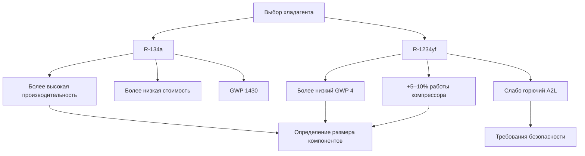

## Основы проектирования системы

Проектирование автомобильной системы охлаждения требует интеграции оптимизации термодинамического цикла с жесткими ограничениями по упаковке, работой с переменной скоростью и экстремальными температурами окружающей среды от −40°C до 54°C. Процесс проектирования балансирует холодопроизводительность, коэффициент производительности (COP), вес, объем упаковки и стоимость при соблюдении стандартов производительности SAE J2765.

Фундаментальное уравнение холодопроизводительности определяет выбор компонентов:

$$Q_c = \dot{m}_r (h_1 - h_4)$$

Где $Q_c$ — холодопроизводительность (кДж/ч), $\dot{m}_r$ — массовый расход хладагента (кг/ч), $h_1$ — энтальпия на выходе испарителя, $h_4$ — энтальпия на выходе регулятора расширения. Условия проектирования обычно используют температуру окружающей среды 35°C, температуру воздуха в салоне 27°C при влажности 50% и работу на холостом ходу для обеспечения достаточной производительности в наихудших сценариях.

## Методология выбора компонентов

### Выбор компрессора

Компрессоры переменного рабочего объема с наклонной плитой доминируют в приложениях легковых автомобилей благодаря непрерывной модуляции производительности от 2% до 100% рабочего объема. Компрессор должен удовлетворять максимальной тепловой нагрузке при сохранении приемлемых характеристик NVH в диапазоне оборотов двигателя от 600 до 6000 об/мин.

Определение размера рабочего объема компрессора выполняется по формуле:

$$V_d = \frac{Q_c \times 60}{RPM_{design} \times \eta_v \times \rho_{suction} \times (h_2 - h_1)}$$

Где $V_d$ — рабочий объем (см³/об), $\eta_v$ — объемный КПД (типично 0,65–0,75), $\rho_{suction}$ — плотность хладагента на входе компрессора. Электрические компрессоры для гибридных и электромобилей исключают зависимость от оборотов двигателя, позволяя оптимизацию в единственной рабочей точке (эквивалент 3000–6000 об/мин).

| Тип компрессора | Диапазон рабочего объема | Степень сжатия | Вес | Применение |
|-----------------|-------------------------|-----------------|------|------------|
| Переменная наклонная плита | 1600–4100 см³/об | 2,0–4,5:1 | 4,5–6,4 кг | Легковые автомобили |
| Спиральный фиксированный | 500–1300 см³/об | 2,5–5,0:1 | 3,6–5,4 кг | Электромобили |
| Качающаяся плита переменная | 2500–4900 см³/об | 2,0–4,0:1 | 5,4–7,3 кг | Лёгкие грузовики |
| Спиральный электрический | 650–1600 см³/об | 2,5–5,5:1 | 6,4–8,2 кг | Гибрид/EV |

### Проектирование конденсатора

Параллельные микроканальные конденсаторы обеспечивают максимальный отвод тепла на единицу площади фронта и заправку хладагентом. Производительность теплоотвода должна превышать холодопроизводительность на величину работы компрессора:

$$Q_h = Q_c + W_{comp} = \dot{m}_r (h_2 - h_3)$$

Определение размера конденсатора требует расчётов UA (произведение коэффициента теплопередачи на площадь) на основе логарифмической средней разности температур:

$$Q_h = UA \times LMTD = UA \times \frac{(T_2 - T_{amb}) - (T_3 - T_{amb})}{\ln\left(\frac{T_2 - T_{amb}}{T_3 - T_{amb}}\right)}$$

Типичные автомобильные конденсаторы достигают значений UA 250–500 кДж/(ч·°C) с площадью фронта 1300–2600 см². Переохлаждение на 6–11°C на выходе конденсатора обеспечивает поступление жидкого хладагента к регулятору расширения при всех условиях работы.

### Определение размера испарителя

Производительность испарителя напрямую определяет охлаждающую способность салона. Пластинчато-рёберные конструкции с 47–63 рёбер на 10 см уравновешивают эффективность теплообмена (0,70–0,85) против падения давления со стороны воздуха (75–150 Па). Отношение чувствительного тепла (SHR) обычно находится в диапазоне от 0,65 до 0,75:

$$SHR = \frac{Q_{sensible}}{Q_{total}} = \frac{Q_{sensible}}{Q_{sensible} + Q_{latent}}$$

Перегрев испарителя на 4–8°C в условиях проектирования предотвращает возврат жидкого хладагента в компрессор при максимизации использования производительности. Автомобильные испарители работают при температуре насыщенного всасывания −2 до 4°C для предотвращения обледенения катушки при сохранении надлежащей осушки воздуха.

### Выбор регулятора расширения

Терморегулирующие вентили (TXV) обеспечивают превосходное управление по сравнению с капиллярными трубками, модулируя расход хладагента для поддержания постоянного перегрева. Номинальная производительность вентиля должна соответствовать рабочей точке системы:

$$\dot{m}_r = C \sqrt{\rho_l \Delta P}$$

Где $C$ — коэффициент пропускной способности вентиля и $\Delta P$ — перепад давления на вентиле (типично 1000–1700 кПа). Электронные регуляторы расширения (EXV) обеспечивают точное управление для систем переменной производительности и позволяют оптимизировать перегрев при всех условиях работы.

## Расчёт заправки хладагентом

Точная заправка хладагентом критична для производительности и надёжности. Общая заправка системы равна сумме массы хладагента в каждом компоненте:

$$m_{total} = m_{comp} + m_{cond} + m_{lines} + m_{evap} + m_{acc/dry}$$

Масса хладагента в теплообменниках зависит от внутреннего объёма и качества хладагента:

$$m_{HX} = \int_V \rho(x) \, dV$$

Где $\rho(x)$ — плотность как функция качества пара. Заправка конденсатора обычно составляет 40–50% от общей заправки, тогда как испаритель содержит 15–25%. Линии и аккумулятор составляют остаток.

**Допуски на спецификацию заправки:**
- Оптимальная заправка: ±28 г от спецификации проектирования
- Эффекты недозаправки: Снижение производительности, высокий перегрев, перегрев компрессора
- Эффекты перезаправки: Высокое давление нагнетания, снижение переохлаждения, риск гидравлического удара

SAE J2099 определяет требования к чистоте хладагента (минимум 99,5%) и лимиты загрязнения по влаге (<50 ppm), воздуху (<2% по весу) и некондесируемым газам.

## Анализ давления в системе

### Проектирование высокой стороны

Давление проектирования высокой стороны согласно SAE J639 должно выдерживать максимальные условия замачивания при высокой температуре окружающей среды (71°C) с коэффициентом безопасности. Системы R-134a используют давление проектирования 2760–3100 кПа, тогда как системы R-1234yf требуют аналогичные номиналы из-за сравнимых отношений давление–температура.

Давление нагнетания при температуре окружающей среды 35°C обычно достигает:
- R-134a: 1620–1830 кПа (насыщенная конденсация при 46–52°C)
- R-1234yf: 1690–1900 кПа (насыщенная конденсация при 46–52°C)

Падения давления на высокой стороне должны оставаться ниже 100 кПа для избежания потерь производительности. Определение размера линии следует формуле:

$$\Delta P = f \frac{L}{D} \frac{\rho v^2}{2g_c}$$

Где коэффициент трения $f$ зависит от числа Рейнольдса и относительной шероховатости. Скорости в линии нагнетания 7–12 м/с предотвращают чрезмерное падение давления при сохранении унесения масла.

### Проектирование низкой стороны

Проектирование линии всасывания уравновешивает падение давления против скорости возврата масла. Минимальные скорости пара 5 м/с обеспечивают циркуляцию масла в компрессор. Падения давления в линии всасывания не должны превышать 20–35 кПа эквивалента:

$$\Delta T_{equiv} = \frac{\partial T_{sat}}{\partial P} \Delta P \approx 1\text{°C на кПа}$$

Чрезмерное падение давления всасывания снижает массовый расход компрессора и увеличивает степень сжатия, ухудшая COP.

## Сравнение систем R-134a и R-1234yf

### Сравнение производительности

| Свойство | R-134a | R-1234yf | Влияние |
|----------|--------|----------|---------|
| Молярная масса | 102,03 | 114,04 | +11,8% массы хладагента |
| Критическая температура | 101,1°C | 95,2°C | Снижение производительности при высокой температуре |
| Давление пара при 25°C | 504 кПа | 548 кПа | +8,7% давления в системе |
| Плотность жидкости при 25°C | 1200 кг/м³ | 1140 кг/м³ | −5,1% плотности заправки |
| Скрытая теплота при 4°C | 208 кДж/кг | 182 кДж/кг | −12,4% производительности на кг |
| Класс безопасности | A1 | A2L | Соображения по воспламеняемости |

Системы R-1234yf требуют обнаружения утечек согласно SAE J2927 из-за слабой воспламеняемости. Спецификации компонентов остаются в значительной степени совместимыми, основные различия относятся к сервисному оборудованию и процедурам обращения согласно SAE J2843.

### Модификации проектирования для R-1234yf

Преобразование с R-134a требует минимальных изменений оборудования:
- Внутренний теплообменник (IHX) рекомендуется для восстановления эффективности (+3–5% COP)
- Замена масла компрессора с PAG на совместимые с POE составы
- Усиленная профилактика утечек (предпочтение паяным соединениям перед механическими)
- Маркировка сервисного порта согласно SAE J2844

Заправка хладагентом обычно увеличивается на 8–12% по массе для R-1234yf для компенсации более низкой объёмной производительности при сохранении идентичных давлений и температур системы.

## Интеграция системы и валидация производительности

Финальная валидация системы следует испытаниям калориметра SAE J2765 при нескольких условиях температуры окружающей среды и скорости движения. Метрики производительности включают:

**Целевые показатели производительности:**
- Время охлаждения: от 27°C до 22°C менее чем за 10 минут при температуре окружающей среды 35°C
- Стабильная производительность: >35 кВт на холостом ходу, >53 кВт при крейсерской скорости
- COP: 2,0–2,8 в зависимости от условий работы

Расположение контура хладагента должно учитывать виброизоляцию транспортного средства (SAE J1455), пределы проницаемости шлангов (SAE J2064) и доступность для обслуживания. Барьерные шланги с внутренней прокладкой из нитрила снижают проницаемость хладагента менее 7,1 г/год согласно требованиям SAE J2064.
