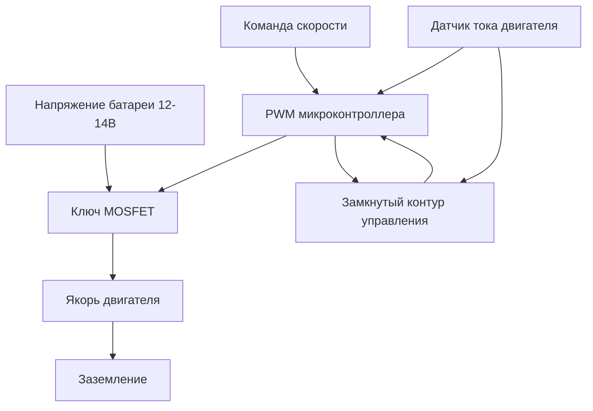
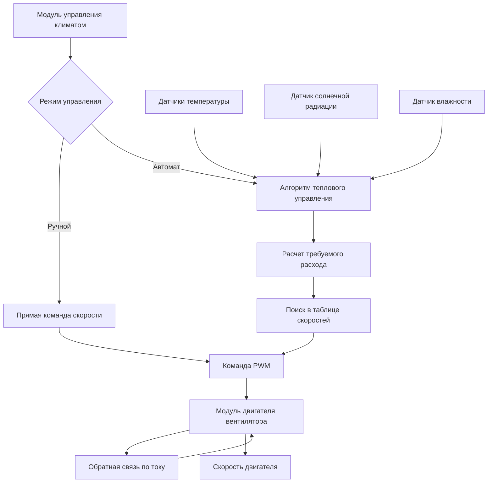

Системы автомобильных вентиляторов служат основными устройствами подачи воздуха в системах HVAC транспортных средств, доставляя кондиционированный воздух через сеть распределения в салоне. Эти центробежные машины должны работать в широком диапазоне напряжений, при экстремальных температурных условиях и различных требованиях статического давления, одновременно минимизируя шум, потребление энергии и электромагнитные помехи.

## Основы центробежного вентилятора

Системы автомобильного HVAC универсально используют центробежные вентиляторы с загнутыми вперед лопатками (конструкция типа "беличья клетка") вместо осевых вентиляторов благодаря их превосходной способности создавать статическое давление против сопротивления воздуховодов и фильтров. Зависимость производительности следует фундаментальным законам вентиляторов.

**Соотношение мощности вентилятора:**

$$P_{fan} = \frac{\dot{V} \cdot \Delta P}{\eta_{total}}$$

Где:
- $P_{fan}$ = мощность на валу (Вт)
- $\dot{V}$ = объемный расход воздуха (м³/с)
- $\Delta P$ = повышение статического давления (Па)
- $\eta_{total}$ = общий КПД (обычно 0,35-0,50 для автомобильных вентиляторов)

**Законы подобия при изменении скорости:**

$$\frac{\dot{V}_2}{\dot{V}_1} = \frac{N_2}{N_1}$$

$$\frac{\Delta P_2}{\Delta P_1} = \left(\frac{N_2}{N_1}\right)^2$$

$$\frac{P_2}{P_1} = \left(\frac{N_2}{N_1}\right)^3$$

Эти соотношения показывают, что удвоение скорости вентилятора удваивает воздушный поток, но увеличивает потребление энергии в восемь раз, что делает управление скоростью критически важным для управления энергией.

## Технологии двигателей

### Сравнение щеточных и бесщеточных двигателей

| Параметр | Щеточный двигатель постоянного тока | Бесщеточный двигатель постоянного тока (BLDC) |
|-----------|------------------|---------------------------|
| КПД | 60-75% | 85-92% |
| Срок службы | 1 000-3 000 ч | 10 000-30 000 ч |
| Генерирование помех | Высокое (искрение щеток) | Низкое (электронная коммутация) |
| Сложность управления | Простое (изменение напряжения) | Сложное (требует контроллера) |
| Стоимость (относительная) | 1,0x | 1,8-2,5x |
| Пульсация момента | 5-10% | 1-3% |
| Диапазон рабочих температур | -20°C до 85°C | -40°C до 105°C |
| Акустическая сигнатура | Широкополосный шум щеток | Тональный электромагнитный шум |

### Физика выбора двигателя

Двигатель должен обеспечивать достаточный момент для преодоления аэродинамического сопротивления вентилятора:

$$T_{required} = \frac{P_{fan} \cdot 60}{2\pi N}$$

Пусковой момент должен превышать статическое трение, обычно 150-200% от номинального момента. Двигатели BLDC превосходны в этом приложении благодаря:

1. **Управление тепловыделением**: Более высокий КПД снижает тепловые потери при компактном расположении под приборной панелью
2. **Надежность**: Отсутствие износа щеток исключает режим отказа в пыльной среде салона
3. **Точность управления**: Электронная коммутация обеспечивает точное регулирование скорости
4. **Допуск напряжения**: Широкий диапазон рабочих напряжений (9-16В) компенсирует падения при пуске и всплески при зарядке

## Методы регулирования скорости

### Реализация PWM управления

Широтно-импульсная модуляция изменяет эффективное напряжение путем переключения двигателя с частотой обычно 15-25 кГц (выше диапазона слышимости, но ниже значительных потерь переключения транзистора).

**Эффективное напряжение:**

$$V_{eff} = V_{battery} \cdot D$$

Где $D$ = коэффициент заполнения (0 до 1)

### Сети резисторов многоскоростного управления

Устаревшие системы используют последовательные резисторы для снижения напряжения и тока:

$$I_{motor} = \frac{V_{battery}}{R_{total} + R_{motor}}$$

Рассеивание мощности в резисторах:

$$P_{resistor} = I_{motor}^2 \cdot R_{resistor}$$

Этот метод тратит энергию в виде тепла (потери 30-50% на низких скоростях) и в значительной степени заменен электронными модулями управления с использованием PWM или линейной регуляции.

### Автоматическое управление вентилятором

Современные системы непрерывно модулируют скорость вентилятора на основе:
- Ошибки температуры в салоне: $\Delta T = T_{setpoint} - T_{cabin}$
- Температуры окружающей среды
- Солнечной нагрузки (через датчик)
- Температуры испарителя (предотвращает обледенение)

**Алгоритм PI управления:**

$$N_{blower} = K_p \cdot \Delta T + K_i \int \Delta T \, dt$$

Где $K_p$ и $K_i$ - коэффициенты пропорционального и интегрального усиления, настроенные на характеристики теплового отклика.

## Характеристики производительности

### Кривые расхода воздуха относительно статического давления

Вентилятор работает в точке пересечения его кривой давления-расхода с кривой сопротивления системы:

$$\Delta P_{system} = K \cdot \dot{V}^2$$

Где $K$ включает геометрию воздуховода, сопротивление фильтра и положения заслонок. По мере загрязнения фильтра частицами $K$ увеличивается, смещая точку работы на более низкие расходы при постоянной скорости.

### Типичные спецификации производительности

| Режим скорости | об/мин | Расход (CFM) | Статическое давление (см вод. ст.) | Мощность (Вт) | Шум (дБА) |
|---------------|-----|-----------------|-------------------------|-----------|-------------|
| Низкая | 1 500 | 120 (204) | 20 | 35 | 42 |
| Средне-низкая | 2 200 | 175 (297) | 30 | 75 | 48 |
| Средняя | 3 000 | 240 (408) | 45 | 140 | 54 |
| Высокая | 4 000 | 320 (544) | 63 | 270 | 62 |

## Звуковые характеристики

Шум вентилятора состоит из трех основных механизмов:

1. **Аэродинамический шум**: Турбулентный поток вокруг краев лопастей генерирует широкополосный шум
   - Масштабируется как $N^5$ до $N^6$ (частота прохождения лопасти)
   - Доминирует выше 3 000 об/мин

2. **Механический шум**: Вибрация подшипника и дисбаланс ротора
   - Тональные компоненты на частоте вращения и гармониках
   - Минимизируется через прецизионную балансировку (класс ISO 1940 G2.5)

3. **Электромагнитный шум**: Пульсация момента двигателя возбуждает резонансы конструкции
   - Двигатели BLDC демонстрируют тональный шум на частоте 6× электрической частоты
   - Смягчается через сенсорное управление FOC (ориентированное на поле управление)

**Оценка уровня звуковой мощности:**

$$L_W = 10 \log_{10}\left(\frac{P_{acoustic}}{P_{ref}}\right) + 120$$

Где $P_{ref} = 10^{-12}$ Вт

Стратегии снижения шума согласно SAE J1477:
- Конструкция входного патрубка с раструбом снижает турбулентность
- Изоляционные крепления вибрации (эластомерные втулки)
- Звукопоглощающее поролоновое покрытие в корпусе вентилятора
- Эксплуатация на переменной скорости при минимально допустимых об/мин

## Оптимизация потребления энергии

Энергоэффективная работа вентилятора уравновешивает доставку воздуха с электрической нагрузкой на генератор, что напрямую влияет на потребление топлива.

**Влияние на потребление топлива:**

$$\dot{m}_{fuel} = \frac{P_{blower}}{\eta_{alternator} \cdot \eta_{engine} \cdot LHV_{fuel}}$$

Для вентилятора мощностью 200 Вт на высокой скорости:
- КПД генератора: 0,60
- КПД двигателя: 0,25
- Низшая теплотворная способность топлива: 43 МДж/кг

Это дает приблизительно 0,015 кг/ч дополнительного расхода топлива, или 0,4% от расхода на холостом ходу.

**Стратегии оптимизации:**
- Расчет тепловой нагрузки салона определяет минимально необходимый расход воздуха
- Использование тепловой массы снижает переходный спрос вентилятора
- Режим рециркуляции снижает тепловую нагрузку на 40-60%
- Системы с переменным хладагентом позволяют более низкий расход при постоянном комфорте

## Архитектура управления

Модуль двигателя вентилятора контролирует ток для обнаружения:
- Условий перегрузки по току (>15А указывает на механическое заедание)
- Недостаточного тока при заданной скорости (указывает на разрыв цепи)
- Заклинивания ротора (высокий ток с нулевой обратной электродвижущей силой)

Современные реализации согласно SAE J2842 осуществляют связь по шине LIN, обеспечивая коды диагностических неисправностей и адаптивное управление на основе измеренной деградации производительности.

## Ссылки на стандарты

- **SAE J1477**: Измерение уровней звука в салоне
- **SAE J2842**: Спецификации двигателя вентилятора HVAC
- **ISO 1940**: Требования к балансировке вибрации
- **AEC-Q100**: Квалификация надежности автомобильной электроники

## Интеграция компонентов

Полная система вентилятора состоит из:
- **Центробежная сборка вентилятора**: Рабочее колесо с загнутыми вперед лопатками, корпус, входной патрубок
- **Двигатель**: Щеточный постоянного тока или BLDC с интегральным или внешним управлением
- **Модуль управления скоростью**: Драйвер PWM, датчик тока, диагностика
- **Сеть резисторов (устаревшее)**: Последовательное сопротивление для многоскоростной работы
- **Изоляция крепления**: Снижает передачу вибрационного шума конструкцией
- **Управление давлением в салоне**: Предотвращает трудность закрывания дверей и шум ветра

Правильный выбор требует согласования характеристик давления-расхода вентилятора с импедансом системы воздуховодов во всех режимах работы, обеспечивая достаточный расход воздуха на обогрев лобового стекла (минимум 204 CFM (м³/ч) согласно SAE J902) при поддержании приемлемых уровней шума и минимизации паразитных электрических нагрузок.
