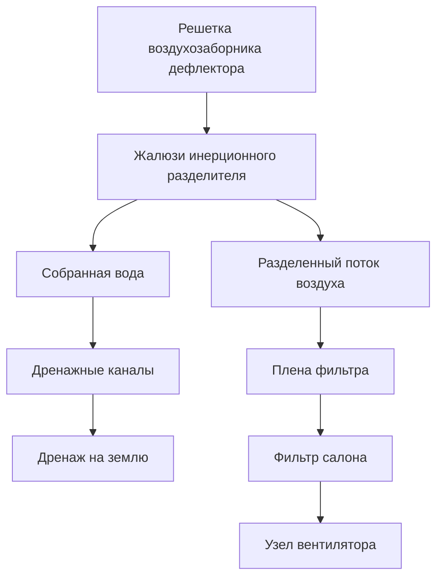
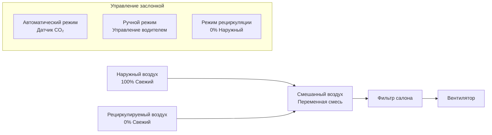

## Системы подачи свежего воздуха в автомобильном HVAC

Системы подачи свежего воздуха в автомобилях обеспечивают вентиляцию путем подачи отфильтрованного наружного воздуха в салон транспортного средства. Эти системы должны преодолевать уникальные проблемы: захват воздуха при скоростях движения от стояния до скоростей на шоссе, разделение воды из поступающего воздуха, фильтрация загрязнений и поддержание адекватных расходов вентиляции в компактной, чувствительной к шуму среде.

## Конструкция воздухозаборника дефлектора

Область дефлектора — место соединения капота и лобового стекла — служит основным поступлением свежего воздуха для большинства автомобилей благодаря благоприятным аэродинамическим и компоновочным характеристикам.

### Эффект тарана воздуха

Движение автомобиля создает динамическое давление на воздухозаборнике дефлектора. Общее доступное давление увеличивается с скоростью в соответствии с:

$$P_{total} = P_{static} + \frac{1}{2}\rho v^2$$

где $\rho$ — плотность воздуха (типично 1,2 кг/м³) и $v$ — скорость автомобиля. При скорости на шоссе (30 м/с или 67 миль/ч), динамическое давление обеспечивает примерно 540 Па, что значительно снижает требуемую мощность вентилятора.

Воздухозаборник дефлектора обычно имеет приподнятую кромку для создания зоны застоя, где скорость воздуха приближается к нулю, а давление максимально. SAE J1503 рекомендует расположение воздухозаборников на расстоянии не менее 150 мм от основания лобового стекла для избежания зон циркуляции.

### Геометрия воздухозаборника

Площадь воздухозаборника дефлектора должна сбалансировать несколько факторов:

| Параметр | Типичный диапазон | Ограничивающий фактор |
|----------|-------------------|----------------------|
| Площадь воздухозаборника | 200-400 см² | Поддержание скорости на фронте <3 м/с на холостом ходу |
| Коэффициент открытой площади решетки | 40-60% | Разделение воды и потеря давления |
| Угол жалюзи | 20-45° от горизонтали | Исключение дождя и расход воздуха |
| Объем плены | 3-8 литров | Восстановление давления и осаждение воды |

Скорость на фронте воздухозаборника должна оставаться ниже 3 м/с при типичных настройках вентилятора для минимизации шума воздухозаборника и аэродинамических потерь.

## Разделение дождя и воды

Разделение воды полагается на инерционный удар — использование отношения плотности 800:1 между водяными каплями и воздухом.

### Физика разделения

Когда воздух меняет направление через жалюзи, капли продолжают движение в своей исходной траектории из-за инерции. Эффективность разделения зависит от числа Стокса:

$$Stk = \frac{\rho_p d_p^2 v}{18\mu D_c}$$

где:
- $\rho_p$ = плотность частиц (капель) (1000 кг/м³ для воды)
- $d_p$ = диаметр капли
- $v$ = скорость подхода
- $\mu$ = динамическая вязкость воздуха (1,8 × 10⁻⁵ Па·с)
- $D_c$ = характерный размер (расстояние между жалюзи)

Эффективное разделение происходит при Stk > 1. Для капель размером 100 мкм при скорости 5 м/с через расстояние между жалюзи 10 мм, Stk ≈ 1,5, обеспечивая эффективность разделения >85%.

### Система дренажа

Дренажные каналы должны справляться с максимальным расходом воды, обычно рассчитываемым на интенсивность осадков 100 мм/ч (экстремальные условия). При скорости движения автомобиля с эффективной площадью захвата 0,04 м² это представляет примерно 67 мл/мин расход. Определение размера дренажного отверстия следует стандартным гидравлическим соотношениям с минимальным диаметром 8 мм для предотвращения засорения мусором.

## Фильтрация воздуха салона

Современные фильтры салона обеспечивают двухступенчатую фильтрацию: удаление частиц и адсорбция газообразных загрязнений.

### Механизмы фильтрации частиц

Три физических механизма доминируют в захвате частиц:

**Перехват**: Частицы, следующие линиям тока, контактируют с волокнами, когда их радиус приносит их в пределах одного радиуса поверхности волокна. Эффективность сбора путем перехвата:

$$\eta_R = \frac{1}{K_u}(1 + R)\left(\frac{d_p}{d_f}\right)^2$$

где $R$ — параметр перехвата и $K_u$ — гидродинамический фактор Кувабары.

**Диффузия**: Броуновское движение вызывает отклонение частиц <0,5 мкм от линий тока. Эффективность диффузии увеличивается при уменьшении размера частиц:

$$\eta_D = 2.6\left(\frac{1}{K_u}\right)^{1/3}\left(\frac{D}{v \cdot d_f}\right)^{2/3}$$

где $D$ — коэффициент диффузии частиц.

**Удар**: Частицы >1 мкм с достаточной инерцией прямо ударяют волокна. Эффективность удара зависит от числа Стокса для потока вокруг цилиндрических волокон.

### Спецификации производительности фильтра

| Тип фильтра | Размер частиц | Эффективность | Начальный ΔP | Емкость по пыли |
|-------------|----------------|--------------|--------------|------------------|
| Стандартный фильтр частиц | 3-10 мкм | 80-90% | 25-40 Па | 30-50 г |
| Высокоэффективный | 0,3-10 мкм | >95% | 40-60 Па | 40-70 г |
| HEPA (автомобильный) | 0,3 мкм | >99,97% | 80-120 Па | 20-40 г |

HEPA фильтры в автомобильных приложениях сталкиваются с проблемами, связанными с ограниченным пространством и производительностью вентилятора. Высокая начальная потеря давления (80-120 Па) требует более мощных вентиляторов и снижает расход воздуха в системе на 15-25% по сравнению со стандартными фильтрами.

### Слой активированного угля

Газообразные загрязнители (NOₓ, летучие органические соединения, озон) не захватываются механизмами фильтрации частиц. Слои активированного угля используют физическую адсорбцию на гранулах углерода с высокой удельной площадью поверхности.

Емкость по адсорбции угля следует изотерме Ленгмюра для однокомпонентной адсорбции:

$$q = q_{max}\frac{K_{ads}C}{1 + K_{ads}C}$$

где $q$ — адсорбированное количество на единицу массы углерода, $q_{max}$ — максимальная емкость, $K_{ads}$ — константа равновесия адсорбции, и $C$ — концентрация в газовой фазе.

Типичные автомобильные углеродные слои содержат 50-150 г активированного угля с удельными площадями поверхности 800-1200 м²/г, обеспечивая начальную эффективность удаления >90% для запахов и >60% для NO₂. Углерод насыщается после 12 000-25 000 км в зависимости от уровней воздействия.

### Критерии замены фильтра

Замените фильтр салона, когда:

- Потеря давления превышает 200 Па при номинальном расходе
- Расход воздуха снижается на >30% по сравнению с чистым фильтром
- Видимое загрязнение или биологический рост
- Углеродный слой насыщен (обычно 1 год или 20 000 км)

Потеря давления увеличивается примерно линейно с накопленной массой пыли до тех пор, пока фильтр не начнет уплотняться, затем растет экспоненциально по мере перехода глубокой фильтрации в поверхностную фильтрацию.

## Работа заслонки подачи свежего воздуха

Заслонка свежего воздуха контролирует отношение наружного воздуха к рециркулируемому воздуху салона.

### Положения заслонки и смешивание

Приводы заслонок используют вакуумные сервосистемы, электрические шаговые двигатели или двигатели постоянного тока с обратной связью по положению. Время отклика обычно варьируется от 2-5 секунд для полного хода для минимизации переходных процессов температуры или давления.

### Расходы вентиляции для качества воздуха

SAE J1503 рекомендует минимальные расходы вентиляции на основе объема салона и занятости:

$$Q_{vent} = N \cdot V_{person} + V_{cabin} \cdot ACH_{min}$$

где:
- $N$ = количество пассажиров
- $V_{person}$ = 7-10 л/с на человека (15-21 CFM)
- $V_{cabin}$ = объем салона (обычно 3-5 м³)
- $ACH_{min}$ = минимальная кратность воздухообмена (0,5-1,0 ACH)

Для типичного седана (салон 4 м³, 2 пассажира):

$$Q_{vent} = 2 \times 8 + 4 \times \frac{1}{3600} \times 3600 \times 0,75 = 16 + 3 = 19 \text{ л/с (40 CFM)}$$

### Управление с регулированием по CO₂

Современные системы измеряют концентрацию CO₂ в салоне для модулирования положения заслонки подачи свежего воздуха. Приемлемые уровни CO₂ варьируются от 800-1200 ppm выше окружающей среды (наружный обычно 400-450 ppm). Человеческое дыхание производит примерно 0,3 л/мин CO₂ на человека в состоянии покоя, увеличиваясь до 1-2 л/мин во время активности.

Массовый баланс CO₂ в салоне:

$$V_{cabin}\frac{dC}{dt} = N \cdot G_{CO_2} - Q_{vent}(C - C_{ambient})$$

В установившемся состоянии требуемый расход вентиляции для поддержания целевого уровня CO₂ становится:

$$Q_{vent} = \frac{N \cdot G_{CO_2}}{C_{target} - C_{ambient}}$$

Для 2 пассажиров, производящих по 0,3 л/мин CO₂ каждый, поддержание 1000 ppm выше окружающей среды требует примерно 20 л/с расход вентиляции, подтверждая руководство SAE J1503.

## Рассмотрения интеграции системы

Конструкция системы подачи свежего воздуха должна решать:

- **Герметизация корпуса фильтра**: Утечка, обходящая фильтр, аннулирует фильтрацию. Сжатие прокладки 20-30% и ширина уплотнения >8 мм обеспечивают <2% утечку.
- **Производительность вентилятора**: Общая потеря давления в системе (воздухозаборник + фильтр + воздуховоды + выходы) обычно варьируется 150-400 Па. Центробежные вентиляторы с загнутыми назад лопатками обеспечивают эффективность 40-60%.
- **Контроль шума**: Скорости воздухозаборника >6 м/с генерируют шум турбулентности. Объемы плены >5 литров ослабляют пульсации от работы вентилятора.
- **Управление конденсатом**: Перепад температуры на катушке испарителя может произвести 2-4 л/ч конденсата во влажных условиях. Системы дренажа должны предотвращать обратное попадание воды в корпус фильтра.

## Ссылки

- SAE J1503: Ventilation Air Change Rates for Light-Duty Vehicles
- SAE J1669: Platform Lift and Wheelchair Lift Design for Stationary Vehicle Applications (стандарты объема салона)
- ISO 11155-1: Road vehicles — Air filters for passenger compartments
