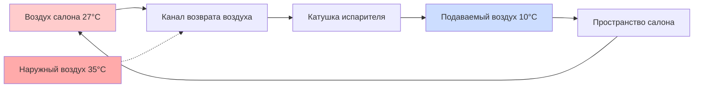
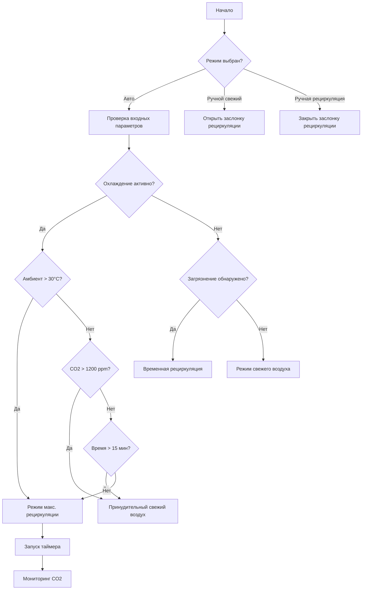

Режим рециркуляции перенаправляет воздух салона обратно через систему HVAC вместо забора свежего наружного воздуха, создавая замкнутую схему циркуляции воздуха. Этот режим работы принципиально изменяет термодинамические и параметры качества воздуха в салоне транспортного средства, обеспечивая значительные преимущества в производительности охлаждения и изоляции от загрязнения за счет увеличения концентрации углекислого газа и накопления влаги.

## Термодинамические преимущества

Основное преимущество режима рециркуляции вытекает из сниженного температурного перепада между подаваемым воздухом и теплообменником. Когда система кондиционирования воздуха работает в режиме свежего воздуха, она должна охладить наружный воздух от температуры окружающей среды $T_{amb}$ до требуемой температуры подачи $T_{discharge}$. В режиме рециркуляции система обрабатывает воздух салона, уже частично охлажденный до температуры $T_{cabin}$.

Снижение нагрузки охлаждения можно количественно оценить через передачу явного тепла:

$$Q_{sensible} = \dot{m} \cdot c_p \cdot (T_{inlet} - T_{discharge})$$

где $\dot{m}$ представляет массовый расход и $c_p$ — удельная теплоемкость воздуха (1,005 кДж/кг·К). В жаркий день при $T_{amb} = 35°C$ и $T_{cabin} = 27°C$ режим рециркуляции снижает температурный перепад приблизительно на 8°C, уменьшая нагрузку явного охлаждения на 30–40%.

Это термодинамическое преимущество приводит к более быстрому охлаждению салона, снижению нагрузки на компрессор и повышению эффективности расхода топлива. Испытания SAE J2765 показывают, что режим рециркуляции может сократить время охлаждения салона на 25–35% по сравнению с работой на свежем воздухе.

## Накопление углекислого газа

Замкнутая природа режима рециркуляции создает неизбежное последствие: накопление метаболического CO2. Каждый пассажир выделяет примерно 0,3–0,4 л/мин CO2 через дыхание. В типичном салоне седана объемом 3,5 м³ эта скорость выделения вызывает быстрое увеличение концентрации.

Скорость накопления CO2 подчиняется следующему соотношению:

$$\frac{dC_{CO_2}}{dt} = \frac{n \cdot G_{CO_2}}{V_{cabin}} - \frac{Q_{fresh} \cdot (C_{CO_2} - C_{ambient})}{V_{cabin}}$$

где:
- $n$ = количество пассажиров
- $G_{CO_2}$ = скорость выделения CO2 на одного человека (л/мин)
- $V_{cabin}$ = объем салона (м³)
- $Q_{fresh}$ = скорость инфильтрации свежего воздуха (м³/мин)
- $C_{ambient}$ = концентрация CO2 на улице (обычно 400 ppm)

При чистой рециркуляции ($Q_{fresh} = 0$) и двух пассажирах уровень CO2 в салоне повышается примерно на 140 ppm в минуту. Начиная с амбиентных условий, концентрация достигает 1000 ppm в течение 5 минут и 2000 ppm в течение 12 минут.

| Время (мин) | Уровень CO2 (ppm) | Влияние на когнитивные функции |
|-------------|-------------------|-------------------------------|
| 0 | 400 | Базовое качество наружного воздуха |
| 5 | 1000 | Допустимый предел ASHRAE |
| 10 | 1700 | Пороговая сонливость |
| 15 | 2400 | Измеримое нарушение когнитивных функций |
| 20 | 3100 | Значительное снижение производительности |

Повышенные концентрации CO2 выше 1000 ppm, как показано, нарушают принятие решений и увеличивают время реакции, создавая проблемы безопасности при длительной работе в режиме рециркуляции.

## Стратегии автоматического управления

Современные автомобили используют сложные алгоритмы управления для балансировки термальных преимуществ рециркуляции с требованиями качества воздуха. Эти стратегии обычно используют многовходовую логику принятия решений:

### Режим максимального охлаждения

Режим максимального охлаждения обеспечивает максимальную рециркуляцию при начальном охлаждении, когда температура в салоне значительно превышает установку. Этот режим работает при следующих условиях:

- Температура амбиента > 30°C
- Температура салона > установка + 5°C
- Компрессор AC включен
- Лимит времени не превышен (обычно 10–20 минут)

Система автоматически переходит на частичный свежий воздух после приближения температуры салона к установке или при истечении лимита времени.

### Переключение по загрязнению воздуха

Датчики качества воздуха обнаруживают повышенные концентрации вредных соединений в наружном воздухе и автоматически закрывают заслонку рециркуляции для защиты пассажиров. Распространенные типы датчиков включают:

**Датчики на основе оксида металла**: Обнаруживают VOC, NOx и общее качество воздуха через изменения сопротивления в нагреваемых пленках оксида металла. Время отклика обычно 5–15 секунд с чувствительностью к концентрациям вплоть до 0,1 ppm для определенных соединений.

**Электрохимические датчики CO**: Специально предназначены для обнаружения монооксида углерода из выхлопа транспортных средств. Обеспечивают линейный отклик в диапазоне 0–100 ppm с точностью ±5 ppm.

**NDIR датчики CO2**: Измеряют уровни CO2 в салоне с использованием инфракрасного поглощения на длине волны 4,26 мкм. Точность обычно ±30 ppm с диапазоном измерений 0–5000 ppm.

| Загрязнитель | Источник | Пороговое значение (ppm) | Тип датчика |
|--------------|----------|------------------------|------------|
| CO | Выхлоп автомобиля | 9 (среднее за 8 часов) | Электрохимический |
| NOx | Выхлоп дизельных двигателей | 0,05 | Оксид металла |
| VOCs | Промышленные зоны | Варьируется | Оксид металла |
| CO2 | Дыхание пассажиров | 1000 | NDIR |

### Обнаружение туннеля

Многие системы используют данные GPS или датчики света для обнаружения входа в туннель, автоматически переключаясь на рециркуляцию для предотвращения попадания выхлопа высокой концентрации. При выходе из туннеля система реализует цикл продувки свежим воздухом с временной задержкой для эвакуации накопленного CO2.

## Предотвращение запотевания окон

Режим рециркуляции увеличивает влажность салона благодаря дыханию и потоотделению пассажиров, повышая температуру точки росы. Когда температура внутренних стеклянных поверхностей падает ниже этой точки росы, образуется конденсат.

Скорость выделения влаги на одного пассажира составляет примерно 40–60 г/час в нормальных условиях. В запечатанном салоне относительная влажность повышается со скоростью:

$$\frac{d\phi}{dt} = \frac{n \cdot G_{H_2O}}{V_{cabin} \cdot \rho_{sat}(T)}$$

где $\rho_{sat}(T)$ — плотность насыщенного пара при температуре салона.

Для предотвращения запотевания системы управления HVAC контролируют:

- Температуру ветрового стекла (через инфракрасный датчик или модельную оценку)
- Относительную влажность салона (емкостной или резистивный датчик)
- Температуру точки росы (рассчитывается из температуры и влажности)

Когда температура ветрового стекла приближается к точке росы в пределах 2–3°C, система автоматически переключается на режим свежего воздуха и направляет поток воздуха к вентиляционным отверстиям обогрева лобового стекла, независимо от установок пассажиров.

## Циклы продувки свежим воздухом

Для управления накоплением CO2 при сохранении преимуществ энергоэффективности рециркуляции современные системы реализуют периодические циклы продувки свежим воздухом. Типовые стратегии включают:

- **На основе времени**: Принудительное свежее воздушное питание в течение 2–3 минут каждые 15–20 минут непрерывной рециркуляции
- **На основе CO2**: Поддержание уровня CO2 в салоне ниже 1200–1500 ppm через замкнутое управление заслонкой
- **Частичная рециркуляция**: Постоянное смешивание 70–80% рециркулированного воздуха с 20–30% свежего воздуха

Эффективность воздухообмена во время циклов продувки зависит от расположения подаваемого воздуха и смешивания в салоне. Полный обмен воздуха требует примерно:

$$t_{purge} = \frac{V_{cabin}}{Q_{supply}} \cdot \ln\left(\frac{C_{initial} - C_{ambient}}{C_{target} - C_{ambient}}\right)$$

Для типичных объемов салона и скоростей подачи воздуха 254–339 CFM (430–575 м³/ч) снижение CO2 с 2000 ppm до 800 ppm требует 3–4 минут работы со 100% свежим воздухом.

## Компоненты

- Заслонка рециркуляции
- Рециркуляция режима максимального охлаждения
- Рециркуляция на основе качества воздуха
- Автоматическое управление рециркуляцией
- Автоматическая рециркуляция при обнаружении туннеля
- Управление рециркуляцией по датчику загрязнения
- Датчик CO2 в салоне
- Датчик VOC в салоне
- Лимит времени рециркуляции
- Цикл продувки свежим воздухом
