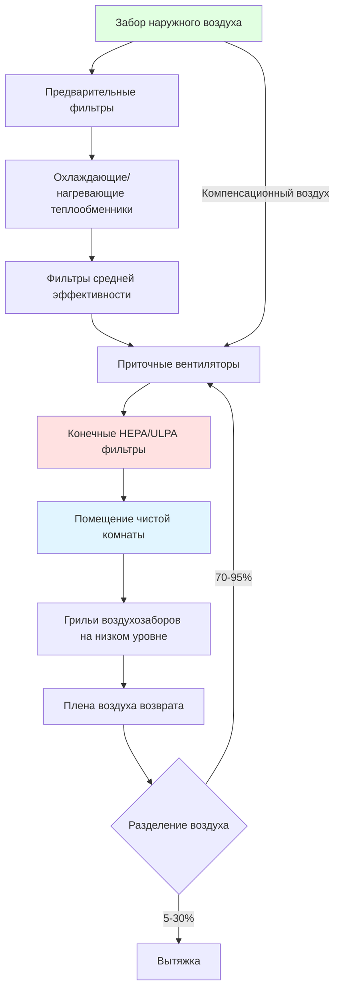

Системы вентиляции и кондиционирования воздуха чистых помещений представляют собой высокоспециализированные приложения экологического контроля, где контролирование загрязнения частицами, температуры, влажности и давления должны поддерживаться в чрезвычайно узких допусках. Эти контролируемые среды необходимы для отраслей, где даже микроскопические загрязнения могут нарушить качество продукции или целостность исследований.

## Основы чистых помещений

Чистые помещения классифицируются по максимально допустимой концентрации частиц на кубический метр воздуха. ISO 14644-1 определяет классификацию чистых помещений от ISO Class 1 (наименьшее количество частиц) до ISO Class 9. Классификация непосредственно определяет требования к системе вентиляции и кондиционирования, причем более чистые классы требуют экспоненциально более высоких кратностей воздухообмена и эффективности фильтрации.

Основные источники загрязнения включают:
- Персонал (чешуйки кожи, волосы, волокна одежды)
- Технологическое оборудование и материалы
- Материалы конструкции объекта
- Инфильтрация наружного воздуха

Проектирование чистых помещений следует строгим принципам зонирования, где давление каскадирует от самых чистых к менее чистым областям, предотвращая обратный поток загрязнения. Типичные перепады давления составляют от 12 до 48 Па между соседними зонами.

## Ключевые компоненты систем вентиляции и кондиционирования

Системы вентиляции и кондиционирования чистых помещений состоят из нескольких критических компонентов, работающих в совокупности:

**Высокоэффективная фильтрация**: HEPA фильтры (эффективность 99,97% при 0,3 мкм) или ULPA фильтры (эффективность 99,9995% при 0,12 мкм) устанавливаются в конечных точках подачи, обычно в потолке в виде полного покрытия массива фильтр-вентилятор-модуль (FFU) или отдельных диффузоров подачи. Предварительные фильтры и мешочные фильтры в приточных вентиляционных установках защищают дорогостоящие конечные фильтры и продлевают срок их службы.

**Приточные вентиляционные установки**: Приточные установки для чистых помещений имеют увеличенные секции фильтров, резервные вентиляторы, преобразователи частоты для точного управления воздушным потоком и надежную конструкцию для минимизации образования частиц. Охлаждающие и осушающие теплообменники должны быть спроектированы для предотвращения переноса влаги, которая могла бы переносить частицы.

**Системы рециркуляции**: Для достижения требуемых кратностей воздухообмена экономично чистые помещения обычно рециркулируют 70-95% воздуха подачи. Воздухозаборы на низкой стене или уровне пола захватывают нисходящий ламинарный поток, удаляя частицы близко к источнику их образования.

**Контроль давления**: Специализированные системы контроля давления используют модулирующие заслонки или вентиляторы переменной скорости вытяжки для поддержания положительного давления. Системы автоматизации зданий непрерывно контролируют перепад давления на критических барьерах и в реальном времени регулируют воздушные потоки.

## Кратность воздухообмена и рециркуляция

Кратность воздухообмена непосредственно определяет эффективность удаления частиц. Связь между кратностью воздухообмена в час (ACH) и затуханием концентрации частиц следует кинетике первого порядка:

$$C(t) = C_0 \cdot e^{-\frac{ACH \cdot t}{60}}$$

где $C(t)$ — концентрация частиц в момент времени $t$ (минуты), $C_0$ — начальная концентрация, и ACH — кратность воздухообмена в час.

Типичные кратности воздухообмена по классам чистых помещений:

| ISO Class | Частиц/м³ (≥0,5 мкм) | Воздухообмены/час | Характер потока воздуха |
|-----------|----------------------|------------------|------------------------|
| ISO 3 | 35 | 300-600 | Унидиректциональный |
| ISO 4 | 352 | 300-600 | Унидиректциональный |
| ISO 5 | 3 520 | 240-480 | Унидиректциональный |
| ISO 6 | 35 200 | 90-180 | Неунидиректциональный |
| ISO 7 | 352 000 | 30-60 | Неунидиректциональный |
| ISO 8 | 3 520 000 | 15-30 | Неунидиректциональный |

Требование к наружному воздуху для поддержания давления и вентиляции для персонала рассчитывается как:

$$Q_{OA} = \text{max}(Q_{vent}, Q_{press} + Q_{leak})$$

где $Q_{vent}$ = вентиляция на основе занятости (типично 0,16-0,32 м³/(ч·чел.)), $Q_{press}$ = намеренный расход вытяжки, и $Q_{leak}$ = утечка ограждения (типично 2-5% расхода подачи).

## Принципы контроля загрязнения

Эффективный контроль загрязнения требует интегрированных стратегий:

**Контроль источника**: Протоколы облачения персонала, шлюзы материального переноса и защитные кожухи технологического оборудования минимизируют образование частиц. Совместимые с чистым помещением материалы (нержавеющая сталь, неосыпающиеся пластики) указаны повсеместно.

**Управление воздушным потоком**: Унидиректциональный (ламинарный) поток воздуха при скорости 27 ± 6 м/мин сносит частицы от критических рабочих зон. Неунидиректциональный (турбулентный) поток воздуха с несколькими точками подачи и низкими воздухозаборами обеспечивает адекватное перемешивание для менее критических помещений.

**Стратегия фильтрации**: Многоступенчатая фильтрация защищает последующие компоненты и поддерживает эффективность удаления частиц. Типичная последовательность: жалюзи наружного воздуха → 30% MERV 8 → 85% MERV 14 → 99,97% HEPA.

**Контроль давления**: Поддержание положительного давления (типично 48-120 Па выше соседних помещений) предотвращает инфильтрацию нефильтрованного воздуха. Шлюзы и каскадные зоны давления изолируют самые чистые области.

## Требования, специфичные для отраслей

### Фармацевтическое производство

Фармацевтические чистые помещения должны соответствовать FDA 21 CFR Part 211 и EU GMP Annex 1. Критические рассмотрения включают:

- **Зоны Grade A**: ISO 5 при работе, унидиректциональный поток при критических точках наполнения/передачи
- **Зоны Grade B**: ISO 5-7 в фоне для операций Grade A
- **Зоны Grade C/D**: ISO 7-8 для менее критических этапов производства
- **Температура**: 20 ± 2°C типичная, с более жестким контролем (±0,5°C) для термочувствительных процессов
- **Влажность**: 30-50% ОВ, с более низкой влажностью (≤35% ОВ) для гигроскопичных материалов
- **Микробный контроль**: Активное отбор проб воздуха, контроль поверхностей и протоколы санитизации

Фармацевтические чистые помещения часто требуют совместимости со стерилизацией на месте (SIP) или парофазной стерилизацией перекисью водорода (VHP).

### Производство полупроводников

Полупроводниковые фабрики требуют самых чистых сред, обычно ISO 3-5, с уникальными требованиями:

- **Контроль молекулярного загрязнения**: Химическая фильтрация для переносимых по воздуху молекулярных загрязнений (AMCs), которые влияют на фотолитографию
- **Защита от электростатического разряда (ESD)**: Системы ионизации, проводящие полы, контроль влажности (40-60% ОВ)
- **Процессная вытяжка**: Специализированные системы промывки для едких и токсичных технологических газов
- **Контроль вибрации**: Изолированное крепление оборудования для предотвращения смещения фотолитографии
- **Стабильность температуры**: ±0,1°C в областях фотолитографии для поддержания размерной стабильности

Экстремальные кратности воздухообмена (400-600 ACH) и 100% покрытие потолка FFUs создают расход воздуха:

$$Q = \frac{A \cdot v}{0,00167}$$

где $Q$ — воздушный поток (м³/ч), $A$ — площадь этажа (м²), $v$ — лицевая скорость (м/мин, типично 27), и коэффициент преобразования составляет 1/0,00167.

## Соображения энергоэффективности

HVAC чистых помещений представляет одно из самых энергоемких приложений зданий, потребляя в 10-100 раз больше энергии на квадратный метр, чем обычные здания. Стратегии энергоэффективности включают:

**Управление по требованию**: Снижение расхода воздуха в неиспользуемые периоды при сохранении минимального расхода для поддержания давления. Чистые помещения ISO 5 часто могут снизить мощность со 100-150 м³/(ч·м²) до 25-40 м³/(ч·м²) в режиме неиспользуемого ожидания.

**Рекуперация тепла**: Колеса рекуперации энергии или пластинчатые теплообменники захватывают энергию охлаждения/отопления из вытяжного воздуха. В фармацевтических приложениях они должны предотвращать перекрестное загрязнение.

**Экономайзерная работа**: Свободное охлаждение через наружный воздух, когда условия позволяют, хотя и ограниченное требованиями контроля влажности и частиц.

**Высокоэффективное оборудование**: Двигатели премиум-эффективности, вентиляторы на магнитных подшипниках и оптимизированный дизайн воздуховодов снижают энергию вентиляторов. Каждое снижение перепада давления на 25 Па экономит примерно 25% энергии вентилятора.

**Оптимизация температуры и влажности**: Расширение допустимых диапазонов (например, 20-24°C вместо 21±1°C) значительно снижает энергию охлаждения и повторного нагрева при сохранении совместимости процесса.

Энергия вентилятора для рециркуляции может быть оценена как:

$$P = \frac{Q \cdot \Delta P}{3791 \cdot \eta_{fan} \cdot \eta_{motor}}$$

где $P$ — мощность (кВт), $Q$ — воздушный поток (м³/ч), $\Delta P$ — полное давление (Па), и $\eta$ представляет эффективности (типично 0,65-0,75 для вентилятора, 0,93-0,96 для двигателя).

## Приложения чистых помещений по отраслям

| Отрасль | ISO Class | Ключевые требования | Критические параметры |
|---------|-----------|-------------------|----------------------|
| Полупроводниковое производство | ISO 3-5 | Контроль AMC, защита ESD | Температура ±0,1°C, 40-60% ОВ |
| Стерильные фармацевтические препараты | ISO 5-7 | Контроль жизнеспособных частиц, SIP совместимость | 20±2°C, 30-50% ОВ, микробные пределы |
| Сборка медицинских устройств | ISO 6-8 | Контроль твердых частиц, совместимость материалов | 20-24°C, <60% ОВ |
| Биотехнология | ISO 6-8 | Биобезопасность, стабильность температуры | 18-26°C, зависимая от процесса влажность |
| Сборка аэрокосмических деталей | ISO 7-8 | Большой объем, контроль пыли | Стандартные условия комфорта |
| Производство оптики/линз | ISO 5-7 | Контроль влажности, контроль статики | 20±1°C, 40-50% ОВ |
| Пищевая промышленность (асептическая) | ISO 5-7 | Санитизируемые поверхности, контроль жизнеспособности | 4-10°C типичная, низкая влажность |
| Исследовательские лаборатории | ISO 6-8 | Гибкость, зонирование | Переменная в зависимости от эксперимента |

Системы вентиляции и кондиционирования чистых помещений требуют тщательного проектирования, наладки и постоянного мониторинга для поддержания производительности. Инвестиция в сложный экологический контроль непосредственно защищает качество продукции и выход процесса в загрязнечувствительных производственных и исследовательских операциях.
