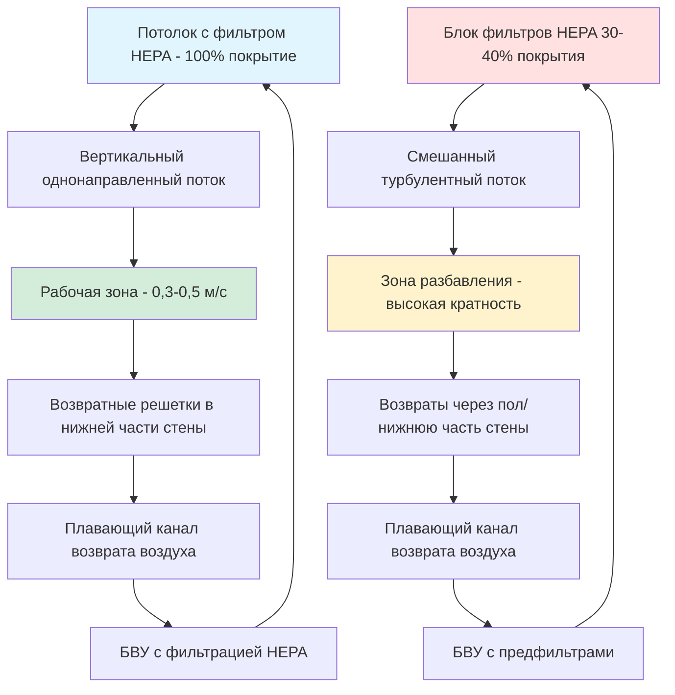

Паттерны потока воздуха представляют собой фундаментальный проектный параметр производительности чистого помещения. Конфигурация потока воздуха непосредственно определяет эффективность удаления частиц, результативность контроля загрязнения и достижение классификации чистого помещения.

## Однонаправленный и неоднонаправленный потоки

**Однонаправленный поток** (обычно называемый ламинарным потоком) обеспечивает параллельные линии потока воздуха, движущиеся в одном направлении с однородной скоростью. Этот паттерн уносит частицы от критических процессов согласованным, предсказуемым образом. Истинный однонаправленный поток проявляет минимальную турбулентность и завихрения, которые могли бы захватить или перенаправить загрязнители.

**Неоднонаправленный поток** полагается на турбулентное смешивание для разбавления переносимых по воздуху частиц. Приточный воздух поступает через потолочные диффузоры или фильтры HEPA, смешивается с воздухом помещения и разбавляет загрязнение до приемлемых концентраций. Этот подход дешевле однонаправленных систем, но достигает более низких уровней чистоты.

Выбор между паттернами зависит от требований классификации ISO:
- Классы ISO 1-4: требуется однонаправленный поток
- Класс ISO 5: однонаправленный поток обычно требуется для критических зон
- Классы ISO 6-8: приемлем неоднонаправленный поток

## Вертикальный и горизонтальный ламинарный потоки

**Вертикальный однонаправленный поток** подает воздух через полный потолок фильтров HEPA или ULPA, направляя поток вниз к возвратным отверстиям в нижней части стены или в поднятый пол. Эта конфигурация обеспечивает оптимальное удаление частиц, так как гравитация способствует перемещению частиц вниз от рабочих поверхностей.

Скорость вертикального потока обычно колеблется от 0,3 до 0,5 м/с. Связь между скоростью и удалением частиц следует выражению:

$$\eta = 1 - e^{-\frac{v_s \cdot t}{H}}$$

где $\eta$ — эффективность удаления, $v_s$ — скорость осадки, $t$ — время, а $H$ — высота помещения.

**Горизонтальный однонаправленный поток** направляет воздух от фильтровальной стены через помещение к противоположной возвратной стене. Этот паттерн хорошо подходит для контролируемых процессов, требующих доступа персонала сверху или снизу. Горизонтальный поток требует тщательного размещения оборудования и персонала во избежание эффектов волны, нарушающих линии потока.

Горизонтальные системы требуют более высоких скоростей (0,4-0,5 м/с) для преодоления гравитационного осаждения частиц, движущихся в боковом направлении.

## Кратность воздухообмена по классификациям

Кратность воздухообмена определяет эффективность разбавления в неоднонаправленных чистых помещениях. Требуемая кратность увеличивается с более строгими классификациями:

| Класс ISO | Кратность воздухообмена, ч⁻¹ | Типичная скорость (однонаправленный) | Паттерн потока |
|-----------|---------------------|----------------------------------|-----------------|
| ISO 3 | N/A | 0,4-0,5 м/с | Однонаправленный |
| ISO 4 | N/A | 0,3-0,5 м/с | Однонаправленный |
| ISO 5 | 240-480 | 0,3-0,45 м/с | Однонаправленный или смешанный |
| ISO 6 | 90-180 | N/A | Неоднонаправленный |
| ISO 7 | 40-70 | N/A | Неоднонаправленный |
| ISO 8 | 15-25 | N/A | Неоднонаправленный |

Связь между кратностью воздухообмена и концентрацией частиц следует экспоненциальному затуханию первого порядка:

$$C(t) = C_0 \cdot e^{-\frac{ACH}{60} \cdot t}$$

где $C(t)$ — концентрация частиц в момент времени $t$, $C_0$ — начальная концентрация, а $ACH$ — кратность воздухообмена, ч⁻¹.

## Стратегии возвратного воздуха

Размещение возвратного воздуха критически влияет на эффективность паттерна потока.

**Возвратные отверстия в нижней части стены** размещают решетки на высоте 150-300 мм от пола. Эта конфигурация улавливает частицы, уносимые вниз вертикальным однонаправленным потоком, прежде чем они накапливаются на полу. Возвратные отверстия в нижней части стены создают оптимальные паттерны линий потока в помещениях с вертикальным потоком.

**Возвраты через поднятый пол** обеспечивают равномерный возврат по всей площади пола через перфорированные панели пола. Этот подход обеспечивает наиболее равномерный вертикальный паттерн потока, но требует значительных инвестиций в строительство. Перепад давления через перфорированные полы обычно колеблется от 12-25 Па.

Скорость возврата через решетки в нижней части стены должна оставаться ниже 2,5 м/с во избежание повторного увлечения частиц. Для перфорированных полов скорость через перфорации не должна превышать 0,6 м/с.

## Требования к скорости в турбулентном и ламинарном потоках

Требования к скорости принципиально различаются между паттернами потока:

**Ламинарный (однонаправленный) поток:**
- Стандартная скорость: 0,36-0,45 м/с
- Равномерность: ±20% по площади фильтра
- Максимальное отклонение: 0,15 м/с от средней скорости

**Турбулентный (неоднонаправленный) поток:**
- Скорость подачи: 2,5-5,0 м/с на диффузоре
- Скорость в помещении: <0,2 м/с в зоне обитания
- Дальность выброса: Высота потолка × 4 к 6

Число Рейнольдса определяет переход режима потока:

$$Re = \frac{\rho \cdot v \cdot L}{\mu}$$

Для приложений чистых помещений $Re < 2300$ указывает на ламинарные условия, тогда как $Re > 4000$ указывает на турбулентный поток.

## Визуализация и валидация потока воздуха

Валидация паттерна потока воздуха проверяет производительность проекта несколькими методами:

**Исследования дыма** выпускают театральный дым или аэрозольные потоки для визуализации паттернов потока. Наблюдения выявляют зоны циркуляции, мертвые зоны и нарушения потока. Этот качественный метод обеспечивает немедленную визуальную обратную связь, но требует экспертного толкования.

**Картирование концентрации частиц** измеряет переносимые по воздуху частицы в нескольких местоположениях во время работы. Картирование выявляет зоны с плохим удалением частиц, указывающие на недостаточный поток воздуха. Концентрации должны оставаться равномерными во всех зонах однонаправленного потока.

**Измерения скорости** с использованием термоанемометров проверяют равномерность и величину. ISO 14644-3 требует измерений с интервалом сетки приблизительно 0,6 м по площади фильтров. Каждая точка должна находиться в пределах установленных допусков.

**Моделирование вычислительной гидродинамики (CFD)** предсказывает паттерны потока воздуха до строительства. CFD выявляет проблемы проекта на ранних этапах, но требует валидации через физическое тестирование после установки.

**Испытание восстановления** измеряет время, требуемое для снижения концентрации частиц на 90% или 99% после события загрязнения. Эта метрика непосредственно оценивает практическую эффективность паттерна потока в условиях возмущения.

Надлежащее проектирование и валидация паттерна потока воздуха обеспечивает соответствие производительности чистого помещения требованиям процесса при оптимизации энергопотребления и затрат на строительство.
