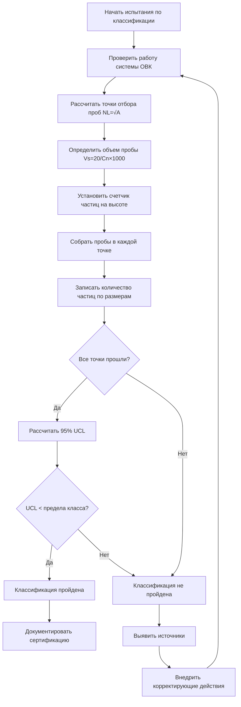

## Система классификации ISO 14644-1

ISO 14644-1 устанавливает международный стандарт для классификации чистых помещений на основе чистоты воздуха от взвешенных частиц. Классификация присваивает классы чистых помещений от ISO 1 (самый чистый) до ISO 9 (наименее чистый) на основе максимально допустимой концентрации частиц на кубический метр воздуха для заданных размеров частиц.

Фундаментальное уравнение, определяющее пределы классов ISO:

$$C_n = 10^N \times \left(\frac{0.1}{D}\right)^{2.08}$$

Где:
- $C_n$ = максимально допустимая концентрация (частиц/м³) для размера частиц $D$
- $N$ = номер класса ISO (от 1 до 9)
- $D$ = размер частиц в микрометрах (от 0.1 мкм до 5.0 мкм)

Для чистых помещений класса ISO 5 при размере частиц 0.5 мкм:

$$C_{0.5} = 10^5 \times \left(\frac{0.1}{0.5}\right)^{2.08} = 10^5 \times 0.255 = 3\,520 \text{ частиц/м}^3$$

Стандарт предусматривает рассмотрение частиц размером 0.1 мкм, 0.2 мкм, 0.3 мкм, 0.5 мкм, 1.0 мкм и 5.0 мкм, хотя не все размеры применимы ко всем классам.

## Исторический федеральный стандарт 209E

Федеральный стандарт 209E, широко использовавшийся в США до его замены стандартом ISO 14644-1 в 2001 году, классифицировал чистые помещения на основе количества частиц на кубический фут, а не на кубический метр. Цифра в обозначении указывала максимальное количество частиц размером 0.5 мкм, допускаемое на кубический фут.

### Сравнение ISO и FS 209E

| Класс ISO | Эквивалент FS 209E | Частиц/м³ (≥0.5 мкм) | Частиц/фут³ (≥0.5 мкм) |
|:---:|:---:|:---:|:---:|
| ISO 3 | Класс 1 | 35.2 | 1 |
| ISO 4 | Класс 10 | 352 | 10 |
| ISO 5 | Класс 100 | 3 520 | 100 |
| ISO 6 | Класс 1 000 | 35 200 | 1 000 |
| ISO 7 | Класс 10 000 | 352 000 | 10 000 |
| ISO 8 | Класс 100 000 | 3 520 000 | 100 000 |
| ISO 9 | Воздух помещения | 35 200 000 | 1 000 000 |

Коэффициент пересчета между системами: умножьте количество частиц/фут³ на 35.2, чтобы получить количество частиц/м³.

## Методы испытаний по подсчету частиц

Классификация чистых помещений требует дискретного подсчета частиц с использованием калиброванных оптических счетчиков частиц (ОСП), работающих на принципе светорассеяния. Лазерный или белый источник света освещает частицы, проходящие через зону детектирования, а фотодетекторы измеряют интенсивность рассеянного света для определения размера и количества частиц.

**Точки отбора проб** соответствуют статистическим требованиям в зависимости от площади чистого помещения:

$$NL = \sqrt{A}$$

Где $NL$ = минимальное количество точек отбора проб, а $A$ = площадь чистого помещения в квадратных метрах. Для площадей менее 4 м² используйте минимум 2 точки.

**Объем пробы** должен быть достаточным для обнаружения как минимум 20 частиц самого крупного указанного размера, если концентрация равна пределу класса:

$$V_s = \frac{20}{C_n} \times 1000$$

Где $V_s$ = минимальный объем единичной пробы в литрах, а $C_n$ = предел класса в частицах на кубический метр.

Для ISO класса 5 при 0.5 мкм: $V_s = \frac{20}{3\,520} \times 1000 = 5.68$ литра минимум на точку.

## Классификация в состоянии «как построено» и в рабочем режиме

ISO 14644-1 определяет три состояния эксплуатации для классификации:

**«Как построено» (As-built):** Объект полностью построен, система ОВК работает, но производственное оборудование и персонал отсутствуют. Проверяет качество строительства и производительность системы ОВК.

**«В состоянии покоя» (At-rest):** Установка завершена, оборудование установлено и работает, но персонал отсутствует. Демонстрирует, что оборудование не нарушает чистоту в нерабочем состоянии.

**«В рабочем режиме» (Operational):** Нормальные условия эксплуатации, оборудование функционирует, персонал выполняет работы. Представляет реальную производительность в условиях производства.

Наиболее сложная классификация происходит в состоянии «в рабочем режиме» из-за генерации частиц при движении персонала, обработке материалов и работе технологического оборудования. В технических заданиях обычно требуется, чтобы производительность в состоянии «в состоянии покоя» соответствовала классу ISO на один уровень выше требований для рабочего режима, чтобы обеспечить необходимый запас.

## Классификации по стандартам EU GMP

Руководящие принципы Европейского Союза по надлежащей производственной практике (EU GMP) для фармацевтического производства определяют классы чистых помещений A, B, C и D, которые приблизительно соответствуют классификации ISO, но устанавливают более строгие требования к эксплуатационным состояниям:

- **Класс A:** Эквивалент ISO 5, критические зоны для операций с высоким риском
- **Класс B:** Эквивалент ISO 5–7, фоновая зона для классов A
- **Класс C:** Эквивалент ISO 7–8, менее критические этапы производства
- **Класс D:** Эквивалент ISO 8, зоны подготовки

EU GMP дополнительно устанавливает предельные значения жизнеспособных частиц (микробов) наряду с подсчетом нежизнеспособных частиц, требуя отбора проб воздуха и поверхностей для выявления микробиологического загрязнения.

## Требования к сертификации и повторной сертификации

Первичная сертификация подтверждает производительность чистого помещения по завершении монтажа. Стандарт ISO 14644-2 устанавливает требования к мониторингу и интервалам повторной квалификации:

**Квалификация монтажа (IQ):** Подтверждает, что установленное оборудование соответствует проектным спецификациям.

**Квалификация эксплуатации (OQ):** Демонстрирует, что система работает в пределах заданных параметров.

**Квалификация производительности (PQ):** Подтверждает, что чистое помещение достигает требуемого класса при эксплуатационных условиях.

**Интервалы повторной сертификации** зависят от оценки рисков, но обычно следуют максимальным периодам:
- Испытания на подсчет частиц: каждые 6–24 месяца
- Скорость/объем воздушного потока: каждые 12 месяцев
- Целостность фильтров HEPA: каждые 24 месяца
- Дифференциальное давление в помещении: непрерывный мониторинг с квартальной проверкой

Производство фармацевтической продукции и медицинских изделий часто требует более частого тестирования в соответствии с регуляторными требованиями. Любые существенные изменения в объекте, замена оборудования или инцидент загрязнения требуют немедленной повторной квалификации независимо от графика.

Критические чистые помещения, поддерживающие стерильное производство, оснащаются системами непрерывного мониторинга частиц с сигналами тревоги в реальном времени при приближении уровня частиц к пороговым значениям, обеспечивая раннее предупреждение о событиях загрязнения до превышения предельных значений класса.
