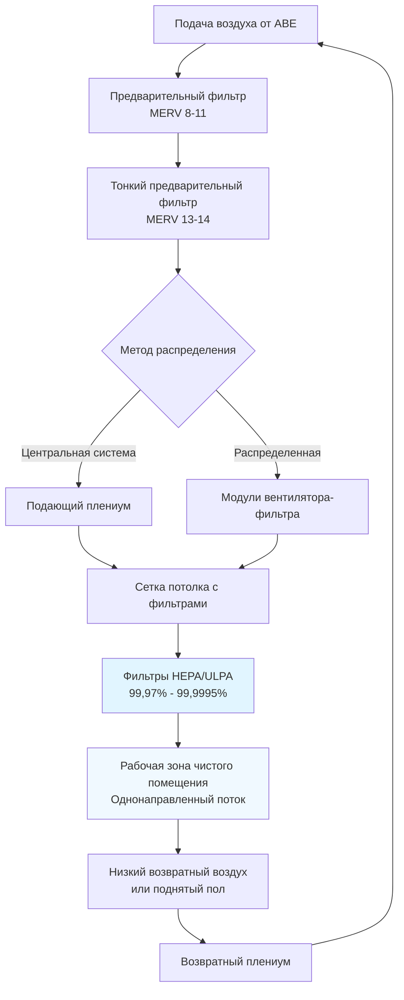

Системы фильтрации чистых помещений обеспечивают первичную защиту от загрязнения частицами, удаляя взвешенные в воздухе частицы для поддержания установленных уровней чистоты. Выбор и конфигурация оборудования фильтрации напрямую определяют производительность чистого помещения и соответствие классификациям ISO 14644-1.

## Стандарты фильтров HEPA и ULPA

Фильтры High-Efficiency Particulate Air (HEPA) достигают минимальной эффективности 99,97% для частиц размером 0,3 мкм, наиболее проникающего размера частиц (MPPS). Фильтры Ultra-Low Penetration Air (ULPA) обеспечивают эффективность 99,9995% при 0,12 мкм, требуемую для чистых помещений класса ISO 3 и чище.

Эффективность фильтра выражается как:

$$\eta = \left(1 - \frac{C_{downstream}}{C_{upstream}}\right) \times 100\%$$

где $C_{downstream}$ представляет концентрацию частиц после фильтрации, а $C_{upstream}$ представляет концентрацию до фильтрации.

Проникновение, обратное эффективности, рассчитывается как:

$$P = \frac{C_{downstream}}{C_{upstream}} = 1 - \frac{\eta}{100}$$

Для фильтров HEPA при номинальных условиях проникновение равно 0,0003 (0,03%). Фильтры ULPA достигают проникновения 0,000005 (0,0005%).

## Типы фильтров по классификации чистых помещений

| Класс ISO | Тип фильтра | Минимальная эффективность | Типичное применение | Покрытие |
|-----------|-------------|-------------------|---------------------|----------|
| ISO 3 | ULPA | 99,9995% при 0,12 мкм | Литография полупроводников | 80-100% потолка |
| ISO 4 | ULPA/HEPA | 99,999% при 0,12 мкм | Критические процессы полупроводников | 70-90% потолка |
| ISO 5 | HEPA | 99,99% при 0,3 мкм | Асептическое заполнение фармацевтических препаратов | 35-70% потолка |
| ISO 6 | HEPA | 99,97% при 0,3 мкм | Фармацевтическое производство | 15-35% потолка |
| ISO 7 | HEPA | 99,97% при 0,3 мкм | Сборка медицинских изделий | 5-15% потолка |
| ISO 8 | HEPA | 99,97% при 0,3 мкм | Упаковка фармацевтических препаратов | 5-10% финального |

## Конфигурации потолков с фильтрами

Конструкция потолка с фильтрами обеспечивает баланс между равномерностью распределения воздуха, эффективностью удаления частиц и стоимостью строительства. Потолки с полным покрытием фильтрами обеспечивают 80-100% покрытие HEPA/ULPA, создавая однонаправленный нисходящий поток воздуха для чистых помещений класса ISO 3-5. Эта конфигурация обеспечивает скорость потока воздуха 0,30-0,50 м/с в рабочей зоне.

Частичное покрытие использует 15-70% площади потолка с фильтрами для чистых помещений класса ISO 6-7 с неоднонаправленным потоком воздуха. Фильтры концентрируются над критическими рабочими зонами, при этом оставшаяся площадь потолка занята глухими панелями, освещением и инженерными сетями.

Финальные корпуса фильтров интегрируются в воздуховодные системы подачи или модули вентилятора-фильтра для приложений класса ISO 7-8. Этот подход снижает начальную стоимость, но обеспечивает менее равномерное распределение воздуха, чем потолки с фильтрами.

## Модули вентилятора-фильтра в сравнении с центральными системами

Модули вентилятора-фильтра (FFU) объединяют фильтры HEPA/ULPA с интегральными вентиляторами, установленными непосредственно в сетку потолка. Каждый FFU работает независимо, обеспечивая расход воздуха 90-100 м³/ч при скорости потока на поверхности 0,45 м/с. FFU предлагают гибкость установки, сокращение воздуховодов и упрощенное расширение, но генерируют тепловые нагрузки 30-60 Вт на одно устройство и требуют распределенного электроснабжения.

Центральные системы кондиционирования воздуха подают кондиционированный воздух через воздуховоды к финальным фильтрам HEPA/ULPA. Этот подход централизует техническое обслуживание оборудования, обеспечивает превосходное управление температурой и влажностью и снижает тепловые нагрузки в чистом помещении. Центральные системы требуют больших механических помещений и более сложных сетей распределения.

Перепад давления в системах фильтрации чистых помещений влияет на потребление энергии вентилятором:

$$\Delta P_{total} = \Delta P_{pre} + \Delta P_{fine} + \Delta P_{HEPA/ULPA} + \Delta P_{duct}$$

Начальный перепад давления фильтра HEPA составляет 200-300 Па, увеличиваясь до 400-600 Па при замене фильтра. Фильтры ULPA начинают с 300-400 Па из-за более плотной конструкции носителя.

## Стратегии предварительной фильтрации

Предварительные фильтры защищают финальные фильтры HEPA/ULPA от преждевременной загрузки, продлевая срок службы с 2-3 лет до 5-7 лет. Трехступенчатый каскад фильтрации обеспечивает оптимальную защиту:

**Первичные предварительные фильтры (MERV 8-11)** удаляют крупные частицы >10 мкм, включая пыль, ворсинки и волокна из наружного воздуха и строительных материалов. Замена каждые 3-6 месяцев по результатам контроля перепада давления.

**Тонкие предварительные фильтры (MERV 13-14)** захватывают частицы размером 1-10 мкм перед финальной фильтрацией. Эти фильтры достигают эффективности 75-85% при 0,3 мкм, значительно снижая загрузку HEPA/ULPA. Замена каждые 6-12 месяцев.

**Химические фильтры** с использованием носителя из активированного угля или перманганата калия удаляют молекулярные загрязнители (AMC), которые проходят через фильтры частиц. Критично для приложений полупроводников и аэрокосмической промышленности, где выделение газов влияет на качество продукции.

Перепад давления предварительного фильтра обычно составляет 50-150 Па в начале, с заменой срабатываемой при финальном давлении 250-400 Па.

## Требования к испытанию фильтров на утечки

ISO 14644-3 требует испытание на утечки на месте после установки фильтра и ежегодно после этого. Испытание проверяет целостность носителя фильтра, герметизацию уплотнений и установку рамы.

Метод сканирования фотометром вводит полидисперсный аэрозоль (PAO, DOS или PSL частицы) вверх по потоку при концентрации 10-20 мкг/л. Переносной аэрозольный фотометр сканирует нижнюю сторону фильтра на расстоянии 25-50 мм, двигаясь со скоростью 50 мм/с. Любое место, показывающее проникновение >0,01%, указывает на утечку, требующую ремонта или замены фильтра.

Метод счетчика частиц отбирает пробы отдельных точек на поверхности фильтра, сравнивая концентрацию испытания вверх по потоку с показаниями вниз по потоку. Этот количественный подход обеспечивает документирование для протоколов валидации.

Приемлемые пределы утечек зависят от применения:
- Класс ISO 3-4: Обнаруживаемые утечки отсутствуют (0,00% проникновения)
- Класс ISO 5-6: <0,01% локального проникновения
- Класс ISO 7-8: <0,03% локального проникновения

## Процедуры замены фильтров

Процедуры замены фильтров поддерживают целостность чистого помещения во время операций замены. Планируйте замены во время запланированных остановок, когда производство прекращается и классификация помещения не требуется.

Установите корпуса с упаковкой в мешок/из мешка (BIBO) для приложений с опасными материалами. Эти системы герметизируют загрязненные фильтры в пластиковые мешки перед удалением, защищая персонал от воздействия токсичных или инфекционных частиц.

Стандартный протокол замены:

1. **Проверка перед заменой** - Документируйте перепад давления, расход воздуха и подсчет частиц перед удалением
2. **Подготовка рабочей зоны** - Очистите область под фильтрами, установите временное сдерживание, если требуется
3. **Удаление фильтра** - Отпустите зажимы, герметизируйте удаленный фильтр в пластиковый мешок, очистите внутреннюю часть корпуса
4. **Установка** - Расположите новый фильтр, проверьте выравнивание прокладки, закрепите зажимы с крутящим моментом в соответствии со спецификациями производителя
5. **Испытание на утечки** - Выполните сканирование аэрозолем по всей поверхности фильтра и уплотнению периметра
6. **Проверка производительности** - Измерьте расход воздуха, перепад давления и подсчет частиц в помещении

Поддерживайте непрерывную работу предварительного фильтра во время замены финального фильтра, чтобы минимизировать загрязнение чистого помещения.

Документируйте все замены фильтров, включая дату, местоположение, серийные номера, результаты испытаний и идентификацию техника для требований валидации и аудита.

## Компоненты

- Финальная фильтрация HEPA
- Финальная фильтрация ULPA
- Защита предварительного фильтра
- Угольный фильтр молекулярного загрязнения
- Модули вентилятора-фильтра FFU
- Испытание целостности фильтра
- Испытание диоктилфталатом DOP
- Испытание аэрозольным фотометром
- Процедуры испытания фильтров на утечки
