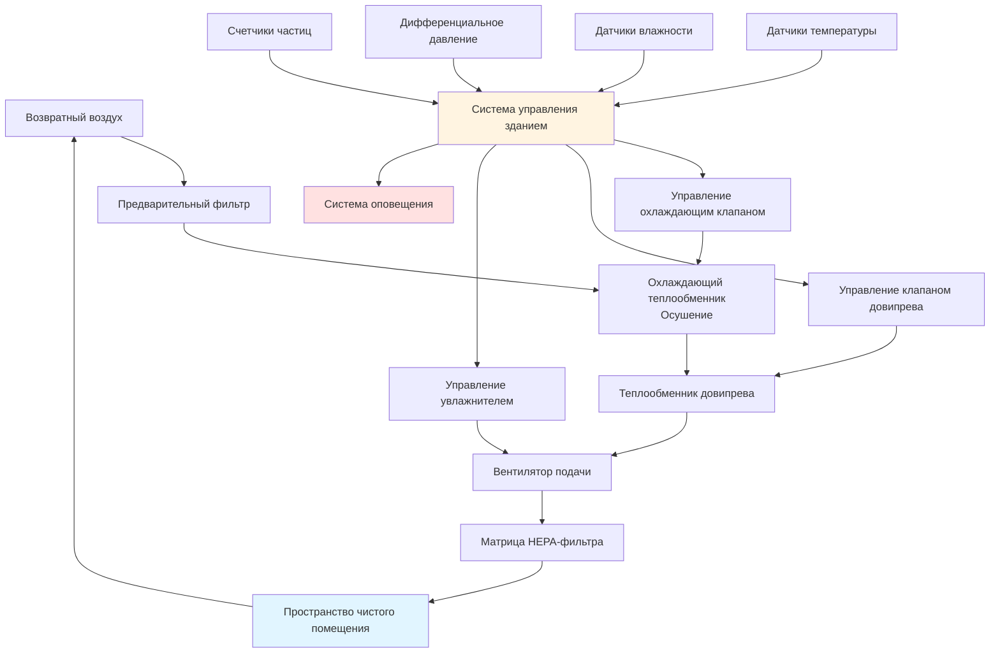

## Требования к прецизионной температуре

Среда в чистых помещениях требует исключительной стабильности температуры для поддержки чувствительных производственных процессов и предотвращения дефектов продукции. Большинство приложений в чистых помещениях требуют контроля температуры в пределах **±0,5°C** от заданного значения, при этом производственные объекты по производству полупроводников часто требуют еще более жестких допусков **±0,25°C**.

Прецизионность температуры влияет на:
- **Выравнивание фотолитографии** при производстве полупроводников
- **Стабильность размеров** прецизионных компонентов во время сборки
- **Скорости химических реакций** при производстве фармацевтических препаратов
- **Свойства материалов** во время укладки композитных материалов
- **Точность измерений** в областях метрологии и контроля качества

### Контроль вертикального перепада температур

Вертикальные перепады температур должны быть минимизированы для поддержания однородных условий по всему пространству чистого помещения. Матрицы HEPA-фильтров, установленные в потолке, обеспечивают ламинарный поток воздуха, который предотвращает стратификацию, обычно поддерживая вертикальное изменение температуры ниже **0,3°C на метр** высоты помещения.

Мощность удаления явного тепла должна учитывать все источники тепла:

$$Q_s = Q_{lights} + Q_{equipment} + Q_{people} + Q_{walls} + Q_{outdoor}$$

Где каждый компонент способствует общей нагрузке охлаждения, требуя прецизионного контроля объема воздуха и температуры.

## Контроль влажности для предотвращения статического электричества

Контроль статического электричества представляет критическую функцию управления влажностью в чистых помещениях. Производство электронных устройств требует **40-50% ОВ** для предотвращения повреждения от электростатического разряда (ESD), в то время как фармацевтические операции обычно поддерживают **35-50% ОВ** для стабильности продукции.

### Предотвращение электростатического разряда

Связь между относительной влажностью и поверхностным сопротивлением демонстрирует, почему контроль влажности является критическим:

$$R_s = k \cdot e^{-\alpha \cdot RH}$$

Где $R_s$ — поверхностное сопротивление (омы), $k$ — константа материала, $\alpha$ — коэффициент чувствительности к влажности, и $RH$ — относительная влажность в процентах. Поверхностное сопротивление экспоненциально снижается по мере увеличения влажности, снижая накопление статического заряда.

Поддержание влажности выше **40% ОВ** обычно снижает поверхностное сопротивление ниже $10^{11}$ омов, порога эффективного статического рассеивания на большинстве материалов.

## Требования окружающей среды, специфичные для процесса

Различные приложения в чистых помещениях налагают особые ограничения на окружающую среду на основе чувствительности продукта и химии процесса.

| Приложение | Температура | Допуск температуры | Влажность | Допуск влажности | Класс ISO |
|-------------|-------------|----------------------|----------|-------------------|-----------|
| Производство полупроводников | 20-22°C | ±0,25°C | 40-45% ОВ | ±2% ОВ | 4-5 |
| Фармацевтическое производство | 20-22°C | ±0,5°C | 35-50% ОВ | ±5% ОВ | 5-7 |
| Производство биотехнологии | 20-24°C | ±1,0°C | 40-60% ОВ | ±5% ОВ | 6-8 |
| Сборка медицинских устройств | 21-23°C | ±0,5°C | 40-50% ОВ | ±5% ОВ | 7-8 |
| Композиты аэрокосмической промышленности | 20-25°C | ±1,0°C | 45-55% ОВ | ±5% ОВ | 7-8 |
| Производство оптических линз | 20-22°C | ±0,3°C | 40-50% ОВ | ±3% ОВ | 6-7 |
| Чистые помещения центра обработки данных | 18-27°C | ±2,0°C | 40-60% ОВ | ±10% ОВ | 8 |

### Процессы с влагочувствительными материалами

Гигроскопичные материалы при обработке полупроводников требуют контроля точки росы, а не контроля относительной влажности. Передовые производственные объекты поддерживают точку росы ниже **-40°C** в областях литографии для предотвращения поглощения влаги фоторезистивными материалами.

Связь содержания влаги демонстрирует, почему контроль точки росы обеспечивает лучшую повторяемость процесса:

$$W = 0.622 \cdot \frac{P_{ws}}{P_{atm} - P_{ws}}$$

Где $W$ — коэффициент влажности (кг воды/кг сухого воздуха), $P_{ws}$ — давление насыщения водяного пара при температуре точки росы, и $P_{atm}$ — атмосферное давление.

## Системы довипрева и осушения

Достижение прецизионного контроля влажности при одновременном поддержании стабильности температуры требует сложных стратегий довипрева. Системы HVAC в чистых помещениях обычно используют несколько стадий кондиционирования.

### Последовательность охлаждения и довипрева

1. **Предварительный охлаждающий теплообменник** удаляет основную явную и скрытую нагрузку
2. **Глубокий охлаждающий теплообменник** переохлаждает подаваемый воздух до точки росы 7-10°C
3. **Теплообменник довипрева** повышает температуру до желаемого условия подачи
4. **Тонкое охлаждение** обеспечивает точную регулировку температуры

Процесс осушения следует психрометрическому соотношению:

$$Q_l = \dot{m}_a \cdot h_{fg} \cdot (W_1 - W_2)$$

Где $Q_l$ — скрытое охлаждение (кВт), $\dot{m}_a$ — массовый расход сухого воздуха (кг/с), $h_{fg}$ — скрытая теплота испарения (2501 кДж/кг), $W_1$ — входящий коэффициент влажности, и $W_2$ — выходящий коэффициент влажности.

### Адсорбционное осушение

Приложения с низкой точкой росы ниже **-20°C** требуют адсорбционных систем, поскольку холодильное охлаждение не может обеспечить необходимое удаление влаги. Регенеративные адсорбционные колеса обеспечивают непрерывное осушение с восстановлением энергии.

Мощность удаления влаги адсорбентом зависит от изотермы адсорбции:

$$W_{ads} = f(RH, T, t)$$

Где адсорбированное содержание воды варьируется в зависимости от относительной влажности, температуры и времени контакта.

## Требования к времени отклика системы управления

Системы контроля окружающей среды в чистых помещениях должны быстро реагировать на возмущения, избегая колебаний или перерегулирования.

### Пропорционально-интегрально-дифференциальное (PID) управление

Температурные и влажностные контуры используют PID-алгоритмы, настроенные на быстрый отклик без ловушек:

$$u(t) = K_p \cdot e(t) + K_i \int e(t)dt + K_d \frac{de(t)}{dt}$$

Где $u(t)$ — выходной сигнал контроллера, $e(t)$ — сигнал ошибки, и $K_p$, $K_i$, $K_d$ — коэффициенты пропорциональности, интеграции и дифференцирования.

**Типичные параметры настройки:**
- **Температурные контуры:** $K_p = 2-5$, $T_i = 5-10$ мин, $T_d = 1-2$ мин
- **Контуры влажности:** $K_p = 1-3$, $T_i = 10-20$ мин, $T_d = 0-2$ мин

### Времена отклика контура управления

- **Восстановление после температурного возмущения:** 10-15 минут в пределах ±0,1°C от заданного значения
- **Восстановление после возмущения влажности:** 20-30 минут в пределах ±2% ОВ от заданного значения
- **Частота обновления датчика:** интервалы дискретизации 1-5 секунд
- **Время отклика управляющего клапана:** время модуляции 30-60 секунд

## Мониторинг и оповещение

Непрерывный мониторинг окружающей среды обеспечивает целостность процесса и обеспечивает раннее предупреждение о деградации системы.

### Стратегия размещения датчиков

- **Датчики температуры:** установлены на уровне дыхания (1,2-1,5 м) в рабочих областях, а также в воздушных потоках подачи и возврата
- **Датчики влажности:** минимум один на 100 м² площади чистого помещения, калибруются ежеквартально
- **Дифференциальное давление:** через каждый матрицу HEPA-фильтра и между зонами чистого помещения
- **Датчики точки росы:** требуются для процессов, требующих точку росы ниже -20°C

### Иерархия оповещений

**Критические оповещения** (требуется немедленный ответ):
- Отклонение температуры, превышающее ±1,0°C более чем на 5 минут
- Отклонение влажности, превышающее ±10% ОВ более чем на 10 минут
- Отказ подачи воздуха или остановка вентилятора
- Потеря дифференциального давления, указывающая на отказ фильтра

**Предупреждающие оповещения** (требуется расследование):
- Отклонение температуры, превышающее ±0,5°C более чем на 10 минут
- Отклонение влажности, превышающее ±5% ОВ более чем на 15 минут
- Тренд, указывающий на приближающееся выход за пределы допуска

### Требования к регистрации данных

Данные об окружающей среде должны регистрироваться постоянно для валидации процесса и устранения неисправностей:

- **Интервал регистрации:** усреднение за 1 минуту для трендинга, интервалы 10 секунд для оповещений
- **Длительность хранения:** минимум 2 года для фармацевтических приложений (FDA 21 CFR Part 11)
- **Журнал аудита:** все изменения заданного значения и подтверждение оповещений записываются с ID пользователя и отметкой времени
- **Записи о калибровке:** проверка точности датчиков каждые 6-12 месяцев в зависимости от критичности

Контроль окружающей среды представляет основу эксплуатации чистого помещения. Управление прецизионной температурой и влажностью напрямую влияет на выход продукции, повторяемость процесса и соответствие нормативным требованиям в промышленности полупроводников, фармацевтических препаратов и прецизионного производства.
