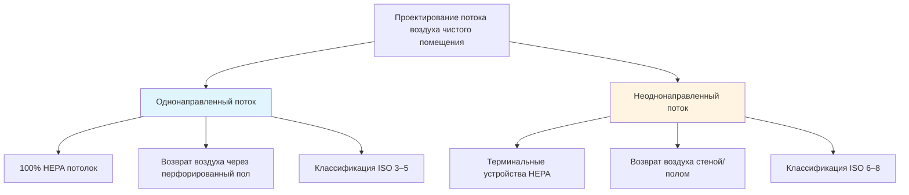

# Вентиляция чистых помещений и контролируемых сред

Чистые помещения — это специализированные пространства, в которых концентрация аэрозольных частиц контролируется в соответствии с установленными пределами. Системы HVAC для чистых помещений должны поддерживать точный контроль уровней загрязнения частицами, температуры, влажности и давления при управлении тепловыделением от оборудования и персонала.

## Стандарты классификации ISO

ISO 14644-1 определяет классификацию чистых помещений на основе максимально допустимой концентрации частиц на кубический метр воздуха. Номер классификации представляет log₁₀ количества частиц размером 0,1 мкм.

### Пределы концентрации частиц ISO 14644-1

| Класс ISO | 0,1 мкм | 0,2 мкм | 0,3 мкм | 0,5 мкм | 1 мкм | 5 мкм |
|-----------|---------|---------|---------|---------|-------|-------|
| ISO 3 | 1 000 | 237 | 102 | 35 | 8 | — |
| ISO 4 | 10 000 | 2 370 | 1 020 | 352 | 83 | — |
| ISO 5 | 100 000 | 23 700 | 10 200 | 3 520 | 832 | 29 |
| ISO 6 | 1 000 000 | 237 000 | 102 000 | 35 200 | 8 320 | 293 |
| ISO 7 | — | — | — | 352 000 | 83 200 | 2 930 |
| ISO 8 | — | — | — | 3 520 000 | 832 000 | 29 300 |

Предел концентрации частиц рассчитывается по формуле:

$$C_n = 10^N \times \left(\frac{0,1}{D}\right)^{2,08}$$

Где:
- $C_n$ = максимально допустимая концентрация частиц (частиц/м³)
- $N$ = номер классификации ISO
- $D$ = размер частицы (мкм)

## Схемы потоков воздуха и проектирование

Чистые помещения используют две основные конфигурации потока воздуха в зависимости от требований контроля загрязнения.

### Однонаправленный (ламинарный) поток

Системы однонаправленного потока обеспечивают параллельный поток воздуха со скоростью 0,36–0,51 м/с через всю площадь поперечного сечения помещения. HEPA или ULPA фильтры покрывают 80–100% потолка, с перфорированными приподнятыми полами для возврата воздуха.

**Применение:** чистые помещения ISO 3–5 для производства полупроводников, асептической фармацевтической обработки и критической сборки медицинских устройств.

**Кратность воздухообмена:** 300–600 ACH в зависимости от покрытия фильтром и требуемой скорости.

### Неоднонаправленный (турбулентный) поток

Неоднонаправленные системы используют высокоэффективные фильтры в потолочных терминальных устройствах с обычными системами возврата воздуха. Турбулентное смешивание разбавляет и удаляет загрязнители с помощью высокой кратности воздухообмена.

**Применение:** чистые помещения ISO 6–8 для упаковки фармацевтических препаратов, сборки электроники и биотехнологических лабораторий.

**Кратность воздухообмена:** 20–60 ACH для ISO 7, 10–25 ACH для ISO 8 согласно рекомендациям ASHRAE.

## Проектирование каскадного давления

Разность давления между помещениями предотвращает миграцию загрязнений из менее чистых помещений в более чистые. Каскады давления устанавливаются путем балансировки потока воздуха и использования подрезов дверей или переходных решеток.

### Требования к разности давления

| Применение | Разность давления | Направление |
|------------|-------------------|------------|
| Чистое помещение к коридору | 5–20 Па (0,02–0,08 дюйм.в.ст.) | Положительное |
| Асептическое ядро к вспомогательным помещениям | 10–15 Па (0,04–0,06 дюйм.в.ст.) | Положительное |
| Помещение опасных материалов | 5–15 Па (0,02–0,06 дюйм.в.ст.) | Отрицательное |
| Шлюз давления | 2,5–5 Па (0,01–0,02 дюйм.в.ст.) | Ступенчатое |

Поток воздуха, необходимый для поддержания разности давления, учитывает утечки через щели в конструкции:

$$Q_{leak} = C \times A \times \sqrt{\Delta P}$$

Где:
- $Q_{leak}$ = поток воздуха утечки (м³/с)
- $C$ = коэффициент утечки (0,65–0,85 для типичной конструкции)
- $A$ = площадь утечки (м²)
- $\Delta P$ = разность давления (Па)

## Системы фильтрации

### Требования к эффективности фильтрации

**HEPA фильтры (H13–H14):** минимум 99,97% эффективности при 0,3 мкм MPPS (наиболее проникающий размер частиц). Используются для чистых помещений ISO 5–8.

**ULPA фильтры (U15–U17):** минимум 99,9995% эффективности при 0,12 мкм MPPS. Требуются для приложений ISO 3–4.

Выбор фильтра учитывает эффективность удаления частиц, перепад давления и энергопотребление. Начальный перепад давления обычно составляет 125–375 Па (0,5–1,5 дюйм.в.ст.) для HEPA фильтров.

Стоимость жизненного цикла фильтра включает как первоначальные инвестиции, так и операционную энергию:

$$LCC = C_{filter} + \frac{Q \times \Delta P \times t \times C_{energy}}{\eta_{fan}}$$

Где:
- $LCC$ = стоимость жизненного цикла ($)
- $C_{filter}$ = стоимость замены фильтра ($)
- $Q$ = расход воздуха (м³/с)
- $\Delta P$ = среднее падение давления (Па)
- $t$ = часы работы (ч)
- $C_{energy}$ = стоимость энергии ($/кВч)
- $\eta_{fan}$ = эффективность вентилятора/двигателя

## Контроль температуры и влажности

Процессы в чистых помещениях часто требуют жестких допусков в отношении окружающей среды:

**Температура:** ±0,5°C — ±2,0°C в зависимости от требований процесса
**Относительная влажность:** ±2% — ±5% ОВ для прецизионных приложений

Коэффициент явного тепла в чистых помещениях обычно превышает 0,90 вследствие тепловыделения от оборудования и минимальной плотности персонала. Осушение требует тщательной интеграции с системами фильтрации для предотвращения конденсации на HEPA фильтрах.

Расчет охлаждающей нагрузки учитывает:
- Тепловыделение от оборудования (часто 50–80% от общей нагрузки)
- Тепловыделение от освещения
- Тепловыделение от персонала
- Тепловыделение вентилятора от высокой кратности воздухообмена
- Нагрузки через ограждающие конструкции (минимальны в контролируемых средах)

## Проектирование воздухообрабатывающей установки

### Требования к наружному воздуху

Наружный воздух чистого помещения компенсирует выброс, давление и потребление процесса:

$$Q_{MA} = Q_{exhaust} + Q_{press} + Q_{process}$$

Системы наружного воздуха обеспечивают 100% внешний воздух с многоступенчатой фильтрацией:
1. Предварительные фильтры (MERV 8–11)
2. Вторичные фильтры (MERV 13–14)
3. Финальные HEPA/ULPA фильтры в точке использования

### Рассмотрение рекуперации энергии

Рекуперация энергии между потоками выбросов и наружного воздуха снижает нагрузку на кондиционирование, но требует тщательного проектирования для предотвращения перекрестного загрязнения. Вращающиеся колесные теплообменники обычно избегаются в фармацевтических и биотехнологических приложениях из-за потенциального переноса. Пластинчатые теплообменники или циркуляционные контуры обеспечивают более безопасные альтернативы.

Эффективность рекуперации 60–75% достижима при сохранении полного разделения потоков воздуха. Потенциал экономии энергии составляет:

$$E_{saved} = Q \times \rho \times c_p \times (T_{oa} - T_{ra}) \times \varepsilon \times t$$

Где $\varepsilon$ — эффективность рекуперации тепла.

## Наладка системы и валидация

Квалификация чистого помещения следует структурированному протоколу согласно руководящим принципам FDA и ISO 14644-3:

**IQ (Квалификация установки):** проверка соответствия установленного оборудования спецификациям
**OQ (Квалификация функционирования):** подтверждение соответствия систем проектным параметрам в рабочих условиях
**PQ (Квалификация производительности):** валидация производительности процесса в условиях имитируемого производства

Ключевые тесты наладки включают:
- Подсчет частиц в нескольких местах и операционных состояниях
- Тестирование HEPA фильтров на герметичность с использованием аэрозолей DOP или PAO
- Измерения скорости и равномерности потока воздуха
- Проверка разности давления в помещении
- Картирование температуры и влажности
- Тестирование времени восстановления после загрязнения

Руководящие принципы ASHRAE предоставляют детальные протоколы для тестирования, регулирования и балансировки чистых помещений, специфичные для критических сред.

---

**Связанные темы:**
- Вентиляция фармацевтического производства
- Контроль окружающей среды в полупроводниковых фабриках
- Системы вытяжки лаборатории
- Вентиляция шкафов биобезопасности
- Проектирование отделения стерильной обработки
