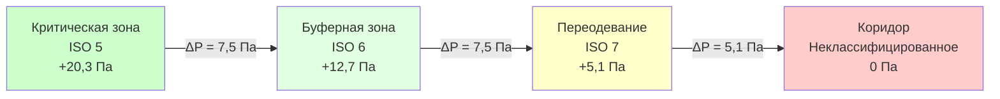

## Фундаментальная физика чистых помещений

Чистые помещения поддерживают контролируемые уровни загрязнения частицами через спроектированные схемы воздушного потока, которые непрерывно удаляют и разбавляют взвешенные частицы. Фундаментальный принцип основан на уравнении материального баланса частиц:

$$\frac{dC}{dt} = G - Q \cdot C - \lambda \cdot C$$

где $C$ — концентрация частиц (частиц/м³), $G$ — скорость образования частиц (частиц/м³·с), $Q$ — скорость воздухообмена (1/с), а $\lambda$ — константа скорости осаждения частиц (1/с).

В установившемся состоянии ($dC/dt = 0$) равновесная концентрация становится:

$$C_{eq} = \frac{G}{Q + \lambda}$$

Эта зависимость показывает, что концентрация частиц снижается с увеличением скорости воздухообмена $Q$, что составляет основу требований к воздухообмену в чистых помещениях.

## Классификации чистых помещений ISO 14644

ISO 14644-1 определяет классы чистых помещений на основе максимально допустимых концентраций частиц при определенных размерах частиц. Номер классификации $N$ представляет максимальное количество частиц (частиц на кубический метр) при диаметре 0,1 мкм.

### Таблица классификации

| Класс ISO | 0,1 мкм | 0,2 мкм | 0,3 мкм | 0,5 мкм | 1,0 мкм | 5,0 мкм | Типичные применения |
|-----------|---------|---------|---------|---------|---------|---------|---------------------|
| ISO 1 | 10 | 2 | — | — | — | — | Теоретический предел |
| ISO 2 | 100 | 24 | 10 | 4 | — | — | Полупроводниковые узлы <7нм |
| ISO 3 | 1 000 | 237 | 102 | 35 | 8 | — | Полупроводниковая фабрика пластин |
| ISO 4 | 10 000 | 2 370 | 1 020 | 352 | 83 | — | Сборка полупроводников |
| ISO 5 | 100 000 | 23 700 | 10 200 | 3 520 | 832 | 29 | Стерильное наполнение лекарств |
| ISO 6 | 1 000 000 | 237 000 | 102 000 | 35 200 | 8 320 | 293 | Фон асептической обработки |
| ISO 7 | — | — | — | 352 000 | 83 200 | 2 930 | Упаковка фармацевтической продукции |
| ISO 8 | — | — | — | 3 520 000 | 832 000 | 29 300 | Общее производство |

Предел количества частиц для любого размера следует экспоненциальной зависимости:

$$C_n = 10^N \times \left(\frac{0.1}{d_p}\right)^{2.08}$$

где $C_n$ — предел концентрации частиц (частиц/м³), $N$ — номер класса ISO, а $d_p$ — диаметр частицы (мкм). Показатель 2,08 выводится из предположений о логнормальном распределении размеров частиц.

## Схемы воздушного потока и удаление частиц

Схемы воздушного потока в чистых помещениях определяют транспорт частиц и эффективность удаления. Существуют две фундаментальные конфигурации: однонаправленная (ламинарная) и неоднонаправленная (турбулентное смешивание).

### Однонаправленный поток (ISO 3–5)

```mermaid
graph TD
    A[Потолочный фильтр HEPA] -->|Равномерная скорость| B[Рабочая зона]
    B -->|Вертикальный поток 0,36–0,54 м/с| C[Перфорированный пол]
    C --> D[Возвратный плен}
    D --> E[ВОУ с HEPA]
    E --> A

    F[Источник частиц] -->|Унесены потоком| C

    style A fill:#e1f5ff
    style B fill:#ffe1e1
    style C fill:#e1ffe1
```

Однонаправленный поток поддерживает почти параллельные линии тока со скоростью $V_{flow} = 0,36–0,54$ м/с (70–106 футов в минуту). Эта скорость превышает скорости оседания частиц, избегая турбулентных вихрей, которые задерживают частицы.

Требуемая скорость на входе для предотвращения рециркуляции частиц следует из соображений чисел Рейнольдса:

$$V_{min} = \frac{\nu \cdot Re_{crit}}{L_c}$$

где $\nu$ — кинематическая вязкость (1,5 × 10⁻⁵ м²/с для воздуха), $Re_{crit} = 2 300$ для перехода в турбулентный режим, а $L_c$ — характерная длина (обычно 1–3 м). Это дает $V_{min} \approx 0,01–0,03$ м/с, значительно ниже стандарта 0,36 м/с, обеспечивая запас безопасности.

### Неоднонаправленный поток (ISO 6–8)

Чистые помещения с неоднонаправленным потоком используют турбулентное смешивание для разбавления концентраций частиц. Подаваемый воздух из HEPA-фильтруемых потолочных диффузоров создает схемы смешивания, которые снижают концентрацию частиц через зависимость экспоненциального затухания:

$$C(t) = C_0 e^{-Qt/V}$$

где $C_0$ — начальная концентрация, $Q$ — скорость подачи воздуха, $V$ — объем помещения, а $t$ — время. Постоянная времени $\tau = V/Q$ представляет время для снижения концентрации на 63,2% (1/e).

Требуемое количество воздухообменов в час (АОЧ) для достижения классификации следует из анализа установившегося состояния:

$$ACH = \frac{G \cdot V}{C_{target} \cdot V} = \frac{G}{C_{target}}$$

Типичные требования АОЧ чистого помещения:

| Класс ISO | Диапазон АОЧ | Постоянная времени воздухообмена |
|-----------|-----------|-------------------------|
| ISO 5 | 400–600 | 6–9 секунд |
| ISO 6 | 150–240 | 15–24 секунды |
| ISO 7 | 60–90 | 40–60 секунд |
| ISO 8 | 20–30 | 120–180 секунд |

## Требования фильтрации HEPA и ULPA

Фильтры высокой эффективности задержания частиц (HEPA) обеспечивают минимальную эффективность 99,97% при 0,3 мкм, что соответствует наиболее проникающему размеру частиц (MPPS). Фильтры сверхнизкого проникновения воздуха (ULPA) достигают эффективности 99,9995% при 0,12 мкм.

### Физика эффективности фильтрации

Эффективность сбора фильтром $\eta$ зависит от пяти механизмов:

$$\eta_{total} = 1 - (1-\eta_{interception})(1-\eta_{impaction})(1-\eta_{diffusion})(1-\eta_{gravity})(1-\eta_{electrostatic})$$

При MPPS (0,1–0,3 мкм) инертиальный удар и броуновская диффузия наиболее слабы, создавая точку минимальной эффективности. Диаметр MPPS $d_{MPPS}$ следует:

$$d_{MPPS} = \sqrt{\frac{18 \mu D}{\rho_p V_0 d_f}}$$

где $\mu$ — динамическая вязкость воздуха, $D$ — коэффициент диффузии частицы, $\rho_p$ — плотность частицы, $V_0$ — скорость на входе, а $d_f$ — диаметр волокна.

### Выбор размера фильтра и падение давления

Скорость на входе фильтра HEPA влияет на срок службы и падение давления. Падение давления на чистых фильтрах HEPA колеблется от 0,5–1,0 дюймов вод. ст. (1,25–2,5 см вод. ст.) при номинальном расходе. Падение давления следует соотношению Дарси–Вейсбаха:

$$\Delta P = K \cdot \rho \cdot V^2$$

где $K$ — коэффициент сопротивления фильтра (0,5–1,5 для материала HEPA) и $V$ — скорость на входе. По мере загрязнения фильтров частицами падение давления увеличивается:

$$\Delta P(t) = \Delta P_0 \left(1 + \frac{m_p(t)}{A \cdot \alpha}\right)$$

где $m_p(t)$ — накопленная масса частиц, $A$ — площадь фильтра, а $\alpha$ — емкость накопления пыли (100–300 г/м² для фильтров HEPA). Фильтры требуют замены, когда падение давления достигает 2,0–2,5 дюймов вод. ст. (5,0–6,25 см вод. ст.) или эффективность снижается ниже спецификации.

## Проектирование каскада давления

Чистые помещения поддерживают положительное давление по отношению к смежным менее чистым пространствам, создавая градиент давления, который предотвращает инфильтрацию загрязнителей. Каскад давления следует иерархии:



Минимальный дифференциал давления $\Delta P_{min}$ должен преодолеть утечку через двери и поддерживать направленный воздушный поток. ISO 14644-4 рекомендует:

$$\Delta P_{min} = 5-12 \text{ Па (0,02-0,05 дюймов вод. ст.)}$$

Воздушный поток, необходимый для поддержания дифференциала давления против утечки, следует уравнению отверстия:

$$Q = C_d A_{leak} \sqrt{\frac{2 \Delta P}{\rho}}$$

где $C_d = 0,6–0,65$ для зазоров двери и $A_{leak}$ — общая площадь утечки. Для стандартного чистого помещения с площадью стены 18,6 м² и скоростью утечки 0,1 CFM (0,17 м³/ч) на м², поддержание 12 Па требует приблизительно 20 CFM (34 м³/ч) подпиточного воздуха.

## Скорости образования и удаления частиц

Персонал генерирует 100 000–10 000 000 частиц в минуту ≥0,5 мкм в зависимости от уровня активности и протокола облачения. Технологическое оборудование вносит дополнительные нагрузки на частицы.

### Образование частиц персоналом

| Деятельность | Частиц/минуту (≥0,5 мкм) | Предел класса ISO |
|----------|---------------------------|-----------------|
| Сидящий, минимум движений | 100 000 | Совместимо с ISO 5 |
| Стоящий, легкая работа | 500 000 | Совместимо с ISO 6 |
| Медленная ходьба | 1 000 000 | Совместимо с ISO 7 |
| Быстрая ходьба | 5 000 000 | Совместимо с ISO 8 |
| Гимнастические упражнения | 10 000 000+ | Требует помещение для одевания |

Скорость удаления частиц в чистом помещении следует кинетике первого порядка:

$$\frac{dN}{dt} = G - \lambda N$$

где $N$ — общее количество частиц, $G$ — скорость образования, а $\lambda$ — константа скорости удаления. При равновесии:

$$N_{eq} = \frac{G}{\lambda} = \frac{G \cdot V}{Q}$$

Для чистого помещения ISO 5 объемом 28,3 м³ с одним оператором, генерирующим 500 000 частиц в минуту при ≥0,5 мкм, требуемый воздушный поток для поддержания классификации (3 520 частиц/м³ при 0,5 мкм) составляет:

$$Q = \frac{G \cdot V}{C_{target}} = \frac{500 000 \text{ ч./мин} \times 1}{3 520 \text{ ч./м}^3 \times 35,3 \text{ м}^3} \approx 4 020 \text{ CFM (6 827 м³/ч)}$$

Это соответствует примерно 240 АОЧ, что соответствует требованиям ISO 5.

## Контроль температуры и влажности

Чистые помещения поддерживают жесткие допуски по температуре и влажности для управления процессом и комфорта персонала. Типичные спецификации:

- Температура: 20 ± 2°C
- Относительная влажность: 45 ± 5% ОВ
- Температурный градиент: <0,5°C на метр высоты

Контроль влажности предотвращает электростатический разряд (ЭСР) и управляет поведением гигроскопических частиц. Зависимость между размером частицы и относительной влажностью следует уравнению Кельвина:

$$\ln\left(\frac{RH}{100}\right) = \frac{4 \gamma M}{\rho RT d_p}$$

где $\gamma$ — поверхностное натяжение, $M$ — молекулярный вес, $R$ — газовая постоянная, $T$ — температура, а $d_p$ — диаметр частицы. Гигроскопические частицы значительно растут выше 60% ОВ, усложняя контроль частиц.

Чувствительная охлаждающая нагрузка в чистых помещениях включает:

$$Q_{sensible} = Q_{lights} + Q_{equipment} + Q_{people} + Q_{infiltration} + Q_{supply\ fan}$$

Скрытая нагрузка от персонала и инфильтрации требует емкости осушения:

$$Q_{latent} = m_{moisture} \times h_{fg}$$

где $h_{fg} = 2 450$ кДж/кг — теплота испарения воды. Типичный человек при легкой деятельности генерирует примерно 58 Вт скрытого тепла.

## Распределение подпиточного воздуха

Распределение подпиточного воздуха влияет на эффективность удаления частиц и тепловую однородность. Потолочные модули с фильтром HEPA (0,6 м × 1,2 м или 0,6 м × 0,6 м) обеспечивают 100% покрытие для чистых помещений с однонаправленным потоком ISO 4–5.

### Коэффициент покрытия фильтром

Коэффициент покрытия фильтром определяет однородность воздушного потока:

$$Coverage = \frac{A_{filter}}{A_{ceiling}} \times 100\%$$

| Класс ISO | Коэффициент покрытия | Скорость фильтра | АОЧ помещения |
|-----------|----------------|-----------------|----------|
| ISO 3–4 | 80–100% | 27 м/мин | 540–720 |
| ISO 5 | 60–80% | 27 м/мин | 360–540 |
| ISO 6–7 | 15–25% | 27 м/мин | 60–150 |
| ISO 8 | 5–10% | 27 м/мин | 20–40 |

Чистые помещения с неоднонаправленным потоком используют перфорированные диффузоры или низкоскоростные диффузоры вытеснения для минимизации турбулентных струй, которые вновь поднимают осевшие частицы.

## Потребление энергии и оптимизация

Чистые помещения потребляют в 10–100 раз больше энергии на квадратный метр, чем обычные здания, из-за высоких скоростей воздушного потока и требований 100% наружного воздуха (в некоторых приложениях). Годовое энергопотребление колеблется от 539–2 150 кВт·ч/м²·год.

### Возможности рекуперации энергии

Рекуперация тепла из вытяжного воздуха снижает нагрузки на кондиционирование подпиточного воздуха. Эффективность рекуперации тепла $\varepsilon$ следует:

$$\varepsilon = \frac{T_{supply} - T_{OA}}{T_{exhaust} - T_{OA}}$$

Роторные рекуператоры достигают $\varepsilon = 0,75–0,85$, но рискуют перекрестным загрязнением. Пластинчатые теплообменники обеспечивают $\varepsilon = 0,50–0,70$ с полной разделением воздушных потоков.

Потребление энергии вентилятором масштабируется с воздушным потоком и падением давления:

$$P_{fan} = \frac{Q \times \Delta P_{total}}{6,356 \times \eta_{fan}}$$

где $P_{fan}$ — мощность вентилятора (л.с.), $Q$ — воздушный поток (CFM), $\Delta P_{total}$ — общее системное давление (дюймы вод. ст.), а $\eta_{fan}$ — эффективность вентилятора (0,60–0,75). Высокоэффективные двигатели ECM и преобразователи частоты снижают энергопотребление на 30–50% по сравнению с системами с постоянным объемом.

## Стратегия контроля загрязнения

Эффективная эксплуатация чистого помещения требует комплексного контроля загрязнения, адресующего источники, пути и рецепторы:

### Контроль источников
- Протоколы облачения персонала минимизируют сбрасывание частиц
- Выбор оборудования подчеркивает конструкции с низким образованием частиц
- Процедуры передачи материалов предотвращают введение загрязнителей

### Контроль путей
- Каскады давления предотвращают воздушную миграцию
- Шлюзы изолируют переходные зоны
- Липкие коврики захватывают частицы на уровне пола

### Защита рецепторов
- Однонаправленный поток защищает критические рабочие зоны
- Локализованные рабочие станции с фильтром HEPA создают микросреды
- Изоляция процесса в барьерных системах или изоляторах

Подход с многоуровневой защитой объединяет несколько слоев управления, обеспечивая, что отказы одной точки не компрометируют чистоту.

## Валидация и мониторинг

ISO 14644-3 определяет тесты производительности чистого помещения, проводимые во время квалификации при установке (IQ), операционной квалификации (OQ) и квалификации производительности (PQ).

### Критические параметры производительности

1. **Скорость и однородность воздушного потока**: Измеряется на 80% расположений входа фильтра
2. **Тестирование утечки фильтра HEPA**: Вызов аэрозолем DOP или PAO при эффективности 99,97%
3. **Тестирование количества частиц**: Выборка в репрезентативных местах, несколько каналов размеров
4. **Проверка дифференциала давления**: Запись каскада через все барьеры
5. **Время восстановления**: Измерение времени возврата к классификации после вызова частицами
6. **Скорость воздухообмена**: Расчет из объема и измеренного воздушного потока

Время восстановления $t_{recovery}$ для снижения концентрации с уровней ISO 8 до ISO 5 следует:

$$t_{recovery} = \frac{V}{Q} \ln\left(\frac{C_{initial}}{C_{target}}\right) = \frac{1}{ACH/60} \times \ln\left(\frac{C_8}{C_5}\right)$$

Для восстановления ISO 8 до ISO 5 (коэффициент снижения концентрации ≈1 000) при 360 АОЧ:

$$t_{recovery} = \frac{60}{360} \times \ln(1 000) \approx 1,15 \text{ минут}$$

Непрерывный мониторинг дифференциального давления, количества частиц, температуры и влажности обеспечивает устойчивое соответствие между периодическими циклами переаттестации (обычно 6–12 месяцев).
