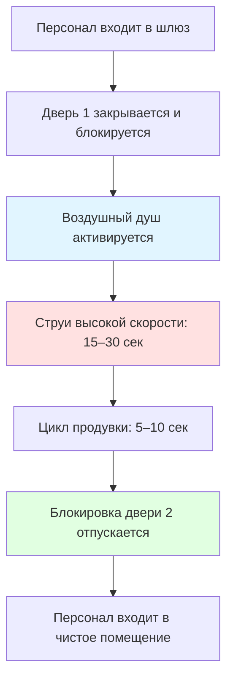

## Фундаментальная физика шлюзов

Шлюзы в зонах переодевания чистых помещений функционируют как переходные зоны давления, предотвращающие двусторонний перенос загрязнений. Фундаментальный принцип основан на поддержании градиента давления, который обеспечивает движение воздуха от более чистых к менее чистым средам, предотвращая миграцию частиц против дифференциала давления.

Дифференциал давления через дверь шлюза подчиняется уравнению потока через отверстие:

$$Q = C_d A \sqrt{\frac{2\Delta P}{\rho}}$$

где $Q$ — объёмный расход воздуха (CFM), $C_d$ — коэффициент расхода (0,6–0,65 для зазоров двери), $A$ — эффективная площадь утечки (м²), $\Delta P$ — дифференциал давления (Па), и $\rho$ — плотность воздуха (кг/м³).

Для типичной двери чистого помещения с периметральным зазором 3,2 мм площадь утечки приближается к $A = L \times h$, где $L$ — периметр двери и $h$ — высота зазора. Стандартная дверь размером 0,9 м × 2,1 м даёт $A \approx 0,0162$ м² при зазоре 3,2 мм.

## Проектирование каскадного дифференциального давления

Эффективные системы шлюзов устанавливают монотонный градиент давления от управляемого чистого помещения через зону переодевания к неконтролируемой среде. ISO 14644-4 рекомендует минимальные дифференциалы давления 5–12 Па между смежными зонами.

### Трёхступенчатый каскад давления

| Зона | Типовое давление | Относительно атмосферы | Воздухообмены/час |
|------|------------------|------------------------|------------------|
| Чистое помещение ISO 5 | +20 Па | +20 Па | 400–600 |
| Шлюз переодевания | +12 Па | +12 Па | 60–90 |
| Коридор без защиты | +5 Па | +5 Па | 20–30 |
| Внешняя среда | 0 Па | 0 Па | — |

Дифференциал давления должен преодолевать утечку через двери и поддерживать направленный поток воздуха. Требуемый расход воздуха для поддержания дифференциала давления:

$$Q_{required} = Q_{leakage} + Q_{safety} = C_d A \sqrt{\frac{2\Delta P}{\rho}} + 0.2Q_{leakage}$$

Коэффициент безопасности 20 % компенсирует переходные процессы при работе двери и вариации системы.

### Испытание на утечку давления

Проверка целостности шлюза следует методологии ISO 14644-3 при затухании давления. При закрытых всех дверях постоянная времени $\tau$ затухания давления характеризует утечку:

$$P(t) = P_0 e^{-t/\tau}$$

где $\tau = V/(Q_{leak})$ и $V$ — объём шлюза. Хорошо герметизированный шлюз имеет $\tau > 20$ секунд для затухания давления с 12 Па до 6 Па.

## Интеграция воздушного душа

Воздушные души обеспечивают локализованные струи воздуха высокой скорости (20–30 м/с) для удаления поверхностных частиц с персонала и одежды. Эффективность удаления частиц зависит от динамики удара струи.

### Механика удаления частиц

Критическая скорость $V_{crit}$, необходимая для преодоления сил адгезии частиц, следует соотношению:

$$V_{crit} = \sqrt{\frac{F_{adhesion}}{0.5 \rho C_d A_p}}$$

где $F_{adhesion}$ — сила адгезии частица-поверхность (10⁻⁶ – 10⁻⁸ Н для частиц 1–10 мкм), $A_p$ — площадь поперечного сечения частицы, и $C_d$ — коэффициент сопротивления частицы (≈ 0,4 для сфер).

Для частиц размером 5 мкм с силами адгезии ван-дер-Ваальса $V_{crit}$ варьируется от 12–23 м/с в зависимости от характеристик поверхности и условий влажности. Более высокие скорости (25–30 м/с) обеспечивают запас для эффективного удаления.

### Проектирование цикла воздушного душа

Типовые спецификации воздушного душа:

- Скорость струи: 25–30 м/с
- Продолжительность цикла: 15–30 секунд
- Эффективность HEPA фильтрации: 99,99 % при 0,3 мкм
- Объём воздуха: 400–570 м³/ч на душ
- Уровень шума: 75–85 дBA при работе

Цикл продувки после душа обеспечивает удаление воздуха, содержащего частицы, перед открытием двери.

## Оптимизация схемы движения персонала

Однонаправленный поток предотвращает перекрёстное загрязнение между входящим и выходящим персоналом. Критический параметр проектирования — разделение чистых и потенциально загрязнённых путей.

### Конфигурация линейного потока

Эта конфигурация исключает перекрёстное движение персонала, снижая ресуспензию частиц и поддерживая целостность давления.

### Размерность шлюза

Минимальные размеры шлюза обеспечивают движение персонала без контакта одежды со стенами:

- Одноместный: 1,2 м × 1,2 м × 2,4 м (1,44 м² площадь пола)
- Двухместный: 1,8 м × 1,8 м × 2,4 м (3,24 м² площадь пола)
- Доступный для инвалидных колясок: 1,5 м × 1,5 м × 2,4 м минимум

Объём шлюза влияет на время стабилизации давления. Постоянная времени выравнивания давления:

$$\tau_{eq} = \frac{V}{Q_{supply}} \times \ln\left(\frac{\Delta P_{initial}}{\Delta P_{final}}\right)$$

Для шлюза объёмом 3,6 м³ (1,2×1,2×2,4 м) с подачей 190 м³/ч стабилизация давления с 0 до 12 Па требует приблизительно 2–3 секунды.

## Стратегии контроля загрязнения

Множественные инженерные средства работают синергически для минимизации введения частиц:

### 1. Системы блокировки

Электронные или механические блокировки предотвращают одновременное открытие обеих дверей шлюза. Дифференциал давления схлопывается при одновременном открытии дверей, позволяя двусторонний перенос загрязнений. Логика блокировки обеспечивает:

$$\text{Дверь}_2 = \text{ЗАБЛОКИРОВАНА если Дверь}_1 = \text{ОТКРЫТА}$$

Возможность отключения должна включать звуковую/видимую сигнализацию и регистрацию в журнале для соответствия системе качества.

### 2. Мониторинг давления

Непрерывный мониторинг дифференциального давления с сигнализацией обеспечивает целостность каскада давления. Размещение датчика давления на середине высоты (1,2 м над полом) избегает эффектов стратификации. Точки срабатывания сигнализации обычно:

- Сигнал низкого давления: $\Delta P < 3,75$ Па (75 % от уставки)
- Сигнал высокого давления: $\Delta P > 20$ Па (чрезмерное давление)

### 3. Управление скоростью воздуха

Скорость подачи воздуха в шлюз должна быть достаточной для преодоления турбулентности при открытии двери. Скорость подачи диффузора $V_{supply}$ должна соответствовать:

$$V_{supply} \geq 0,5 \text{ м/с (наружу из чистого помещения)}$$

Эта наружная скорость предотвращает внутреннюю миграцию частиц при переходных процессах открытия двери.

### 4. Выбор материалов поверхности

Внутренние поверхности шлюза должны быть несыпучими и легко очищаемыми. Рекомендуемые материалы включают:

| Поверхность | Материал | Обоснование чистоты |
|-----------|----------|----------------------|
| Стены | Виниловое покрытие гипсокартона, панели FRP | Непористые, химически стойкие |
| Потолок | Герметизированная потолочная плитка для чистых помещений | Гладкая, устойчивая к выделению частиц |
| Пол | Эпоксидное или полиуретановое покрытие | Бесшовное, легко чистится |
| Двери | Окрашенная порошком сталь с уплотнениями | Гладкая поверхность, с прокладками |

## Проектирование вентиляции шлюза

Подача воздуха в шлюз должна соответствовать трём требованиям:

1. Поддерживать дифференциал давления против утечки
2. Обеспечивать воздухообмены для разбавления частиц
3. Подавать приточный воздух для воздушного душа (при встроенной системе)

Общее требование по расходу воздуха:

$$Q_{total} = Q_{pressurization} + Q_{air\ changes} + Q_{air\ shower}$$

Для шлюза объёмом 3,6 м³ с дифференциалом 12 Па, 60 воздухообменов в час и встроенным воздушным душом 470 м³/ч:

- $Q_{pressurization} = 24$ м³/ч (из расчёта утечки)
- $Q_{air\ changes} = (3,6 \text{ м}^3 \times 60)/60 = 3,6$ м³/ч
- $Q_{air\ shower} = 470$ м³/ч (только во время цикла)

Пиковый спрос во время работы воздушного душа: $Q_{total} = 497$ м³/ч

Система подачи должна модулировать между нормальным (27,6 м³/ч) и режимом душа (497 м³/ч), поддерживая уставку давления.

## Эксплуатационные соображения

Производительность шлюза зависит от надлежащей эксплуатации и обслуживания:

- Уплотнения двери должны проверяться ежеквартально на деформацию и повреждение
- Дифференциалы давления требуют еженедельной проверки калибровочными манометрами
- HEPA фильтры воздушного душа нуждаются в замене при перепаде давления, превышающем в 1,5 раза начальное сопротивление
- Персонал должен быть обучен минимизации времени открытия двери (<5 секунд типично)

Связь между временем открытия двери и внедрением частиц следует:

$$N_{intrusion} = C_{ambient} \times Q_{inflow} \times t_{open}$$

где $N_{intrusion}$ — количество внесённых частиц, $C_{ambient}$ — концентрация окружающей среды, и $t_{open}$ — продолжительность открытия двери. Минимизация $t_{open}$ через обучение и автоматические доводчики двери напрямую снижает загрязнение.

## Проверка соответствия

ISO 14644-3 определяет испытания квалификации производительности шлюза:

1. Проверка дифференциала давления (установленное и неработающее состояния)
2. Визуализация направления потока воздуха (дымовые тесты)
3. Испытание целостности утечки (метод затухания давления)
4. Испытание функциональности блокировки
5. Испытание времени восстановления (возврат к классификации после открытия двери)

Документация должна продемонстрировать, что шлюз поддерживает требуемый каскад давления и предотвращает измеримый перенос частиц между зонами при нормальной эксплуатации и событиях прохода через двери.
