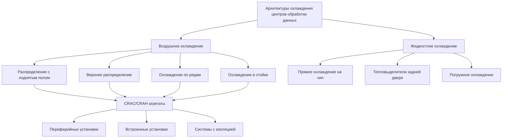

# Охлаждение центров обработки данных

Охлаждение центров обработки данных представляет одно из наиболее требовательных HVAC приложений, требующее точного контроля температуры и влажности при управлении исключительно высокой плотностью мощности. Современные объекты могут превышать 3200 Вт/м² в высокопроизводительных вычислительных средах, создавая проблемы управления тепловыми потоками, которые намного превосходят обычные коммерческие здания.

## Основы плотности мощности

Охлаждающая нагрузка в центрах обработки данных прямо пропорциональна потреблению электроэнергии ИТ-оборудованием. Отвод тепла осуществляется посредством явного охлаждения с минимальной скрытой нагрузкой от персонала или процессов.

Фундаментальное соотношение между потреблением мощности и охлаждающей нагрузкой:

$$Q_{\text{cooling}} = P_{\text{IT}} + P_{\text{lighting}} + P_{\text{UPS loss}} + Q_{\text{envelope}}$$

Где общая плотность мощности на единицу площади рассчитывается как:

$$\rho_P = \frac{P_{\text{total}}}{A_{\text{floor}}} \quad \text{[Вт/м²]}$$

Коэффициент явного охлаждения (SHR) в центрах обработки данных обычно превышает 0,95, в резком контрасте с коммерческими помещениями, где SHR находится в диапазоне от 0,65 до 0,80.

### Типичные диапазоны плотности мощности

| Тип объекта | Плотность мощности | Требование охлаждения |
|---------------|---------------|---------------------|
| Корпоративная ИТ | 1070-1610 Вт/м² | 98-151 кВт/100 м² |
| Высокопроизводительные вычисления | 2150-4300 Вт/м² | 201-402 кВт/100 м² |
| Периферийные вычисления | 540-1070 Вт/м² | 50-101 кВт/100 м² |
| Традиционный серверный зал | 320-810 Вт/м² | 30-76 кВт/100 м² |

Примечание: 3,517 кВт = 1 тонна охлаждения = 12 000 БТЕ/ч.

## Проектные вызовы

Системы охлаждения центров обработки данных должны соответствовать множественным конкурирующим требованиям:

**Требования к надежности**
- Резервирование N+1 или 2N для критически важных операций
- Реакция на тепловые переходные процессы за доли секунды
- Исключение единственных точек отказа
- Непрерывная работа во время обслуживания

**Управление тепловыми потоками**
- Локальные горячие точки, превышающие 5380 Вт/м²
- Смешивание подаваемого и возвращаемого воздуха (обходной поток воздуха)
- Однородность температуры на входе оборудования (±1,1°C вариации)
- Контроль влажности в диапазоне ASHRAE (40-60% ОВ)

**Энергетическая эффективность**
- Целевые показатели Power Usage Effectiveness (PUE) ниже 1,3
- Интеграция свободного охлаждения при допустимом климате
- Операция переменной емкости, соответствующая ИТ-нагрузке
- Минимизация паразитных потерь (вентиляторы, насосы, средства управления)

## Архитектуры охлаждения

### Системы воздушного охлаждения

**Распределение с поднятым полом**
- Подаваемый воздух через перфорированные потолочные плиты
- CRAC (компьютерный кондиционер воздуха) или CRAH (компьютерный воздухообрабатывающий агрегат)
- Глубина пленума обычно 45-90 см
- Эффективно для плотности мощности до 1610 Вт/м²

**Конфигурация "Горячий проход/Холодный проход"**
- Чередующиеся ориентации стоек для разделения потоков подачи и возврата
- Холодные проходы выходят на входы оборудования (передняя часть серверов)
- Горячие проходы выходят на выхлопы оборудования (задняя часть серверов)
- Уменьшает смешивание и повышает эффективность

**Системы изоляции**
- Физические барьеры, изолирующие холодные или горячие проходы
- Изоляция холодного прохода (CAC) охватывает путь подачи воздуха
- Изоляция горячего прохода (HAC) охватывает путь возврата воздуха
- Увеличивает температурный перепад (ΔT) для более высокой эффективности

Эффективность изоляции количественно определяется индексом температуры возврата (RTI):

$$\text{RTI} = \frac{T_{\text{return}} - T_{\text{supply}}}{T_{\text{IT exhaust}} - T_{\text{supply}}}$$

Оптимальная изоляция достигает значений RTI выше 0,85.

### Подходы жидкостного охлаждения

При плотности мощности свыше 3200 Вт/м² жидкостное охлаждение становится необходимым из-за превосходной тепловой емкости воды по сравнению с воздухом:

$$\frac{c_p \text{ вода}}{c_p \text{ воздух}} \approx 4000 \quad \text{[по массе]}$$

**Охлаждение прямо на чип**
- Холодные пластины, установленные непосредственно на процессорах
- Циркуляция охлажденной воды или диэлектрической жидкости
- Способны отводить 500+ ватт на процессор
- Требуют дублирующих насосных систем

**Тепловыделители задней двери**
- Теплообменник, установленный на выхлопе стойки
- Перехватывает 60-100% тепла стойки перед попаданием в помещение
- Позволяет существующей воздушной инфраструктуре поддерживать более высокие плотности
- Упрощенный подход модификации

## Показатели эффективности

ASHRAE TC 9.9 (критически важные объекты, пространства технологий и электронного оборудования) устанавливает руководящие принципы проектирования и показатели производительности для охлаждения центров обработки данных.

**Power Usage Effectiveness (PUE)**

$$\text{PUE} = \frac{P_{\text{total facility}}}{P_{\text{IT equipment}}}$$

Отраслевые ориентиры:
- Традиционное проектирование: PUE = 2,0-2,5
- Эффективное проектирование: PUE = 1,3-1,5
- Передовое проектирование: PUE = 1,1-1,2

**Эффективность механической энергии**

$$\text{Mechanical Load Component (MLC)} = \frac{P_{\text{cooling}}}{P_{\text{IT}}}$$

Целевые значения MLC находятся в диапазоне от 0,10 до 0,30 в зависимости от климата и технологии охлаждения.

## Условия окружающей среды для эксплуатации

ASHRAE TC 9.9 определяет классы оборудования с соответствующими допустимыми диапазонами:

| Класс | Диапазон сухой лампочки | Диапазон точки росы | Применение |
|-------|----------------|-----------------|-------------|
| A1 | 15-32°C | -12 до 17°C | Корпоративные серверы, накопители |
| A2 | 10-35°C | -12 до 21°C | Массовые серверы, накопители |
| A3 | 5-40°C | -12 до 24°C | Массовые серверы, надежное ИТ |
| A4 | 5-45°C | -12 до 24°C | Защищенное оборудование |

Расширение допустимого диапазона температур позволяет увеличить использование экономизации воздуха, снизить требования механического охлаждения и понизить PUE.

## Процесс проектирования

Критические соображения при проектировании включают:

1. **Оценка нагрузки**: определение номинальной мощности, фактической рабочей мощности и коэффициентов разнообразия
2. **Уровень резервирования**: конфигурация N, N+1, N+2 или 2N в зависимости от требований по времени работы
3. **Стратегия распределения**: централизованное или распределенное охлаждающее оборудование
4. **Потенциал экономизатора**: анализ климата для определения часов свободного охлаждения
5. **Будущее расширение**: модульный подход, позволяющий поэтапное развертывание

## Заключение

Охлаждение центров обработки данных требует интеграции принципов машиностроения с требованиями ИТ-инфраструктуры. Успех требует строгого применения термодинамических основ, соблюдения руководящих принципов ASHRAE TC 9.9 и тщательного внимания к управлению воздушными потоками. По мере того как плотность вычислительной мощности продолжает увеличиваться, гибридные подходы охлаждения, объединяющие воздушные и жидкостные технологии, станут стандартной практикой, при этом оптимизация эффективности останется главенствующей для контроля операционных затрат.
