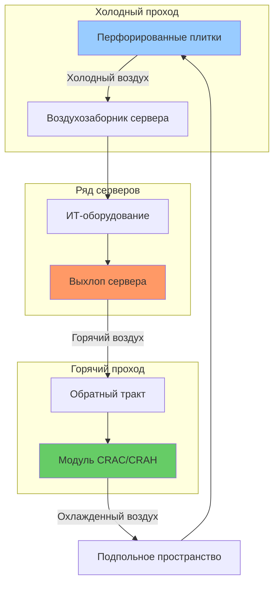
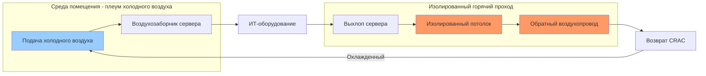

## Обзор

Архитектуры охлаждения центров обработки данных определяют физическое расположение распределения воздуха, стратегии изоляции и расположение охлаждающего оборудования для управления тепловыми нагрузками в диапазоне 17,5-105 кВт/стойка в современных объектах. ASHRAE TC 9.9 (Mission Critical Facilities, Technology Spaces, and Electronic Equipment) устанавливает руководящие принципы проектирования для этих систем, с рекомендуемыми температурами подачи воздуха 18-27°C и максимальными допустимыми точками росы 15°C для предотвращения конденсации при сохранении надежности оборудования.

Основной вызов в охлаждении центра данных — соответствие охлаждающей мощности отводу тепла при минимизации утечки воздуха (холодный воздух, возвращающийся в охлаждающие установки без поглощения тепла) и рециркуляции (горячий выхлопной воздух, повторно поступающий в воздухозаборники оборудования). Надлежащий выбор архитектуры напрямую влияет на Power Usage Effectiveness (PUE) — отношение общей мощности объекта к мощности ИТ-оборудования.

## Конфигурация горячего и холодного проходов

Планировка горячего и холодного проходов является основой современного охлаждения центров обработки данных. Серверные стойки расположены в ряды с холодными проходами, обращенными к воздухозаборникам оборудования, и горячими проходами, обращенными к выхлопным отверстиям. Это разделение предотвращает перемешивание потоков подачи и возврата воздуха, повышая эффективность охлаждения.

### Основная планировка

### Расчеты воздушных потоков

Объемный воздушный поток, требуемый для серверной стойки, определяется тепловой нагрузкой и разностью температур:

$$Q = \dot{m} \cdot c_p \cdot \Delta T$$

$$\text{CFM} = \frac{P_{IT} \times 3.413}{1.08 \times \Delta T}$$

Где:
- $P_{IT}$ = мощность ИТ-оборудования (кВ)
- $\Delta T$ = повышение температуры на оборудовании (°F)
- 3.413 = коэффициент преобразования (кДж/ч на ватт)
- 1.08 = константа для стандартного воздуха (0.075 фунт/фут³ × 0.24 кДж/фунт·°F × 60 мин/ч)

Для стойки мощностью 10 кВт с повышением температуры 11°C:

$$\text{CFM} = \frac{10 \times 3.413}{1.08 \times 11} = \frac{34.13}{11.88} = 2,873 \text{ CFM (м³/ч)}$$

## Системы изоляции

Изоляция разделяет горячие и холодные потоки воздуха, исключая потери от перемешивания. Существуют две основные стратегии:

### Изоляция холодного прохода (CAC)

Холодные проходы закрыты дверьми и потолками, образуя изолированный холодный воздушный камеру. Воздух подачи подается исключительно в изолированные пространства, выход сервера поступает в открытую среду помещения (плеум возврата). Этот подход защищает согласованность температуры подачи и позволяет повысить температуру в помещении (снижение нагрузки на механическое охлаждение).

**Преимущества:**
- Более плотное управление температурами на входе
- Персонал может получить доступ к горячим проходам без теплового стресса
- Более простые конфигурации дверей/доступа
- Более низкая стоимость реализации

**Недостатки:**
- Все помещение служит плеумом возврата
- Могут развиваться горячие точки в помещении
- Менее эффективны для высокоплотных приложений (>52 кВт/стойка)

### Изоляция горячего прохода (HAC)

Горячие проходы закрыты, захватывая выхлопной воздух непосредственно из серверов и направляя его в охлаждающие установки. Среда помещения становится холодным плеумом подачи. Эта конфигурация предпочтительна для высокоплотных развертываний, где концентрация тепла серьезна.

**Преимущества:**
- Максимальное разделение эффективности (минимальная утечка/рециркуляция)
- Поддерживает высокоплотные стойки (70-105+ кВт)
- Позволяет повысить температуру возврата воздуха (экономия энергии)
- Лучшее согласование с работой экономайзера

**Недостатки:**
- Более высокая стоимость установки (воздухопроводы, двери доступа)
- Обслуживание требует входа в горячую среду
- Требует надежной целостности изоляции

## Методы подачи охлаждения

### Поднятый пол с подпольным распределением

Традиционный подход с использованием поднятого пола (типично 610-915 мм) как плеума подачи воздуха. Перфорированные плитки или встроенные в пол диффузоры подают воздух в холодные проходы. Блоки Computer Room Air Conditioners (CRAC) или Air Handlers (CRAH) выпускают воздух в подпольное пространство.

**Расчеты давления** для подпольного плеума:

$$\Delta P = \frac{\rho \cdot v^2}{2} + f \cdot \frac{L}{D_h} \cdot \frac{\rho \cdot v^2}{2}$$

Где:
- $\Delta P$ = перепад давления (Па)
- $\rho$ = плотность воздуха (кг/м³)
- $v$ = скорость (м/с)
- $f$ = коэффициент трения
- $L$ = длина тракта потока (м)
- $D_h$ = гидравлический диаметр (м)

**Соображения проектирования:**
- Открытая площадь перфорированной плитки: 25-60%
- Скорость под полом: <2.5 м/с для минимизации турбулентности
- Глубина плеума влияет на равномерность давления
- Препятствия кабелей/труб снижают эффективную площадь потока

### Встроенное охлаждение

Охлаждающие установки, расположенные непосредственно в рядах серверов, минимизирующие расстояние прохождения воздуха. Эти установки обеспечивают мощность 17,5-175 кВт и характеризуются вертикальным или горизонтальным потоком воздуха. Близость к источникам тепла снижает утечку воздуха и повышает точность управления тепловыми режимами.

**Уравнение эффективности:**

$$\eta_{cooling} = \frac{Q_{removed}}{Q_{IT}} = \frac{\dot{m}_{actual} \cdot c_p \cdot \Delta T_{actual}}{P_{IT} \times 3.413}$$

Встроенные установки обычно достигают 85-95% эффективности в сравнении с 60-75% для периметральных модулей CRAC.

### Потолочное распределение охлаждения

Воздух подачи подается из потолочных воздухопроводов или потолочных установок непосредственно в холодные проходы. Исключает требование к поднятому полу, снижая строительные затраты и упрощая модификацию инфраструктуры. Часто комбинируется с жесткими плеумами потолка возврата, захватывающими выхлоп горячего прохода.

**Применение:**
- Модернизация объектов без поднятых полов
- Высокоплотные зоны, требующие дополнительного охлаждения
- Модульные развертывания центров данных

## Сравнение архитектур

| Архитектура | Типовая плотность | Диапазон PUE | Стоимость установки | Гибкость | Утечка/рециркуляция |
|--------------|----------------|-----------|-------------------|-------------|---------------|
| Поднятый пол + CRAC (без изоляции) | 10,5-28 кВт/стойка | 1.6-2.0 | Базовая | Высокая | 30-50% |
| Изоляция холодного прохода (CAC) | 28-52 кВт/стойка | 1.3-1.5 | +15-25% | Средняя | 10-20% |
| Изоляция горячего прохода (HAC) | 52-105 кВт/стойка | 1.2-1.4 | +25-40% | Средняя | 5-15% |
| Встроенное охлаждение | 35-87,5 кВт/стойка | 1.2-1.4 | +20-35% | Низкая | 5-10% |
| Потолочное + изоляция | 42-70 кВт/стойка | 1.3-1.5 | +10-20% | Высокая | 8-18% |

**Критерии выбора:**
- Плотность тепла определяет основное решение (более высокая плотность требует более тесной связи)
- Существующая инфраструктура (наличие поднятого пола)
- Ограничения капитального бюджета
- Требования будущего расширения
- Совместимость с экономайзером (HAC позволяет повысить температуру возврата)

## Соответствие ASHRAE TC 9.9

ASHRAE TC 9.9 определяет четыре класса окружающей среды (A1-A4) для ИТ-оборудования:

- **Класс A1:** 15-32°C, 20-80% ОВ (серверы для предприятий)
- **Класс A2:** 10-35°C, 20-80% ОВ (серверы на объем)
- **Класс A3:** 5-40°C, 8-85% ОВ (рабочие станции)
- **Класс A4:** 5-45°C, 8-90% ОВ (специализированные приложения)

Надлежащий выбор архитектуры обеспечивает сохранение условий подачи в пределах допусков оборудования при максимизации часов работы экономайзера и минимизации времени работы механического охлаждения. Мониторинг температур на входе на уровне стойки подтверждает эффективность проекта.

## Заключение

Выбор архитектуры охлаждения центра данных уравновешивает эффективность управления тепловыми режимами, энергоэффективность и капитальные инвестиции. Высокоплотные развертывания требуют изоляции горячего прохода или встроенного охлаждения для минимизации неэффективности воздушного потока. Низкоплотные объекты могут использовать изоляцию холодного прохода или традиционные системы поднятого пола с приемлемой производительностью. Соблюдение руководящих принципов ASHRAE TC 9.9 обеспечивает надежность оборудования при оптимизации операционных затрат благодаря обоснованным стратегиям управления температурой.
