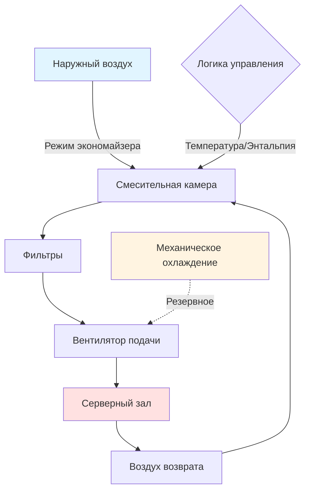
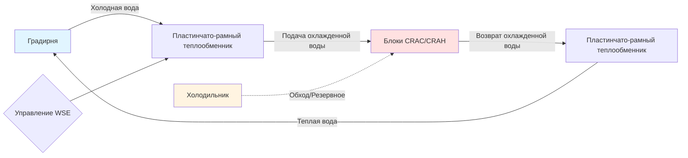

Свободное охлаждение использует условия окружающей среды для снижения или исключения механического охлаждения в системах охлаждения центра обработки данных. Когда температура или энтальпия наружного воздуха падают ниже параметров воздуха возврата, надлежащим образом спроектированные экономайзеры обеспечивают значительную экономию энергии при одновременном обеспечении надежности оборудования в соответствии с тепловыми рекомендациями ASHRAE TC 9.9.

## Системы воздушного экономайзера

Воздушные экономайзеры вводят отфильтрованный наружный воздух непосредственно в центр обработки данных, когда условия окружающей среды позволяют охладить его без механического холодоснабжения. Система модулирует задвижки наружного и возвратного воздуха на основе стратегий управления температурой или энтальпией.

### Режимы работы

**Стратегии управления:**

1. **Управление на основе температуры**: Экономайзер активируется, когда температура сухого термометра наружного воздуха < температура воздуха возврата минус дифференциал (обычно 1–3°C)
2. **Управление на основе энтальпии**: Экономайзер активируется, когда энтальпия наружного воздуха < энтальпия воздуха возврата, предотвращая введение воздуха с высокой влажностью
3. **Управление на основе точки росы**: Ограничивает работу экономайзера на основе точки росы наружного воздуха для предотвращения риска конденсации

### Расчет часов экономайзера

Годовые часы экономайзера зависят от климатической зоны и стратегии управления. Доля годовых часов, пригодных для экономизации:

$$
\eta_{econ} = \frac{\sum_{i=1}^{8760} \mathbb{1}(T_{oa,i} < T_{setpoint} - \Delta T)}{8760}
$$

Где:
- $\eta_{econ}$ = коэффициент доступности экономайзера
- $T_{oa,i}$ = температура наружного воздуха в час $i$ (°C)
- $T_{setpoint}$ = температура блокировки экономайзера (°C)
- $\Delta T$ = дифференциальная температура (°C)
- $\mathbb{1}$ = индикаторная функция (1, если условие истинно, 0 в противном случае)

Экономия энергии от работы воздушного экономайзера:

$$
Q_{saved} = \dot{m} \cdot c_p \cdot (T_{return} - T_{oa}) \cdot \eta_{econ} \cdot 8760
$$

$$
\text{COP}_{equiv} = \frac{Q_{saved}}{P_{fan,additional}}
$$

Где:
- $Q_{saved}$ = годовая энергия охлаждения с учетом избежания (кДж)
- $\dot{m}$ = расход воздуха по массе (кг/ч)
- $c_p$ = удельная теплоемкость воздуха = 1005 Дж/(кг·K)
- $\text{COP}_{equiv}$ = эквивалентный коэффициент производительности
- $P_{fan,additional}$ = дополнительная мощность вентилятора для наружного воздуха (кВт·ч)

## Системы водяного экономайзера

Водяные экономайзеры используют градирни или сухие охладители для производства охлажденной воды без работы механических холодильников, когда температуры по влажному или сухому термометру наружного воздуха достаточно низкие.

### Конфигурации проектирования

| Конфигурация | Описание | Эффективность | Капитальная стоимость |
|--------------|-------------|-----------|--------------|
| Встроенный водяной экономайзер | Один контур с пластинчато-рамным теплообменником | Высокая (снижение энергии на 15-40%) | Средняя |
| Параллельный водяной экономайзер | Отдельный контур экономайзера с выделенной градирней | Очень высокая (снижение энергии на 20-50%) | Высокая |
| Экономайзер термосифон | Циркуляция естественной конвекции | Наивысшая (без штрафа на перекачку) | Высокая |

Эффективность водяного экономайзера:

$$
\epsilon_{wse} = \frac{T_{CHW,return} - T_{CHW,supply}}{T_{CHW,return} - T_{wb,oa}}
$$

Где:
- $\epsilon_{wse}$ = эффективность теплообменника (обычно 0,7–0,85)
- $T_{CHW,return}$ = температура возврата охлажденной воды (°C)
- $T_{CHW,supply}$ = температура подачи охлажденной воды (°C)
- $T_{wb,oa}$ = температура по влажному термометру наружного воздуха (°C)

## Технологии испарительного охлаждения

### Прямое испарительное охлаждение

Прямое испарительное охлаждение (ПИО) добавляет влагу в поток воздуха при снижении температуры по сухому термометру вдоль линии постоянной влажности. Мощность охлаждения:

$$
Q_{DEC} = \dot{m}_{air} \cdot (h_{in} - h_{out}) = \dot{m}_{air} \cdot c_p \cdot \eta_{sat} \cdot (T_{db,in} - T_{wb,in})
$$

Где:
- $\eta_{sat}$ = эффективность насыщения (0,70–0,95 в зависимости от материала)
- $h$ = энтальпия (Дж/кг)
- $T_{db,in}$ = температура по сухому термометру входящего в материал воздуха (°C)
- $T_{wb,in}$ = температура по влажному термометру входящего в материал воздуха (°C)

### Косвенное испарительное охлаждение

Косвенное испарительное охлаждение (КИО) обеспечивает чувствительное охлаждение без добавления влаги в поток подачи. Теплообменник разделяет влажные и сухие каналы, обеспечивая испарительное предварительное охлаждение воздуха выхлопа.

**Преимущество производительности**: КИО может достигать температур подаваемого воздуха на 2–4°C ниже точки росы наружного воздуха без штрафа на увлажнение, что критически важно для контроля влажности центра обработки данных в соответствии с рекомендациями ASHRAE TC 9.9 (40–60% ОВ рекомендуемая, 20–80% ОВ допустимая).

## Анализ производительности по климатическим зонам

Эффективность свободного охлаждения значительно варьируется по климатическим зонам в зависимости от профилей температуры и влажности.

| Климатическая зона ASHRAE | Годовые часы экономайзера (Температура) | Годовые часы экономайзера (Энтальпия) | Типичное улучшение PUE |
|---------------------|--------------------------------------|-----------------------------------|------------------------|
| 1A (Майами) | 850–1 200 | 400–800 | 0,08–0,12 |
| 2A (Хьюстон) | 1 800–2 400 | 1 200–1 800 | 0,12–0,18 |
| 2B (Феникс) | 3 200–3 800 | 2 800–3 400 | 0,18–0,25 |
| 3A (Атланта) | 2 800–3 400 | 2 200–2 800 | 0,15–0,22 |
| 3C (Сан-Франциско) | 6 500–7 200 | 6 200–6 900 | 0,28–0,38 |
| 4A (Нью-Йорк) | 3 600–4 200 | 2 800–3 600 | 0,18–0,26 |
| 5A (Чикаго) | 4 400–5 000 | 3 400–4 200 | 0,22–0,32 |
| 6A (Миннеаполис) | 5 200–5 800 | 4 000–4 800 | 0,25–0,36 |
| 7 (Дулут) | 6 000–6 600 | 4 600–5 400 | 0,28–0,40 |

*Допущения: температура блокировки экономайзера 24°C, конверт класса ASHRAE A1 (15–32°C допустимо)*

## Оценка воздействия на PUE

Коэффициент использования энергии (PUE) количественно определяет эффективность инфраструктуры центра обработки данных:

$$
\text{PUE} = \frac{P_{total,facility}}{P_{IT,equipment}}
$$

Свободное охлаждение снижает потребление энергии инфраструктурой охлаждения:

$$
\Delta\text{PUE} = \frac{P_{cooling,baseline} - P_{cooling,economizer}}{P_{IT,equipment}}
$$

**Типичное распределение энергии в исходном объекте (PUE = 1,8)**:
- ИТ-оборудование: 56% (по определению, 1,0/1,8)
- Системы охлаждения: 30% (механическое холодоснабжение, насосы, вентиляторы)
- Потери при распределении мощности: 10% (ИБП, распределители мощности, потери трансформаторов)
- Освещение и прочее: 4%

**С оптимизированным свободным охлаждением (PUE = 1,3–1,4)**:
- ИТ-оборудование: 71–77%
- Системы охлаждения: 12–18% (в основном вентиляторы и насосы во время работы экономайзера)
- Потери при распределении мощности: 8–9%
- Освещение и прочее: 3–4%

## Соответствие тепловым рекомендациям ASHRAE TC 9.9

Технический комитет ASHRAE 9.9 определяет классы оборудования на основе допустимых диапазонов температуры и влажности:

| Класс оборудования | Допустимый диапазон температур | Рекомендуемый диапазон температур | Допустимый диапазон влажности |
|----------------|----------------------------|------------------------------|------------------------|
| A1 | 15–32°C | 18–27°C | 20–80% ОВ, точка росы макс. 17°C |
| A2 | 10–35°C | 18–27°C | 20–80% ОВ, точка росы макс. 21°C |
| A3 | 5–40°C | 18–27°C | 8–85% ОВ, точка росы макс. 23°C |
| A4 | 5–45°C | 18–27°C | 8–90% ОВ, точка росы макс. 26°C |

**Последствия свободного охлаждения**: Расширение допустимых диапазонов (классы A2–A4) увеличивает годовые часы экономайзера на 15–40% в зависимости от климатической зоны. Гарантийные обязательства оборудования должны быть оценены в отношении экономии энергии.

### Стратегии управления влажностью

Работа экономайзера должна поддерживать управление точкой росы для предотвращения конденсации и коррозии:

$$
\text{DP}_{max} = T_{supply} - \frac{\ln(\text{RH}_{max}/100)}{\lambda} \quad \text{(упрощенное приближение)}
$$

Где $\lambda \approx 0,06$ для типичных диапазонов работы, или используйте психрометрические соотношения для точного расчета.

## Рассмотрение реализации

**Требования к фильтрации**: Фильтрация MERV 13–15 рекомендуется для воздушных экономайзеров для предотвращения загрязнения взвешенными частицами. Штраф на перепад давления: 10–20 Па, требующий дополнительной мощности вентилятора 15–25%.

**Факторы надежности**: Отказы задвижек экономайзера должны по умолчанию минимизировать наружный воздух, чтобы предотвратить неконтролируемые превышения влажности или температуры. Избыточные датчики и контуры управления обеспечивают непрерывную работу.

**Загрязнение частицами и газами**: ASHRAE TC 9.9 предоставляет пределы загрязнения газами и частицами. Объекты с высоким загрязнением окружающей среды могут потребовать газовой фильтрации (активированный уголь), добавляющей перепад давления 15–25 Па.

## Стратегии оптимизации свободного охлаждения

1. **Повышение температуры подачи охлажденной воды**: От 10°C до 13–16°C увеличивает часы экономайзера на 800–1 500 часов ежегодно в умеренном климате
2. **Реализация изоляции горячего и холодного проходов**: Позволяет использовать более высокие температуры воздуха возврата (29–35°C), расширяя окно работы экономайзера
3. **Развертывание приводов переменной скорости**: Оптимизация энергии вентилятора и насоса во время частичной нагрузки при работе экономайзера
4. **Использование прогнозного управления**: Прогноз погоды позволяет применять стратегии предварительного охлаждения для максимизации использования свободного охлаждения

Эти стратегии в совокупности достигают значений PUE 1,15–1,25 в благоприятных климатических условиях (зоны ASHRAE 3C, 5A–7) с надлежащим образом спроектированными системами свободного охлаждения.

## Подтемы

- Воздушный экономайзер центра обработки данных
- Водяной экономайзер центра обработки данных
- Прямое испарительное охлаждение
- Косвенное испарительное охлаждение
- Адиабатическое охлаждение центра обработки данных
- Максимизация часов свободного охлаждения
- Тепловые рекомендации ASHRAE для центров обработки данных
- Расширение допустимого диапазона температур
- Среды класса A1, A2, A3, A4
