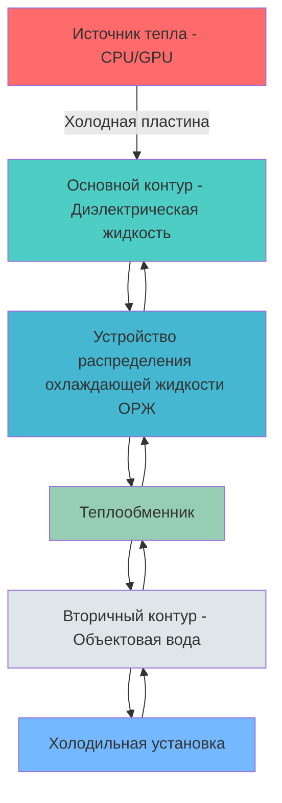
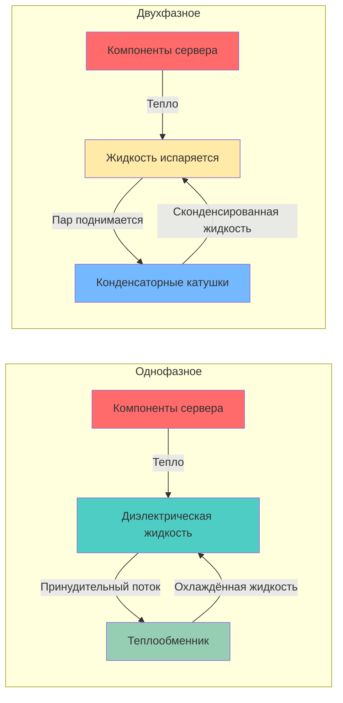

## Основы жидкостного охлаждения

Технологии жидкостного охлаждения стали необходимы для современных центров обработки данных, которые управляют тепловыми нагрузками превышающими 20-30 кВт на стойку. Превосходные теплофизические свойства жидкостей по сравнению с воздухом — удельная теплоёмкость примерно в 4000 раз выше и теплопроводность в 25 раз выше — обеспечивают эффективное отведение тепла при повышенных температурах входящего воздуха серверов, одновременно сокращая потребление энергии.

Технический комитет ASHRAE 9.9 (Критичные объекты инфраструктуры, технологические пространства и электронное оборудование) предоставляет рекомендации по проектированию реализаций жидкостного охлаждения, подчёркивая надёжность, эффективность и совместимость с существующей инфраструктурой.

### Сравнение теплопередачи

Фундаментальное уравнение теплопередачи для систем жидкостного охлаждения:

$$Q = \dot{m} \cdot c_p \cdot \Delta T$$

Где:
- $Q$ = мощность отведения тепла (Вт)
- $\dot{m}$ = массовый расход (кг/с)
- $c_p$ = удельная теплоёмкость (Дж/кг·K)
- $\Delta T$ = температурный дифференциал (K)

Для однофазного жидкостного охлаждения коэффициент конвективной теплопередачи:

$$h = \frac{Nu \cdot k}{D_h}$$

Где:
- $h$ = коэффициент конвективной теплопередачи (Вт/м²·K)
- $Nu$ = число Нуссельта (безразмерная величина)
- $k$ = теплопроводность жидкости (Вт/м·K)
- $D_h$ = гидравлический диаметр (м)

## Охлаждение непосредственно на кристалле

Охлаждение непосредственно на кристалле (ОНК) использует холодные пластины, устанавливаемые непосредственно на высокомощные процессоры (CPU, GPU, ASIC) для отведения тепла в источнике. Этот подход исключает тепловое сопротивление, связанное с радиаторами и воздушным охлаждением.

### Конструкция холодной пластины

Холодные пластины обычно используют микроканальную или штыревую геометрию для максимизации площади поверхности и турбулентности. Тепловое сопротивление от кристалла к жидкости:

$$R_{j-f} = R_{die} + R_{TIM} + R_{coldplate} + R_{conv}$$

Где типичные значения для высокопроизводительных холодных пластин достигают $R_{coldplate}$ 0,01–0,03 K/Вт.

### Архитектура системы

## Теплообменники задней двери

Теплообменники задней двери (ТЗД) обеспечивают пассивное охлаждение путём замены стандартных дверей стойки на водовоздушные теплообменники. Горячий выходящий воздух проходит через катушки теплообменника, отводя тепло в объектовую воду перед возвратом в помещение.

### Характеристики производительности

| Параметр | Пассивный ТЗД | Активный ТЗД |
|-----------|--------------|-------------|
| Мощность отведения тепла | 20–35 кВт | 35–60 кВт |
| Перепад давления | 0–10 Па | 50–150 Па |
| Расход воды | 15–30 л/мин | 30–50 л/мин |
| Температура подающейся воды | 15–20°C | 15–25°C |
| Температурный подход | 3–5 K | 2–4 K |
| Потребляемая мощность | 0 Вт (пассивный) | 200–400 Вт (вентиляторы) |

Эффективность теплообмена:

$$\epsilon = \frac{Q_{actual}}{Q_{max}} = \frac{T_{air,in} - T_{air,out}}{T_{air,in} - T_{water,in}}$$

Для типичных установок эффективность находится в диапазоне 0,60–0,85 в зависимости от расходов воздуха и воды.

## Погружное охлаждение

Погружное охлаждение полностью погружает ИТ-оборудование в диэлектрическую жидкость, полностью исключая воздушное охлаждение. Существуют два основных подхода: однофазное и двухфазное погружение.

### Однофазное погружное охлаждение

Серверы работают полностью погруженными в диэлектрическую жидкость (минеральное масло, синтетические жидкости или специализированные жидкости), поддерживаемую ниже точки кипения. Циркуляция жидкости передаёт тепло внешним теплообменникам.

Теплопередача следует естественной или принудительной конвекции:

$$Nu = C \cdot Re^m \cdot Pr^n$$

Где постоянные C, m, n зависят от геометрии и режима потока. Для принудительной конвекции в корпусе сервера: $Nu = 0.023 \cdot Re^{0.8} \cdot Pr^{0.4}$ (корреляция Диттуса–Бёльта).

### Двухфазное погружное охлаждение

Серверы погружают в низкокипящую диэлектрическую жидкость (температура кипения 40–65°C). Тепло вызывает испарение жидкости на поверхностях компонентов; пар конденсируется на верхних катушках, выделяя скрытое тепло.

Коэффициент теплопередачи при кипении:

$$q'' = h_{boiling} \cdot (T_{surface} - T_{sat})$$

Пузырьковое кипение достигает коэффициентов теплопередачи 5000–20000 Вт/м²·K, значительно превышая однофазную конвекцию (500–2000 Вт/м²·K).

### Сравнение систем погружного охлаждения

| Характеристика | Однофазное | Двухфазное |
|----------------|--------------|-----------|
| Температура жидкости | 30–50°C | 40–65°C (точка кипения) |
| Режим теплопередачи | Конвекция | Кипение/конденсация |
| Коэффициент теплопередачи | 500–2000 Вт/м²·K | 5000–20000 Вт/м²·K |
| Мощность насоса | Умеренная | Минимальная (естественная циркуляция) |
| Стоимость жидкости | Ниже | Выше |
| Совместимость материалов | Более широкая | Требует проверки совместимости |
| Температура компонентов | Более высокая вариативность | Изотермальная (при насыщении) |

## Гибридные архитектуры охлаждения

Гибридные подходы комбинируют воздушное и жидкостное охлаждение для оптимизации стоимости и производительности. Общие конфигурации включают:

1. **Жидкостно-вспомогательное воздушное охлаждение:** Охлаждение непосредственно на кристалле для высокомощных процессоров (CPU, GPU) с воздушным охлаждением для остальных компонентов (память, хранилище, сетевое оборудование)

2. **Зональное охлаждение:** Жидкостное охлаждение для высокотехнологичных стоек (>20 кВт) с воздушным охлаждением для стандартных стоек

3. **Постепенная миграция:** Теплообменники задней двери как переходная технология перед полным развёртыванием охлаждения непосредственно на кристалле

### Баланс энергии гибридной системы

Для гибридной стойки с жидкостным охлаждением процессоров и воздушным охлаждением компонентов:

$$Q_{total} = Q_{liquid} + Q_{air}$$

Где типичное распределение достигает 60–80% отведения тепла через жидкость с соответствующим улучшением PUE на 15–30% по сравнению с охлаждением только воздухом.

| Стратегия охлаждения | Диапазон PUE | Типичная плотность стойки | Индекс капитальных затрат |
|------------------|-----------|----------------------|-------------------|
| Только воздух (Горячий/Холодный проход) | 1,4–1,8 | 8–15 кВт | 1,0× |
| Теплообменник задней двери | 1,3–1,5 | 15–30 кВт | 1,2–1,4× |
| Гибридное охлаждение на кристалле | 1,15–1,3 | 25–50 кВт | 1,5–2,0× |
| Полное погружение (однофазное) | 1,05–1,15 | 50–100 кВт | 1,8–2,5× |
| Полное погружение (двухфазное) | 1,03–1,1 | 100–250 кВт | 2,5–3,5× |

## Устройства распределения охлаждающей жидкости

Устройства распределения охлаждающей жидкости (ОРЖ) служат интерфейсом между основными контурами жидкостного охлаждения и инфраструктурой объектовой воды. ОРЖ обеспечивают:

- Теплообмен между основным (диэлектрическая жидкость) и вторичным (объектовая вода) контурами
- Насосирование для циркуляции основного хладагента
- Фильтрацию и кондиционирование жидкости
- Обнаружение утечек и мониторинг
- Управление температурой и расходом

Определение размера ОРЖ следует соотношению:

$$\dot{m}_{coolant} = \frac{Q_{IT}}{\rho \cdot c_p \cdot \Delta T}$$

Для нагрузки ИТ-оборудования 100 кВт с температурным дифференциалом 10 K и водой как охладителем:

$$\dot{m} = \frac{100000}{1000 \cdot 4186 \cdot 10} = 2,39 \text{ л/с} \approx 143 \text{ л/мин}$$

## Соображения при проектировании

**Критерии выбора жидкости:**
- Диэлектрическая прочность для электрической изоляции
- Теплопроводность и удельная теплоёмкость
- Вязкость в диапазоне рабочих температур
- Совместимость материалов с компонентами сервера
- Влияние на окружающую среду и требования утилизации
- Стоимость и доступность

**Требования надёжности:**
- Резервные насосы и обнаружение утечек
- Быстросъёмные соединения для удобства обслуживания
- Мониторинг давления и предохранительные клапаны
- Фильтрация для предотвращения загрязнения частицами
- Мониторинг качества жидкости (проводимость, pH)

**Проблемы интеграции:**
- Следствия для гарантии сервера
- Требования обучения персонала
- Процедуры обслуживания
- Вывод из эксплуатации и утилизация жидкости
- Протоколы аварийного отключения

Технический комитет ASHRAE TC 9.9 рекомендует жидкостное охлаждение для приложений, превышающих плотность 20 кВт/стойка, где воздушное охлаждение становится экономически или физически непрактичным. Выбор между охлаждением непосредственно на кристалле, погружением или гибридными подходами зависит от требований плотности, ограничений инфраструктуры и анализа общей стоимости владения.
