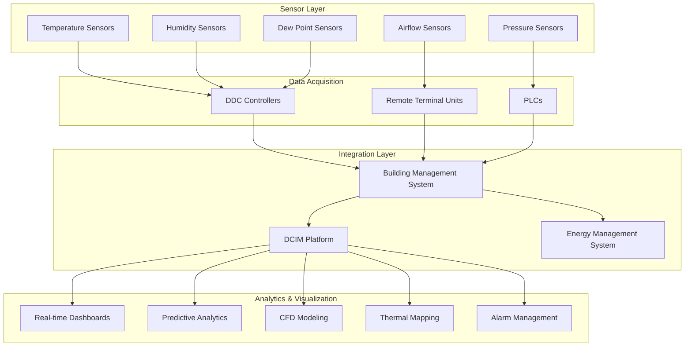

## Обзор

Мониторинг и управление центром обработки данных представляют собой нервную систему критичных по надежности объектов, обеспечивая полную видимость в реальном времени тепловых, энергетических и экологических условий. Эффективный мониторинг позволяет осуществлять проактивное управление, оптимизировать энергоэффективность и предотвращать тепловые скачки, которые могут нарушить надежность ИТ-оборудования.

ASHRAE TC 9.9 (Критичные по надежности объекты) устанавливает руководящие принципы плотности мониторинга окружающей среды, размещения датчиков и стратегии управления, которые поддерживают оборудование в рекомендуемых рабочих диапазонах при максимизации энергоэффективности.

## Мониторинг эффективности использования энергии (PUE)

PUE количественно определяет энергоэффективность центра обработки данных путем сравнения общей мощности объекта с мощностью ИТ-оборудования:

$$\text{PUE} = \frac{P_{\text{total}}}{P_{\text{IT}}}$$

Где:
- $P_{\text{total}}$ = общая мощность объекта (кВ)
- $P_{\text{IT}}$ = мощность ИТ-оборудования (кВ)

Для расчета PUE в реальном времени с детальным разбором компонентов:

$$\text{PUE} = \frac{P_{\text{IT}} + P_{\text{cooling}} + P_{\text{lighting}} + P_{\text{aux}}}{P_{\text{IT}}}$$

Упрощено до накладных расходов инфраструктуры:

$$\text{PUE} = 1 + \frac{P_{\text{cooling}} + P_{\text{lighting}} + P_{\text{aux}}}{P_{\text{IT}}}$$

Непрерывный мониторинг потребления энергии системой охлаждения позволяет провести корреляционный анализ между эффективностью охлаждения и заданными параметрами окружающей среды, наружными условиями воздуха и вариациями нагрузки ИТ.

## Архитектура мониторинга окружающей среды

## Стратегия размещения датчиков

| **Зона** | **Тип датчика** | **Плотность** | **Высота** | **Точки измерения** |
|----------|----------------|-------------|-----------|----------------------|
| Горячий проход | Температура | 1 на 5 стоек | Верх, середина, низ | Температура возвратного воздуха |
| Холодный проход | Температура | 1 на 5 стоек | Высота входа (2 м) | Температура подаваемого воздуха |
| Выпуск CRAC/CRAH | Температура, ОВ | 1 на единицу | Выпускная камера | Условия подачи |
| Подпольная камера | Температура, давление | 1 на 200 м² | Уровень пола | Стратификация, статическое давление |
| Верхний возврат | Температура | 1 на 200 м² | Уровень потолка | Температура возвратного воздуха |
| Входное отверстие критичного оборудования | Температура | 1 на критичную стойку | Входное отверстие оборудования | Проверка соответствия |
| Периметральные стены | Температура, ОВ | 1 на 10 м | Середина высоты | Условия ограждающей конструкции |
| Точка росы | Влажность | 1 на 400 м² | Путь возвратного воздуха | Контроль влажности |

ASHRAE TC 9.9 рекомендует минимальную плотность мониторинга в один датчик температуры на 150-200 м² поднимаемого пола, с повышенной плотностью в зонах высокой тепловой плотности, превышающих 10 кВ на стойку.

## Управление инфраструктурой центра обработки данных (DCIM)

Платформы DCIM интегрируют мониторинг окружающей среды, измерение мощности, управление активами и планирование емкости в единые панели управления. Основные функции DCIM включают:

**Мониторинг в реальном времени**: Непрерывный опрос датчиков температуры, влажности, мощности и воздушного потока с интервалом 15-60 секунд обеспечивает немедленную видимость в экологические отклонения.

**Управление емкостью**: 3D-визуализация пространства стоек, емкости электроэнергии и емкости охлаждения позволяет осуществлять проактивное планирование и предотвращает перегрузку критичных ресурсов.

**Отслеживание активов**: Автоматическое обнаружение и документирование местоположения ИТ-оборудования, потребления энергии и теплового выхода поддерживает точное моделирование емкости.

**Анализ энергии**: Детальное измерение мощности на уровне PDU, стойки и устройства позволяет выполнить разложение PUE, анализ тенденций и определение возможностей повышения эффективности.

## Интеграция системы управления зданием

Интеграция BMS позволяет скоординированное управление между системами HVAC и условиями нагрузки ИТ:

**Управление охлаждением на основе нагрузки**: Переустановка температуры подаваемого воздуха и температуры охлажденной воды на основе контролируемой температуры возвратного воздуха и вариаций нагрузки ИТ.

**Оптимизация воздушной экономайзера**: Автоматическое переключение на свободное охлаждение, когда позволяют наружные условия, на основе сравнения энтальпии:

$$h_{\text{outdoor}} < h_{\text{return}} - \Delta h_{\text{min}}$$

Где $\Delta h_{\text{min}}$ представляет минимальный дифференциал энтальпии для работы экономайзера (обычно 2-4 кДж/кг).

**Управление резервированием**: Автоматическое распределение резервных холодильных агрегатов на основе архитектуры N+1 или 2N с балансировкой нагрузки и ротацией ведущего звена.

**Реагирование на спрос**: Скоординированная реакция на события спроса со стороны коммунальных служб путем временного увеличения температуры подаваемого воздуха в пределах допустимых диапазонов ASHRAE.

## Управление сигналами тревоги и эскалация

Критичные пороги сигналов тревоги на основе тепловых рекомендаций ASHRAE:

| **Параметр** | **Предупреждение** | **Критично** | **Время отклика** |
|--------------|------------|--------------|------------------|
| Температура входа стойки | >27°C | >32°C | <2 мин |
| Относительная влажность | <20% или >60% | <8% или >80% | <5 мин |
| Точка росы | >17°C | >21°C | <5 мин |
| Давление подпольного пространства | <12 Па | <8 Па | <5 мин |
| Отказ CRAC/CRAH | Отдельная единица | Потеря N-1 | <1 мин |
| Подача охлажденной воды | >10°C | >13°C | <2 мин |

Протоколы эскалации сигналов тревоги интегрируются с SMS, электронной почтой и системой управления зданием уведомлений, обеспечивая 24/7 осведомленность операторов о критичных условиях.

## Прогностическая аналитика и машинное обучение

Передовые платформы DCIM используют прогностическую аналитику для прогнозирования тепловых скачков до их возникновения:

**Анализ тенденций**: Исторические данные о температуре раскрывают сезонные вариации, деградацию оборудования и снижение производительности системы охлаждения.

**Обнаружение аномалий**: Алгоритмы машинного обучения выявляют отклонения от базовых тепловых моделей, отмечая потенциальные отказы или засорение воздушного потока.

**Прогнозирование отказа**: Мониторинг часов работы холодильного агрегата, тока компрессора и дифференциального давления позволяет спланировать профилактическое обслуживание до катастрофических отказов.

**Интеграция вычислительной гидродинамики (CFD)**: Данные датчиков в реальном времени проверяют и калибруют модели CFD, улучшая точность сценариев «что если» для планирования емкости и определения горячих зон.

## Тепловое картирование и визуализация

Непрерывное тепловое картирование генерирует тепловые карты, наложенные на планы этажей объекта, выявляя:

- Горячие зоны, превышающие рекомендуемые температуры входа ASHRAE
- Обход холодного воздуха и короткое замыкание подаваемого воздуха
- Недоиспользованную емкость охлаждения
- Возможности оптимизации содержания

Трехмерная тепловая визуализация позволяет быстро определить вертикальную стратификацию температуры и неэффективность смешивания как в конфигурациях подпольной, так и верхней подачи.

## Лучшие практики реализации

**Калибровка**: Ежегодная калибровка датчиков поддерживает точность измерения в пределах ±0,5°C для датчиков температуры и ±3% ОВ для датчиков влажности.

**Сетевая архитектура**: Отдельные сети мониторинга от производственных сетей ИТ предотвращают уязвимости безопасности и обеспечивают доступность системы мониторинга во время сбоев сети.

**Сохранение данных**: Минимум 2-летнее хранение исторических данных позволяет проводить долгосрочный анализ тенденций и документирование соответствия нормативно-правовым актам.

**Резервирование**: Двойные пути связи и резервные контроллеры мониторинга предотвращают единственные точки отказа в системах критичных сигналов тревоги.

Эффективный мониторинг и управление трансформируют центры обработки данных из реактивных сред тушения пожара в проактивные оптимизированные объекты, работающие на пиковой эффективности при сохранении строгих требований надежности.
