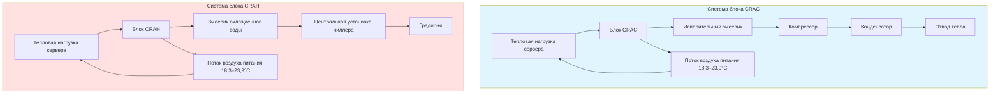
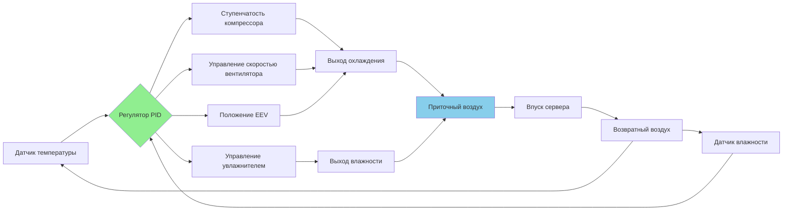

## Основы точного охлаждения

Системы точного охлаждения обеспечивают непрерывный контроль окружающей среды в центрах обработки данных, телекоммуникационных объектах и серверных комнатах. В отличие от систем комфортного кондиционирования, точные устройства поддерживают жесткие допуски по температуре и влажности при управлении преимущественно чувствительными тепловыми нагрузками от электронного оборудования. ASHRAE TC 9.9 (Критически важные объекты, технологические пространства и электронное оборудование) устанавливает критерии проектирования для этих специализированных приложений.

Охлаждение центра обработки данных требует работы в режиме 24/7 с минимальным временем простоя, высокими коэффициентами чувствительного теплового потока и точным контролем окружающей среды. Две основные технологии точного охлаждения — это блоки кондиционирования воздуха для компьютерных помещений (CRAC) и обработчики воздуха для компьютерных помещений (CRAH), каждый из которых имеет особенные эксплуатационные характеристики.

## Системы CRAC и CRAH

### Блоки CRAC (кондиционирование воздуха для компьютерных помещений)

Блоки CRAC содержат встроенные системы прямого расширения (DX) с компрессорами, испарительными змеевиками и элементами управления. Эти автономные системы подключаются к удаленным конденсаторам или конденсирующим установкам.

**Эксплуатационные характеристики:**
- Охлаждение с прямым расширением с теплообменом хладагент-воздух
- Многоступенчатые компрессоры для модуляции мощности (типично 25%, 50%, 75%, 100%)
- Интегрированные системы увлажнения и осушения
- Коэффициенты чувствительного теплового потока: 0,90–1,0
- Холодопроизводительность: 5–100+ кВ на устройство
- Независимое функционирование без центральной инфраструктуры

### Блоки CRAH (обработчик воздуха для компьютерных помещений)

Блоки CRAH используют охлажденные водяные змеевики, питаемые от центральных установок чиллеров. Эти устройства содержат вентиляторы, фильтры, охлажденные водяные змеевики и элементы управления, но не имеют компонентов холодильной системы.

**Эксплуатационные характеристики:**
- Теплообмен охлажденной водой (типично вода питания 5,6–8,9°C)
- Регулирующие клапаны расхода воды для модуляции мощности
- Требует инфраструктуру центральной установки чиллера
- Более высокий потенциал энергоэффективности с бесплатным охлаждением
- Холодопроизводительность: 10–150+ кВ на устройство
- Централизованное управление холодильной системой

## Расчеты коэффициента чувствительного теплового потока

Коэффициент чувствительного теплового потока (SHR) количественно определяет долю общей холодопроизводительности, которая является чувствительной (изменение температуры) в сравнении со скрытой (удаление влаги). Центры обработки данных обычно демонстрируют значения SHR от 0,90 до 1,0.

$$\text{SHR} = \frac{Q_s}{Q_t} = \frac{Q_s}{Q_s + Q_l}$$

Где:
- $Q_s$ = Чувствительная холодопроизводительность (кДж/ч)
- $Q_l$ = Скрытая холодопроизводительность (кДж/ч)
- $Q_t$ = Общая холодопроизводительность (кДж/ч)

**Чувствительная холодопроизводительность:**

$$Q_s = 1,23 \times \text{CFM} \times \Delta T$$

Где:
- CFM = Расход воздуха (м³/ч), где 1 CFM = 1,699 м³/ч
- $\Delta T$ = Разность температур между возвратным и приточным воздухом (°C)
- 1,23 = Коэффициент преобразования для метрической системы

**Общая холодопроизводительность:**

$$Q_t = 3,6 \times \text{CFM} \times \Delta h$$

Где:
- $\Delta h$ = Разность энтальпии между возвратным и приточным воздухом (кДж/кг)
- 3,6 = Коэффициент преобразования для метрической системы

**Пример расчета:**
Для блока точного охлаждения с расходом воздуха 4 720 м³/ч (2 790 CFM), температурой возвратного воздуха 26,7°C и температурой приточного воздуха 18,3°C с пренебрежимой скрытой нагрузкой:

$$Q_s = 1,23 \times 2{,}790 \times (26,7 - 18,3) = 47{,}700 \text{ кДж/ч} = 13,3 \text{ кВ}$$

## Спецификации точного кондиционирования воздуха

| Параметр | Комфортное AC | Точное AC | Критерии проектирования |
|-----------|-----------|--------------|-----------------|
| Контроль температуры | ±2,2°C | ±1,1°C | ASHRAE TC 9.9 |
| Контроль влажности | ±8% ОВ | ±3% ОВ | Цель 40–55% ОВ |
| Коэффициент чувствительного теплового потока | 0,60–0,75 | 0,90–1,0 | Высокая чувствительная нагрузка |
| Часы работы | 2 000–3 000 ч/год | 8 760 ч/год | Работа 24/7 |
| Работа вентилятора | Прерывистая | Непрерывная | Постоянный воздушный поток |
| Расход воздуха | 595–678 м³/ч на кВ | 762–933 м³/ч на кВ | Частые воздухообмены |
| Эффективность фильтра | MERV 8 | MERV 11–13 | Контроль частиц |
| Резервирование | N | N+1 или 2N | Критически важные системы |

## Возможности точного управления

Системы точного охлаждения включают передовые возможности управления для поддержания стабильности окружающей среды:

**Контроль температуры:**
- Электронные расширительные клапаны (EEV) для точного измерения хладагента
- Многоступенчатые компрессоры с цифровой технологией спирального сжатия
- Вентиляторы переменной скорости EC (электронно-коммутируемые)
- Алгоритмы управления пропорционально-интегрально-дифференциальные (PID)
- Байпас горячего газа для модуляции мощности при низких нагрузках

**Контроль влажности:**
- Системы ультразвукового или инфракрасного увлажнения
- Активное осушение с перегревом горячего газа
- Мониторинг и контроль температуры точки росы
- Расчеты коэффициента влажности по сухому и влажному термометрам

**Управление воздушным потоком:**
- Управление вентилятором переменной скорости (25–100% мощности)
- Расходы воздуха: 762–933 м³/ч на кВ охлаждения
- Температура приточного воздуха: 18,3–23,9°C (регулируемая)
- Температура возвратного воздуха: 23,9–29,4°C (типичный выхлоп сервера)

## Методы модуляции мощности

Системы точного охлаждения применяют несколько стратегий для сопоставления холодопроизводительности с изменяющимися нагрузками серверов:

**Управление мощностью CRAC:**
- Несколько компрессоров (2–4 контура) с поэтапной работой
- Технология компрессора цифрового спирального сжатия (10–100% мощности с шагом 10%)
- Приводы переменной частоты (VFD) на компрессорах
- Модуляция электронного расширительного клапана
- Байпас горячего газа для условий минимальной нагрузки

**Управление мощностью CRAH:**
- Регулирующие клапаны охлажденной воды (2-ходовые или 3-ходовые)
- Переменный расход воды
- Переменная скорость вентилятора с VFD или моторами EC
- Сброс температуры входящей воды
- Управление температурой покидающего воздуха

Комбинация нескольких методов модуляции позволяет блокам точного охлаждения поддерживать условия установки при нагрузках от 20% до 100% конструктивной мощности при оптимизации энергоэффективности и срока службы оборудования.

## Соображения проектирования

**Факторы выбора системы:**
- Размер объекта и требования резервирования (конфигурации N+1, N+2, 2N)
- Доступная инфраструктура (центральная установка чиллера в сравнении с DX системами)
- Целевые показатели энергоэффективности (цели PUE)
- Возможность расширения в будущем
- Доступность для технического обслуживания и ремонта
- Наличие воды для увлажнения

**Рекомендуемые условия ASHRAE TC 9.9:**
- Допустимый диапазон температуры: 17,9–26,9°C (Класс A1)
- Рекомендуемый диапазон температуры: 17,9–26,9°C
- Допустимый диапазон влажности: температура точки росы от −11,1°C до 15°C
- Рекомендуемый диапазон влажности: температура точки росы от 5,5°C до 15°C
- Максимальная скорость изменения: 5°C/ч по температуре, 2,8°C/ч по температуре точки росы

Системы точного охлаждения представляют критическую инфраструктуру управления окружающей средой для центров обработки данных, требующую специализированного проектирования, эксплуатации и обслуживания для обеспечения непрерывной работы критически важного вычислительного оборудования.
